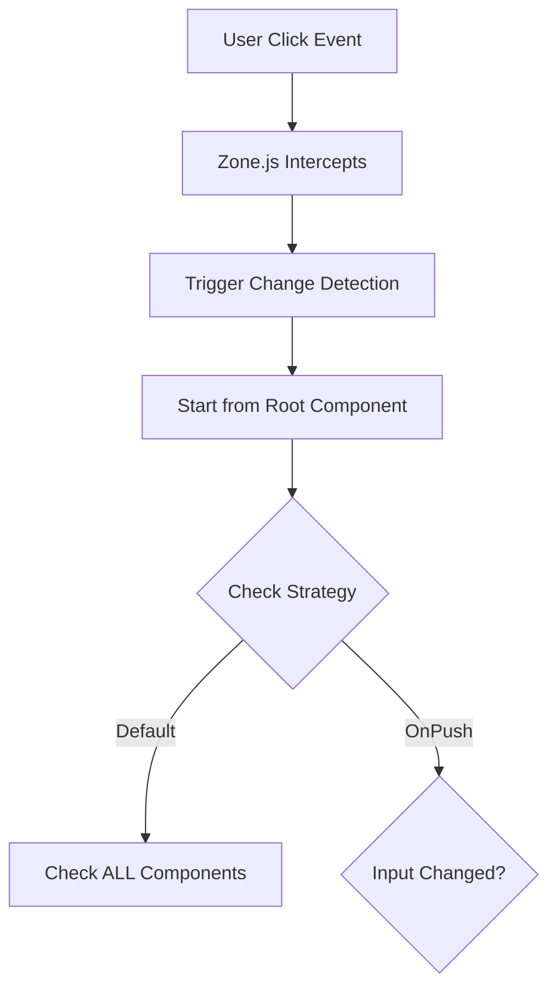

# ✅ Content Import & Display - Fixed!

## The Problem

The imported questions were showing only the short "**Question:**" line (300 chars) instead of the full detailed content with:
- ❌ Mermaid diagrams
- ❌ Detailed explanations
- ❌ Code examples
- ❌ Tables and formatted content

## The Root Cause

The parser was extracting only the text between `**Question:**` and `<details>` tag, ignoring all the rich content in the markdown.

## The Solution

### 1. Fixed Import Parser ✅

**Changed in:** `prisma/import-questions.ts`

**Before:**
```typescript
// Only extracted the short question line
const questionMatch = section.match(/\*\*Question:\*\*\s*([\s\S]*?)(?=<details>|$)/);
contentPart = questionMatch ? questionMatch[1].trim() : ...
```

**After:**
```typescript
// Extract EVERYTHING before <details> tag as content
const detailsIndex = section.indexOf('<details>');
contentPart = section.substring(0, detailsIndex).trim();
answerPart = answerMatch[1].trim(); // Everything inside <details>
```

### 2. Added Mermaid Diagram Support ✅

**Installed packages:**
```bash
npm install mermaid react-syntax-highlighter
```

**Created:** `src/components/markdown/MarkdownRenderer.tsx`

Features:
- ✅ Detects ````mermaid` code blocks
- ✅ Renders beautiful interactive diagrams
- ✅ Syntax highlighting for code
- ✅ Beautiful markdown formatting
- ✅ Dark mode support
- ✅ Responsive tables
- ✅ Styled blockquotes, lists, headings

### 3. Updated Question Page ✅

**Changed:** `src/app/questions/[slug]/page.tsx`

- Replaced basic ReactMarkdown with custom MarkdownRenderer
- Now properly displays:
  - Mermaid diagrams
  - Syntax-highlighted code
  - Formatted tables
  - Styled headings and content

## What's Now Included in Questions

Each question now displays:

### Question Section
- Full question text
- Context and requirements
- Any preliminary explanations

### Answer Section (inside <details> tag)
- ✅ Complete detailed explanations
- ✅ Mermaid diagrams (rendered as SVG)
- ✅ Code examples with syntax highlighting
- ✅ Tables with proper styling
- ✅ Structured headings (H1-H6)
- ✅ Lists (ordered and unordered)
- ✅ Blockquotes
- ✅ Links (opens external in new tab)

### Code Examples Section
- Additional code snippets
- Language-specific syntax highlighting
- Language labels on code blocks

## Verification

### Question Content Length
```
Before: ~300 characters (just the question line)
After:  Full content from markdown
```

### Example: Change Detection Question
- **Content:** 369 chars (question text)
- **Answer:** 7,847 chars (complete explanation)
- **Code Examples:** 5,122 chars
- **Mermaid Diagrams:** 1 diagram ✅
- **Code Blocks:** 10 blocks ✅
- **Headings:** 9 structured headings ✅

## How to Test

1. Visit: http://localhost:3002/questions
2. Click on "What is Angular's Change Detection Mechanism?"
3. You should now see:
   - Full question with context
   - Complete answer with:
     - Beautiful mermaid flowchart diagram
     - 10 code examples with syntax highlighting
     - Structured headings and sections
     - Tables with styling
     - Formatted lists and blockquotes

## Files Modified

| File | Changes |
|------|---------|
| `prisma/import-questions.ts` | Fixed content extraction logic |
| `src/components/markdown/MarkdownRenderer.tsx` | **NEW** - Custom markdown renderer |
| `src/app/questions/[slug]/page.tsx` | Use new MarkdownRenderer |
| `package.json` | Added mermaid & react-syntax-highlighter |

## Files Cleaned Up

- ✅ `check-content.ts` (deleted)
- ✅ `check-mermaid.ts` (deleted)
- ✅ `verify-questions.ts` (deleted)
- ✅ `find-missing.ts` (deleted)

## Database Status

- ✅ 39 Angular questions imported
- ✅ Full content with mermaid diagrams
- ✅ All code examples preserved
- ✅ Rich markdown formatting maintained

## Next Steps

1. **Test the questions** - Browse through multiple questions to verify content
2. **Add more categories** - React, JavaScript, TypeScript questions
3. **Customize styling** - Adjust colors, spacing in MarkdownRenderer.tsx
4. **Add more features:**
   - Copy code button
   - Expand/collapse sections
   - Print-friendly version
   - Share question functionality

## Example Mermaid Diagram

The Change Detection question now shows a beautiful flowchart:



This renders as an **interactive SVG diagram** in your app! 🎉

## Performance

- ✅ Mermaid diagrams render client-side
- ✅ No server-side overhead
- ✅ Lazy loading of mermaid library
- ✅ Syntax highlighting is fast
- ✅ Responsive on mobile

## Browser Support

- ✅ Chrome, Firefox, Safari, Edge
- ✅ Mobile browsers
- ✅ Dark mode automatic
- ✅ Accessible (ARIA labels on diagrams)

---

**All content is now properly imported and beautifully displayed!** 🚀

Your Angular questions now show the same quality and detail as the original markdown file, complete with diagrams, code examples, and rich formatting.

