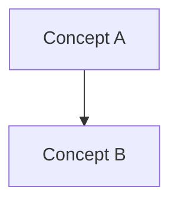
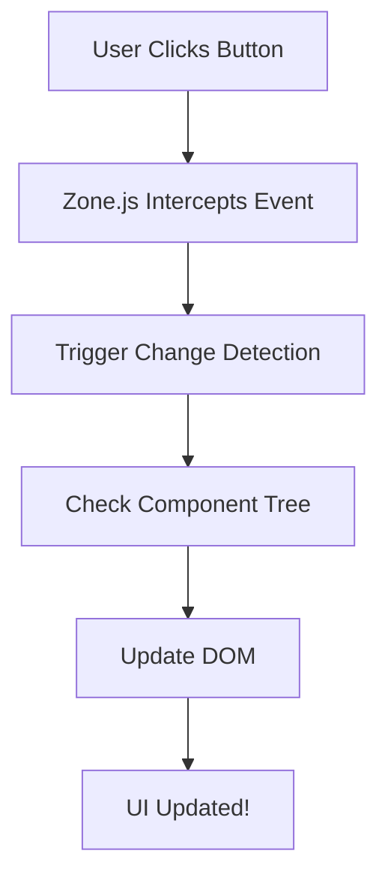

# 📚 Better Question Structure Guide

## Current Issue

Your questions jump straight to code examples without explaining concepts first. This makes learning harder for beginners.

**Current Structure:**
```markdown
### 1. Question Title

**Question:** Brief question statement

<details>
<summary>View Answer</summary>

#### Section 1
[Immediately shows code]
```typescript
@Component({...})
```

#### Section 2
More code...
```

**Problem:** No conceptual foundation before diving into code!

---

## ✅ Recommended Structure

### Template for Better Learning:

```markdown
### 1. Question Title

**Question:** Brief question statement

<details>
<summary><b>View Answer</b></summary>

#### 🎯 Quick Summary
A 2-3 sentence high-level explanation of the concept.

#### 📖 Concept Explanation

**What is it?**
Plain English explanation of what this concept/feature is.

**Why does it matter?**
Real-world importance and use cases.

**How does it work?**
Step-by-step conceptual explanation WITHOUT code yet.

#### 💡 Key Concepts

1. **First Key Point**
   - Bullet point explanation
   - More details

2. **Second Key Point**
   - Explanation
   - Details

#### 📊 Visual Overview

[Mermaid diagram if helpful]


#### 💻 Code Examples

Now that you understand the concept, here's how to implement it:

**Example 1: Basic Usage**
```typescript
// Clear, simple example
@Component({
  selector: 'app-example'
})
export class Example {}
```

**Example 2: Real-World Usage**
```typescript
// More complex, practical example
```

#### ⚠️ Common Pitfalls

- What to avoid
- Common mistakes
- Best practices

#### 🔗 Related Concepts
- Links to related questions
- Further reading

</details>
```

---

## 📝 Example: Well-Structured Question

### Good Example:

```markdown
### 1. What is Angular's Change Detection Mechanism?

**Question:** Explain Angular's change detection from event to DOM update.

<details>
<summary><b>View Answer</b></summary>

#### 🎯 Quick Summary

Change detection is Angular's process of synchronizing your application's data with the UI. It automatically updates the DOM when your component's data changes.

#### 📖 Concept Explanation

**What is Change Detection?**

Imagine you have a counter app. When you click a button, the counter increases. Change detection is the mechanism that:
1. Notices the counter value changed
2. Finds all places in the UI showing that counter
3. Updates those DOM elements with the new value

**Why does it matter?**

Without change detection, you'd manually update the DOM every time data changes - tedious and error-prone. Angular automates this, keeping your UI in sync with your data.

**How does it work?**

Think of it like a "watchdog" system:
1. An event happens (button click, HTTP response, timer)
2. Angular's "watchdog" (Zone.js) notices the event
3. Angular checks if any data used in templates changed
4. If yes, update those specific parts of the DOM
5. Your UI is now up-to-date!

#### 💡 Key Concepts

**1. Automatic vs Manual**
- By default, Angular checks EVERYTHING after EVERY event
- This is safe but can be slow in large apps
- You can optimize by telling Angular "only check when I say so"

**2. Two Strategies**
- **Default:** Check all components (simple, safe)
- **OnPush:** Only check when needed (fast, requires discipline)

**3. Zone.js Magic**
- Monkey-patches browser APIs
- Intercepts ALL async operations
- Triggers change detection automatically

#### 📊 Visual Flow



#### 💻 Code Examples

Now let's see this in action:

**Example 1: Default Change Detection**

```typescript
// This component uses default change detection
// Angular checks it after EVERY event in the app

@Component({
  selector: 'app-counter',
  template: `
    <div>Count: {{ count }}</div>
    <button (click)="increment()">+1</button>
  `
})
export class CounterComponent {
  count = 0;
  
  increment() {
    this.count++; // Angular detects this change!
  }
}
```

What happens:
1. User clicks button
2. `increment()` runs, `count` becomes 1
3. Zone.js triggers change detection
4. Angular checks this component
5. Sees `count` changed from 0 to 1
6. Updates the DOM: `<div>Count: 1</div>`

**Example 2: Optimized with OnPush**

```typescript
// This component only checks when inputs change
// Much faster for large apps!

@Component({
  selector: 'app-user',
  changeDetection: ChangeDetectionStrategy.OnPush,
  template: `<div>{{ user.name }}</div>`
})
export class UserComponent {
  @Input() user: User; // Only checked when this reference changes
}
```

#### ⚠️ Common Pitfalls

**Pitfall 1: Mutating Objects with OnPush**
```typescript
// ❌ WRONG: Mutating - OnPush won't detect
this.user.name = "New Name"; // Same object reference

// ✅ CORRECT: New reference
this.user = { ...this.user, name: "New Name" };
```

**Pitfall 2: Forgetting to Run in Zone**
```typescript
// ❌ WRONG: Outside Angular's zone
setTimeout(() => {
  this.count++;  // UI won't update!
}, 1000);

// ✅ CORRECT: Use Angular's NgZone
this.ngZone.run(() => {
  this.count++;  // UI updates!
});
```

#### 🎯 When to Use Each Strategy

Use **Default** when:
- Building small apps
- Rapid prototyping
- Prioritizing simplicity

Use **OnPush** when:
- Large component trees
- Performance is critical
- Using immutable data patterns

#### 🔗 Related Concepts
- Zone.js internals
- Immutable data patterns
- Component lifecycle hooks

</details>
```

---

## 🔄 How to Improve Your Questions

### Step 1: Identify Structure Issues

Look for questions that:
- Start with code immediately
- Lack "Why" explanations
- Have no concept introduction
- Jump between topics randomly

### Step 2: Add Conceptual Layers

For each question, add:
1. **Quick Summary** (30 seconds to read)
2. **Plain English Explanation** (no jargon)
3. **Why It Matters** (real-world context)
4. **How It Works** (conceptual flow)
5. **Then** show code examples

### Step 3: Structure Code Examples

Don't dump all code at once:
1. **Basic Example** - Simplest possible case
2. **Practical Example** - Real-world usage
3. **Advanced Example** - Edge cases/optimization

### Step 4: Add Learning Aids

- Diagrams before complex code
- Comments in code explaining each line
- Common mistakes section
- Related concepts links

---

## 📊 Before vs After Comparison

### ❌ BEFORE (Hard to Learn)

```markdown
#### Change Detection Flow

```typescript
@Component({
  changeDetection: ChangeDetectionStrategy.OnPush
})
export class UserComponent {
  @Input() user: User;
}
```

Zone.js triggers change detection...
[More technical details]
```

Problems:
- Code first, explanation later
- Assumes prior knowledge
- No context for "why"
- Overwhelming for beginners

### ✅ AFTER (Easy to Learn)

```markdown
#### 🎯 What You'll Learn

Change detection keeps your UI in sync with your data automatically.

#### 📖 The Problem It Solves

Without change detection, you'd write code like this every time data changes:
- Manually find the DOM element
- Manually update its text
- Track all places using that data

That's tedious and error-prone!

#### 💡 The Solution

Angular does this automatically:
1. You change data: `this.name = "Alice"`
2. Angular notices the change
3. Angular updates the UI automatically
4. No manual DOM manipulation needed!

#### 📊 Visual Overview
[Mermaid diagram showing flow]

#### 💻 Now Let's See It In Code

**Example 1: The Basics**
[Simple code with line-by-line comments]

**Example 2: In Practice**
[Real-world code]
```

Benefits:
- Context before code
- Progressive complexity
- Clear learning path
- Approachable for beginners

---

## 🛠️ Quick Fixes for Your Questions

### Fix 1: Add Summary Sections

At the start of every answer:
```markdown
#### 🎯 TL;DR
One paragraph summarizing the entire concept.
```

### Fix 2: Add "Why" Sections

Before diving deep:
```markdown
#### 📖 Why This Matters
Real-world scenario explaining importance.
```

### Fix 3: Separate Concepts from Code

```markdown
#### 💡 The Concept
[Explanation without code]

#### 💻 The Implementation
[Code examples]
```

### Fix 4: Add Progressive Examples

```markdown
#### 💻 Code Examples

**Level 1: Hello World**
Simplest possible example

**Level 2: Real Usage**
Practical example

**Level 3: Production Ready**
Complete example with error handling
```

---

## 🎯 Checklist for Each Question

Before considering a question "complete," ensure it has:

- [ ] Quick summary (30 seconds)
- [ ] Plain English explanation
- [ ] "Why it matters" section
- [ ] Conceptual flow (before code)
- [ ] Diagram (if helpful)
- [ ] Progressive code examples (simple → complex)
- [ ] Comments in code
- [ ] Common mistakes section
- [ ] Related concepts

---

## 📝 Action Items

### To Improve Your Content:

1. **Review Current Questions**
   - Open `markdown-files/angular.md`
   - Find questions that jump to code immediately

2. **Restructure Top 10 Questions**
   - Add conceptual explanations
   - Reorganize code examples
   - Add learning aids

3. **Re-import Questions**
   ```bash
   npm run import:local
   ```

4. **Test Learning Flow**
   - Read questions as if you're a beginner
   - Does it make sense without prior knowledge?
   - Is the progression logical?

---

## 🎓 Learning Principles Applied

**1. Scaffolding**
Start with familiar concepts, build up gradually.

**2. Context First**
Answer "why" before "how".

**3. Progressive Disclosure**
Simple examples first, complexity later.

**4. Multiple Modalities**
Text + diagrams + code = better retention.

**5. Practical Context**
Real-world scenarios make concepts stick.

---

## 💡 Example Template You Can Use

Save this as a template for new questions:

```markdown
### N. [Question Title]

**Question:** [Brief question statement]

<details>
<summary><b>View Answer</b></summary>

#### 🎯 Quick Summary
[2-3 sentences - high-level overview]

#### 📖 Understanding the Concept

**What is [concept]?**
[Plain English explanation]

**Why should you care?**
[Real-world importance]

**How does it work?**
[Conceptual explanation - no code yet]

#### 💡 Key Points

1. **[First Key Point]**
   - [Details]

2. **[Second Key Point]**
   - [Details]

#### 📊 Visual Overview
[Optional mermaid diagram]

#### 💻 Implementation

**Example 1: Basic**
[Simple code with comments]

**Example 2: Real-World**
[Practical code]

**Example 3: Advanced**
[Complex scenario]

#### ⚠️ Common Mistakes

**Mistake 1:**
```typescript
// ❌ Wrong
[bad code]

// ✅ Correct
[good code]
```

#### 🎯 Best Practices

- [Practice 1]
- [Practice 2]

#### 🔗 Related Topics
- [Link 1]
- [Link 2]

</details>
```

---

**Your questions will be much more effective with this structure!** 🎓

Would you like me to help restructure a few questions as examples?


