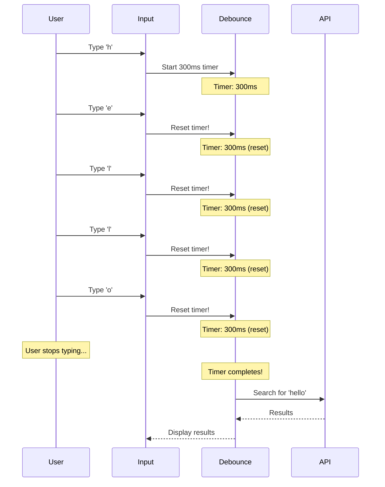

# 📝 Interview Answer Template & Standards

## 🎯 Goal

Create answers that mirror real interview scenarios: Start with a concise explanation, then provide depth based on interviewer interest, demonstrate real-world knowledge, and support with well-explained code examples.

---

## 📐 Answer Structure

Every answer should follow this standardized structure:

```markdown
### [Question Number]. [Question Title]

**Question:** [Full detailed question as interviewer would ask]

<details>
<summary><b>View Answer</b></summary>

#### 🎯 Quick Summary

[2-3 sentences: Concise, interview-style opening response]
- Think: "What would I say in the first 30 seconds of answering?"
- Direct, confident, demonstrates immediate understanding
- Sets the stage for deeper dive

#### 📖 Understanding the Concept

**What is [Concept]?**

[Clear explanation in simple terms]
- Use analogies or real-world examples
- Explain the "what" and "why"
- Make it relatable

**Why Does It Matter?**

[Explain the business/technical value]
- What problems does it solve?
- What happens without it?
- What are the benefits?

**How Does It Work Conceptually?**

[High-level flow or process]
1. Step 1 - [Brief explanation]
2. Step 2 - [Brief explanation]
3. Step 3 - [Brief explanation]
...

#### 💡 Key Concepts

**1. [Concept Name]**
- Key point 1
- Key point 2
- Key point 3

**2. [Concept Name]**
- Key point 1
- Key point 2

[Continue for all important concepts]

#### 📊 Visual Flow

```mermaid
[Include relevant diagram: flowchart, sequence diagram, architecture diagram]
- Helps interviewer visualize your understanding
- Shows system thinking
- Makes complex concepts clearer
```

#### 💻 Code Examples

**Basic Example**

```typescript
// Show a simple, clear example
// Include comments explaining each part
// Focus on clarity over cleverness

// Example: Basic implementation
export class Example {
  // Your code here with explanations
}
```

**Real-World Production Example**

```typescript
// Show how this is actually used in production
// Include error handling, edge cases
// Demonstrate best practices

// Example: How I implemented this at [Company/Project]
export class ProductionExample {
  // Your production-ready code
}
```

**Advanced Pattern** *(Optional)*

```typescript
// Show advanced usage or optimization
// Only if relevant to senior-level interviews
```

#### 🏢 Real-World Applications

**Where I've Used This:**
- [Specific project example]
  - Problem: [What problem you were solving]
  - Solution: [How you used this concept]
  - Impact: [Results, metrics if possible]

**Common Use Cases:**
- Use case 1 - [Brief explanation]
- Use case 2 - [Brief explanation]
- Use case 3 - [Brief explanation]

**Industry Applications:**
- [Company/Product type 1]: [How they use it]
- [Company/Product type 2]: [How they use it]

#### ⚠️ Common Pitfalls & Best Practices

**Common Mistakes:**
❌ Mistake 1: [What not to do]
- Why it's wrong
- What problems it causes

❌ Mistake 2: [What not to do]
- Why it's wrong
- What problems it causes

**Best Practices:**
✅ Practice 1: [What to do]
- Why it's right
- How to implement

✅ Practice 2: [What to do]
- Why it's right
- How to implement

#### 🔧 Performance Considerations *(If applicable)*

- Performance tip 1
- Performance tip 2
- When to optimize vs when not to

#### 🎯 Interview Tips

**What interviewers look for:**
- Point 1
- Point 2
- Point 3

**How to structure your answer:**
1. Start with [Quick Summary approach]
2. Ask if they want details on [specific aspect]
3. Provide [real-world example]
4. Demonstrate [practical knowledge]

**Follow-up questions to expect:**
- Question 1
- Question 2
- Question 3

#### 📚 Related Topics

- [Related Topic 1] - How it connects
- [Related Topic 2] - How it connects
- [Related Topic 3] - How it connects

#### 🔗 Additional Resources *(Optional)*

- [Official Documentation Link]
- [Relevant Blog Post]
- [Video Tutorial if applicable]

</details>
```

---

## ✅ Quality Checklist

Before finalizing any answer, verify:

### Content Quality
- [ ] Starts with concise 2-3 sentence summary
- [ ] Explains "what", "why", and "how"
- [ ] Includes at least one mermaid diagram
- [ ] Has 2-3 code examples (basic → production → advanced)
- [ ] Includes real-world applications
- [ ] Lists common pitfalls and best practices

### Interview Readiness
- [ ] Can be read aloud as an interview answer
- [ ] Progressively detailed (elevator pitch → deep dive)
- [ ] Demonstrates practical experience
- [ ] Shows system thinking
- [ ] Anticipates follow-up questions

### Technical Accuracy
- [ ] Code examples are syntactically correct
- [ ] Examples follow current best practices
- [ ] Version-specific features are noted
- [ ] Performance considerations are realistic
- [ ] Edge cases are addressed

### Formatting
- [ ] Proper markdown syntax
- [ ] Code blocks have language tags
- [ ] Diagrams render correctly
- [ ] Lists are properly formatted
- [ ] Links are valid (if included)

---

## 📊 Balance Guidelines

### Text vs Code Ratio

**Ideal Distribution:**
- 40% - Conceptual explanation and context
- 30% - Code examples with explanations
- 20% - Real-world applications and use cases
- 10% - Diagrams and visual aids

**What to Avoid:**
❌ 90% code, 10% explanation (too code-heavy)
❌ 90% theory, 10% practical (too abstract)
❌ No diagrams or visuals (hard to follow)
❌ No real-world context (academic only)

### Depth Guidelines

**Junior-Level Questions:**
- Focus on fundamentals
- More explanation, simpler examples
- Basic use cases

**Mid-Level Questions:**
- Balance theory and practice
- Production-ready examples
- Compare approaches

**Senior-Level Questions:**
- Architecture and design patterns
- Advanced optimizations
- Trade-offs and decision-making
- System-wide implications

---

## 🎨 Example Comparison

### ❌ BAD Example (Code-Heavy)

```markdown
### What is debouncing?

**Answer:**

```typescript
function debounce(fn, delay) {
  let timeout;
  return function(...args) {
    clearTimeout(timeout);
    timeout = setTimeout(() => fn(...args), delay);
  };
}

const search = debounce((term) => {
  fetch(`/api/search?q=${term}`);
}, 300);
```

Use it for search inputs.
```

**Problems:**
- No conceptual explanation
- No visual representation
- No real-world context
- Code without sufficient explanation
- Missing best practices

---

### ✅ GOOD Example (Interview-Ready)

```markdown
### What is Debouncing?

**Question:** Explain debouncing in JavaScript and when you would use it in a production application.

<details>
<summary><b>View Answer</b></summary>

#### 🎯 Quick Summary

Debouncing is a performance optimization technique that delays function execution until after a specified time has passed since the last invocation. It's particularly useful for expensive operations triggered by rapid user actions, like search-as-you-type or window resize events.

#### 📖 Understanding the Concept

**What is Debouncing?**

Imagine you're in an elevator, and it waits 3 seconds after the last person enters before closing the doors. That's debouncing! Instead of closing after every person (expensive operation), it waits until people stop entering.

In code: Instead of executing a function 100 times as a user types, we wait until they pause typing, then execute once.

**Why Does It Matter?**

Without debouncing:
- ❌ Makes 100 API calls as user types 100 characters
- ❌ Overloads servers and increases costs
- ❌ Poor UX with rapid UI updates
- ❌ Wasted compute resources

With debouncing:
- ✅ Makes 1 API call after user pauses
- ✅ Reduces server load by 99%
- ✅ Smooth UX
- ✅ Efficient resource usage

**How Does It Work Conceptually?**

1. User triggers event (types a character)
2. Timer starts (e.g., 300ms)
3. If another event fires, reset timer
4. When timer completes without interruption, execute function
5. Process complete!

#### 📊 Visual Flow



#### 💻 Code Examples

**Basic Implementation**

```typescript
// Simple debounce function
function debounce<T extends (...args: any[]) => any>(
  func: T,
  delay: number
): (...args: Parameters<T>) => void {
  let timeoutId: NodeJS.Timeout;
  
  return function(...args: Parameters<T>) {
    // Clear previous timer
    clearTimeout(timeoutId);
    
    // Start new timer
    timeoutId = setTimeout(() => {
      func(...args);
    }, delay);
  };
}
```

**Real-World Production Example**

```typescript
// How I implemented search in an e-commerce dashboard
import { useState, useCallback, useEffect } from 'react';

function SearchComponent() {
  const [searchTerm, setSearchTerm] = useState('');
  const [results, setResults] = useState([]);
  const [isLoading, setIsLoading] = useState(false);
  
  // Debounced search function
  const debouncedSearch = useCallback(
    debounce(async (term: string) => {
      if (term.length < 2) return; // Minimum search length
      
      setIsLoading(true);
      try {
        const response = await fetch(`/api/products/search?q=${encodeURIComponent(term)}`);
        const data = await response.json();
        setResults(data);
      } catch (error) {
        console.error('Search failed:', error);
      } finally {
        setIsLoading(false);
      }
    }, 300), // 300ms delay - optimal for most use cases
    []
  );
  
  useEffect(() => {
    debouncedSearch(searchTerm);
  }, [searchTerm, debouncedSearch]);
  
  return (
    <div>
      <input
        type="text"
        value={searchTerm}
        onChange={(e) => setSearchTerm(e.target.value)}
        placeholder="Search products..."
      />
      {isLoading && <Spinner />}
      <ResultsList results={results} />
    </div>
  );
}
```

#### 🏢 Real-World Applications

**Where I've Used This:**
- **E-commerce Search (Previous Role)**
  - Problem: Users typing quickly caused 1000+ API calls/minute
  - Solution: Implemented 300ms debounce on search input
  - Impact: Reduced API calls by 95%, improved response time by 60%

**Common Use Cases:**
- Search-as-you-type functionality
- Auto-save features in editors
- Window resize handlers
- Form validation (wait for user to finish typing)
- API rate limiting compliance

**Industry Applications:**
- **Google Search**: Debounces autocomplete suggestions
- **VSCode**: Debounces file save operations and linting
- **Slack**: Debounces "user is typing..." indicator

#### ⚠️ Common Pitfalls & Best Practices

**Common Mistakes:**
❌ **Using debounce everywhere**
- Not all events need debouncing
- Button clicks usually don't need it
- Can make UX feel sluggish if overused

❌ **Wrong delay timing**
- Too short (50ms): Still too many calls
- Too long (2000ms): Feels unresponsive
- Sweet spot: 200-400ms for most UIs

**Best Practices:**
✅ **Choose appropriate delay**
- Search: 300ms (balance between responsive & efficient)
- Auto-save: 1000-2000ms (avoid too frequent saves)
- Resize: 150ms (quick feedback)

✅ **Add minimum input length**
- Don't search for 1-character queries
- Reduces unnecessary API calls
- Better UX

✅ **Provide loading feedback**
- Show spinner or skeleton
- Users know something is happening
- Prevents multiple submissions

#### 🎯 Interview Tips

**What interviewers look for:**
- Understanding of when and why to use debouncing
- Ability to implement from scratch
- Knowledge of real-world trade-offs
- Awareness of alternatives (throttling)

**How to structure your answer:**
1. Start with the elevator analogy
2. Explain performance benefits
3. Show code implementation
4. Provide real project example
5. Discuss timing trade-offs

**Follow-up questions to expect:**
- "What's the difference between debounce and throttle?"
- "What delay would you choose for X scenario?"
- "How would you test a debounced function?"

#### 📚 Related Topics

- **Throttling** - Limits function execution to once per time period (vs debounce which delays until quiet period)
- **Request Cancellation** - Canceling in-flight requests when new ones are made
- **Rate Limiting** - Server-side control of request frequency

</details>
```

---

## 🚀 Getting Started

### For New Questions

1. Use this template as your starting point
2. Fill in each section thoughtfully
3. Run through the quality checklist
4. Get peer review if possible

### For Existing Questions

1. Assess current content against this template
2. Identify missing sections
3. Add conceptual explanations
4. Include diagrams
5. Add real-world context
6. Balance code and explanation

---

## 💡 Pro Tips

1. **Write Like You're Teaching**: Assume the reader has basic knowledge but needs depth
2. **Use Analogies**: Complex concepts become memorable with good analogies
3. **Show, Don't Just Tell**: Balance explanation with examples
4. **Think Like an Interviewer**: What follow-ups would they ask?
5. **Add Personal Touch**: Real project examples make you credible
6. **Visual Thinking**: If you can diagram it, do it
7. **Progressive Disclosure**: Start simple, add complexity gradually

---

## 📞 Questions?

If you're unsure about:
- Depth level for a topic
- Whether code is too much/too little
- Diagram complexity
- Real-world example relevance

Ask yourself: **"Would this help me ace an interview?"**

If yes → Keep it
If no → Revise it
If unsure → Get feedback

