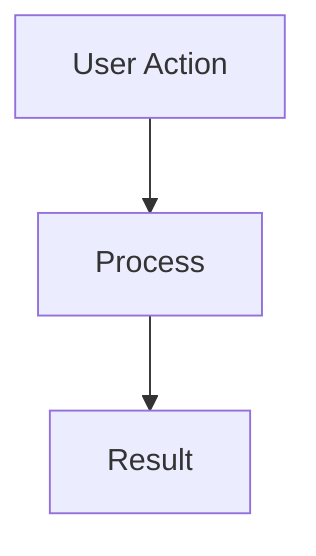
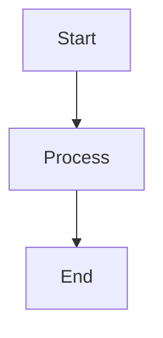
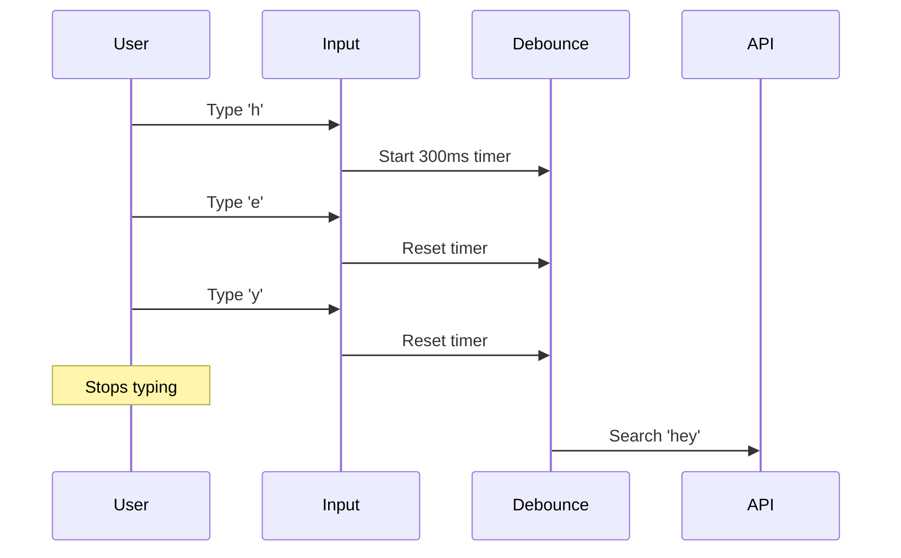

# ⚡ Quick Start: Improve Your Questions

## 🎯 Goal
Transform code-heavy answers into interview-ready responses with better explanations, diagrams, and real-world context.

---

## 🚀 3-Step Process

### Step 1: Assess (2 minutes)

```bash
npm run assess:questions -- --detailed
```

This shows you:
- Which questions need the most work
- Common issues across all questions
- Category-wise scores

### Step 2: Pick a Question (1 minute)

Start with questions scoring <40. Open the lowest scoring one.

### Step 3: Improve (15-30 minutes per question)

Use this checklist while editing:

---

## ✅ Improvement Checklist

### 1. Add Quick Summary (2 minutes)
**At the very top of your answer, add:**

```markdown
#### 🎯 Quick Summary

[2-3 sentences explaining the concept concisely]
```

**Example:**
```markdown
#### 🎯 Quick Summary

Change detection is Angular's automatic system for keeping your UI 
synchronized with your data. When something changes (like a button click), 
Angular automatically updates the screen—no manual DOM manipulation needed!
```

---

### 2. Add Conceptual Explanation (5 minutes)
**After the summary:**

```markdown
#### 📖 Understanding the Concept

**What is [Concept]?**

[Simple explanation with analogy]

**Why Does It Matter?**

Without it:
- ❌ Problem 1
- ❌ Problem 2

With it:
- ✅ Benefit 1
- ✅ Benefit 2

**How Does It Work?**

1. Step 1
2. Step 2
3. Step 3
```

---

### 3. Add a Diagram (5-10 minutes)
**Create a visual flow:**

```markdown
#### 📊 Visual Flow


\```
```

**Use [Mermaid Live Editor](https://mermaid.live/) to design your diagram**

**Common diagram types:**
- `graph TD` - Flowchart (top-down)
- `sequenceDiagram` - Interactions between components
- `graph LR` - Architecture (left-right)

---

### 4. Organize Code Examples (5 minutes)
**Structure your code like this:**

```markdown
#### 💻 Code Examples

**Basic Example**

```typescript
// Simple, clear implementation
// With explanatory comments
```

**Real-World Production Example**

```typescript
// How you'd actually use this in production
// With error handling and best practices
```
\```
```

**Tips:**
- Keep basic example simple (10-15 lines)
- Make production example realistic (20-30 lines)
- Add comments explaining each part

---

### 5. Add Real-World Context (5 minutes)

```markdown
#### 🏢 Real-World Applications

**Where I've Used This:**
- **Project at Company**
  - Problem: [What you were solving]
  - Solution: [How you used this]
  - Impact: [Results - be specific!]

**Common Use Cases:**
- Use case 1
- Use case 2
- Use case 3

**Industry Examples:**
- Google: [How they use it]
- Netflix: [How they use it]
```

---

### 6. Add Best Practices (3 minutes)

```markdown
#### ⚠️ Common Pitfalls & Best Practices

**Common Mistakes:**

❌ **Mistake 1**
- Why it's wrong
- What problems it causes

❌ **Mistake 2**
- Why it's wrong
- What problems it causes

**Best Practices:**

✅ **Practice 1**
- Why it's right
- How to implement

✅ **Practice 2**
- Why it's right
- How to implement
```

---

### 7. Add Interview Tips (2 minutes)

```markdown
#### 🎯 Interview Tips

**What interviewers look for:**
- Understanding of core concept
- Real-world experience
- Awareness of trade-offs

**How to answer:**
1. Start with 2-sentence summary
2. Ask if they want details
3. Provide real example
4. Discuss trade-offs

**Follow-up questions to expect:**
- "When would you use X vs Y?"
- "What are the performance implications?"
- "How did you handle Z in your project?"
```

---

## 📝 Template You Can Copy-Paste

```markdown
#### 🎯 Quick Summary

[Concept] is [simple definition]. [Why it matters]. [Key benefit].

#### 📖 Understanding the Concept

**What is [Concept]?**

[Explanation with analogy]

**Why Does It Matter?**

Without it:
- ❌ Problem 1
- ❌ Problem 2

With it:
- ✅ Benefit 1
- ✅ Benefit 2

**How Does It Work?**

1. Step 1 - [Explanation]
2. Step 2 - [Explanation]
3. Step 3 - [Explanation]

#### 📊 Visual Flow



#### 💻 Code Examples

**Basic Example**

```typescript
// Clear, simple code
// With comments
```

**Real-World Production Example**

```typescript
// Production-ready implementation
// With error handling
```

#### 🏢 Real-World Applications

**Where I've Used This:**
- **Project at Company**
  - Problem: [Challenge]
  - Solution: [Implementation]
  - Impact: [Results]

**Common Use Cases:**
- Use case 1
- Use case 2
- Use case 3

#### ⚠️ Common Pitfalls & Best Practices

**Common Mistakes:**

❌ **Mistake 1**
- Why it's wrong
- Problems it causes

**Best Practices:**

✅ **Practice 1**
- Why it's right
- How to implement

#### 🎯 Interview Tips

**What interviewers look for:**
- Point 1
- Point 2

**How to answer:**
1. Start with quick summary
2. Dive into details if asked
3. Share real example

**Follow-up questions:**
- Question 1
- Question 2
```

---

## 🎨 Before & After Example

### ❌ Before (Code-Heavy, Poor)

```markdown
### What is debouncing?

```typescript
function debounce(fn, delay) {
  let timeout;
  return function(...args) {
    clearTimeout(timeout);
    timeout = setTimeout(() => fn(...args), delay);
  };
}
```

Use it for search inputs to reduce API calls.
```

**Problems:**
- No conceptual explanation
- No diagram
- No real-world context
- Too much code, too little explanation
- No best practices

---

### ✅ After (Interview-Ready, Excellent)

```markdown
### What is Debouncing?

#### 🎯 Quick Summary

Debouncing delays function execution until after a specified time has passed since the last invocation. It's essential for performance optimization, particularly for expensive operations like API calls triggered by rapid user input.

#### 📖 Understanding the Concept

**What is Debouncing?**

Imagine you're in an elevator that waits 3 seconds after the last person enters before closing doors. That's debouncing! Instead of closing after every person, it waits until people stop entering.

**Why Does It Matter?**

Without debouncing:
- ❌ 100 API calls as user types 100 characters
- ❌ Server overload and increased costs
- ❌ Poor UX with rapid updates

With debouncing:
- ✅ 1 API call after user pauses
- ✅ 95%+ reduction in server load
- ✅ Smooth, efficient UX

**How Does It Work?**

1. User triggers event (types character)
2. Timer starts (e.g., 300ms)
3. If another event fires, reset timer
4. When timer completes, execute function

#### 📊 Visual Flow



#### 💻 Code Examples

**Basic Implementation**

```typescript
function debounce<T extends (...args: any[]) => any>(
  func: T,
  delay: number
): (...args: Parameters<T>) => void {
  let timeoutId: NodeJS.Timeout;
  
  return function(...args: Parameters<T>) {
    clearTimeout(timeoutId); // Clear previous timer
    timeoutId = setTimeout(() => func(...args), delay); // Start new
  };
}
```

**Production Example: Search Component**

```typescript
function SearchComponent() {
  const [searchTerm, setSearchTerm] = useState('');
  const [results, setResults] = useState([]);
  
  const debouncedSearch = useCallback(
    debounce(async (term: string) => {
      if (term.length < 2) return; // Min length
      
      try {
        const response = await fetch(`/api/search?q=${term}`);
        setResults(await response.json());
      } catch (error) {
        console.error('Search failed:', error);
      }
    }, 300),
    []
  );
  
  useEffect(() => {
    debouncedSearch(searchTerm);
  }, [searchTerm]);
  
  return <input onChange={(e) => setSearchTerm(e.target.value)} />;
}
```

#### 🏢 Real-World Applications

**Where I've Used This:**
- **E-commerce Search at Previous Company**
  - Problem: 1000+ API calls/minute from users typing
  - Solution: 300ms debounce on search input
  - Impact: 95% reduction in API calls, 60% faster response

**Common Use Cases:**
- Search-as-you-type functionality
- Auto-save in editors (1-2 second delay)
- Window resize handlers (150ms)
- Form validation

**Industry Examples:**
- Google Search: Autocomplete debouncing
- VSCode: File save and linting debounce
- Slack: "User is typing..." indicator

#### ⚠️ Common Pitfalls & Best Practices

**Common Mistakes:**

❌ **Using everywhere**
- Not all events need debouncing
- Button clicks usually don't
- Can make UI feel sluggish

❌ **Wrong delay timing**
- Too short (50ms): Still too many calls
- Too long (2s): Feels unresponsive
- Sweet spot: 200-400ms for most UIs

**Best Practices:**

✅ **Choose appropriate delay**
- Search: 300ms
- Auto-save: 1000-2000ms
- Resize: 150ms

✅ **Add minimum input length**
- Don't search 1-character queries
- Reduces unnecessary calls

✅ **Show loading state**
- Users know something is happening
- Prevents multiple submissions

#### 🎯 Interview Tips

**What interviewers look for:**
- Understanding when/why to use debouncing
- Ability to implement from scratch
- Knowledge of timing trade-offs
- Awareness of alternatives (throttling)

**How to answer:**
1. Start with elevator analogy
2. Explain performance benefits
3. Show code implementation
4. Share real project example
5. Discuss timing considerations

**Follow-up questions:**
- "Difference between debounce and throttle?"
- "What delay for auto-save vs search?"
- "How to test debounced functions?"
```

---

## 🎯 Key Differences

| Aspect | Before | After |
|--------|--------|-------|
| **Opening** | None | Quick summary |
| **Explanation** | 1 sentence | Full concept breakdown |
| **Visuals** | None | Mermaid diagram |
| **Code** | 1 basic example | 2 examples (basic + production) |
| **Context** | "Use for search" | Real project with metrics |
| **Guidance** | None | Pitfalls + best practices |
| **Interview** | Not prepared | Ready to ace it |
| **Score** | ~25/100 | ~90/100 |

---

## 📊 Time Investment

| Task | Time | Impact |
|------|------|--------|
| Quick Summary | 2 min | ⭐⭐⭐ |
| Concept Explanation | 5 min | ⭐⭐⭐⭐⭐ |
| Diagram | 5-10 min | ⭐⭐⭐⭐ |
| Code Examples | 5 min | ⭐⭐⭐ |
| Real-World Context | 5 min | ⭐⭐⭐⭐⭐ |
| Best Practices | 3 min | ⭐⭐⭐⭐ |
| Interview Tips | 2 min | ⭐⭐⭐ |
| **Total** | **~30 min** | **Huge** |

---

## 💪 Make It a Habit

**Daily Goal:** Improve 2-3 questions (1 hour)

**Weekly Goal:** Improve 15-20 questions

**Monthly Goal:** All questions scoring 60+

---

## 🎓 Remember

**Interview answers should:**
1. Start concise
2. Go deep if asked
3. Show real experience
4. Balance code and explanation
5. Make the candidate confident

**Your goal:** Make users feel like experts who can confidently answer any interviewer's questions!

---

## 🚀 Get Started NOW

```bash
# 1. See what needs work
npm run assess:questions

# 2. Pick lowest scoring question
npm run improve:question

# 3. Copy the template from above

# 4. Fill it in thoughtfully (30 min)

# 5. Update in database

# 6. Verify on your site

# 7. Repeat!
```

---

**Good luck! You got this! 💪**

