# 🅰️ Angular Interview Prep Guide

> **50 production-level Angular interview questions** for senior engineers and architects. Complete guide covering fundamentals to cutting-edge patterns with modern Angular 18+ features.

**⭐ Click star if you find this useful!**

---

## 📚 Table of Contents

- [Angular Questions (50)](#angular)
- [React Questions](#react) *(Coming Soon)*
- [JavaScript Questions](#javascript) *(Coming Soon)*
- [HTML & CSS Questions](#html--css) *(Coming Soon)*
- [System Design Questions](#system-design) *(Coming Soon)*
- [Behavioral Questions](#behavioral-questions) *(Coming Soon)*
- [Coding Challenges](#coding-challenges)

---

<a name="angular"></a>

# Angular Interview Questions

> **50 production-level Angular questions** for senior engineers and architects covering fundamentals, architecture, performance, testing, and modern patterns (Signals, SSR, Micro-frontends).

**Last Updated:** October 2025 | **Angular 18+**

---

## 📋 Questions List

| No. | Question |
|-----|----------|
| 1 | [What is Angular's Change Detection Mechanism?](#angular-q1) |
| 2 | [What is the difference between ngOnInit and Constructor?](#angular-q2) |
| 3 | [How does Content Projection work internally?](#angular-q3) |
| 4 | [How do you debug Memory Leaks in Angular?](#angular-q4) |
| 5 | [Explain Angular's Dependency Injection System](#angular-q5) |
| 6 | [What is Angular's Core Architecture?](#angular-q6) |
| 7 | [Explain Angular's Modular Architecture](#angular-q7) |
| 8 | [What is the Component Lifecycle in Angular?](#angular-q8) |
| 9 | [How does Change Detection work in detail?](#angular-q9) |
| 10 | [Explain Dependency Injection in depth](#angular-q10) |
| 11 | [What are RxJS Operators? (switchMap, mergeMap, concatMap, exhaustMap)](#angular-q11) |
| 12 | [ngOnInit vs Constructor - When to use what?](#angular-q12) |
| 13 | [What are Angular Modules?](#angular-q13) |
| 14 | [Explain Hierarchical Injectors](#angular-q14) |
| 15 | [What are Data Binding types in Angular?](#angular-q15) |
| 16 | [How does Content Projection Pipeline work?](#angular-q16) |
| 17 | [What are 10+ Performance Optimization Techniques?](#angular-q17) |
| 18 | [How does NgRx integrate with Angular?](#angular-q18) |
| 19 | [Explain Angular Testing Strategy](#angular-q19) |
| 20 | [How to debug Production Memory Leaks?](#angular-q20) |
| 21 | [What are Modern Angular Features?](#angular-q21) |
| 22 | [Explain Component Lifecycle Hooks](#angular-q22) |
| 23 | [How do Modern Angular Features work internally?](#angular-q23) |
| 24 | [Explain NgRx Data Flow](#angular-q24) |
| 25 | [What are Reactive Forms?](#angular-q25) |
| 26 | [How to implement Complex Form Validation?](#angular-q26) |
| 27 | [Explain Angular Router](#angular-q27) |
| 28 | [How do Route Guards work?](#angular-q28) |
| 29 | [Compare RxJS Operators](#angular-q29) |
| 30 | [What are RxJS and Observables?](#angular-q30) |
| 31 | [When to use which RxJS Operator?](#angular-q31) |
| 32 | [Explain Angular Testing Architecture](#angular-q32) |
| 33 | [Angular Signals vs Observables](#angular-q33) |
| 34 | [AOT vs JIT Compilation](#angular-q34) |
| 35 | [Angular Ivy Renderer Architecture](#angular-q35) |
| 36 | [HTTP Interceptors Pipeline](#angular-q36) |
| 37 | [Custom Structural Directives](#angular-q37) |
| 38 | [Dynamic Component Creation](#angular-q38) |
| 39 | [Renderer2 and Direct DOM Manipulation](#angular-q39) |
| 40 | [Web Workers in Angular](#angular-q40) |
| 41 | [Angular Module Boundaries and Architecture](#angular-q41) |
| 42 | [Angular Schematics and Code Generation](#angular-q42) |
| 43 | [View Encapsulation Strategies](#angular-q43) |
| 44 | [Zone.js and Zoneless Applications](#angular-q44) |
| 45 | [Angular Hydration and SSR](#angular-q45) |
| 46 | [Micro-Frontend Architecture](#angular-q46) |
| 47 | [Service Workers and PWA](#angular-q47) |
| 48 | [Performance Profiling and Optimization](#angular-q48) |
| 49 | [Reactive Forms Advanced Patterns](#angular-q49) |
| 50 | [Error Handling Strategy](#angular-q50) |

---

## Questions & Answers

<a name="angular-q1"></a>

### 1. What is Angular's Change Detection Mechanism?

**Question:** Walk me through Angular's change detection mechanism from the moment an event (say a button click) occurs in the browser to when the DOM actually updates. Cover Zone.js, ChangeDetectorRef, Default vs OnPush strategies, and manual optimization techniques.

<details>
<summary><b>View Answer</b></summary>

#### 🎯 Quick Summary

Change detection is Angular's automatic system for keeping your UI synchronized with your application data. When something changes (like clicking a button), Angular automatically updates the parts of your screen that need to reflect that change—no manual DOM manipulation required!

#### 📖 Understanding the Concept

**What is Change Detection?**

Think of change detection as a "watchdog" that monitors your application. In traditional JavaScript, if you update a variable, you'd have to manually find the DOM elements displaying that variable and update them. Angular does this automatically!

For example:
- You click a button that increases a counter
- Your component's `count` variable changes from 5 to 6
- Angular notices this change
- Angular automatically updates `<div>{{count}}</div>` in your template to show 6

**Why Does It Matter?**

Without change detection, building dynamic UIs would be painful:
- You'd manually update the DOM after every data change
- Easy to miss updates, leading to bugs
- Code becomes tightly coupled to the DOM structure
- Hard to maintain and scale

With change detection:
- Write declarative templates
- Update data, Angular handles the UI
- Clean separation of concerns
- Automatic and reliable updates

**How Does It Work Conceptually?**

1. **Something happens** - User clicks, API responds, timer fires
2. **Angular's watchdog notices** - Zone.js intercepts the event
3. **Check what changed** - Angular compares old vs new data
4. **Update the view** - Only changed parts of DOM are updated
5. **Your UI is fresh** - Automatic, no extra code needed!

#### 💡 Key Concepts

**1. Automatic by Default**
- Angular handles this for you automatically
- You just update your data, Angular updates the UI
- Works out of the box for most apps

**2. Two Main Strategies**
- **Default:** Check everything (simple, safe, but slower)
- **OnPush:** Only check when necessary (fast, but requires discipline)

**3. Zone.js: The Magic Behind It**
- Intercepts ALL async operations (clicks, HTTP, timers)
- Tells Angular "something might have changed!"
- Triggers change detection automatically

**4. Manual Control Available**
- Can detach from automatic checking
- Trigger updates only when you want
- Useful for performance-critical scenarios

#### 📊 Visual Flow


#### 💻 Code Examples

Now let's see how this works in actual code:

**Example 1: Basic Counter (Default Strategy)**

```typescript
// Simple component using default change detection
@Component({
  selector: 'app-counter',
  template: `
    <div>Count: {{ count }}</div>
    <button (click)="increment()">+1</button>
  `
})
export class CounterComponent {
  count = 0;
  
  increment() {
    this.count++; // Angular detects this change automatically!
  }
}
```

**What happens behind the scenes:**
1. User clicks the "+1" button
2. Zone.js intercepts the click event
3. `increment()` method runs, `count` changes from 0 to 1
4. Zone.js tells Angular "something might have changed"
5. Angular checks this component's template
6. Sees that `{{count}}` references changed data
7. Updates the DOM: `<div>Count: 1</div>`
8. Your UI is updated—automatically!

**Example 2: The Zone.js Magic**

```typescript
// Zone.js automatically intercepts these operations:
@Component({
  template: `<div>{{ message }}</div>`
})
export class MessagesComponent {
  message = 'Loading...';
  
  ngOnInit() {
    // HTTP Request - Zone.js intercepts
    this.http.get('/api/data').subscribe(data => {
      this.message = 'Data loaded!'; // UI updates automatically!
    });
    
    // setTimeout - Zone.js intercepts
    setTimeout(() => {
      this.message = 'Timeout done!'; // UI updates automatically!
    }, 1000);
    
    // DOM Event - Zone.js intercepts
    // (already shown in button clicks)
  }
}
```

**Zone.js patches these operations:**
- DOM events (click, input, etc.)
- `setTimeout()` and `setInterval()`
- Promises
- HTTP requests (via HttpClient)
- WebSocket events

**Example 3: Optimizing with OnPush Strategy**

```typescript
// Default Strategy - checks EVERY time
@Component({
  selector: 'app-user-default',
  template: `
    <div>{{ user.name }}</div>
    <div>{{ expensiveCalculation() }}</div>
  `,
  changeDetection: ChangeDetectionStrategy.Default
})
export class UserDefaultComponent {
  @Input() user: User;
  
  expensiveCalculation() {
    console.log('Calculating...'); // Runs on EVERY change in the app!
    return this.user.name.toUpperCase();
  }
}
```

```typescript
// OnPush Strategy - checks only when needed
@Component({
  selector: 'app-user-optimized',
  template: `
    <div>{{ user.name }}</div>
    <div>{{ expensiveCalculation() }}</div>
  `,
  changeDetection: ChangeDetectionStrategy.OnPush
})
export class UserOptimizedComponent {
  @Input() user: User;
  
  expensiveCalculation() {
    console.log('Calculating...'); // Only runs when this component actually changes!
    return this.user.name.toUpperCase();
  }
}
```

**OnPush triggers change detection only when:**
1. **Input reference changes** (new object, not mutation)
2. **Event fires** in the component or its children
3. **Async pipe emits** a new value
4. **`markForCheck()`** called manually

**Example 4: Manual Control with ChangeDetectorRef**

```typescript
export class ManualComponent implements OnInit {
  data: any;
  
  constructor(
    private cdr: ChangeDetectorRef,
    private dataService: DataService
  ) {}
  
  ngOnInit() {
    // Detach from automatic change detection
    this.cdr.detach();
    
    // Now we control when to check
    this.dataService.getData().subscribe(data => {
      this.data = data;
      
      // Option 1: Check immediately (this component + children)
      this.cdr.detectChanges();
      
      // Option 2: Schedule check in next cycle
      this.cdr.markForCheck();
    });
  }
  
  ngOnDestroy() {
    // Clean up: reattach if needed
    this.cdr.reattach();
  }
}
```

**ChangeDetectorRef Methods:**

| Method | What It Does | When to Use |
|--------|-------------|-------------|
| `detectChanges()` | Immediately checks this component and children | After updating data outside Zone.js |
| `markForCheck()` | Schedules check in next CD cycle | With OnPush when input mutates |
| `detach()` | Removes from automatic checking | For full manual control (games, real-time) |
| `reattach()` | Restores automatic checking | To resume normal behavior |

**Example 5: Real-World Performance Impact**

```typescript
// Large List Example
@Component({
  selector: 'app-users-list',
  template: `
    <app-user-card 
      *ngFor="let user of users" 
      [user]="user"
      (userUpdated)="onUserUpdate($event)">
    </app-user-card>
  `
})
export class UsersListComponent {
  users: User[] = [...]; // 1000 users
  
  onUserUpdate(updatedUser: User) {
    // ❌ WRONG with OnPush: Mutates array (same reference)
    // const user = this.users.find(u => u.id === updatedUser.id);
    // user.name = updatedUser.name; // OnPush won't detect!
    
    // ✅ CORRECT: Create new array reference
    this.users = this.users.map(u => 
      u.id === updatedUser.id ? { ...u, ...updatedUser } : u
    );
    // OnPush detects new reference and updates!
  }
}

// Each user card with OnPush
@Component({
  selector: 'app-user-card',
  template: `
    <div>{{ user.name }}</div>
    <button (click)="update()">Update</button>
  `,
  changeDetection: ChangeDetectionStrategy.OnPush
})
export class UserCardComponent {
  @Input() user: User;
  @Output() userUpdated = new EventEmitter<User>();
  
  update() {
    this.userUpdated.emit({ ...this.user, name: 'Updated' });
  }
}
```

**Performance Comparison:**
```
Without OnPush (Default):
- 1000 components checked every click
- ~50ms per change detection cycle
- User types in input → 50ms lag per keystroke

With OnPush:
- Only 10 components checked
- ~5ms per change detection cycle
- 90% performance improvement!
```

#### ⚠️ Common Pitfalls

**Pitfall 1: Mutating Objects with OnPush**

```typescript
// ❌ WRONG: This won't trigger change detection with OnPush
updateUser() {
  this.user.name = 'New Name'; // Same object reference
}

// ✅ CORRECT: Create new object reference
updateUser() {
  this.user = { ...this.user, name: 'New Name' };
}
```

**Pitfall 2: Async Operations in Constructor**

```typescript
// ❌ WRONG: Constructor is for DI only
constructor(private http: HttpClient) {
  this.http.get('/api/data').subscribe(data => {
    this.data = data; // May not trigger CD properly
  });
}

// ✅ CORRECT: Use ngOnInit
ngOnInit() {
  this.http.get('/api/data').subscribe(data => {
    this.data = data; // Triggers CD correctly
  });
}
```

**Pitfall 3: Forgetting to Run in Zone**

```typescript
// ❌ WRONG: Outside Angular's zone
window.addEventListener('message', (event) => {
  this.message = event.data; // UI won't update!
});

// ✅ CORRECT: Run in NgZone
constructor(private ngZone: NgZone) {}

ngOnInit() {
  window.addEventListener('message', (event) => {
    this.ngZone.run(() => {
      this.message = event.data; // UI updates!
    });
  });
}
```

#### 🎯 When to Use Each Strategy

**Use Default Strategy when:**
- Building small to medium apps
- Rapid prototyping
- Prioritizing simplicity over performance
- Team is new to Angular
- App doesn't have performance issues

**Use OnPush Strategy when:**
- Large component trees (100+ components)
- Performance is critical
- Using immutable data patterns
- Building reusable component libraries
- App has noticeable lag

#### 🚀 Modern Angular: Signals & Zoneless

Angular 18+ introduces signals for even better performance:

```typescript
// Modern approach with signals
@Component({
  template: `<div>Count: {{ count() }}</div>`
})
export class ModernComponent {
  count = signal(0);
  
  increment() {
    this.count.update(v => v + 1); // Fine-grained reactivity!
  }
}
```

**Benefits of signals:**
- Finer-grained updates (only what changed)
- Can run without Zone.js (smaller bundle)
- More predictable behavior
- Better performance

#### Key Takeaways

✅ Change detection automatically syncs your data with the UI  
✅ Zone.js intercepts async operations and triggers updates  
✅ Default strategy checks all components (simple but slower)  
✅ OnPush strategy checks only when needed (90% faster)  
✅ Use immutable data patterns with OnPush for reliability  
✅ ChangeDetectorRef gives you manual control when needed  
✅ Modern Angular offers signals for even better performance

</details>

---

<a name="angular-q2"></a>

### 2. What is the difference between ngOnInit and Constructor?

**Question:** Explain the difference between ngOnInit() and the constructor in Angular components. What is each used for? When exactly does Angular call them? Cover scenarios requiring each, the @Input trap, async ngOnInit, and DI timing.

<details>
<summary><b>View Answer</b></summary>

#### 🎯 Quick Summary

The **constructor** is called first (by JavaScript) and is used ONLY for dependency injection. The **ngOnInit()** lifecycle hook is called later (by Angular) after inputs are set, and is where you should put your initialization logic like API calls and data setup.

#### 📖 Understanding the Concept

**What's the Difference?**

Think of building a house:
- **Constructor** = Delivering materials to the site (just gathering tools/dependencies)
- **ngOnInit()** = Actually starting construction (using those tools to build)

**Constructor:**
- Called by JavaScript/TypeScript (not Angular-specific)
- Happens BEFORE Angular sets up the component
- @Input properties are NOT available yet
- Use ONLY for injecting dependencies

**ngOnInit():**
- Called by Angular after component setup
- Happens AFTER @Input properties are set
- Component is ready for initialization
- Use for all your setup logic

**Why This Matters?**

A common beginner mistake:
```typescript
// ❌ This will NOT work!
constructor() {
  console.log(this.userId); // undefined - inputs not set yet!
}
```

Understanding when each is called prevents bugs and leads to cleaner code.

**The Timeline:**

1. **Constructor** is called → Dependencies injected → @Input still undefined
2. Angular sets @Input values
3. **ngOnInit()** is called → @Input available → Initialize component

#### 💡 Key Concepts

**1. The @Input Trap**
- Constructor runs BEFORE @Input values are set
- Trying to use @Input in constructor = undefined
- Always use @Input in ngOnInit() or later

**2. One vs Many**
- Constructor: Called ONCE when component is created
- ngOnInit(): Also called ONCE, but after setup

**3. Dependency Injection**
- Constructor is WHERE you inject services
- ngOnInit() is WHERE you USE those services

**4. Async Operations**
- ❌ DON'T make API calls in constructor
- ✅ DO make API calls in ngOnInit()

#### 📊 Visual Timeline


#### 💻 Code Examples

**Example 1: The Basics**

```typescript
@Component({
  selector: 'app-user',
  template: `<div>User: {{ userName }}</div>`
})
export class UserComponent implements OnInit {
  @Input() userId: string;
  userName: string;
  
  // 1️⃣ STEP 1: Constructor called FIRST
  constructor(private http: HttpClient) {
    console.log('1. Constructor');
    console.log('userId:', this.userId); // ❌ undefined!
    
    // ✅ GOOD: Inject dependencies
    // ✅ GOOD: Initialize simple properties
    this.localVar = 'initial';
    
    // ❌ BAD: Don't use @Input (not set yet)
    // ❌ BAD: Don't make API calls
    // ❌ BAD: Don't access DOM
  }
  
  // 2️⃣ STEP 2: ngOnInit called AFTER
  ngOnInit() {
    console.log('2. ngOnInit');
    console.log('userId:', this.userId); // ✅ '123' - Available now!
    
    // ✅ GOOD: Use @Input values
    // ✅ GOOD: Make API calls
    // ✅ GOOD: Initialize component logic
    this.loadUserData();
  }
  
  loadUserData() {
    this.http.get<User>(`/api/users/${this.userId}`)
      .subscribe(user => {
        this.userName = user.name;
      });
  }
}

// Usage:
<app-user [userId]="'123'"></app-user>

// Console output:
// 1. Constructor
// userId: undefined
// 2. ngOnInit  
// userId: 123
```

**Example 2: What Goes Where?**

```typescript
export class ProfileComponent implements OnInit {
  @Input() userId: string;
  @ViewChild('avatar') avatar: ElementRef;
  user$: Observable<User>;
  
  // CONSTRUCTOR: Dependency Injection ONLY
  constructor(
    private http: HttpClient,           // ✅ Inject services
    private router: Router,             // ✅ Inject router
    private fb: FormBuilder,            // ✅ Inject form builder
    @Inject(APP_CONFIG) private config  // ✅ Inject tokens
  ) {
    // ✅ GOOD: Initialize simple values
    this.loading = false;
    this.errors = [];
    
    // ❌ DON'T: Access @Input
    // console.log(this.userId); // undefined
    
    // ❌ DON'T: Make API calls
    // this.http.get('/api/data').subscribe(...);
    
    // ❌ DON'T: Access DOM/ViewChild
    // this.avatar.nativeElement // undefined
  }
  
  // ngOnInit: Initialization Logic
  ngOnInit() {
    // ✅ GOOD: Access @Input properties
    console.log('User ID:', this.userId);
    
    // ✅ GOOD: Make API calls
    this.user$ = this.http.get<User>(`/api/users/${this.userId}`);
    
    // ✅ GOOD: Set up subscriptions
    this.setupDataStream();
    
    // ✅ GOOD: Initialize forms
    this.form = this.fb.group({
      name: ['', Validators.required]
    });
    
    // ❌ DON'T: Access @ViewChild
    // (use ngAfterViewInit for that)
    // console.log(this.avatar); // undefined
  }
}
```

**Example 3: The @Input Trap - Real Bug**

```typescript
// ❌ COMMON BUG: Using @Input in constructor
@Component({
  selector: 'app-greeting',
  template: `<h1>{{ greeting }}</h1>`
})
export class GreetingComponent {
  @Input() userName: string;
  greeting: string;
  
  constructor() {
    // ❌ BUG: userName is undefined here!
    this.greeting = `Hello, ${this.userName}!`;
    // Result: "Hello, undefined!"
  }
}

// ✅ FIXED: Using @Input in ngOnInit
export class GreetingComponent implements OnInit {
  @Input() userName: string;
  greeting: string;
  
  constructor() {
    // Constructor stays clean
  }
  
  ngOnInit() {
    // ✅ WORKS: userName is available now!
    this.greeting = `Hello, ${this.userName}!`;
    // Result: "Hello, John!"
  }
}
```

**Example 4: Async ngOnInit**

```typescript
export class DataComponent implements OnInit {
  data: any;
  loading = true;
  
  // ✅ Option 1: async/await in ngOnInit (works but not ideal)
  async ngOnInit() {
    this.loading = true;
    try {
      // Wait for data
      const response = await firstValueFrom(
        this.http.get('/api/data')
      );
      this.data = response;
    } catch (error) {
      console.error('Failed:', error);
    } finally {
      this.loading = false;
    }
  }
  
  // ✅ Option 2: Observable pattern (PREFERRED)
  ngOnInit() {
    this.data$ = this.http.get('/api/data').pipe(
      tap(() => this.loading = true),
      catchError(error => {
        console.error('Failed:', error);
        return of(null);
      }),
      finalize(() => this.loading = false)
    );
  }
}

// Template for Option 2:
<div *ngIf="data$ | async as data; else loading">
  {{ data | json }}
</div>
<ng-template #loading>
  <div>Loading...</div>
</ng-template>
```

**Example 5: Parent-Child Scenario**

```typescript
// Parent Component
@Component({
  selector: 'app-parent',
  template: `
    <app-child [config]="appConfig"></app-child>
  `
})
export class ParentComponent {
  appConfig = {
    theme: 'dark',
    language: 'en',
    features: ['feature1', 'feature2']
  };
}

// Child Component
export class ChildComponent implements OnInit, OnChanges {
  @Input() config: Config;
  
  constructor(private logger: LoggerService) {
    // ❌ WRONG: config is undefined
    // this.logger.log('Config:', this.config); // undefined
    
    // ✅ CORRECT: Just inject services
    this.logger.log('Child component created');
  }
  
  // ✅ FIRST TIME: Use ngOnInit
  ngOnInit() {
    this.logger.log('Config received:', this.config);
    this.applyConfiguration(this.config);
  }
  
  // ✅ SUBSEQUENT CHANGES: Use ngOnChanges
  ngOnChanges(changes: SimpleChanges) {
    if (changes['config'] && !changes['config'].firstChange) {
      this.applyConfiguration(changes['config'].currentValue);
    }
  }
  
  applyConfiguration(config: Config) {
    // Apply theme, language, etc.
    document.body.classList.add(`theme-${config.theme}`);
  }
}
```

#### ⚠️ Common Pitfalls

**Pitfall 1: API Calls in Constructor**

```typescript
// ❌ WRONG: API call in constructor
constructor(private http: HttpClient) {
  this.http.get('/api/data').subscribe(data => {
    this.data = data; // May cause issues
  });
}

// ✅ CORRECT: API call in ngOnInit
  ngOnInit() {
  this.http.get('/api/data').subscribe(data => {
    this.data = data; // Safe and correct
  });
}
```

**Pitfall 2: Accessing @ViewChild in ngOnInit**

```typescript
export class MyComponent implements OnInit, AfterViewInit {
  @ViewChild('myElement') element: ElementRef;
  
  ngOnInit() {
    // ❌ WRONG: ViewChild not available yet
    // console.log(this.element); // undefined
  }
  
  ngAfterViewInit() {
    // ✅ CORRECT: ViewChild available here
    console.log(this.element); // ElementRef
  }
}
```

**Pitfall 3: Heavy Logic in Constructor**

```typescript
// ❌ WRONG: Heavy computation in constructor
  constructor() {
  this.processLargeDataset(); // Blocks component creation
  this.calculateComplexStuff();
  }
  
// ✅ CORRECT: Heavy logic in ngOnInit
  ngOnInit() {
  this.processLargeDataset(); // Component created fast
  this.calculateComplexStuff();
}
```

#### 🎯 Best Practices

**Constructor: Keep It Light**
```typescript
constructor(
  private http: HttpClient,
  private router: Router
) {
  // ONLY inject dependencies
  // NO business logic
  // NO API calls
  // NO @Input access
}
```

**ngOnInit: Do Your Initialization**
```typescript
ngOnInit() {
  // ✅ Initialize data from @Input
  // ✅ Make API calls
  // ✅ Set up subscriptions
  // ✅ Initialize forms
  // ✅ Start timers
}
```

#### 🔗 Complete Lifecycle Order

For reference, here's the complete order:

1. **constructor()** - DI only
2. ngOnChanges() - When @Input changes
3. **ngOnInit()** - Initialize (ONE TIME)
4. ngDoCheck() - Custom change detection
5. ngAfterContentInit() - After ng-content
6. ngAfterContentChecked() - After checking content
7. ngAfterViewInit() - After view init (@ViewChild available)
8. ngAfterViewChecked() - After checking view
9. ngOnDestroy() - Cleanup

#### Key Takeaways

✅ **Constructor** = Dependency Injection ONLY  
✅ **ngOnInit()** = Initialization Logic  
✅ @Input is undefined in constructor, available in ngOnInit  
✅ Always make API calls in ngOnInit, not constructor  
✅ Constructor is for DI, ngOnInit is for using those dependencies  
✅ Both are called ONCE per component instance  
✅ Use async/await carefully in ngOnInit, prefer Observables

</details>

---

<a name="angular-q3"></a>

### 3. How does Content Projection work internally?

**Question:** Explain how Angular internally handles content projection - the full pipeline from parsing to rendering. Cover compilation, structural differences between projection primitives, multi-slot projection, bindings in projected content, change detection context, real-world design patterns, and hybrid approaches with dynamic components.

<details>
<summary><b>View Answer</b></summary>

#### 🎯 Quick Summary

Content projection (also called "transclusion") is Angular's mechanism for inserting parent component content into designated slots in a child component's template. It's like creating customizable "placeholders" where parent components can inject their own HTML, creating flexible and reusable component designs.

#### 📖 Understanding the Concept

**What is Content Projection?**

Imagine you're creating a reusable card component. Without content projection, every card would be identical. With content projection, you can create a flexible card "shell" that accepts different content from its parent—like a picture frame that can hold any photo you want.

For example:
- You create a `<app-card>` component with empty slots
- Parent components can fill those slots with custom content
- The card component doesn't need to know what content it will display
- Same component, infinite variations!

**Why Does It Matter?**

Without content projection:
- You'd need separate components for every variation
- Components become rigid and hard to reuse
- Lots of duplicate code
- @Input properties for every piece of content (messy!)

With content projection:
- Create truly reusable components
- Components are flexible and composable
- Clean, declarative parent templates
- Better separation of concerns

**How Does It Work Conceptually?**

1. **Child defines slots** - Uses `<ng-content>` tags as placeholders
2. **Parent provides content** - Puts content between component tags
3. **Angular matches content** - Based on CSS selectors (attributes, classes, tags)
4. **Content is projected** - Inserted into the appropriate slots at runtime
5. **Bindings stay with parent** - Change detection happens in parent's context

#### 💡 Key Concepts

**1. ng-content Element**
- Special Angular element (not a real DOM element)
- Acts as a placeholder for projected content
- Supports CSS selectors for multi-slot projection
- Compiled away during build (doesn't exist in final DOM)

**2. Single vs Multi-Slot**
- **Single-slot:** One `<ng-content>` - all content goes there
- **Multi-slot:** Multiple `<ng-content select="...">` - selective projection

**3. Change Detection Context**
- Projected content belongs to the PARENT component
- Bindings and event handlers run in parent's context
- Child component can't directly access projected content properties

**4. Selector Types**
- **Attribute:** `select="[header]"` - matches `<div header>`
- **Class:** `select=".header"` - matches `<div class="header">`
- **Tag:** `select="header"` - matches `<header>`
- **Default:** no `select` - catches unmatched content

#### 💻 Code Examples

**Example 1: Simple Wrapper Component**

The simplest form - a component that wraps whatever content you give it:

```typescript
// Child: Creates a styled wrapper
@Component({
  selector: 'app-wrapper',
  template: `
    <div class="fancy-border">
      <ng-content></ng-content> <!-- Everything goes here -->
    </div>
  `
})
export class WrapperComponent {}

// Parent: Provides content to wrap
<app-wrapper>
  <h1>Hello World!</h1>
  <p>Any content you want</p>
</app-wrapper>

// Result in DOM:
<div class="fancy-border">
  <h1>Hello World!</h1>
  <p>Any content you want</p>
</div>
```

**What happened here?**
1. Parent puts content between `<app-wrapper>` tags
2. Angular finds the `<ng-content>` in wrapper's template
3. Content is moved into that slot
4. `<ng-content>` itself disappears (it's just a placeholder)

**Example 2: Multi-Slot Card Component**

Now let's create a card with specific slots for header, body, and footer:

```typescript
// Child: Card with three slots
@Component({
  selector: 'app-card',
  template: `
    <div class="card">
      <div class="card-header">
        <ng-content select="[card-title]"></ng-content>
      </div>
      <div class="card-body">
        <ng-content></ng-content> <!-- Default slot -->
      </div>
      <div class="card-footer">
        <ng-content select="[card-actions]"></ng-content>
      </div>
    </div>
  `
})
export class CardComponent {}

// Parent: Fills the slots
@Component({
  template: `
    <app-card>
      <h2 card-title>{{ title }}</h2>
      <p>This is the main content. No special attribute needed!</p>
      <button card-actions (click)="onSave()">Save</button>
    </app-card>
  `
})
export class ParentComponent {
  title = 'My Card';
  onSave() { console.log('Saved!'); }
}

// Result in DOM:
<div class="card">
  <div class="card-header">
    <h2>My Card</h2>
  </div>
  <div class="card-body">
    <p>This is the main content. No special attribute needed!</p>
  </div>
  <div class="card-footer">
    <button>Save</button>
  </div>
</div>
```

**How Angular matches content:**
- `<h2 card-title>` → Goes to `<ng-content select="[card-title]">`
- `<button card-actions>` → Goes to `<ng-content select="[card-actions]">`
- `<p>` (no attribute) → Goes to `<ng-content>` (default slot)

**Example 3: Different Selector Types**

You can use different CSS selectors to match content:

```typescript
@Component({
  selector: 'app-dashboard',
  template: `
    <!-- 1. Attribute selector: [attribute] -->
    <ng-content select="[toolbar]"></ng-content>
    
    <!-- 2. Class selector: .className -->
    <ng-content select=".widget"></ng-content>
    
    <!-- 3. Tag selector: tagname -->
    <ng-content select="sidebar"></ng-content>
    
    <!-- 4. Default: everything else -->
    <ng-content></ng-content>
  `
})
export class DashboardComponent {}

// Usage - all these work!
<app-dashboard>
  <!-- Matches [toolbar] -->
  <div toolbar>Toolbar content</div>
  
  <!-- Matches .widget -->
  <div class="widget">Widget 1</div>
  <div class="widget">Widget 2</div>
  
  <!-- Matches sidebar tag -->
  <sidebar>Sidebar content</sidebar>
  
  <!-- No match = goes to default slot -->
  <p>This goes to the default slot</p>
</app-dashboard>
```

**Example 4: Change Detection Context - The Key Insight**

This is where many developers get confused. Projected content belongs to the PARENT:

```typescript
// Child Component
@Component({
  selector: 'app-panel',
  template: `
    <div class="panel">
      <ng-content></ng-content>
    </div>
  `
})
export class PanelComponent {
  childValue = 'Child Value';
}

// Parent Component
@Component({
  template: `
    <app-panel>
      <!-- This button can access parentValue, NOT childValue! -->
      <button (click)="increment()">Count: {{ count }}</button>
    </app-panel>
  `
})
export class ParentComponent {
  count = 0;
  
  increment() {
    this.count++; // This works!
  }
}
```

**Why this matters:**
- The button's `(click)` handler runs in **ParentComponent's context**
- The button can access `count` from parent, but NOT `childValue` from child
- Change detection for the button happens when **ParentComponent** changes
- Even though the button is rendered inside `<app-panel>`, it "belongs" to the parent

**Example 5: Real-World Layout Component**

A practical example - building a reusable page layout:

```typescript
// Reusable Layout Component
@Component({
  selector: 'app-page-layout',
  template: `
    <div class="page">
      <header class="header">
        <ng-content select="[page-header]"></ng-content>
    </header>
      
      <nav class="sidebar">
        <ng-content select="[page-sidebar]"></ng-content>
      </nav>
      
      <main class="content">
        <ng-content></ng-content> <!-- Main content (default) -->
    </main>
      
      <footer class="footer">
        <ng-content select="[page-footer]"></ng-content>
    </footer>
    </div>
  `,
  styles: [`
    .page { display: grid; grid-template-areas: "header header" "sidebar content" "footer footer"; }
    .header { grid-area: header; }
    .sidebar { grid-area: sidebar; }
    .content { grid-area: content; }
    .footer { grid-area: footer; }
  `]
})
export class PageLayoutComponent {}

// Using it in multiple pages
@Component({
  template: `
    <app-page-layout>
      <h1 page-header>Dashboard</h1>
      
      <nav page-sidebar>
        <a routerLink="/home">Home</a>
        <a routerLink="/users">Users</a>
      </nav>
      
      <!-- Main content (no attribute = default slot) -->
      <h2>Welcome to Dashboard</h2>
      <app-stats></app-stats>
      <app-charts></app-charts>
      
      <p page-footer>© 2024 My Company</p>
    </app-page-layout>
  `
})
export class DashboardPageComponent {}
```

#### ⚠️ Common Pitfalls

**Key Point:** Projected content belongs to the **parent component's change detection tree**, not the child!

```typescript
// Parent Component
@Component({
  selector: 'app-parent',
  template: `
    <app-card>
      <h2>{{ parentTitle }}</h2> <!-- Bound to parent -->
      <button (click)="parentMethod()">Click</button>
    </app-card>
  `
})
export class ParentComponent {
  parentTitle = 'Parent Title';
  
  parentMethod() {
    console.log('Parent method called');
    this.parentTitle = 'Updated'; // ✅ Will update
  }
}

// Child Component
@Component({
  selector: 'app-card',
  template: `
    <div class="card">
      <ng-content></ng-content>
      <!-- Content above is checked by PARENT, not child -->
    </div>
  `,
  changeDetection: ChangeDetectionStrategy.OnPush // Child's strategy
})
export class CardComponent {
  // Even with OnPush, projected content is checked by parent's CD
}
```

#### 5. Accessing Projected Content

**Using `@ContentChild` and `@ContentChildren`**

```typescript
// Tab Component
@Component({
  selector: 'app-tab',
  template: `<div class="tab">{{ title }}</div>`
})
export class TabComponent {
  @Input() title: string;
}

// Tabs Container
@Component({
  selector: 'app-tabs',
  template: `
    <div class="tabs">
      <ng-content></ng-content>
    </div>
  `
})
export class TabsComponent implements AfterContentInit {
  // Single child
  @ContentChild(TabComponent) tab: TabComponent;
  
  // Multiple children
  @ContentChildren(TabComponent) tabs: QueryList<TabComponent>;
  
  ngAfterContentInit() {
    console.log('Tabs:', this.tabs.length);
    
    // Subscribe to changes
    this.tabs.changes.subscribe(tabs => {
      console.log('Tabs changed:', tabs.length);
    });
  }
}
```

**Lifecycle Hooks for Content:**


#### 6. Real-World Design Patterns

**Pattern 1: Reusable Modal**

```typescript
@Component({
  selector: 'app-modal',
  template: `
    <div class="modal" *ngIf="isOpen">
      <div class="modal-header">
        <ng-content select="[modal-title]"></ng-content>
        <button (click)="close()">×</button>
      </div>
      <div class="modal-body">
        <ng-content></ng-content>
      </div>
      <div class="modal-footer">
        <ng-content select="[modal-footer]"></ng-content>
      </div>
    </div>
  `
})
export class ModalComponent {
  @Input() isOpen = false;
  @Output() closed = new EventEmitter();
  
  close() {
    this.isOpen = false;
    this.closed.emit();
  }
}

// Usage
<app-modal [isOpen]="showModal" (closed)="onModalClose()">
  <h2 modal-title>Confirm Action</h2>
  <p>Are you sure you want to proceed?</p>
  <div modal-footer>
    <button (click)="confirm()">Yes</button>
    <button (click)="showModal = false">No</button>
  </div>
</app-modal>
```

**Pattern 2: Accordion with Dynamic Content**

```typescript
@Component({
  selector: 'app-accordion',
  template: `
    <div class="accordion">
      <ng-content></ng-content>
    </div>
  `
})
export class AccordionComponent implements AfterContentInit {
  @ContentChildren(AccordionItemComponent) items: QueryList<AccordionItemComponent>;
  
  ngAfterContentInit() {
    // Ensure only one item is open
    this.items.forEach((item, index) => {
      item.toggle.subscribe(() => this.onItemToggle(index));
    });
  }
  
  onItemToggle(index: number) {
    this.items.forEach((item, i) => {
      if (i !== index) item.close();
    });
  }
}

@Component({
  selector: 'app-accordion-item',
  template: `
    <div class="accordion-item">
      <div class="header" (click)="toggleOpen()">
        <ng-content select="[item-title]"></ng-content>
      </div>
      <div class="content" *ngIf="isOpen">
        <ng-content></ng-content>
      </div>
    </div>
  `
})
export class AccordionItemComponent {
  @Output() toggle = new EventEmitter();
  isOpen = false;
  
  toggleOpen() {
    this.isOpen = !this.isOpen;
    this.toggle.emit();
  }
  
  close() {
    this.isOpen = false;
  }
}

// Usage
<app-accordion>
  <app-accordion-item>
    <h3 item-title>Section 1</h3>
    <p>Content 1</p>
  </app-accordion-item>
  <app-accordion-item>
    <h3 item-title>Section 2</h3>
    <p>Content 2</p>
  </app-accordion-item>
</app-accordion>
```

#### 7. Advanced: Conditional Projection

**Problem:** What if no content is projected?

```typescript
@Component({
  selector: 'app-card',
  template: `
    <div class="card">
      <div class="header" *ngIf="hasHeader">
        <ng-content select="[header]"></ng-content>
      </div>
      <div class="body">
        <ng-content></ng-content>
      </div>
    </div>
  `
})
export class CardComponent implements AfterContentInit {
  @ContentChild('[header]') header: ElementRef;
  hasHeader = false;
  
  ngAfterContentInit() {
    this.hasHeader = !!this.header;
  }
}
```

#### 8. Hybrid: Projection + Dynamic Components

```typescript
@Component({
  selector: 'app-dialog',
  template: `
    <div class="dialog">
      <!-- Projected content -->
      <ng-content></ng-content>
      
      <!-- Dynamic component -->
      <ng-container #dynamicContent></ng-container>
    </div>
  `
})
export class DialogComponent implements AfterViewInit {
  @ViewChild('dynamicContent', { read: ViewContainerRef }) 
  container: ViewContainerRef;
  
  ngAfterViewInit() {
    // Load component dynamically
    const componentRef = this.container.createComponent(AlertComponent);
    componentRef.instance.message = 'Dynamic alert!';
  }
}
```

#### Key Takeaways

✅ Content projection lets parent components inject content into child component slots  
✅ Use `<ng-content>` as placeholder, `select="[attr]"` for multi-slot projection  
✅ Projected content belongs to PARENT's change detection tree, not child's  
✅ Supports attribute `[header]`, class `.tab`, and tag `sidebar` selectors  
✅ Use `@ContentChild/@ContentChildren` to access projected content in child  
✅ Content available in `ngAfterContentInit()` lifecycle hook  
✅ Perfect for reusable wrappers: modals, cards, layouts, tabs

</details>

---

<a name="angular-q4"></a>

### 4. How do you debug Memory Leaks in Angular?

**Question:** Your Angular app crashes after ~30 minutes of use due to memory exhaustion. No obvious culprit. Walk me through your complete forensic process - detection, reproduction, profiling tools, common leak patterns, root cause analysis, fixes, validation, and prevention strategies. Include a real-world story and defend whether you'd hotfix or refactor.

<details>
<summary><b>View Answer</b></summary>

#### 🎯 Quick Summary

Memory leaks occur when your application holds references to objects that are no longer needed, preventing JavaScript's garbage collector from freeing that memory. In Angular, the most common culprits are unsubscribed Observables, unremoved event listeners, and uncleaned timers. The result? Your app gets slower and slower until it crashes.

#### 📖 Understanding the Concept

**What is a Memory Leak?**

Think of memory like a parking lot. When you create an object (park a car), it takes up a space. When you're done with it (car leaves), that space should become available again. A memory leak is like a car that never leaves—the space stays occupied forever, even though no one's using it.

In a web app:
- You create a subscription to get data from a server
- You navigate to another page
- The subscription is still running (car still parked!)
- Do this 100 times = 100 subscriptions still running
- Memory fills up → app slows down → crash

**Why Do Memory Leaks Happen in Angular?**

Angular components are created and destroyed constantly as users navigate. Each component might:
- Subscribe to Observables (HTTP requests, events, timers)
- Add event listeners (window resize, scroll, etc.)
- Start timers (setInterval, setTimeout)

If you don't clean these up when the component is destroyed, they keep running in the background, holding onto memory.

**Real-World Impact:**

```
Scenario: Dashboard with auto-refresh every 5 seconds
Without cleanup:
- Visit dashboard → 1 timer running
- Navigate away, come back → 2 timers running
- Do this 10 times → 10 timers all running!
- After 1 hour → 120+ timers
- Result: Browser tab uses 2GB RAM, then crashes
```

**How to Think About It:**

Every time you "start" something in Angular:
- Start a subscription → Must stop it
- Add an event listener → Must remove it
- Start a timer → Must clear it

ngOnDestroy() is your cleanup crew—it runs when the component is destroyed, giving you a chance to clean up.

#### 💡 Key Concepts

**1. Garbage Collection**
- JavaScript automatically frees unused memory
- BUT only if there are no references to the object
- A subscription/listener = a reference that blocks garbage collection

**2. Component Lifecycle**
- Components are created (ngOnInit)
- Components are destroyed (ngOnDestroy)
- Cleanup MUST happen in ngOnDestroy

**3. Common Leak Sources**
- **Observables**: HTTP, timers, events, WebSockets
- **DOM Listeners**: window, document events
- **Timers**: setInterval, setTimeout
- **Third-party libs**: Google Maps, charting libraries

**4. Detection Tools**
- **Chrome DevTools Memory Profiler**: Take heap snapshots
- **Performance tab**: Monitor memory over time
- **Memory timeline**: See if memory keeps growing

#### 💻 Code Examples

**Example 1: The Classic Leak - Unsubscribed Observable**

This is the most common memory leak in Angular:

```typescript
// ❌ LEAKY CODE - Don't do this!
export class DashboardComponent implements OnInit {
  users: User[] = [];
  
  ngOnInit() {
    // This subscription NEVER stops!
    this.userService.getUsers().subscribe(users => {
      this.users = users;
    });
    
    // This interval NEVER stops!
    interval(5000).subscribe(() => {
      console.log('Refreshing...');
      this.loadData();
    });
  }
  
  // Component destroyed, but subscriptions still running!
}
```

**What's the problem?**
- User visits dashboard → subscription starts
- User navigates away → component destroyed
- BUT subscription is still running!
- Visit dashboard 10 times → 10 subscriptions running
- Each one holding memory

**Example 2: Fix with Manual Unsubscribe**

The traditional way - keep track of subscriptions and unsubscribe manually:

```typescript
// ✅ FIXED: Manual cleanup
export class DashboardComponent implements OnInit, OnDestroy {
  users: User[] = [];
  private subscriptions = new Subscription();
  
  ngOnInit() {
    // Add subscription to collection
    this.subscriptions.add(
      this.userService.getUsers().subscribe(users => {
        this.users = users;
      })
    );
    
    // Add another subscription
    this.subscriptions.add(
      interval(5000).subscribe(() => {
        console.log('Refreshing...');
        this.loadData();
      })
    );
  }
  
  ngOnDestroy() {
    // Cleanup: Unsubscribe from ALL subscriptions
    this.subscriptions.unsubscribe();
  }
}
```

**How this works:**
1. Create a `Subscription` container
2. Add all subscriptions to it using `.add()`
3. In ngOnDestroy, call `.unsubscribe()` once
4. All subscriptions are cleaned up automatically

**Example 3: Fix with takeUntil Pattern (Recommended)**

The modern, cleaner approach using RxJS operators:

```typescript
// ✅ BETTER: takeUntil pattern
export class DashboardComponent implements OnInit, OnDestroy {
  users: User[] = [];
  private destroy$ = new Subject<void>();
  
  ngOnInit() {
    // Automatically unsubscribe when destroy$ emits
    this.userService.getUsers()
      .pipe(takeUntil(this.destroy$))
      .subscribe(users => {
        this.users = users;
      });
    
    interval(5000)
      .pipe(takeUntil(this.destroy$))
      .subscribe(() => {
        console.log('Refreshing...');
        this.loadData();
      });
  }
  
  ngOnDestroy() {
    // Trigger all takeUntil operators
    this.destroy$.next();
    this.destroy$.complete();
  }
}
```

**How this works:**
1. Create a `Subject` called `destroy$`
2. Add `.pipe(takeUntil(this.destroy$))` to every subscription
3. In ngOnDestroy, emit a value: `destroy$.next()`
4. All subscriptions automatically unsubscribe

**Example 4: Fix with Async Pipe (Best)**

Let Angular handle it automatically—no manual cleanup needed!

```typescript
// ✅ BEST: Async pipe (no ngOnDestroy needed!)
export class DashboardComponent {
  users$ = this.userService.getUsers();
  refreshInterval$ = interval(5000);
  
  constructor(private userService: UserService) {}
}

// Template
<div *ngIf="users$ | async as users">
  <div *ngFor="let user of users">{{ user.name }}</div>
</div>

<div *ngIf="refreshInterval$ | async">
  Refreshing...
</div>
```

**Why this is best:**
- No ngOnDestroy needed
- No manual unsubscribe
- Angular automatically unsubscribes when component is destroyed
- Clean, declarative code

**Example 5: Event Listener Leak**

DOM event listeners also need cleanup:

```typescript
// ❌ LEAKY: Event listeners never removed
export class ResizableComponent implements OnInit {
  
  ngOnInit() {
    // These listeners stay forever!
    window.addEventListener('resize', this.onResize);
    document.addEventListener('scroll', this.onScroll);
  }
  
  onResize = () => {
    console.log('Window resized');
  }
  
  onScroll = () => {
    console.log('Document scrolled');
  }
  
  // Component destroyed, listeners still attached!
}

// ✅ FIXED: Remove listeners in ngOnDestroy
export class ResizableComponent implements OnInit, OnDestroy {
  
  ngOnInit() {
    window.addEventListener('resize', this.onResize);
    document.addEventListener('scroll', this.onScroll);
  }
  
  ngOnDestroy() {
    // Clean up: remove listeners
    window.removeEventListener('resize', this.onResize);
    document.removeEventListener('scroll', this.onScroll);
  }
  
  onResize = () => {
    console.log('Window resized');
  }
  
  onScroll = () => {
    console.log('Document scrolled');
  }
}
```

**Why arrow functions?**
We use arrow functions (`onResize = () => {}`) instead of methods (`onResize() {}`) because:
- They maintain the correct `this` context
- You can pass the same function reference to both `addEventListener` and `removeEventListener`
- Otherwise, Angular would need to use `.bind(this)` which creates a new function reference

**Pattern 3: Timers** ❌

```typescript
export class LeakyComponent implements OnInit {
  
  ngOnInit() {
    // ❌ LEAK: Timer keeps running
    setInterval(() => {
      this.updateData();
    }, 1000);
    
    setTimeout(() => {
      this.heavyOperation();
    }, 5000);
  }
}

// ✅ FIX: Clear timers
export class FixedComponent implements OnInit, OnDestroy {
  private intervalId: any;
  private timeoutId: any;
  
  ngOnInit() {
    this.intervalId = setInterval(() => {
      this.updateData();
    }, 1000);
    
    this.timeoutId = setTimeout(() => {
      this.heavyOperation();
    }, 5000);
  }
  
  ngOnDestroy() {
    clearInterval(this.intervalId);
    clearTimeout(this.timeoutId);
  }
}
```

**Pattern 4: DOM References** ❌

```typescript
export class LeakyComponent implements AfterViewInit {
  @ViewChild('video') videoRef: ElementRef<HTMLVideoElement>;
  
  ngAfterViewInit() {
    // ❌ LEAK: Video keeps reference
    const video = this.videoRef.nativeElement;
    video.addEventListener('play', () => {
      console.log('Playing');
    });
    
    // Store reference to DOM element
    // this.cachedElement = document.querySelector('.my-element');
  }
}

// ✅ FIX: Clean up references
export class FixedComponent implements AfterViewInit, OnDestroy {
  @ViewChild('video') videoRef: ElementRef<HTMLVideoElement>;
  private onPlay = () => console.log('Playing');
  
  ngAfterViewInit() {
    const video = this.videoRef.nativeElement;
    video.addEventListener('play', this.onPlay);
  }
  
  ngOnDestroy() {
    const video = this.videoRef.nativeElement;
    video.removeEventListener('play', this.onPlay);
    video.pause();
    video.src = ''; // Release video memory
    video.load();
  }
}
```

#### 3. Profiling Tools

**Chrome DevTools Memory Profiler**

```
1. Open DevTools → Memory tab
2. Select "Heap snapshot"
3. Take baseline snapshot
4. Perform actions (navigate, interact)
5. Take another snapshot
6. Compare snapshots:
   - Look for "Detached DOM nodes"
   - Find growing arrays/objects
   - Check constructor names (Component names)
```

**Memory Profiler Screenshot:**
```
Snapshot 1: 25 MB
Snapshot 2: 45 MB (+20 MB)  ← Memory leak!
Snapshot 3: 65 MB (+20 MB)  ← Leak confirmed

// Look for:
- Retained objects
- Detached DOM tree
- Growing arrays
- Component instances not garbage collected
```

**Angular DevTools**

```typescript
// Install Angular DevTools Chrome extension

// Features:
// 1. Component tree inspection
// 2. Change detection profiling
// 3. Performance metrics
// 4. Injector tree visualization

// Look for:
// - Components not destroyed
// - Multiple instances of same component
// - Change detection running continuously
```

#### 4. Real-World Case Study

**Scenario:**

```typescript
// Bug Report:
// "Dashboard crashes after 30 minutes of use"
// Users report browser tab becomes unresponsive

// Initial Investigation:
// 1. Take heap snapshots → Memory grows from 50MB to 2GB
// 2. Check component destruction → Components not destroyed
// 3. Profile subscriptions → Found 1000+ active subscriptions
```

**Root Cause:**

```typescript
// DashboardComponent.ts
@Component({
  selector: 'app-dashboard',
  template: `
    <app-widget *ngFor="let widget of widgets" [config]="widget">
    </app-widget>
  `
})
export class DashboardComponent implements OnInit {
  widgets = [];
  
  ngOnInit() {
    // ❌ BUG: Subscription never cleaned up
    // Dashboard polls every 5 seconds
    interval(5000).subscribe(() => {
      this.refreshData(); // Creates NEW subscriptions each time
    });
  }
  
  refreshData() {
    // ❌ BUG: Each widget subscribes, never unsubscribes
    this.widgets.forEach(widget => {
      this.dataService.getWidgetData(widget.id).subscribe(data => {
        widget.data = data;
      });
    });
    
    // After 30 minutes:
    // 30 min * 60 sec / 5 sec = 360 refreshes
    // 360 refreshes * 10 widgets = 3600 subscriptions!
  }
}
```

**Fix:**

```typescript
// ✅ FIXED Version
@Component({
  selector: 'app-dashboard',
  template: `
    <app-widget 
      *ngFor="let widget of widgets" 
      [data$]="getWidgetData(widget.id)"
      [config]="widget">
    </app-widget>
  `
})
export class DashboardComponent implements OnInit, OnDestroy {
  widgets = [];
  private destroy$ = new Subject<void>();
  private widgetDataCache$ = new Map<string, Observable<any>>();
  
  ngOnInit() {
    // ✅ Proper cleanup with takeUntil
    interval(5000)
      .pipe(
        takeUntil(this.destroy$),
        switchMap(() => this.refreshAllWidgets()) // Cancel previous
      )
      .subscribe();
  }
  
  getWidgetData(widgetId: string): Observable<any> {
    // ✅ Cache observables, don't recreate
    if (!this.widgetDataCache$.has(widgetId)) {
      this.widgetDataCache$.set(
        widgetId,
        this.dataService.getWidgetData(widgetId).pipe(
          shareReplay(1) // Share single subscription
        )
      );
    }
    return this.widgetDataCache$.get(widgetId);
  }
  
  refreshAllWidgets(): Observable<any> {
    this.widgetDataCache$.clear(); // Clear cache
    return forkJoin(
      this.widgets.map(w => this.getWidgetData(w.id))
    );
  }
  
  ngOnDestroy() {
    this.destroy$.next();
    this.destroy$.complete();
    this.widgetDataCache$.clear();
  }
}
```

#### 5. Prevention Strategies

**Strategy 1: Lint Rules**

```json
// .eslintrc.json
{
  "rules": {
    "rxjs/no-ignored-subscription": "error",
    "rxjs/no-nested-subscribe": "error",
    "rxjs/no-unsafe-takeuntil": "error"
  }
}
```

**Strategy 2: Base Component**

```typescript
// BaseComponent with auto-cleanup
export abstract class BaseComponent implements OnDestroy {
  protected destroy$ = new Subject<void>();
  
  ngOnDestroy() {
    this.destroy$.next();
    this.destroy$.complete();
  }
}

// Usage
export class MyComponent extends BaseComponent implements OnInit {
  ngOnInit() {
    this.dataService.getData()
      .pipe(takeUntil(this.destroy$)) // Auto-cleanup!
      .subscribe(data => this.data = data);
  }
}
```

**Strategy 3: Automated Testing**

```typescript
// Memory leak test
describe('DashboardComponent Memory Leaks', () => {
  it('should not leak subscriptions', () => {
    const fixture = TestBed.createComponent(DashboardComponent);
    const component = fixture.componentInstance;
    
    // Create component
    fixture.detectChanges();
    
    // Spy on subscription
    const subscribeSpy = jasmine.createSpy('subscribe');
    spyOn(component['destroy$'], 'next');
    
    // Destroy component
    fixture.destroy();
    
    // Verify cleanup
    expect(component['destroy$'].next).toHaveBeenCalled();
  });
});
```

#### 6. Memory Leak Checklist

```markdown
✅ **Before Deploying:**

- [ ] All subscriptions have `takeUntil(this.destroy$)` or async pipe
- [ ] Event listeners are removed in ngOnDestroy
- [ ] Timers (setTimeout/setInterval) are cleared
- [ ] Third-party libraries are destroyed (charts, maps, etc.)
- [ ] DOM references are nullified
- [ ] Large data structures are cleared
- [ ] WebSocket connections are closed
- [ ] Service workers are unregistered (if needed)

✅ **During Development:**

- [ ] Use Angular DevTools to monitor components
- [ ] Take heap snapshots before/after navigation
- [ ] Run memory profiler for 10+ minutes
- [ ] Test on low-memory devices
- [ ] Monitor production with error tracking (Sentry)
```

#### Diagram: Memory Leak Patterns


#### Key Takeaways

✅ Memory leaks = objects held in memory that are no longer needed  
✅ Main culprits: unsubscribed Observables, event listeners, timers  
✅ **Always cleanup in ngOnDestroy()** - it's your cleanup crew  
✅ **Best solution**: Use async pipe (no manual cleanup needed)  
✅ **Good solution**: Use takeUntil pattern with destroy$ Subject  
✅ **Acceptable solution**: Manual Subscription container  
✅ Detect leaks with Chrome DevTools Memory Profiler (heap snapshots)

</details>

---

<a name="angular-q5"></a>

### 5. What is Angular's Dependency Injection System?

**Question:** Explain Angular's Dependency Injection system in detail. Walk me through exactly how Angular resolves a dependency — from provider registration to instance creation. Cover hierarchical injectors, provider scopes, injection tokens, multi-providers, tree-shaking, and collision handling.

<details>
<summary><b>View Answer</b></summary>

#### 🎯 Quick Summary

Dependency Injection (DI) is Angular's system for automatically providing objects (dependencies) to classes that need them, rather than having those classes create the dependencies themselves. Think of it as a smart vending machine: you ask for what you need in the constructor, and Angular automatically delivers it to you.

#### 📖 Understanding the Concept

**What is Dependency Injection?**

Imagine you're building a car. Without DI, you'd have to:
1. Build the engine from scratch
2. Build the wheels from scratch
3. Build the radio from scratch
4. Assemble everything yourself

With DI, you just say "I need an engine, wheels, and a radio," and someone else (Angular) provides pre-built, tested components. You focus on assembling, not manufacturing.

In code terms:
- **Dependency** = Something your class needs to work (like a service or configuration)
- **Injection** = Angular automatically provides it
- **You don't use `new`** = Angular creates and manages everything

**Why Does It Matter?**

Without DI:
```typescript
class Car {
  constructor() {
    this.engine = new Engine();     // Hard-coded!
    this.wheels = new Wheels();     // Can't swap implementations
    this.radio = new Radio();       // Can't test with mocks
  }
}
```

Problems:
- Can't test Car without real Engine, Wheels, Radio
- Can't use a different Engine without changing code
- If Engine needs dependencies, Car must know how to create those too
- Everything is tightly coupled

With DI:
```typescript
class Car {
  constructor(
    private engine: Engine,        // Angular provides
    private wheels: Wheels,        // Can be mocked in tests
    private radio: Radio           // Can be swapped easily
  ) {}
}
```

Benefits:
- Easy to test (provide mock Engine, Wheels, Radio)
- Loose coupling (Car doesn't care how dependencies are created)
- Reusable (same Car class works with different engines)
- Maintainable (change Engine implementation without touching Car)

**How Does It Work Conceptually?**

1. **You register providers** - Tell Angular "here's how to create UserService"
2. **You declare dependencies** - In constructor: `constructor(private userService: UserService)`
3. **Angular looks up the provider** - Searches through injector hierarchy
4. **Angular creates or reuses instance** - Based on scope (singleton vs new instance)
5. **Angular injects it** - Passes the instance to your constructor

**Real-World Analogy:**

DI is like a restaurant kitchen:
- **Without DI**: Every chef makes their own ingredients (flour, eggs, milk) from scratch
- **With DI**: Central pantry provides pre-made ingredients; chefs just ask for what they need

#### 💡 Key Concepts

**1. Providers**
- Tell Angular HOW to create a dependency
- Can be registered at different levels (root, module, component)
- Determine scope (singleton vs multiple instances)

**2. Injectors**
- Angular's "vending machines" that provide dependencies
- Organized in a hierarchy (platform → root → module → component)
- Look up the tree until dependency is found

**3. Hierarchical Injectors**
- Multiple injector levels (like folders on your computer)
- Child injectors can see parent providers
- Child providers override parent providers

**4. Tokens**
- Unique identifiers for dependencies
- Class name (UserService) or custom token (APP_CONFIG)
- Used to look up providers in the injector

**5. Scopes**
- **Root**: One instance for entire app
- **Module**: One instance per module (multiple for lazy-loaded)
- **Component**: New instance for each component

#### 📊 Visual Hierarchy


#### 💻 Code Examples

**Example 1: Without DI vs With DI**

See the difference clearly:

```typescript
// ❌ WITHOUT DI: Manual creation (bad)
export class UserComponent {
  private http: HttpClient;
  private logger: LoggerService;
  
  constructor() {
    // Component must create everything itself
    this.http = new HttpClient();
    this.logger = new LoggerService();
    
    // What if LoggerService needs dependencies?
    // Component would need to know that too!
  }
}

// Problems:
// 1. Can't test with mock services
// 2. Can't swap implementations easily
// 3. Component knows too much
// 4. Hard to maintain

// ✅ WITH DI: Angular provides (good)
export class UserComponent {
  constructor(
    private http: HttpClient,      // Angular provides
    private logger: LoggerService  // Angular provides
  ) {
    // Component just uses them!
    // Doesn't know or care how they're created
  }
}

// Benefits:
// 1. Easy to test (inject mocks)
// 2. Loose coupling
// 3. Component is simple
// 4. Easy to maintain
```

**Example 2: Provider Scopes - Root, Module, Component**

Understanding where to provide services and what it means:

**Option 1: Root-Level (Application Singleton)**

```typescript
// ✅ BEST: Modern, tree-shakeable (recommended)
@Injectable({
  providedIn: 'root'  // ONE instance for ENTIRE app
})
export class UserService {
  private users: User[] = [];
  
  getUsers() {
    return this.users;
  }
  
  addUser(user: User) {
    this.users.push(user);
    // This array is shared across the entire app!
  }
}

// Usage: Just inject it - no providers array needed!
constructor(private userService: UserService) {}
```

**When to use:**
- Authentication service (one user session for entire app)
- HTTP service (shared across app)
- State management (shared data)
- **Most common choice**

**Option 2: Component-Level (New Instance Per Component)**

```typescript
// Component provides its own instance
@Component({
  selector: 'app-user-list',
  template: `...`,
  providers: [UserService]  // NEW instance for THIS component
})
export class UserListComponent {
  constructor(private userService: UserService) {
    // Gets a FRESH instance
    // NOT shared with other components
  }
}
```

**When to use:**
- Form state (each form needs its own)
- Component-specific logic
- Need isolation between components

**Example 3: Hierarchical Resolution**

See how Angular looks up the injector tree:

```typescript
// Root-level service
@Injectable({ providedIn: 'root' })
export class LoggerService {
  log(msg: string) { console.log('[ROOT]', msg); }
}

// Parent component with its own instance
@Component({
  selector: 'app-parent',
  template: '<app-child></app-child>',
  providers: [LoggerService]  // Override root instance
})
export class ParentComponent {
  constructor(private logger: LoggerService) {
    this.logger.log('Parent'); // Uses parent's instance
  }
}

// Child component
@Component({
  selector: 'app-child',
  template: '...'
  // No providers - inherits from parent
})
export class ChildComponent {
  constructor(private logger: LoggerService) {
    this.logger.log('Child'); // Uses parent's instance (inherited)
  }
}

// Another component at root level
@Component({
  selector: 'app-sidebar',
  template: '...'
  // No providers
})
export class SidebarComponent {
  constructor(private logger: LoggerService) {
    this.logger.log('Sidebar'); // Uses root instance
  }
}
```

**Resolution flow:**
1. Child asks for LoggerService
2. Child has no providers → check parent
3. Parent has LoggerService provider → use it
4. Sidebar asks for LoggerService
5. Sidebar has no providers → check parent (none)
6. Check root → found → use root instance

**Example 4: Injection Tokens for Non-Class Dependencies**

Sometimes you need to inject values, not classes:
export class FeatureModule {}
// Result: TWO instances (one for main app, one for lazy module)
```

#### 4. Dependency Resolution Flow

**Step-by-step:**

```typescript
@Component({
  selector: 'app-child',
  providers: [ComponentService]  // Component-level
})
export class ChildComponent {
  constructor(
    private rootService: RootService,      // From root
    private moduleService: ModuleService,  // From module
    private compService: ComponentService  // From component
  ) {}
}

// Resolution order:
// 1. Check component injector → ComponentService ✓
// 2. Check parent component injector → ...
// 3. Check module injector → ModuleService ✓
// 4. Check root injector → RootService ✓
// 5. Check platform injector → ...
// 6. Not found → NullInjectorError
```

**Visual Example:**

```typescript
// Parent Component
@Component({
  selector: 'app-parent',
  template: '<app-child></app-child>',
  providers: [{ provide: 'NAME', useValue: 'Parent' }]
})
export class ParentComponent {}

// Child Component
@Component({
  selector: 'app-child',
  template: '{{ name }}',
  providers: [{ provide: 'NAME', useValue: 'Child' }]
})
export class ChildComponent {
  constructor(@Inject('NAME') public name: string) {}
  // Gets 'Child' (component's own provider)
}

// Grandchild Component
@Component({
  selector: 'app-grandchild',
  template: '{{ name }}'
  // No provider
})
export class GrandchildComponent {
  constructor(@Inject('NAME') public name: string) {}
  // Gets 'Parent' (walks up tree)
}
```

#### 5. Injection Tokens

**Problem:** Can't use interfaces as tokens in runtime

```typescript
// ❌ DOESN'T WORK: Interfaces don't exist at runtime
interface AppConfig {
  apiUrl: string;
}

@Injectable()
export class ApiService {
  constructor(private config: AppConfig) {}  // Error!
}
```

**Solution: InjectionToken**

```typescript
// ✅ Create token
export const APP_CONFIG = new InjectionToken<AppConfig>('app.config');

// Provide value
@NgModule({
  providers: [
    {
      provide: APP_CONFIG,
      useValue: {
        apiUrl: 'https://api.example.com',
        timeout: 5000
      }
    }
  ]
})
export class AppModule {}

// Inject
export class ApiService {
  constructor(@Inject(APP_CONFIG) private config: AppConfig) {
    console.log(this.config.apiUrl);
  }
}
```

**Factory Tokens:**

```typescript
// Token with factory
export const API_URL = new InjectionToken<string>('api.url', {
  providedIn: 'root',
  factory: () => {
    // Dynamic configuration
    const isDev = !environment.production;
    return isDev ? 'http://localhost:3000' : 'https://api.prod.com';
  }
});
```

#### 6. Multi-Providers

**Use Case:** Multiple implementations of same token

```typescript
// HTTP Interceptor example
export const HTTP_INTERCEPTORS = new InjectionToken<HttpInterceptor[]>('HTTP_INTERCEPTORS');

// Register multiple interceptors
@NgModule({
  providers: [
    { provide: HTTP_INTERCEPTORS, useClass: AuthInterceptor, multi: true },
    { provide: HTTP_INTERCEPTORS, useClass: LoggingInterceptor, multi: true },
    { provide: HTTP_INTERCEPTORS, useClass: ErrorInterceptor, multi: true }
  ]
})
export class AppModule {}

// Angular injects array of all interceptors
@Injectable()
export class HttpClient {
  constructor(@Inject(HTTP_INTERCEPTORS) private interceptors: HttpInterceptor[]) {
    // interceptors = [AuthInterceptor, LoggingInterceptor, ErrorInterceptor]
  }
}
```

**Custom Multi-Provider Example:**

```typescript
// Plugin system
export const PLUGINS = new InjectionToken<Plugin[]>('app.plugins');

@NgModule({
  providers: [
    { provide: PLUGINS, useClass: AnalyticsPlugin, multi: true },
    { provide: PLUGINS, useClass: LoggingPlugin, multi: true },
    { provide: PLUGINS, useClass: CachePlugin, multi: true }
  ]
})
export class AppModule {}

// Use all plugins
@Injectable({ providedIn: 'root' })
export class PluginManager {
  constructor(@Inject(PLUGINS) private plugins: Plugin[]) {
    this.initializePlugins();
  }
  
  initializePlugins() {
    this.plugins.forEach(plugin => plugin.init());
  }
}
```

#### 7. Provider Types

**useClass:**

```typescript
// Provide concrete class
{ provide: LoggerService, useClass: ConsoleLogger }

// Abstract class with different implementation
{ provide: AbstractLogger, useClass: FileLogger }
```

**useValue:**

```typescript
// Provide literal value
{ provide: 'API_URL', useValue: 'https://api.example.com' }

// Provide object
{ provide: APP_CONFIG, useValue: { apiUrl: '...', timeout: 5000 } }
```

**useFactory:**

```typescript
// Provide with factory function
{
  provide: DatabaseService,
  useFactory: (config: AppConfig) => {
    return config.useCache 
      ? new CachedDatabaseService()
      : new StandardDatabaseService();
  },
  deps: [APP_CONFIG]  // Factory dependencies
}
```

**useExisting:**

```typescript
// Alias one token to another
{ provide: NewLoggerService, useExisting: LoggerService }

// Both tokens resolve to same instance
```

#### 8. Tree-Shaking

**Tree-shakeable services:**

```typescript
// ✅ Tree-shakeable (recommended)
@Injectable({
  providedIn: 'root'
})
export class UserService {}

// If UserService is never imported, it's removed from bundle
```

**Not tree-shakeable:**

```typescript
// ❌ Not tree-shakeable
@NgModule({
  providers: [UserService]
})
export class AppModule {}

// UserService always included in bundle, even if unused
```

#### 9. Optional Dependencies

```typescript
export class Component {
  constructor(
    @Optional() private logger?: LoggerService,
    @Optional() @Inject(API_URL) private apiUrl?: string
  ) {
    // logger and apiUrl can be undefined
    if (this.logger) {
      this.logger.log('Component created');
    }
  }
}
```

#### 10. Self and SkipSelf

```typescript
// Only look in current injector
@Component({
  providers: [UserService]
})
export class MyComponent {
  constructor(@Self() private userService: UserService) {
    // Must find UserService in THIS component's providers
    // Throws error if not found in this injector
  }
}

// Skip current injector, look in parent
export class ChildComponent {
  constructor(@SkipSelf() private userService: UserService) {
    // Skip child's providers, get parent's instance
  }
}
```

#### 11. Collision Handling

**Problem: Same token provided at multiple levels**

```typescript
// Root level
@Injectable({ providedIn: 'root' })
export class ConfigService {
  value = 'root';
}

// Component level
@Component({
  providers: [{ provide: ConfigService, useValue: { value: 'component' } }]
})
export class MyComponent {
  constructor(private config: ConfigService) {
    console.log(this.config.value);  // 'component' (local wins)
  }
}
```

**Resolution Rule:** Closest injector wins (component > module > root)

#### 12. Real-World Example: Authentication

```typescript
// Auth token
export const AUTH_TOKEN = new InjectionToken<string>('auth.token');

// Auth service
@Injectable({ providedIn: 'root' })
export class AuthService {
  constructor(@Inject(AUTH_TOKEN) private token: string) {}
  
  isAuthenticated(): boolean {
    return !!this.token;
  }
}

// Auth interceptor (multi-provider)
@Injectable()
export class AuthInterceptor implements HttpInterceptor {
  constructor(@Inject(AUTH_TOKEN) private token: string) {}
  
  intercept(req: HttpRequest<any>, next: HttpHandler) {
    const authReq = req.clone({
      headers: req.headers.set('Authorization', `Bearer ${this.token}`)
    });
    return next.handle(authReq);
  }
}

// App module
@NgModule({
  providers: [
    {
      provide: AUTH_TOKEN,
      useFactory: () => localStorage.getItem('token'),
    },
    {
      provide: HTTP_INTERCEPTORS,
      useClass: AuthInterceptor,
      multi: true
    }
  ]
})
export class AppModule {}
```

#### Key Takeaways

✅ DI = Angular automatically provides dependencies (don't use `new`)  
✅ Services declared with `@Injectable({ providedIn: 'root' })` = app-wide singleton  
✅ Component-level providers create new instance per component  
✅ Hierarchical injectors: Platform → Root → Module → Component  
✅ Angular looks up injector tree until dependency found  
✅ Closest provider wins (child overrides parent)  
✅ Use InjectionToken for non-class values (config, API URLs)  
✅ DI makes testing easy (inject mocks instead of real services)

</details>

---

<a name="angular-q6"></a>

### 6. What is Angular's Core Architecture?

**Question:** Explain Angular and its core architecture. How does it differ from React?

<details>
<summary><b>View Answer</b></summary>

#### Angular Core Architecture

Angular is a **complete framework** for building web applications, offering a comprehensive solution with built-in tools for routing, forms, HTTP, state management, and more.

#### 1. Angular Architecture Overview


#### 2. Core Building Blocks

**Modules:**

```typescript
@NgModule({
  declarations: [    // Components, directives, pipes
    AppComponent,
    UserListComponent
  ],
  imports: [         // Other modules
    BrowserModule,
    HttpClientModule,
    RouterModule
  ],
  providers: [       // Services
    UserService,
    AuthGuard
  ],
  bootstrap: [AppComponent]  // Root component
})
export class AppModule {}
```

**Components:**

```typescript
@Component({
  selector: 'app-user-card',
  template: `
    <div class="card">
      <h2>{{ user.name }}</h2>
      <p>{{ user.email }}</p>
      <button (click)="onEdit()">Edit</button>
    </div>
  `,
  styles: [`
    .card { padding: 20px; border: 1px solid #ccc; }
  `]
})
export class UserCardComponent {
  @Input() user: User;
  @Output() edit = new EventEmitter<User>();
  
  onEdit() {
    this.edit.emit(this.user);
  }
}
```

**Services:**

```typescript
@Injectable({ providedIn: 'root' })
export class UserService {
  constructor(private http: HttpClient) {}
  
  getUsers(): Observable<User[]> {
    return this.http.get<User[]>('/api/users');
  }
}
```

**Directives:**

```typescript
// Structural directive
@Directive({
  selector: '[appUnless]'
})
export class UnlessDirective {
  @Input() set appUnless(condition: boolean) {
    if (!condition) {
      this.viewContainer.createEmbeddedView(this.templateRef);
    } else {
      this.viewContainer.clear();
    }
  }
  
  constructor(
    private templateRef: TemplateRef<any>,
    private viewContainer: ViewContainerRef
  ) {}
}

// Usage: <div *appUnless="isLoggedIn">Please login</div>
```

**Pipes:**

```typescript
@Pipe({ name: 'capitalize' })
export class CapitalizePipe implements PipeTransform {
  transform(value: string): string {
    return value.charAt(0).toUpperCase() + value.slice(1);
  }
}

// Usage: {{ username | capitalize }}
```

#### 3. Key Angular Concepts

**Two-Way Data Binding:**

```typescript
@Component({
  template: `
    <!-- Two-way binding -->
    <input [(ngModel)]="username" />
    <p>Hello, {{ username }}!</p>
  `
})
export class MyComponent {
  username = 'John';
}

// Expands to:
// <input [value]="username" (input)="username = $event.target.value" />
```

**Dependency Injection:**

```typescript
// Angular's DI provides dependencies
export class UserComponent {
  constructor(
    private userService: UserService,   // Injected
    private router: Router,             // Injected
    private route: ActivatedRoute       // Injected
  ) {}
}
```

**RxJS Integration:**

```typescript
// Observables are first-class citizens
export class DataComponent implements OnInit {
  users$: Observable<User[]>;
  
  ngOnInit() {
    this.users$ = this.userService.getUsers().pipe(
      tap(users => console.log('Loaded:', users.length)),
      catchError(error => {
        console.error('Error:', error);
        return of([]);
      })
    );
  }
}

// Template
<div *ngFor="let user of users$ | async">
  {{ user.name }}
</div>
```

**Routing:**

```typescript
const routes: Routes = [
  { path: '', component: HomeComponent },
  { path: 'users', component: UserListComponent },
  { 
    path: 'admin', 
    loadChildren: () => import('./admin/admin.module').then(m => m.AdminModule),
    canActivate: [AuthGuard]
  }
];

@NgModule({
  imports: [RouterModule.forRoot(routes)],
  exports: [RouterModule]
})
export class AppRoutingModule {}
```

#### 4. Angular vs React Comparison

| Feature | Angular | React |
|---------|---------|-------|
| **Type** | Full framework | UI library |
| **Language** | TypeScript (required) | JavaScript/TypeScript (optional) |
| **Architecture** | MVC/MVVM | Component-based |
| **Data Binding** | Two-way (`[(ngModel)]`) | One-way (props down, events up) |
| **State Management** | RxJS/Services (built-in) | Context API, Redux (external) |
| **Routing** | @angular/router (built-in) | React Router (external) |
| **Forms** | Template-driven, Reactive | Controlled/Uncontrolled |
| **DI** | Built-in (constructor injection) | Not built-in (Context API) |
| **Change Detection** | Zone.js (automatic) | Virtual DOM (reconciliation) |
| **CLI** | Angular CLI (powerful) | Create React App |
| **Bundle Size** | Larger (~500KB min) | Smaller (~100KB) |
| **Learning Curve** | Steeper | Gentler |
| **Opinionated** | Highly opinionated | Flexible |
| **Testing** | Jasmine/Karma (built-in) | Jest (external) |

**Code Comparison:**

```typescript
// ANGULAR Component
@Component({
  selector: 'app-counter',
  template: `
    <div>
      <p>Count: {{ count }}</p>
      <button (click)="increment()">+</button>
    </div>
  `
})
export class CounterComponent {
  count = 0;
  
  increment() {
    this.count++;
  }
}

// REACT Component
function Counter() {
  const [count, setCount] = useState(0);
  
  return (
    <div>
      <p>Count: {count}</p>
      <button onClick={() => setCount(count + 1)}>+</button>
    </div>
  );
}
```

#### 5. When to Choose Angular

**Choose Angular when:**
- Building large enterprise applications
- Need consistent structure across teams
- Want everything built-in (routing, forms, HTTP)
- TypeScript is a requirement
- Need strong DI system
- Team prefers opinionated frameworks

**Choose React when:**
- Need maximum flexibility
- Smaller bundle size is critical
- Want to choose your own libraries
- Simpler learning curve
- Already have React expertise

#### 6. Modern Angular Features (2024)

**Standalone Components:**

```typescript
// No NgModule needed!
@Component({
  selector: 'app-user',
  standalone: true,
  imports: [CommonModule, HttpClientModule],
  template: `<div>{{ user.name }}</div>`
})
export class UserComponent {}
```

**Signals (Reactive Primitives):**

```typescript
export class CounterComponent {
  count = signal(0);
  doubleCount = computed(() => this.count() * 2);
  
  increment() {
    this.count.update(n => n + 1);
  }
}

// Template
<p>Count: {{ count() }}</p>
<p>Double: {{ doubleCount() }}</p>
```

#### Key Takeaways

✅ **Angular** = Complete framework with batteries included  
✅ **React** = UI library, bring your own tools  
✅ Angular uses **TypeScript**, **DI**, **RxJS** heavily  
✅ Angular is **opinionated**, React is **flexible**  
✅ Angular has **steeper learning curve**, more **consistent** structure  
✅ Modern Angular supports **standalone components** and **signals**

</details>

---

<a name="angular-q7"></a>

### 7. What is Angular's Modular Architecture?

**Question:** Explain Angular's modular architecture and how it promotes scalability.

<details>
<summary><b>View Answer</b></summary>

#### Angular Modular Architecture

Angular's module system (@NgModule) allows you to organize your application into cohesive blocks of functionality, promoting code reusability, maintainability, and lazy loading.

#### 1. Module Types

**Root Module (AppModule):**

```typescript
@NgModule({
  declarations: [AppComponent],
  imports: [
    BrowserModule,      // Platform-specific (browser)
    AppRoutingModule,   // App routing
    CoreModule,         // Singleton services
    SharedModule        // Shared components
  ],
  providers: [],
  bootstrap: [AppComponent]
})
export class AppModule {}
```

**Feature Modules:**

```typescript
// Encapsulates a specific feature
@NgModule({
  declarations: [
    UserListComponent,
    UserDetailComponent,
    UserFormComponent
  ],
  imports: [
    CommonModule,        // Instead of BrowserModule
    SharedModule,
    UserRoutingModule
  ],
  providers: [
    UserService,         // Feature-specific service
    UserResolver
  ]
})
export class UserModule {}
```

**Core Module (Singleton Services):**

```typescript
// Services that should be instantiated once
@NgModule({
  providers: [
    AuthService,
    LoggerService,
    ErrorHandler,
    { provide: HTTP_INTERCEPTORS, useClass: AuthInterceptor, multi: true }
  ]
})
export class CoreModule {
  // Prevent re-import
  constructor(@Optional() @SkipSelf() parentModule?: CoreModule) {
    if (parentModule) {
      throw new Error('CoreModule is already loaded. Import it in AppModule only');
    }
  }
}
```

**Shared Module (Reusable Components):**

```typescript
@NgModule({
  declarations: [
    LoadingSpinnerComponent,
    ErrorMessageComponent,
    ConfirmDialogComponent,
    CapitalizePipe,
    HighlightDirective
  ],
  imports: [
    CommonModule
  ],
  exports: [
    // Export everything that other modules might need
    CommonModule,
    LoadingSpinnerComponent,
    ErrorMessageComponent,
    ConfirmDialogComponent,
    CapitalizePipe,
    HighlightDirective
  ]
})
export class SharedModule {}
```

#### 2. Module Organization Pattern

**Recommended Structure:**

```
src/app/
├── core/                    # Singleton services
│   ├── auth/
│   │   ├── auth.service.ts
│   │   ├── auth.guard.ts
│   │   └── auth.interceptor.ts
│   ├── error/
│   │   └── error-handler.service.ts
│   └── core.module.ts
│
├── shared/                  # Reusable components
│   ├── components/
│   │   ├── loading/
│   │   ├── error-message/
│   │   └── confirm-dialog/
│   ├── directives/
│   ├── pipes/
│   └── shared.module.ts
│
├── features/                # Feature modules
│   ├── users/
│   │   ├── components/
│   │   ├── services/
│   │   ├── user-routing.module.ts
│   │   └── user.module.ts
│   ├── products/
│   │   ├── components/
│   │   ├── services/
│   │   ├── product-routing.module.ts
│   │   └── product.module.ts
│   └── dashboard/
│       └── ...
│
├── app-routing.module.ts
├── app.component.ts
└── app.module.ts
```

#### 3. Lazy Loading Modules

**Route Configuration:**

```typescript
const routes: Routes = [
  { path: '', component: HomeComponent },
  {
    path: 'users',
    loadChildren: () => import('./features/users/user.module')
      .then(m => m.UserModule)
  },
  {
    path: 'products',
    loadChildren: () => import('./features/products/product.module')
      .then(m => m.ProductModule)
  },
  {
    path: 'admin',
    loadChildren: () => import('./features/admin/admin.module')
      .then(m => m.AdminModule),
    canLoad: [AuthGuard]  // Only load if authorized
  }
];

@NgModule({
  imports: [RouterModule.forRoot(routes)],
  exports: [RouterModule]
})
export class AppRoutingModule {}
```

**Feature Module Routing:**

```typescript
// user-routing.module.ts
const routes: Routes = [
  { path: '', component: UserListComponent },
  { path: ':id', component: UserDetailComponent },
  { path: ':id/edit', component: UserEditComponent }
];

@NgModule({
  imports: [RouterModule.forChild(routes)],  // forChild, not forRoot!
  exports: [RouterModule]
})
export class UserRoutingModule {}
```

**Benefits of Lazy Loading:**

```typescript
// WITHOUT lazy loading:
// Initial bundle: app.js (5 MB)
// User downloads entire app on first load

// WITH lazy loading:
// Initial bundle: main.js (1 MB)
// User module: users.js (800 KB) - loaded on demand
// Product module: products.js (600 KB) - loaded on demand
// Admin module: admin.js (1.2 MB) - loaded on demand

// Result: 80% faster initial load time!
```

#### 4. Module Imports vs Exports

**Key Rule:** Import what you need, export what others need

```typescript
@NgModule({
  declarations: [
    MyComponent,      // Available within this module
    MyDirective
  ],
  imports: [
    CommonModule,     // Import from other modules
    FormsModule,
    SharedModule
  ],
  exports: [
    MyComponent,      // Make available to importing modules
    MyDirective       // NOT CommonModule (already exported by SharedModule)
  ]
})
export class FeatureModule {}
```

**Common Mistake:**

```typescript
// ❌ WRONG: Don't export imported modules
@NgModule({
  imports: [CommonModule, FormsModule],
  exports: [CommonModule, FormsModule]  // Unnecessary re-export
})
export class FeatureModule {}

// ✅ CORRECT: Create SharedModule for common exports
@NgModule({
  imports: [CommonModule, FormsModule],
  exports: [CommonModule, FormsModule]  // OK in SharedModule
})
export class SharedModule {}
```

#### 5. Scalability Benefits

**Benefit 1: Code Organization**

```typescript
// Bad: Everything in one module
@NgModule({
  declarations: [
    AppComponent,
    UserListComponent,
    UserDetailComponent,
    ProductListComponent,
    ProductDetailComponent,
    DashboardComponent,
    // ... 50 more components
  ]
})

// Good: Organized by feature
@NgModule({
  imports: [
    UserModule,      // 10 components
    ProductModule,   // 8 components
    DashboardModule  // 5 components
  ]
})
```

**Benefit 2: Team Collaboration**

```typescript
// Different teams work on different modules
Team A → UserModule (users/)
Team B → ProductModule (products/)
Team C → DashboardModule (dashboard/)

// No merge conflicts!
// Clear ownership
// Independent testing
```

**Benefit 3: Performance**

```typescript
// Lazy loading reduces initial bundle
// Angular CLI generates separate chunks:

main.js                 1.2 MB  (core app)
users.js               800 KB  (loaded on /users)
products.js            600 KB  (loaded on /products)
admin.js               1.5 MB  (loaded on /admin)

// User only downloads what they need
```

**Benefit 4: Maintenance**

```typescript
// Easy to add/remove features
// Want to remove user management?
// Just delete UserModule folder

// Want to add new feature?
// ng generate module features/analytics --routing
// No impact on existing code
```

#### 6. Modern Approach: Standalone Components (Angular 15+)

**No NgModule needed!**

```typescript
// OLD WAY (NgModule)
@NgModule({
  declarations: [UserComponent],
  imports: [CommonModule, HttpClientModule]
})
export class UserModule {}

// NEW WAY (Standalone)
@Component({
  selector: 'app-user',
  standalone: true,
  imports: [CommonModule, HttpClientModule],  // Component-level imports
  template: `<div>{{ user.name }}</div>`
})
export class UserComponent {}

// Route with standalone component
{
  path: 'user',
  loadComponent: () => import('./user.component').then(m => m.UserComponent)
}
```

#### 7. Real-World Example: E-Commerce App

```typescript
// App structure
src/app/
├── core/
│   ├── auth/               (AuthService, AuthGuard)
│   ├── cart/               (CartService - singleton)
│   └── api/                (ApiService, Interceptors)
│
├── shared/
│   ├── components/
│   │   ├── button/
│   │   ├── card/
│   │   └── modal/
│   └── pipes/              (Currency, Date formatting)
│
├── features/
│   ├── home/               (Landing page)
│   ├── products/           (Product catalog - lazy loaded)
│   │   ├── product-list/
│   │   ├── product-detail/
│   │   └── product-search/
│   ├── checkout/           (Checkout flow - lazy loaded)
│   │   ├── cart/
│   │   ├── shipping/
│   │   └── payment/
│   └── admin/              (Admin panel - lazy loaded, guarded)
│       ├── dashboard/
│       ├── orders/
│       └── inventory/

// Routing
const routes = [
  { path: '', component: HomeComponent },
  { 
    path: 'products', 
    loadChildren: () => import('./features/products/products.module').then(m => m.ProductsModule)
  },
  { 
    path: 'checkout', 
    loadChildren: () => import('./features/checkout/checkout.module').then(m => m.CheckoutModule),
    canActivate: [AuthGuard]
  },
  { 
    path: 'admin', 
    loadChildren: () => import('./features/admin/admin.module').then(m => m.AdminModule),
    canLoad: [AdminGuard]
  }
];

// Performance metrics:
// Initial load: 1.5 MB (main + home)
// Products: +800 KB (loaded on demand)
// Checkout: +600 KB (loaded on demand)
// Admin: +1.2 MB (loaded on demand, restricted)
```

#### Key Takeaways

✅ **Modules** organize code into cohesive blocks  
✅ **CoreModule** for singleton services (import once)  
✅ **SharedModule** for reusable components (import everywhere)  
✅ **Feature modules** for specific functionality  
✅ **Lazy loading** reduces initial bundle size  
✅ **Standalone components** (modern) eliminate need for NgModules  
✅ Clear module boundaries improve **scalability** and **collaboration**

</details>

---

<a name="angular-q8"></a>

### 8. What is the Component Lifecycle in Angular?

**Question:** Explain the complete lifecycle of an Angular component from initialization to destruction. Don't just list the hooks - explain WHEN and WHY each fires, and give me a real scenario where you'd use each one.

<details>
<summary><b>View Answer</b></summary>

#### Complete Component Lifecycle

Angular components have a defined lifecycle managed by Angular. Understanding lifecycle hooks is crucial for proper initialization, change detection, and cleanup.

#### 1. Lifecycle Sequence


#### 2. Detailed Lifecycle Hooks

**constructor() - Dependency Injection**

```typescript
export class UserComponent {
  // ✅ Use for: Dependency injection only
  constructor(
    private userService: UserService,
    private router: Router
  ) {
    console.log('1. Constructor');
    
    // ✅ OK: Initialize simple properties
    this.localState = 'initial';
    
    // ❌ DON'T: Access @Input properties (undefined)
    // ❌ DON'T: Access @ViewChild (undefined)
    // ❌ DON'T: Make API calls
  }
}
```

**ngOnChanges() - Input Property Changes**

```typescript
export class UserCardComponent implements OnChanges {
  @Input() user: User;
  @Input() theme: string;
  
  ngOnChanges(changes: SimpleChanges) {
    console.log('2. ngOnChanges', changes);
    
    // Check specific property
    if (changes['user']) {
      console.log('User changed:');
      console.log('Previous:', changes['user'].previousValue);
      console.log('Current:', changes['user'].currentValue);
      console.log('First change?', changes['user'].firstChange);
      
      // React to change
      if (!changes['user'].firstChange) {
        this.loadUserData(changes['user'].currentValue);
      }
    }
    
    if (changes['theme']) {
      this.applyTheme(changes['theme'].currentValue);
    }
  }
}

// Real scenario: Chart component
export class ChartComponent implements OnChanges {
  @Input() data: number[];
  chart: any;
  
  ngOnChanges(changes: SimpleChanges) {
    if (changes['data'] && this.chart) {
      // Update chart when data changes
      this.chart.updateData(changes['data'].currentValue);
    }
  }
}
```

**ngOnInit() - Component Initialization**

```typescript
export class UserDetailComponent implements OnInit {
  @Input() userId: string;
  user$: Observable<User>;
  
  constructor(private userService: UserService) {}
  
  ngOnInit() {
    console.log('3. ngOnInit');
    
    // ✅ Use for:
    // - API calls
    // - Setting up subscriptions
    // - Complex initialization
    // - Accessing @Input properties
    
    this.user$ = this.userService.getUser(this.userId);
    
    // Setup data stream
    this.setupRealTimeUpdates();
  }
  
  setupRealTimeUpdates() {
    interval(5000).pipe(
      takeUntil(this.destroy$),
      switchMap(() => this.userService.getUser(this.userId))
    ).subscribe(user => {
      // Update user data
    });
  }
}
```

**ngDoCheck() - Custom Change Detection**

```typescript
export class CustomChangeComponent implements DoCheck {
  @Input() items: Item[];
  private previousItems: Item[];
  
  ngDoCheck() {
    console.log('4. ngDoCheck - runs on EVERY CD cycle!');
    
    // ⚠️ Use sparingly - performance impact!
    // Useful for detecting changes Angular doesn't catch
    
    // Example: Detect array mutation
    if (this.items !== this.previousItems) {
      console.log('Array reference changed');
      this.previousItems = [...this.items];
    }
    
    // Check deep equality (expensive!)
    if (JSON.stringify(this.items) !== JSON.stringify(this.previousItems)) {
      console.log('Array contents changed');
      this.onItemsChanged();
    }
  }
}

// Real scenario: Infinite scroll
export class InfiniteScrollComponent implements DoCheck {
  @ViewChild('scrollContainer') container: ElementRef;
  
  ngDoCheck() {
    // Check if user scrolled to bottom
    const element = this.container?.nativeElement;
    if (element) {
      const atBottom = element.scrollHeight - element.scrollTop === element.clientHeight;
      if (atBottom) {
        this.loadMore();
      }
    }
  }
}
```

**ngAfterContentInit() - Content Projection Ready**

```typescript
export class TabsComponent implements AfterContentInit {
  @ContentChildren(TabComponent) tabs: QueryList<TabComponent>;
  
  ngAfterContentInit() {
    console.log('5. ngAfterContentInit - projected content ready');
    
    // ✅ Use for: Access @ContentChild/@ContentChildren
    console.log('Number of tabs:', this.tabs.length);
    
    // Set first tab as active
    if (this.tabs.length > 0) {
      this.tabs.first.active = true;
    }
    
    // Listen for tab changes
    this.tabs.changes.subscribe(tabs => {
      console.log('Tabs changed:', tabs.length);
    });
  }
}

// Usage:
// <app-tabs>
//   <app-tab title="Tab 1">Content 1</app-tab>
//   <app-tab title="Tab 2">Content 2</app-tab>
// </app-tabs>
```

**ngAfterContentChecked() - After Content Check**

```typescript
export class ParentComponent implements AfterContentChecked {
  @ContentChild(ChildComponent) child: ChildComponent;
  
  ngAfterContentChecked() {
    console.log('6. ngAfterContentChecked - after every CD');
    
    // ⚠️ Runs after EVERY change detection
    // Avoid expensive operations
    
    // Example: Sync state
    if (this.child) {
      // Check if child state changed
      if (this.child.isValid !== this.childWasValid) {
        this.childWasValid = this.child.isValid;
        this.onChildValidityChange(this.child.isValid);
      }
    }
  }
}
```

**ngAfterViewInit() - View Initialized**

```typescript
export class ChartComponent implements AfterViewInit {
  @ViewChild('chartCanvas') canvas: ElementRef<HTMLCanvasElement>;
  @ViewChild(ChildComponent) childComponent: ChildComponent;
  
  ngAfterViewInit() {
    console.log('7. ngAfterViewInit - DOM ready');
    
    // ✅ Use for:
    // - Accessing @ViewChild/@ViewChildren
    // - DOM manipulation
    // - Initializing third-party libraries
    
    // Access DOM element
    const ctx = this.canvas.nativeElement.getContext('2d');
    
    // Initialize chart library
    this.chart = new Chart(ctx, {
      type: 'line',
      data: this.chartData
    });
    
    // Access child component
    this.childComponent.doSomething();
  }
}

// Real scenario: Google Maps
export class MapComponent implements AfterViewInit {
  @ViewChild('mapContainer') mapContainer: ElementRef;
  map: google.maps.Map;
  
  ngAfterViewInit() {
    // Initialize Google Maps
    this.map = new google.maps.Map(this.mapContainer.nativeElement, {
      center: { lat: 0, lng: 0 },
      zoom: 8
    });
  }
}

// Real scenario: Focus input
export class LoginComponent implements AfterViewInit {
  @ViewChild('usernameInput') usernameInput: ElementRef;
  
  ngAfterViewInit() {
    // Focus username field on load
    this.usernameInput.nativeElement.focus();
  }
}
```

**ngAfterViewChecked() - After View Check**

```typescript
export class ParentComponent implements AfterViewChecked {
  @ViewChild('scrollContainer') scrollContainer: ElementRef;
  
  ngAfterViewChecked() {
    console.log('8. ngAfterViewChecked - after every CD');
    
    // ⚠️ Runs after EVERY change detection
    // Be careful with performance
    
    // Example: Auto-scroll to bottom (chat app)
    const element = this.scrollContainer.nativeElement;
    element.scrollTop = element.scrollHeight;
  }
}

// Better approach: Only scroll when messages change
export class ChatComponent implements AfterViewChecked, OnChanges {
  @Input() messages: Message[];
  @ViewChild('scrollContainer') scrollContainer: ElementRef;
  private shouldScroll = false;
  
  ngOnChanges(changes: SimpleChanges) {
    if (changes['messages']) {
      this.shouldScroll = true;  // Flag for scroll
    }
  }
  
  ngAfterViewChecked() {
    if (this.shouldScroll) {
      this.scrollToBottom();
      this.shouldScroll = false;  // Reset flag
    }
  }
  
  scrollToBottom() {
    const element = this.scrollContainer.nativeElement;
    element.scrollTop = element.scrollHeight;
  }
}
```

**ngOnDestroy() - Cleanup**

```typescript
export class DataComponent implements OnInit, OnDestroy {
  private destroy$ = new Subject<void>();
  private intervalId: any;
  
  ngOnInit() {
    // Setup subscriptions
    this.dataService.getData()
      .pipe(takeUntil(this.destroy$))
      .subscribe(data => this.data = data);
    
    // Setup interval
    this.intervalId = setInterval(() => {
      this.refresh();
    }, 5000);
    
    // Add event listener
    window.addEventListener('resize', this.onResize);
  }
  
  ngOnDestroy() {
    console.log('9. ngOnDestroy - cleanup time!');
    
    // ✅ MUST DO: Clean up to prevent memory leaks
    
    // Unsubscribe from observables
    this.destroy$.next();
    this.destroy$.complete();
    
    // Clear intervals/timeouts
    clearInterval(this.intervalId);
    
    // Remove event listeners
    window.removeEventListener('resize', this.onResize);
    
    // Destroy third-party libraries
    if (this.chart) {
      this.chart.destroy();
    }
  }
  
  onResize = () => {
    // Handle resize
  }
}
```

#### 3. Execution Order Example

```typescript
@Component({
  selector: 'app-lifecycle',
  template: `
    <div>{{ data }}</div>
    <ng-content></ng-content>
  `
})
export class LifecycleComponent implements 
  OnChanges, OnInit, DoCheck, AfterContentInit, AfterContentChecked,
  AfterViewInit, AfterViewChecked, OnDestroy {
  
  @Input() data: any;
  
  constructor() {
    console.log('1. constructor');
  }
  
  ngOnChanges(changes: SimpleChanges) {
    console.log('2. ngOnChanges', changes);
  }
  
  ngOnInit() {
    console.log('3. ngOnInit');
  }
  
  ngDoCheck() {
    console.log('4. ngDoCheck');
  }
  
  ngAfterContentInit() {
    console.log('5. ngAfterContentInit');
  }
  
  ngAfterContentChecked() {
    console.log('6. ngAfterContentChecked');
  }
  
  ngAfterViewInit() {
    console.log('7. ngAfterViewInit');
  }
  
  ngAfterViewChecked() {
    console.log('8. ngAfterViewChecked');
  }
  
  ngOnDestroy() {
    console.log('9. ngOnDestroy');
  }
}

// Console output on creation:
// 1. constructor
// 2. ngOnChanges { data: { currentValue: 'test', firstChange: true } }
// 3. ngOnInit
// 4. ngDoCheck
// 5. ngAfterContentInit
// 6. ngAfterContentChecked
// 7. ngAfterViewInit
// 8. ngAfterViewChecked

// On every change detection:
// 4. ngDoCheck
// 6. ngAfterContentChecked
// 8. ngAfterViewChecked
```

#### Key Takeaways

✅ **constructor**: DI only, @Input undefined  
✅ **ngOnChanges**: Fires when @Input changes  
✅ **ngOnInit**: Initialize component, API calls (ONE TIME)  
✅ **ngDoCheck**: Custom change detection (EVERY CD - use sparingly)  
✅ **ngAfterContentInit**: @ContentChild available (ONE TIME)  
✅ **ngAfterViewInit**: @ViewChild available, DOM ready (ONE TIME)  
✅ **ngAfterViewChecked**: After view checked (EVERY CD)  
✅ **ngOnDestroy**: CLEANUP - unsubscribe, remove listeners, clear timers

</details>

---

<a name="angular-q9"></a>

### 9. How does Change Detection work in detail?

*See Question 1 for complete change detection details*

---

<a name="angular-q10"></a>

### 10. Explain Dependency Injection in depth

*See Question 5 for complete dependency injection details*

---

<a name="angular-q11"></a>

### 11. What are RxJS Operators? Explain switchMap, mergeMap, concatMap, and exhaustMap

**Question:** Explain the difference between switchMap, mergeMap, concatMap, and exhaustMap. Cover: Exactly how each operator handles inner subscriptions, What happens if the source observable emits again before the inner one completes, Which one you'd pick for HTTP requests, real-time data streams, and user input debouncing, How each operator affects concurrency and memory usage, How you'd debug an observable chain if a stream unexpectedly cancels mid-flight.

<details>
<summary><b>View Answer</b></summary>

#### RxJS Flattening Operators: Complete Guide

These four operators are **flattening operators** - they take a higher-order Observable (Observable of Observables) and flatten it into a first-order Observable.

#### 1. The Problem They Solve

**Without flattening operators:**

```typescript
// Problem: Observable of Observables
searchTerm$.pipe(
  map(term => this.http.get(`/api/search?q=${term}`))
).subscribe(innerObservable => {
  // ❌ innerObservable is Observable<Result[]>, not Result[]
  innerObservable.subscribe(results => {
    // Nested subscription - BAD!
  });
});
```

**With flattening operators:**

```typescript
// Solution: Flat Observable
searchTerm$.pipe(
  switchMap(term => this.http.get(`/api/search?q=${term}`))
).subscribe(results => {
  // ✅ results is Result[], not Observable
});
```

#### 2. Visual Decision Tree

```mermaid
graph TD
    Start{What do you need?}
    
    Start -->|Flatten Observables| Flatten{Concurrency Strategy?}
    
    Flatten -->|Cancel Previous| SwitchMap[switchMap<br/>✅ Search, Navigation<br/>❌ Save Operations]
    Flatten -->|Run All in Parallel| MergeMap[mergeMap<br/>✅ Multiple HTTP calls<br/>❌ Order matters]
    Flatten -->|Queue Sequential| ConcatMap[concatMap<br/>✅ Order matters<br/>❌ Real-time data]
    Flatten -->|Ignore While Busy| ExhaustMap[exhaustMap<br/>✅ Login, Save buttons<br/>❌ Search, Autocomplete]
    
    style SwitchMap fill:#9f9,stroke:#333,stroke-width:2px
    style MergeMap fill:#ff9,stroke:#333,stroke-width:2px
    style ConcatMap fill:#9ff,stroke:#333,stroke-width:2px
    style ExhaustMap fill:#f9f,stroke:#333,stroke-width:2px
```



#### 3. switchMap - Cancel Previous

**Behavior:** Cancels the previous inner subscription when a new value arrives.

```typescript
// Example: Search Autocomplete
@Component({
  template: `
    <input [formControl]="searchControl" placeholder="Search...">
    <div *ngFor="let result of results">{{ result.name }}</div>
  `
})
export class SearchComponent implements OnInit {
  searchControl = new FormControl('');
  results: any[] = [];
  
  ngOnInit() {
    this.searchControl.valueChanges.pipe(
      debounceTime(300),           // Wait for user to stop typing
      distinctUntilChanged(),       // Only if value changed
      switchMap(term => {
        // Cancel previous search if new term arrives
        return this.http.get(`/api/search?q=${term}`);
      })
    ).subscribe(results => {
      this.results = results;
    });
  }
}

// Timeline visualization:
// User types "ang"
// t0: User types "a"    → HTTP request A starts
// t1: User types "an"   → Request A CANCELLED, Request B starts
// t2: User types "ang"  → Request B CANCELLED, Request C starts
// t3: Request C completes → Display results for "ang"

// Only the LAST request completes!
```

**When to Use:**
- ✅ **Search/Autocomplete** - Only care about latest query
- ✅ **Navigation** - Cancel previous route load
- ✅ **Infinite scroll** - Cancel previous page load
- ✅ **Real-time data** - Only show latest snapshot
- ❌ **Save operations** - Don't cancel important writes
- ❌ **File uploads** - Don't interrupt uploads

**Real-World Example:**

```typescript
// Route parameter changes
this.route.params.pipe(
  switchMap(params => {
    // Cancel previous user load if route changes
    return this.userService.getUser(params['id']);
  })
).subscribe(user => {
  this.user = user;
});

// User navigates: /users/1 → /users/2 → /users/3
// Only user 3 loads (previous cancelled)
```

#### 4. mergeMap - Run All in Parallel

**Behavior:** Subscribes to all inner observables and emits results as they complete (no cancellation).

```typescript
// Example: Load multiple users in parallel
getUsersWithDetails(userIds: string[]): Observable<User[]> {
  return from(userIds).pipe(
    mergeMap(id => this.http.get<User>(`/api/users/${id}`)),
    toArray() // Collect all results
  );
}

// Timeline visualization:
// Input: ['user1', 'user2', 'user3']
// t0: All 3 requests start in parallel
// t1: Request 2 completes → emit user2
// t2: Request 1 completes → emit user1
// t3: Request 3 completes → emit user3
// Results may arrive in any order!
```

**Concurrency Control:**

```typescript
// Limit concurrent requests
from(userIds).pipe(
  mergeMap(
    id => this.http.get(`/api/users/${id}`),
    3  // Max 3 concurrent requests
  )
)

// Without limit: 100 users → 100 parallel requests (may overwhelm server)
// With limit: 100 users → max 3 at a time (controlled)
```

**When to Use:**
- ✅ **Parallel HTTP requests** - Load multiple resources
- ✅ **Background tasks** - Process items independently
- ✅ **Batch operations** - Handle multiple items
- ✅ **Order doesn't matter** - Results can arrive in any sequence
- ❌ **Order matters** - Use concatMap instead
- ❌ **Need latest only** - Use switchMap

**Real-World Example:**

```typescript
// Load user and their posts in parallel
forkJoin({
  user: this.http.get(`/api/users/${id}`),
  posts: this.http.get(`/api/users/${id}/posts`),
  comments: this.http.get(`/api/users/${id}/comments`)
}).pipe(
  mergeMap(({ user, posts, comments }) => {
    // Process all in parallel
    return combineLatest([
      of(user),
      this.enrichPosts(posts),
      this.enrichComments(comments)
    ]);
  })
).subscribe(([user, enrichedPosts, enrichedComments]) => {
  // All data loaded
});
```

#### 5. concatMap - Queue Sequential

**Behavior:** Waits for the previous inner observable to complete before subscribing to the next one.

```typescript
// Example: Sequential API calls (order matters)
const operations = [
  { action: 'create', data: user1 },
  { action: 'update', data: user2 },
  { action: 'delete', id: 'user3' }
];

from(operations).pipe(
  concatMap(op => {
    // Wait for previous operation to complete
    switch(op.action) {
      case 'create':
        return this.http.post('/api/users', op.data);
      case 'update':
        return this.http.put(`/api/users/${op.data.id}`, op.data);
      case 'delete':
        return this.http.delete(`/api/users/${op.id}`);
    }
  })
).subscribe(result => {
  console.log('Operation completed:', result);
});

// Timeline visualization:
// t0: Create request starts
// t1: Create completes → Update request starts
// t2: Update completes → Delete request starts
// t3: Delete completes
// Strictly sequential, maintains order!
```

**When to Use:**
- ✅ **Order matters** - Operations must be sequential
- ✅ **Dependent requests** - Next request needs previous result
- ✅ **Queue processing** - FIFO queue
- ✅ **Animation sequences** - One after another
- ❌ **Performance critical** - Sequential is slower than parallel
- ❌ **Independent operations** - Use mergeMap for parallel

**Real-World Example:**

```typescript
// Multi-step wizard form submission
submitWizard(formData: WizardData) {
  return of(null).pipe(
    // Step 1: Create user
    concatMap(() => this.http.post('/api/users', formData.user)),
    
    // Step 2: Upload profile picture (needs user ID from step 1)
    concatMap(user => 
      this.http.post('/api/users/' + user.id + '/avatar', formData.avatar)
    ),
    
    // Step 3: Send welcome email (needs both user and avatar)
    concatMap(avatar => 
      this.http.post('/api/emails/welcome', { userId: avatar.userId })
    )
  );
}

// Each step waits for previous to complete
// Failure in any step cancels subsequent steps
```

#### 6. exhaustMap - Ignore While Busy

**Behavior:** Ignores new source emissions while the previous inner observable is still active.

```typescript
// Example: Prevent double-submit
@Component({
  template: `
    <button (click)="save()">Save</button>
  `
})
export class FormComponent {
  private saveClick$ = new Subject<void>();
  
  constructor(private http: HttpClient) {
    this.saveClick$.pipe(
      exhaustMap(() => {
        // Ignore additional clicks while saving
        return this.http.post('/api/save', this.formData);
      })
    ).subscribe(result => {
      console.log('Saved!');
    });
  }
  
  save() {
    this.saveClick$.next();
  }
}

// Timeline visualization:
// t0: User clicks "Save" → Request starts
// t1: User clicks "Save" → IGNORED (previous still active)
// t2: User clicks "Save" → IGNORED
// t3: Request completes
// t4: User clicks "Save" → New request starts (previous done)

// Only processes one request at a time, ignores spam clicks
```

**When to Use:**
- ✅ **Login buttons** - Prevent double login
- ✅ **Save buttons** - Prevent duplicate submissions
- ✅ **Form submissions** - One submission at a time
- ✅ **Refresh buttons** - Don't spam refresh
- ❌ **Search** - Want to cancel previous, not ignore
- ❌ **Navigation** - Want latest navigation, not ignore

**Real-World Example:**

```typescript
// Login with loading state
@Component({
  template: `
    <button 
      (click)="login()" 
      [disabled]="isLoading">
      {{ isLoading ? 'Logging in...' : 'Login' }}
    </button>
  `
})
export class LoginComponent {
  private loginClick$ = new Subject<void>();
  isLoading = false;
  
  constructor(private authService: AuthService) {
    this.loginClick$.pipe(
      tap(() => this.isLoading = true),
      exhaustMap(() => this.authService.login(this.credentials)),
      tap(() => this.isLoading = false)
    ).subscribe(
      user => console.log('Logged in:', user),
      error => this.isLoading = false
    );
  }
  
  login() {
    this.loginClick$.next();
  }
}
```

#### 7. Comparison Table

| Operator | Cancels Previous? | Waits for Complete? | Concurrent? | Use Case |
|----------|-------------------|---------------------|-------------|----------|
| **switchMap** | ✅ Yes | ❌ No | ❌ No (1 at a time) | Search, navigation, latest value only |
| **mergeMap** | ❌ No | ❌ No | ✅ Yes (all parallel) | Batch operations, independent requests |
| **concatMap** | ❌ No | ✅ Yes | ❌ No (sequential) | Order matters, dependent requests |
| **exhaustMap** | ❌ No (ignores new) | ✅ Yes | ❌ No (1 at a time) | Prevent duplicates, login, save |

#### 8. Memory and Performance Impact

```typescript
// Memory leak with mergeMap (no limit)
interval(100).pipe(
  mergeMap(() => this.http.get('/api/data')) // New request every 100ms!
).subscribe(); // Memory leak - unbounded subscriptions

// Fixed with switchMap
interval(100).pipe(
  switchMap(() => this.http.get('/api/data')) // Cancels previous
).subscribe(); // Only 1 active request at a time

// Fixed with mergeMap + concurrency limit
interval(100).pipe(
  mergeMap(() => this.http.get('/api/data'), 3) // Max 3 concurrent
).subscribe(); // Controlled concurrency
```

#### 9. Debugging Stream Cancellation

```typescript
// Debug why stream is cancelling
this.searchControl.valueChanges.pipe(
  tap(value => console.log('1. Input changed:', value)),
  debounceTime(300),
  tap(value => console.log('2. After debounce:', value)),
  switchMap(term => {
    console.log('3. Starting request for:', term);
    return this.http.get(`/api/search?q=${term}`).pipe(
      tap(results => console.log('4. Request completed:', term, results)),
      catchError(error => {
        console.log('5. Request error:', term, error);
        return of([]);
      }),
      finalize(() => console.log('6. Request finalized:', term))
    );
  }),
  tap(results => console.log('7. Final results:', results))
).subscribe();

// Console output:
// 1. Input changed: "a"
// 2. After debounce: "a"
// 3. Starting request for: "a"
// 1. Input changed: "an"    ← New input
// 6. Request finalized: "a"  ← Previous cancelled!
// 2. After debounce: "an"
// 3. Starting request for: "an"
// 4. Request completed: "an"
// 7. Final results: [...]
```

#### 10. Real-World Decision Guide

**Autocomplete Search:**
```typescript
// ✅ switchMap - Cancel previous searches
searchControl.valueChanges.pipe(
  debounceTime(300),
  switchMap(term => this.searchService.search(term))
)
```

**Batch File Upload:**
```typescript
// ✅ mergeMap(3) - Upload 3 files at a time
from(files).pipe(
  mergeMap(file => this.uploadService.upload(file), 3)
)
```

**Multi-step Form Wizard:**
```typescript
// ✅ concatMap - Each step needs previous result
of(formData).pipe(
  concatMap(data => this.createUser(data)),
  concatMap(user => this.uploadAvatar(user.id)),
  concatMap(avatar => this.sendWelcomeEmail(avatar.userId))
)
```

**Save Button:**
```typescript
// ✅ exhaustMap - Ignore clicks while saving
saveClick$.pipe(
  exhaustMap(() => this.saveService.save(this.data))
)
```

#### Key Takeaways

✅ **switchMap**: Cancel previous (search, navigation)  
✅ **mergeMap**: Run all in parallel (batch operations)  
✅ **concatMap**: Sequential queue (order matters)  
✅ **exhaustMap**: Ignore new while busy (prevent double-submit)  
✅ Use **tap()** for debugging observable chains  
✅ Control **concurrency** with mergeMap's second parameter  
✅ **Memory leaks** happen with unbounded mergeMap

</details>

---

<a name="angular-q12"></a>

### 12. When should you use ngOnInit vs Constructor?

*See Question 2 for complete ngOnInit vs Constructor details*

---

<a name="angular-q13"></a>

### 13. What are Angular Modules?

**Question:** Explain Angular modules and the difference between feature modules, core modules, and shared modules.

<details>
<summary><b>View Answer</b></summary>

#### Angular Modules: Complete Guide

Angular modules (`@NgModule`) are containers that group related components, directives, pipes, and services into cohesive blocks of functionality.

#### 1. What is an Angular Module?

```typescript
@NgModule({
  declarations: [    // Components, directives, pipes this module owns
    MyComponent,
    MyDirective,
    MyPipe
  ],
  imports: [         // Other modules this module needs
    CommonModule,
    FormsModule,
    HttpClientModule
  ],
  providers: [       // Services available to this module
    MyService
  ],
  exports: [         // Make these available to importing modules
    MyComponent,
    MyDirective
  ],
  bootstrap: [       // Only in root module - component to bootstrap
    AppComponent
  ]
})
export class MyModule {}
```

**Key Properties:**

| Property | Purpose | Example |
|----------|---------|---------|
| `declarations` | Components/directives/pipes owned by this module | `[UserComponent]` |
| `imports` | Modules whose exports are needed | `[CommonModule, FormsModule]` |
| `providers` | Services to be injected | `[UserService]` |
| `exports` | Make declarations available to other modules | `[UserComponent]` |
| `bootstrap` | Root component (only for AppModule) | `[AppComponent]` |

#### 2. Root Module (AppModule)

**Purpose:** The entry point of your application.

```typescript
@NgModule({
  declarations: [
    AppComponent  // Root component
  ],
  imports: [
    BrowserModule,        // Browser-specific (use ONCE)
    AppRoutingModule,     // App-level routing
    HttpClientModule,     // HTTP client
    
    // Feature modules
    CoreModule,           // Singleton services
    SharedModule,         // Reusable components
    UserModule,           // Feature module
    ProductModule         // Feature module
  ],
  providers: [
    // Global services (prefer providedIn: 'root' instead)
  ],
  bootstrap: [AppComponent]  // Bootstrap root component
})
export class AppModule {}
```

**Key Points:**
- Only ONE root module per application
- Use `BrowserModule` (not `CommonModule`)
- Bootstrap the root component
- Import feature modules here

#### 3. Feature Modules

**Purpose:** Encapsulate specific features/functionality.

```typescript
// user.module.ts
@NgModule({
  declarations: [
    UserListComponent,      // Only used in this module
    UserDetailComponent,
    UserEditComponent,
    UserCardComponent
  ],
  imports: [
    CommonModule,           // NOT BrowserModule!
    SharedModule,           // Shared components/pipes
    UserRoutingModule       // Feature routing
  ],
  providers: [
    UserService,            // Feature-specific service
    UserResolver
  ]
  // Don't export - lazy loaded
})
export class UserModule {}
```

**Characteristics:**
- Encapsulate related functionality
- Use `CommonModule` (not `BrowserModule`)
- Can be eagerly or lazily loaded
- Domain-focused (users, products, orders)

**Lazy Loading Example:**

```typescript
// app-routing.module.ts
const routes: Routes = [
  {
    path: 'users',
    loadChildren: () => import('./users/user.module')
      .then(m => m.UserModule)
  }
];

// user-routing.module.ts (inside UserModule)
const routes: Routes = [
  { path: '', component: UserListComponent },
  { path: ':id', component: UserDetailComponent },
  { path: ':id/edit', component: UserEditComponent }
];

@NgModule({
  imports: [RouterModule.forChild(routes)],  // forChild!
  exports: [RouterModule]
})
export class UserRoutingModule {}
```

#### 4. Core Module (Singleton Services)

**Purpose:** Provide singleton services that should be instantiated once for the entire app.

```typescript
// core.module.ts
@NgModule({
  providers: [
    // Singleton services
    AuthService,
    LoggerService,
    ErrorHandlerService,
    
    // HTTP Interceptors
    {
      provide: HTTP_INTERCEPTORS,
      useClass: AuthInterceptor,
      multi: true
    },
    {
      provide: HTTP_INTERCEPTORS,
      useClass: ErrorInterceptor,
      multi: true
    }
  ],
  declarations: [
    // Optional: App-wide layout components
    HeaderComponent,
    FooterComponent,
    SidebarComponent
  ],
  exports: [
    HeaderComponent,
    FooterComponent,
    SidebarComponent
  ]
})
export class CoreModule {
  // Prevent re-import
  constructor(@Optional() @SkipSelf() parentModule?: CoreModule) {
    if (parentModule) {
      throw new Error(
        'CoreModule is already loaded. Import it in AppModule only.'
      );
    }
  }
}

// app.module.ts
@NgModule({
  imports: [
    CoreModule,  // Import ONCE
    // ...
  ]
})
export class AppModule {}
```

**What Goes in CoreModule:**
- ✅ Authentication service
- ✅ Logging service
- ✅ Global error handler
- ✅ HTTP interceptors
- ✅ App-wide layout components (header, footer)
- ❌ Reusable UI components (use SharedModule)
- ❌ Feature-specific services (use feature module)

#### 5. Shared Module (Reusable Components)

**Purpose:** Export commonly used components, directives, and pipes for reuse across the app.

```typescript
// shared.module.ts
@NgModule({
  declarations: [
    // Reusable components
    LoadingSpinnerComponent,
    ErrorMessageComponent,
    ConfirmDialogComponent,
    ModalComponent,
    
    // Directives
    HighlightDirective,
    ClickOutsideDirective,
    
    // Pipes
    CapitalizePipe,
    TruncatePipe,
    TimeAgoPipe
  ],
  imports: [
    CommonModule,
    FormsModule,
    ReactiveFormsModule
  ],
  exports: [
    // Export EVERYTHING that other modules might need
    
    // Re-export common modules
    CommonModule,
    FormsModule,
    ReactiveFormsModule,
    
    // Export our components
    LoadingSpinnerComponent,
    ErrorMessageComponent,
    ConfirmDialogComponent,
    ModalComponent,
    
    // Export directives
    HighlightDirective,
    ClickOutsideDirective,
    
    // Export pipes
    CapitalizePipe,
    TruncatePipe,
    TimeAgoPipe
  ]
})
export class SharedModule {}

// Any feature module can now import SharedModule
@NgModule({
  imports: [SharedModule],  // Gets everything exported
  declarations: [MyComponent]
})
export class FeatureModule {}
```

**What Goes in SharedModule:**
- ✅ Reusable UI components (buttons, cards, modals)
- ✅ Common directives (tooltip, highlight)
- ✅ Common pipes (date format, currency)
- ✅ Re-export CommonModule, FormsModule, etc.
- ❌ Services (use providedIn: 'root' or CoreModule)
- ❌ Feature-specific components

#### 6. Module Types Comparison

| Type | Purpose | Import Where | Services | Example |
|------|---------|--------------|----------|---------|
| **Root Module** | App entry point | N/A (bootstrap) | Global providers | AppModule |
| **Feature Module** | Specific feature | AppModule or lazy | Feature services | UserModule, ProductModule |
| **Core Module** | Singleton services | AppModule (once) | App-wide services | AuthService, LoggerService |
| **Shared Module** | Reusable UI | Multiple modules | ❌ No services | Button, Modal, Pipes |

#### 7. Real-World Example: E-Commerce App

```typescript
// app.module.ts (Root)
@NgModule({
  imports: [
    BrowserModule,
    AppRoutingModule,
    HttpClientModule,
    
    CoreModule,      // Singleton services
    SharedModule,    // Reusable components
    
    // Feature modules (eager loaded)
    HomeModule
  ],
  bootstrap: [AppComponent]
})
export class AppModule {}

// core.module.ts
@NgModule({
  providers: [
    AuthService,
    CartService,      // Shopping cart (singleton)
    CheckoutService,
    PaymentService
  ]
})
export class CoreModule {}

// shared.module.ts
@NgModule({
  declarations: [
    ProductCardComponent,   // Reusable product card
    RatingComponent,        // Star rating
    PricePipe,              // Format price
    StockBadgeComponent     // In stock / Out of stock badge
  ],
  exports: [
    CommonModule,
    ProductCardComponent,
    RatingComponent,
    PricePipe,
    StockBadgeComponent
  ]
})
export class SharedModule {}

// products/product.module.ts (Feature - Lazy)
@NgModule({
  declarations: [
    ProductListComponent,
    ProductDetailComponent,
    ProductFilterComponent
  ],
  imports: [
    CommonModule,
    SharedModule,           // Gets ProductCardComponent, RatingComponent, etc.
    ProductRoutingModule
  ],
  providers: [
    ProductService          // Feature-specific
  ]
})
export class ProductModule {}

// checkout/checkout.module.ts (Feature - Lazy)
@NgModule({
  declarations: [
    CheckoutComponent,
    ShippingFormComponent,
    PaymentFormComponent
  ],
  imports: [
    CommonModule,
    SharedModule,
    ReactiveFormsModule,
    CheckoutRoutingModule
  ]
})
export class CheckoutModule {}
```

#### 8. Common Mistakes

**❌ Mistake 1: Importing BrowserModule in feature modules**

```typescript
// ❌ WRONG
@NgModule({
  imports: [BrowserModule]  // Only for AppModule!
})
export class FeatureModule {}

// ✅ CORRECT
@NgModule({
  imports: [CommonModule]   // Use CommonModule
})
export class FeatureModule {}
```

**❌ Mistake 2: Providing services in SharedModule**

```typescript
// ❌ WRONG - Creates multiple instances
@NgModule({
  providers: [UserService]  // DON'T provide services here!
})
export class SharedModule {}

// ✅ CORRECT - Use providedIn
@Injectable({
  providedIn: 'root'        // Singleton across app
})
export class UserService {}
```

**❌ Mistake 3: Not preventing CoreModule re-import**

```typescript
// ❌ WRONG - Can be imported multiple times
export class CoreModule {}

// ✅ CORRECT - Throw error if re-imported
export class CoreModule {
  constructor(@Optional() @SkipSelf() parentModule?: CoreModule) {
    if (parentModule) {
      throw new Error('CoreModule already loaded');
    }
  }
}
```

**❌ Mistake 4: Lazy loading without proper routing**

```typescript
// ❌ WRONG
{
  path: 'users',
  component: UserComponent,  // Eager loaded
  loadChildren: () => import('./user.module').then(m => m.UserModule)
}

// ✅ CORRECT
{
  path: 'users',
  loadChildren: () => import('./user.module').then(m => m.UserModule)
  // No component - loads entire module
}
```

#### 9. Modern Alternative: Standalone Components

**Angular 15+ allows components without NgModules:**

```typescript
// Traditional (NgModule)
@NgModule({
  declarations: [UserComponent],
  imports: [CommonModule, FormsModule]
})
export class UserModule {}

// Modern (Standalone)
@Component({
  selector: 'app-user',
  standalone: true,
  imports: [CommonModule, FormsModule],  // Component-level imports
  template: `...`
})
export class UserComponent {}

// Route directly to component
{
  path: 'user',
  loadComponent: () => import('./user.component').then(m => m.UserComponent)
}
```

#### 10. Module Design Checklist

**Before creating a module, ask:**

- ✅ Is this a **feature** with multiple related components? → Feature Module
- ✅ Are these **singleton services** needed everywhere? → Core Module
- ✅ Are these **reusable UI components** used in multiple features? → Shared Module
- ✅ Is this the **app entry point**? → Root Module
- ✅ Should this be **lazy loaded** for performance? → Feature Module with routing

**Module boundaries:**
- Feature modules should be **independent**
- SharedModule should have **no business logic**
- CoreModule should be imported **only once**
- Services should use **`providedIn: 'root'`** instead of module providers

#### Key Takeaways

✅ **Root Module**: App entry point, imports everything  
✅ **Feature Module**: Domain-specific functionality, can be lazy loaded  
✅ **Core Module**: Singleton services, import ONCE in AppModule  
✅ **Shared Module**: Reusable UI components, NO services  
✅ Use **CommonModule** in feature modules, not BrowserModule  
✅ **Prevent CoreModule re-import** with constructor check  
✅ Modern Angular supports **standalone components** (no modules needed)

</details>

---

<a name="angular-q14"></a>

### 14. What are Hierarchical Injectors in Angular?

*See Question 5 for complete hierarchical injector details*

---

<a name="angular-q15"></a>

### 15. What are the different types of Data Binding in Angular?

**Question:** Explain the different types of data binding in Angular and their performance implications.

<details>
<summary><b>View Answer</b></summary>

#### Data Binding in Angular: Complete Guide

Data binding is the mechanism that coordinates communication between the component class (TypeScript) and the template (HTML).

#### 1. Types of Data Binding

Angular supports **four types** of data binding:

| Type | Syntax | Direction | Use Case |
|------|--------|-----------|----------|
| **Interpolation** | `{{ value }}` | Component → View | Display data |
| **Property Binding** | `[property]="value"` | Component → View | Set DOM properties |
| **Event Binding** | `(event)="handler()"` | View → Component | Handle user actions |
| **Two-Way Binding** | `[(ngModel)]="value"` | Component ↔ View | Form inputs |

#### 2. Interpolation ({{ }})

**Purpose:** Display component data in the template.

```typescript
@Component({
  template: `
    <h1>{{ title }}</h1>
    <p>Hello, {{ user.name }}!</p>
    <p>Total: {{ price * quantity }}</p>
    <p>Uppercase: {{ title.toUpperCase() }}</p>
    <p>Method call: {{ getFullName() }}</p>
  `
})
export class MyComponent {
  title = 'My App';
  user = { name: 'John' };
  price = 100;
  quantity = 2;
  
  getFullName() {
    return `${this.user.name} Doe`;
  }
}
```

**Key Points:**
- Converts expression to string
- Sanitizes HTML automatically (prevents XSS)
- Can call methods (but be careful with performance)
- Supports expressions, not statements

**Limitations:**

```typescript
// ✅ VALID
{{ title }}
{{ price * quantity }}
{{ user.name.toUpperCase() }}
{{ isActive ? 'Yes' : 'No' }}

// ❌ INVALID
{{ var x = 10 }}           // No assignments
{{ if (condition) { } }}   // No control flow
{{ title; doSomething() }} // No semicolons/multiple statements
```

#### 3. Property Binding ([property])

**Purpose:** Set DOM element properties, component inputs, or directive properties.

```typescript
@Component({
  template: `
    <!-- Element properties -->
    
    <button [disabled]="isLoading">Save</button>
    <div [class.active]="isActive">Content</div>
    <div [style.color]="textColor">Colored text</div>
    
    <!-- Component inputs -->
    <app-user-card [user]="currentUser"></app-user-card>
    
    <!-- Directive properties -->
    <div [ngClass]="{ active: isActive, disabled: isDisabled }">
    <div [ngStyle]="{ 'font-size': fontSize + 'px' }">
  `
})
export class MyComponent {
  imageUrl = 'assets/logo.png';
  isLoading = false;
  isActive = true;
  textColor = 'red';
  currentUser = { name: 'John', age: 30 };
  fontSize = 16;
  isDisabled = false;
}
```

**Property vs Attribute:**

```typescript
// Property binding (recommended)
<input [value]="username">           // Binds to DOM property
<button [disabled]="isDisabled">     // Property: true/false

// Attribute binding (rare cases)
<td [attr.colspan]="colSpan">        // HTML attribute
<button [attr.aria-label]="label">   // ARIA attribute
```

**Class Binding:**

```typescript
// Single class
<div [class.active]="isActive">      // Add 'active' if true

// Multiple classes
<div [class]="cssClasses">           // cssClasses = 'class1 class2'
<div [ngClass]="{ active: isActive, disabled: isDisabled }">
```

**Style Binding:**

```typescript
// Single style
<div [style.color]="textColor">      // Set color
<div [style.font-size.px]="fontSize">// With unit

// Multiple styles
<div [style]="styleObject">          // styleObject = { color: 'red', fontSize: '14px' }
<div [ngStyle]="{ 'font-size': fontSize + 'px', color: textColor }">
```

#### 4. Event Binding ((event))

**Purpose:** Listen to DOM events and call component methods.

```typescript
@Component({
  template: `
    <!-- Built-in events -->
    <button (click)="onClick()">Click me</button>
    <input (input)="onInput($event)">
    <input (keyup.enter)="onEnter()">
    <form (submit)="onSubmit($event)">
    
    <!-- Custom component events -->
    <app-user-card (userSelected)="onUserSelected($event)">
    
    <!-- Multiple events -->
    <input 
      (focus)="onFocus()"
      (blur)="onBlur()"
      (keydown)="onKeyDown($event)">
  `
})
export class MyComponent {
  onClick() {
    console.log('Button clicked!');
  }
  
  onInput(event: Event) {
    const target = event.target as HTMLInputElement;
    console.log('Value:', target.value);
  }
  
  onEnter() {
    console.log('Enter key pressed');
  }
  
  onSubmit(event: Event) {
    event.preventDefault();
    console.log('Form submitted');
  }
  
  onUserSelected(user: User) {
    console.log('User selected:', user);
  }
}
```

**Event Object ($event):**

```typescript
// $event contains the DOM event
<button (click)="onClick($event)">Click</button>

onClick(event: MouseEvent) {
  console.log('Click coordinates:', event.clientX, event.clientY);
  event.stopPropagation();  // Stop event bubbling
}

// Input event
<input (input)="onInput($event)">

onInput(event: Event) {
  const target = event.target as HTMLInputElement;
  this.value = target.value;
}
```

**Key Modifiers:**

```typescript
// Keyboard events
<input (keyup.enter)="onEnter()">        // Enter key
<input (keyup.escape)="onEscape()">      // Escape key
<input (keyup.shift.a)="onShiftA()">     // Shift + A
<input (keydown.control.s)="onSave()">   // Ctrl + S

// Mouse events  
<div (click)="onClick()">                // Click
<div (dblclick)="onDoubleClick()">       // Double click
<div (contextmenu)="onRightClick()">     // Right click
```

#### 5. Two-Way Binding ([(ngModel)])

**Purpose:** Synchronize component property with form input.

```typescript
import { FormsModule } from '@angular/forms';

@Component({
  template: `
    <input [(ngModel)]="username">
    <p>Hello, {{ username }}!</p>
    
    <!-- Expands to: -->
    <input 
      [ngModel]="username"
      (ngModelChange)="username = $event">
  `,
  imports: [FormsModule]  // Required for ngModel
})
export class MyComponent {
  username = 'John';
}
```

**Custom Two-Way Binding:**

```typescript
// Child component
@Component({
  selector: 'app-counter',
  template: `
    <button (click)="decrement()">-</button>
    <span>{{ value }}</span>
    <button (click)="increment()">+</button>
  `
})
export class CounterComponent {
  @Input() value: number = 0;
  @Output() valueChange = new EventEmitter<number>();
  
  increment() {
    this.value++;
    this.valueChange.emit(this.value);
  }
  
  decrement() {
    this.value--;
    this.valueChange.emit(this.value);
  }
}

// Parent component
@Component({
  template: `
    <app-counter [(value)]="count"></app-counter>
    <p>Count: {{ count }}</p>
  `
})
export class ParentComponent {
  count = 0;
}
```

**Banana in a Box Syntax:**

```typescript
// [()] = Banana in a box
// [()]  ← Banana (two-way binding)
// ()    ← Box (parentheses for events)
// []    ← Brackets for property

[(ngModel)]  // Two-way binding
[ngModel]    // One-way property binding
(ngModelChange) // One-way event binding
```

#### 6. Performance Implications

**Interpolation vs Property Binding:**

```typescript
// Both have similar performance
        // Interpolation
             // Property binding (preferred)

// Property binding is preferred for non-string values
<button disabled="{{ isDisabled }}">  // ❌ String coercion
<button [disabled]="isDisabled">      // ✅ Boolean directly
```

**Method Calls in Templates:**

```typescript
// ❌ BAD: Method called on EVERY change detection cycle
@Component({
  template: `<p>{{ getExpensiveValue() }}</p>`
})
export class BadComponent {
  getExpensiveValue() {
    console.log('Called on every CD!');
    // Heavy computation
    return this.data.map(x => x * 2).reduce((a, b) => a + b);
  }
}

// ✅ GOOD: Use property or pipe
@Component({
  template: `<p>{{ expensiveValue }}</p>`
})
export class GoodComponent implements OnInit {
  expensiveValue: number;
  
  ngOnInit() {
    this.expensiveValue = this.calculateValue();
  }
  
  calculateValue() {
    return this.data.map(x => x * 2).reduce((a, b) => a + b);
  }
}

// ✅ BETTER: Use pure pipe
@Pipe({ name: 'expensiveCalculation', pure: true })
export class ExpensiveCalculationPipe implements PipeTransform {
  transform(data: number[]): number {
    return data.map(x => x * 2).reduce((a, b) => a + b);
  }
}

@Component({
  template: `<p>{{ data | expensiveCalculation }}</p>`
})
```

**OnPush with Data Binding:**

```typescript
@Component({
  selector: 'app-user',
  template: `
    <h2>{{ user.name }}</h2>
    <button (click)="updateName()">Update</button>
  `,
  changeDetection: ChangeDetectionStrategy.OnPush
})
export class UserComponent {
  @Input() user: User;
  
  // ❌ WON'T trigger change detection (mutation)
  updateName() {
    this.user.name = 'New Name';  // Mutates object
  }
  
  // ✅ WILL trigger change detection (new reference)
  updateName() {
    this.user = { ...this.user, name: 'New Name' };  // New object
  }
}
```

#### 7. Data Flow Summary

```typescript
@Component({
  selector: 'app-parent',
  template: `
    <!-- Data DOWN: Parent → Child -->
    <app-child 
      [title]="parentTitle"           <!-- Property binding -->
      [(count)]="parentCount"         <!-- Two-way binding -->
      (notify)="onNotify($event)">    <!-- Event binding -->
    </app-child>
    
    <p>Parent count: {{ parentCount }}</p>
  `
})
export class ParentComponent {
  parentTitle = 'Hello';
  parentCount = 0;
  
  onNotify(message: string) {
    console.log('Child notified:', message);
  }
}

@Component({
  selector: 'app-child',
  template: `
    <h2>{{ title }}</h2>
    <button (click)="increment()">+</button>
    <button (click)="sendNotification()">Notify</button>
  `
})
export class ChildComponent {
  @Input() title: string;           // Receives from parent
  @Input() count: number;           // Two-way binding (input part)
  @Output() countChange = new EventEmitter<number>();  // Two-way (output part)
  @Output() notify = new EventEmitter<string>();       // Custom event
  
  increment() {
    this.count++;
    this.countChange.emit(this.count);  // Notify parent
  }
  
  sendNotification() {
    this.notify.emit('Hello from child!');
  }
}
```

#### 8. Best Practices

**1. Prefer Property Binding over Interpolation for non-strings:**

```typescript
// ❌ Less efficient

<button disabled="{{ isDisabled }}">

// ✅ More efficient

<button [disabled]="isDisabled">
```

**2. Avoid Complex Expressions:**

```typescript
// ❌ BAD: Complex logic in template
{{ user && user.address && user.address.city || 'Unknown' }}

// ✅ GOOD: Move to component property
get userCity() {
  return this.user?.address?.city || 'Unknown';
}

// Template
{{ userCity }}
```

**3. Use OnPush with Immutable Data:**

```typescript
// ✅ Immutable updates for OnPush
updateUser() {
  this.user = { ...this.user, name: 'New Name' };  // New reference
}

// ❌ Mutable updates don't trigger OnPush
updateUser() {
  this.user.name = 'New Name';  // Mutation
}
```

**4. Sanitize User Input:**

```typescript
import { DomSanitizer, SafeHtml } from '@angular/platform-browser';

@Component({
  template: `
    <!-- ❌ Dangerous: XSS vulnerability -->
    <div [innerHTML]="userInput"></div>
    
    <!-- ✅ Safe: Sanitized -->
    <div [innerHTML]="sanitizedInput"></div>
  `
})
export class SafeComponent {
  userInput: string;
  sanitizedInput: SafeHtml;
  
  constructor(private sanitizer: DomSanitizer) {}
  
  setInput(input: string) {
    this.sanitizedInput = this.sanitizer.sanitize(
      SecurityContext.HTML, 
      input
    );
  }
}
```

#### 9. Comparison Table

| Feature | Interpolation | Property Binding | Event Binding | Two-Way Binding |
|---------|---------------|------------------|---------------|-----------------|
| **Syntax** | `{{ }}` | `[property]` | `(event)` | `[(ngModel)]` |
| **Direction** | Component → View | Component → View | View → Component | Component ↔ View |
| **Performance** | Medium | Fast | Fast | Medium |
| **Use Case** | Display text | Set properties | Handle events | Forms |
| **Type Safety** | String only | Type-safe | Type-safe | Type-safe |

#### Key Takeaways

✅ **Interpolation** (`{{ }}`): Display data as strings  
✅ **Property Binding** (`[]`): Set DOM properties (type-safe)  
✅ **Event Binding** (`()`): Handle user actions  
✅ **Two-Way Binding** (`[()]`): Synchronize form inputs  
✅ **Avoid method calls** in templates (performance)  
✅ **Use OnPush** with immutable data patterns  
✅ **Prefer property binding** over interpolation for non-strings  
✅ **Sanitize user input** to prevent XSS attacks

</details>

---

<a name="angular-q16"></a>

### 16. How does the Content Projection Pipeline work?

*See Question 3 for complete content projection pipeline details*

---

<a name="angular-q17"></a>

### 17. What are 10+ Performance Optimization Techniques in Angular?

**Question:** List at least 10 real, technical causes of Angular performance degradation and how you'd fix each.

<details>
<summary><b>View Answer</b></summary>

#### Angular Performance Optimization: 10+ Techniques

Performance issues in Angular apps typically stem from change detection, bundle size, and rendering inefficiencies. Here are 10+ proven optimization techniques with real examples.

#### 1. OnPush Change Detection Strategy

**Problem:** Default change detection checks ALL components on every event.

**Impact:** 1000 components × 50ms = 50ms lag per user action

```typescript
// ❌ BAD: Default strategy (checks all components)
@Component({
  selector: 'app-user-card',
  template: `
    <div>{{ user.name }}</div>
    <div>{{ expensiveCalculation() }}</div>  <!-- Called on EVERY CD! -->
  `,
  changeDetection: ChangeDetectionStrategy.Default  // Default
})
export class UserCardComponent {
  @Input() user: User;
  
  expensiveCalculation() {
    console.log('Expensive calculation running...');
    return this.user.name.toUpperCase();
  }
}

// ✅ GOOD: OnPush strategy (checks only when input changes)
@Component({
  selector: 'app-user-card',
  template: `
    <div>{{ user.name }}</div>
    <div>{{ userName }}</div>
  `,
  changeDetection: ChangeDetectionStrategy.OnPush  // Optimized
})
export class UserCardComponent implements OnChanges {
  @Input() user: User;
  userName: string;
  
  ngOnChanges(changes: SimpleChanges) {
    if (changes['user']) {
      // Calculate once when input changes
      this.userName = this.user.name.toUpperCase();
    }
  }
}

// Parent must pass immutable data
updateUser() {
  this.user = { ...this.user, name: 'New Name' };  // New reference
}
```

**Benchmark:** 90% reduction in change detection cycles

#### 2. TrackBy Functions for *ngFor

**Problem:** Angular recreates all DOM nodes when array changes.

**Impact:** Re-rendering 1000 list items on every update

```typescript
// ❌ BAD: No trackBy (recreates all DOM nodes)
@Component({
  template: `
    <div *ngFor="let user of users">
      {{ user.name }}
    </div>
  `
})
export class UserListComponent {
  users: User[] = [];
  
  refreshUsers() {
    this.http.get<User[]>('/api/users').subscribe(users => {
      this.users = users;  // All 1000 DOM nodes recreated!
    });
  }
}

// ✅ GOOD: TrackBy (reuses existing DOM nodes)
@Component({
  template: `
    <div *ngFor="let user of users; trackBy: trackByUserId">
      {{ user.name }}
    </div>
  `
})
export class UserListComponent {
  users: User[] = [];
  
  trackByUserId(index: number, user: User): number {
    return user.id;  // Track by unique identifier
  }
  
  refreshUsers() {
    this.http.get<User[]>('/api/users').subscribe(users => {
      this.users = users;  // Only changed items re-rendered
    });
  }
}
```

**Benchmark:** 80% faster list rendering

#### 3. Virtual Scrolling (CDK)

**Problem:** Rendering 10,000 DOM nodes causes lag.

**Impact:** 10,000 items × 50px = 500,000px height, all in DOM

```typescript
// ❌ BAD: Render all 10,000 items
@Component({
  template: `
    <div class="list">
      <div *ngFor="let item of items">{{ item.name }}</div>
    </div>
  `
})
export class ListComponent {
  items = Array.from({ length: 10000 }, (_, i) => ({ id: i, name: `Item ${i}` }));
  // 10,000 DOM nodes!
}

// ✅ GOOD: Virtual scrolling (render only visible)
import { ScrollingModule } from '@angular/cdk/scrolling';

@Component({
  template: `
    <cdk-virtual-scroll-viewport itemSize="50" class="list">
      <div *cdkVirtualFor="let item of items">{{ item.name }}</div>
    </cdk-virtual-scroll-viewport>
  `,
  imports: [ScrollingModule]
})
export class ListComponent {
  items = Array.from({ length: 10000 }, (_, i) => ({ id: i, name: `Item ${i}` }));
  // Only ~20 DOM nodes rendered at once!
}
```

**Benchmark:** Handles 100,000+ items smoothly

#### 4. Lazy Loading Modules

**Problem:** Loading entire app on initial load.

**Impact:** 5MB bundle = 10 seconds on 3G

```typescript
// ❌ BAD: Eager loading (loads everything upfront)
@NgModule({
  imports: [
    BrowserModule,
    UserModule,      // 1MB
    ProductModule,   // 800KB
    AdminModule,     // 1.5MB
    ReportsModule    // 1.2MB
  ]
})
export class AppModule {}
// Total: 4.5MB initial bundle!

// ✅ GOOD: Lazy loading (load on demand)
const routes: Routes = [
  { path: '', component: HomeComponent },  // 200KB
  {
    path: 'users',
    loadChildren: () => import('./users/user.module').then(m => m.UserModule)  // 1MB
  },
  {
    path: 'products',
    loadChildren: () => import('./products/product.module').then(m => m.ProductModule)  // 800KB
  },
  {
    path: 'admin',
    loadChildren: () => import('./admin/admin.module').then(m => m.AdminModule),  // 1.5MB
    canLoad: [AuthGuard]  // Only for admin users
  }
];

// Initial bundle: 200KB
// User module: Loaded only when /users visited
// Admin module: Only loaded if authorized
```

**Benchmark:** 80% faster initial load (5MB → 1MB)

#### 5. Pure Pipes

**Problem:** Pipe called on every change detection.

**Impact:** Expensive pipe × 1000 calls = lag

```typescript
// ❌ BAD: Impure pipe (called on EVERY CD)
@Pipe({ name: 'filter', pure: false })  // Impure
export class FilterPipe implements PipeTransform {
  transform(items: any[], searchText: string): any[] {
    console.log('Filter pipe called!');  // Logs 100x per second!
    return items.filter(item => 
      item.name.toLowerCase().includes(searchText.toLowerCase())
    );
  }
}

// ✅ GOOD: Pure pipe (called only when input changes)
@Pipe({ name: 'filter', pure: true })  // Pure (default)
export class FilterPipe implements PipeTransform {
  transform(items: any[], searchText: string): any[] {
    console.log('Filter pipe called!');  // Logs only when items/searchText changes
    return items.filter(item => 
      item.name.toLowerCase().includes(searchText.toLowerCase())
    );
  }
}

// Even better: Filter in component
@Component({
  template: `<div *ngFor="let item of filteredItems">{{ item.name }}</div>`
})
export class ListComponent {
  items: Item[] = [];
  filteredItems: Item[] = [];
  
  filterItems(searchText: string) {
    this.filteredItems = this.items.filter(item =>
      item.name.toLowerCase().includes(searchText.toLowerCase())
    );
  }
}
```

**Benchmark:** Pure pipes are 100x faster

#### 6. Detach Change Detection for Real-Time Data

**Problem:** High-frequency updates trigger too many CD cycles.

**Impact:** Stock ticker updating 10x/second = 10 CD cycles/second

```typescript
// ❌ BAD: Default CD for high-frequency updates
@Component({
  template: `<div>{{ stockPrice }}</div>`
})
export class StockTickerComponent implements OnInit {
  stockPrice = 0;
  
  ngOnInit() {
    interval(100).subscribe(() => {
      this.stockPrice = Math.random() * 100;
      // Triggers CD 10 times per second!
    });
  }
}

// ✅ GOOD: Detach CD and update manually
@Component({
  template: `<div>{{ stockPrice }}</div>`,
  changeDetection: ChangeDetectionStrategy.OnPush
})
export class StockTickerComponent implements OnInit {
  stockPrice = 0;
  
  constructor(private cdr: ChangeDetectorRef) {}
  
  ngOnInit() {
    this.cdr.detach();  // Detach from CD tree
    
    interval(100).subscribe(() => {
      this.stockPrice = Math.random() * 100;
      // Manually trigger CD
      this.cdr.detectChanges();  // Only this component
    });
  }
}

// Best: Use async pipe with observables
@Component({
  template: `<div>{{ stockPrice$ | async }}</div>`,
  changeDetection: ChangeDetectionStrategy.OnPush
})
export class StockTickerComponent {
  stockPrice$ = interval(100).pipe(
    map(() => Math.random() * 100)
  );
  // Async pipe handles subscription and CD automatically
}
```

**Benchmark:** 50% reduction in CD overhead

#### 7. Webpack Bundle Analyzer

**Problem:** Bloated bundles with unused code.

**Impact:** 5MB bundle includes unused libraries

```bash
# Install analyzer
npm install --save-dev webpack-bundle-analyzer

# Add to angular.json
"budgets": [
  {
    "type": "initial",
    "maximumWarning": "500kb",
    "maximumError": "1mb"
  }
]

# Analyze bundle
npm run build -- --stats-json
npx webpack-bundle-analyzer dist/my-app/stats.json

# Findings:
# - lodash: 70KB (only using 2 functions!)
# - moment.js: 230KB (can use date-fns instead)
# - Unused Angular modules
```

**Fixes:**

```typescript
// ❌ BAD: Import entire lodash
import _ from 'lodash';
const result = _.debounce(fn, 300);  // 70KB for one function

// ✅ GOOD: Import specific function
import debounce from 'lodash/debounce';  // 5KB
const result = debounce(fn, 300);

// ❌ BAD: moment.js (heavy)
import moment from 'moment';  // 230KB

// ✅ GOOD: date-fns (lightweight)
import { format } from 'date-fns';  // 20KB
```

**Benchmark:** Reduced bundle from 5MB → 2MB

#### 8. AOT Compilation (Ahead-of-Time)

**Problem:** JIT compiles templates in the browser.

**Impact:** 2-3 second compilation on app startup

```bash
# ❌ BAD: JIT (dev mode)
ng serve  # Templates compiled in browser

# ✅ GOOD: AOT (production)
ng build --configuration production  # Templates pre-compiled
```

**Benefits:**
- Smaller bundle (no Angular compiler)
- Faster rendering (templates pre-compiled)
- Early template error detection
- Better tree-shaking

**Benchmark:**
- Bundle size: 5MB (JIT) → 3MB (AOT)
- Startup time: 5s → 2s

#### 9. Preload Lazy Modules

**Problem:** Lazy modules have loading delay when accessed.

**Impact:** User clicks "Products" → 2 second delay

```typescript
// ❌ BAD: No preloading (lazy modules load on demand)
@NgModule({
  imports: [RouterModule.forRoot(routes)]
})
export class AppRoutingModule {}

// ✅ GOOD: Preload lazy modules after initial load
@NgModule({
  imports: [
    RouterModule.forRoot(routes, {
      preloadingStrategy: PreloadAllModules  // Preload all lazy modules
    })
  ]
})
export class AppRoutingModule {}

// ✅ BETTER: Custom preload strategy (selective)
export class CustomPreloadStrategy implements PreloadingStrategy {
  preload(route: Route, load: () => Observable<any>): Observable<any> {
    // Preload only routes with data.preload = true
    return route.data && route.data['preload'] ? load() : of(null);
  }
}

const routes: Routes = [
  {
    path: 'users',
    loadChildren: () => import('./users/user.module').then(m => m.UserModule),
    data: { preload: true }  // Preload this module
  },
  {
    path: 'admin',
    loadChildren: () => import('./admin/admin.module').then(m => m.AdminModule)
    // Don't preload admin (rarely accessed)
  }
];
```

**Benchmark:** Instant navigation vs 2s delay

#### 10. Web Workers for Heavy Computation

**Problem:** Heavy computation blocks UI thread.

**Impact:** Calculating 1 million items = 5 second freeze

```typescript
// ❌ BAD: Heavy computation on main thread
@Component({
  template: `
    <button (click)="calculate()">Calculate</button>
    <div>Result: {{ result }}</div>
  `
})
export class CalculatorComponent {
  result = 0;
  
  calculate() {
    // UI freezes for 5 seconds!
    for (let i = 0; i < 1000000000; i++) {
      this.result += Math.sqrt(i);
    }
  }
}

// ✅ GOOD: Web Worker (separate thread)
// calculator.worker.ts
addEventListener('message', ({ data }) => {
  let result = 0;
  for (let i = 0; i < 1000000000; i++) {
    result += Math.sqrt(i);
  }
  postMessage(result);
});

// Component
@Component({
  template: `
    <button (click)="calculate()">Calculate</button>
    <div>Result: {{ result }}</div>
  `
})
export class CalculatorComponent {
  result = 0;
  
  calculate() {
    if (typeof Worker !== 'undefined') {
      const worker = new Worker(new URL('./calculator.worker', import.meta.url));
      worker.onmessage = ({ data }) => {
        this.result = data;  // UI remains responsive!
      };
      worker.postMessage('start');
    }
  }
}
```

**Benchmark:** UI remains responsive during calculation

#### 11. Image Optimization

**Problem:** Loading 5MB images.

**Impact:** Slow page load, high bandwidth

```html
<!-- ❌ BAD: Large unoptimized images -->
  <!-- 5MB! -->

<!-- ✅ GOOD: Optimized images with responsive sizes -->


<!-- ✅ Use NgOptimizedImage (Angular 15+) -->
  <!-- Loads immediately (LCP image) -->
```

**Tools:**
- ImageMagick for compression
- WebP format (30% smaller)
- Lazy loading for below-the-fold images

**Benchmark:** 5MB → 500KB images

#### 12. Service Worker & Caching

**Problem:** Re-downloading assets on every visit.

**Impact:** 2MB of assets downloaded repeatedly

```bash
# Add PWA support
ng add @angular/pwa

# Configure caching in ngsw-config.json
{
  "assetGroups": [
    {
      "name": "app",
      "installMode": "prefetch",
      "resources": {
        "files": [
          "/favicon.ico",
          "/index.html"
        ]
      }
    },
    {
      "name": "assets",
      "installMode": "lazy",
      "updateMode": "prefetch",
      "resources": {
        "files": [
          "/assets/**"
        ]
      }
    }
  ],
  "dataGroups": [
    {
      "name": "api",
      "urls": ["/api/**"],
      "cacheConfig": {
        "maxSize": 100,
        "maxAge": "1h",
        "strategy": "freshness"
      }
    }
  ]
}
```

**Benchmark:** Instant page load on return visits

#### Performance Checklist Summary

✅ **OnPush change detection** (90% fewer CD cycles)  
✅ **TrackBy in ngFor** (80% faster list rendering)  
✅ **Virtual scrolling** (handle 100K+ items)  
✅ **Lazy loading** (80% smaller initial bundle)  
✅ **Pure pipes** (100x faster)  
✅ **Detach CD for real-time** (50% less overhead)  
✅ **Bundle analysis** (remove unused code)  
✅ **AOT compilation** (40% smaller bundle)  
✅ **Preload modules** (instant navigation)  
✅ **Web Workers** (UI stays responsive)  
✅ **Image optimization** (10x faster loads)  
✅ **Service Workers** (offline support + caching)

</details>

---

<a name="angular-q18"></a>

### 18. How does NgRx integrate with Angular?

**Question:** Explain how NgRx (or any Redux-style library) integrates with Angular. Walk through the entire data flow from a component dispatching an action to the UI re-rendering.

<details>
<summary><b>View Answer</b></summary>

#### NgRx State Management: Complete Data Flow

NgRx is a Redux-inspired state management library for Angular that provides a reactive approach to managing application state using RxJS.

#### 1. NgRx Architecture Overview


#### 2. Core Concepts

**State:** Single source of truth

```typescript
// Global application state
export interface AppState {
  users: UserState;
  products: ProductState;
  cart: CartState;
}

export interface UserState {
  users: User[];
  selectedUser: User | null;
  loading: boolean;
  error: string | null;
}
```

**Actions:** Events that describe what happened

```typescript
import { createAction, props } from '@ngrx/store';

// Load users
export const loadUsers = createAction('[User List] Load Users');

export const loadUsersSuccess = createAction(
  '[User API] Load Users Success',
  props<{ users: User[] }>()
);

export const loadUsersFailure = createAction(
  '[User API] Load Users Failure',
  props<{ error: string }>()
);

// Select user
export const selectUser = createAction(
  '[User Detail] Select User',
  props<{ userId: string }>()
);
```

**Reducers:** Pure functions that update state

```typescript
import { createReducer, on } from '@ngrx/store';

export const initialState: UserState = {
  users: [],
  selectedUser: null,
  loading: false,
  error: null
};

export const userReducer = createReducer(
  initialState,
  
  // Load users
  on(loadUsers, (state) => ({
    ...state,
    loading: true,
    error: null
  })),
  
  on(loadUsersSuccess, (state, { users }) => ({
    ...state,
    users,
    loading: false,
    error: null
  })),
  
  on(loadUsersFailure, (state, { error }) => ({
    ...state,
    loading: false,
    error
  })),
  
  // Select user
  on(selectUser, (state, { userId }) => ({
    ...state,
    selectedUser: state.users.find(u => u.id === userId) || null
  }))
);
```

**Effects:** Handle side effects (HTTP, routing, etc.)

```typescript
import { Injectable } from '@angular/core';
import { Actions, createEffect, ofType } from '@ngrx/effects';
import { of } from 'rxjs';
import { map, catchError, switchMap } from 'rxjs/operators';

@Injectable()
export class UserEffects {
  
  // Listen for loadUsers action
  loadUsers$ = createEffect(() =>
    this.actions$.pipe(
      ofType(loadUsers),
      switchMap(() =>
        this.userService.getUsers().pipe(
          // Success: dispatch loadUsersSuccess
          map(users => loadUsersSuccess({ users })),
          
          // Error: dispatch loadUsersFailure
          catchError(error => of(loadUsersFailure({ 
            error: error.message 
          })))
        )
      )
    )
  );
  
  constructor(
    private actions$: Actions,
    private userService: UserService
  ) {}
}
```

**Selectors:** Query and derive data from state

```typescript
import { createSelector, createFeatureSelector } from '@ngrx/store';

// Feature selector
export const selectUserState = createFeatureSelector<UserState>('users');

// Memoized selectors
export const selectAllUsers = createSelector(
  selectUserState,
  (state) => state.users
);

export const selectSelectedUser = createSelector(
  selectUserState,
  (state) => state.selectedUser
);

export const selectLoading = createSelector(
  selectUserState,
  (state) => state.loading
);

export const selectError = createSelector(
  selectUserState,
  (state) => state.error
);

// Derived selector
export const selectActiveUsers = createSelector(
  selectAllUsers,
  (users) => users.filter(u => u.isActive)
);
```

#### 3. Complete Data Flow Example

**Step 1: Component Dispatches Action**

```typescript
@Component({
  selector: 'app-user-list',
  template: `
    <button (click)="loadUsers()">Load Users</button>
    
    <div *ngIf="loading$ | async">Loading...</div>
    <div *ngIf="error$ | async as error">Error: {{ error }}</div>
    
    <div *ngFor="let user of users$ | async">
      <h3>{{ user.name }}</h3>
      <button (click)="selectUser(user.id)">View Details</button>
    </div>
  `
})
export class UserListComponent {
  // Select data from store
  users$ = this.store.select(selectAllUsers);
  loading$ = this.store.select(selectLoading);
  error$ = this.store.select(selectError);
  
  constructor(private store: Store) {}
  
  loadUsers() {
    // Step 1: Dispatch action
    this.store.dispatch(loadUsers());
  }
  
  selectUser(userId: string) {
    this.store.dispatch(selectUser({ userId }));
  }
}
```

**Step 2-3: Action Flows to Effects and Reducer**

```typescript
// Reducer immediately updates loading state
on(loadUsers, (state) => ({
  ...state,
  loading: true,  // UI shows loading spinner
  error: null
}))

// Effect handles HTTP call (parallel to reducer)
loadUsers$ = createEffect(() =>
  this.actions$.pipe(
    ofType(loadUsers),
    switchMap(() => this.userService.getUsers().pipe(
      map(users => loadUsersSuccess({ users })),
      catchError(error => of(loadUsersFailure({ error: error.message })))
    ))
  )
);
```

**Step 4-5: Effects Calls API and Dispatches New Action**

```typescript
// API call returns after 500ms
// Effect dispatches loadUsersSuccess with data
loadUsersSuccess({ users: [
  { id: '1', name: 'John', isActive: true },
  { id: '2', name: 'Jane', isActive: true }
]})
```

**Step 6-7: Reducer Updates State**

```typescript
on(loadUsersSuccess, (state, { users }) => ({
  ...state,
  users,           // Add users to state
  loading: false,  // Stop loading
  error: null
}))

// New state created (immutable)
{
  users: [
    { id: '1', name: 'John', isActive: true },
    { id: '2', name: 'Jane', isActive: true }
  ],
  selectedUser: null,
  loading: false,
  error: null
}
```

**Step 8-9: Selectors Notify Components**

```typescript
// Selectors are memoized (only emit if result changes)
selectAllUsers = createSelector(
  selectUserState,
  (state) => state.users  // Returns new array
);

// Component's subscription receives new data
users$ = this.store.select(selectAllUsers);
// Emits: [{ id: '1', name: 'John' }, { id: '2', name: 'Jane' }]
```

**Step 10: Template Updates**

```html
<!-- Async pipe receives new data and triggers change detection -->
<div *ngFor="let user of users$ | async">
  <h3>{{ user.name }}</h3>
</div>

<!-- Loading spinner disappears -->
<div *ngIf="loading$ | async">Loading...</div>  <!-- False now -->
```

#### 4. Module Setup

```typescript
// app.module.ts
import { StoreModule } from '@ngrx/store';
import { EffectsModule } from '@ngrx/effects';
import { StoreDevtoolsModule } from '@ngrx/store-devtools';

@NgModule({
  imports: [
    // Store configuration
    StoreModule.forRoot({
      users: userReducer,
      products: productReducer
    }),
    
    // Effects
    EffectsModule.forRoot([UserEffects, ProductEffects]),
    
    // DevTools (development only)
    StoreDevtoolsModule.instrument({
      maxAge: 25,
      logOnly: environment.production
    })
  ]
})
export class AppModule {}
```

#### 5. Advanced Patterns

**Pattern 1: Optimistic Updates**

```typescript
// Reducer updates UI immediately
on(updateUser, (state, { user }) => ({
  ...state,
  users: state.users.map(u => u.id === user.id ? user : u),
  optimisticUpdate: true
}))

// Effect handles API call
updateUser$ = createEffect(() =>
  this.actions$.pipe(
    ofType(updateUser),
    switchMap(({ user }) =>
      this.userService.updateUser(user).pipe(
        map(() => updateUserSuccess({ user })),
        catchError(error => of(updateUserFailure({ error, user })))
      )
    )
  )
);

// Rollback on failure
on(updateUserFailure, (state, { user }) => ({
  ...state,
  users: state.users.map(u => u.id === user.id ? user : u),  // Revert
  error: 'Update failed'
}))
```

**Pattern 2: Entity Adapter (Normalized State)**

```typescript
import { EntityState, EntityAdapter, createEntityAdapter } from '@ngrx/entity';

export interface UserState extends EntityState<User> {
  selectedUserId: string | null;
  loading: boolean;
  error: string | null;
}

export const adapter: EntityAdapter<User> = createEntityAdapter<User>({
  selectId: (user) => user.id,
  sortComparer: (a, b) => a.name.localeCompare(b.name)
});

export const initialState: UserState = adapter.getInitialState({
  selectedUserId: null,
  loading: false,
  error: null
});

export const userReducer = createReducer(
  initialState,
  
  on(loadUsersSuccess, (state, { users }) =>
    adapter.setAll(users, { ...state, loading: false })
  ),
  
  on(addUser, (state, { user }) =>
    adapter.addOne(user, state)
  ),
  
  on(updateUser, (state, { user }) =>
    adapter.updateOne({ id: user.id, changes: user }, state)
  ),
  
  on(deleteUser, (state, { userId }) =>
    adapter.removeOne(userId, state)
  )
);

// Pre-built selectors
const {
  selectIds,
  selectEntities,
  selectAll,
  selectTotal
} = adapter.getSelectors();

export const selectUserIds = selectIds;
export const selectUserEntities = selectEntities;
export const selectAllUsers = selectAll;
export const selectUserTotal = selectTotal;
```

**Pattern 3: Component Store (Local State)**

```typescript
import { ComponentStore } from '@ngrx/component-store';

interface UserFormState {
  user: User;
  saving: boolean;
  errors: ValidationErrors | null;
}

@Injectable()
export class UserFormStore extends ComponentStore<UserFormState> {
  
  constructor(private userService: UserService) {
    super({
      user: null,
      saving: false,
      errors: null
    });
  }
  
  // Selectors
  readonly user$ = this.select(state => state.user);
  readonly saving$ = this.select(state => state.saving);
  readonly errors$ = this.select(state => state.errors);
  
  // Updaters
  readonly updateUser = this.updater((state, user: User) => ({
    ...state,
    user
  }));
  
  readonly setSaving = this.updater((state, saving: boolean) => ({
    ...state,
    saving
  }));
  
  // Effects
  readonly saveUser = this.effect((user$: Observable<User>) =>
    user$.pipe(
      tap(() => this.setSaving(true)),
      switchMap(user =>
        this.userService.save(user).pipe(
          tap(() => this.setSaving(false)),
          catchError(error => {
            this.setSaving(false);
            return of(error);
          })
        )
      )
    )
  );
}

// Component
@Component({
  template: `
    <form [formGroup]="form" (ngSubmit)="save()">
      <input formControlName="name">
      <button [disabled]="saving$ | async">Save</button>
    </form>
  `,
  providers: [UserFormStore]  // Component-level store
})
export class UserFormComponent {
  saving$ = this.userFormStore.saving$;
  
  constructor(private userFormStore: UserFormStore) {}
  
  save() {
    this.userFormStore.saveUser(this.form.value);
  }
}
```

#### 6. Testing NgRx

```typescript
describe('User Reducer', () => {
  it('should load users successfully', () => {
    const users = [{ id: '1', name: 'John' }];
    const action = loadUsersSuccess({ users });
    const state = userReducer(initialState, action);
    
    expect(state.users).toEqual(users);
    expect(state.loading).toBe(false);
    expect(state.error).toBeNull();
  });
});

describe('User Effects', () => {
  let actions$: Observable<Action>;
  let effects: UserEffects;
  let userService: jasmine.SpyObj<UserService>;
  
  beforeEach(() => {
    const spy = jasmine.createSpyObj('UserService', ['getUsers']);
    
    TestBed.configureTestingModule({
      providers: [
        UserEffects,
        provideMockActions(() => actions$),
        { provide: UserService, useValue: spy }
      ]
    });
    
    effects = TestBed.inject(UserEffects);
    userService = TestBed.inject(UserService) as jasmine.SpyObj<UserService>;
  });
  
  it('should dispatch loadUsersSuccess on success', (done) => {
    const users = [{ id: '1', name: 'John' }];
    userService.getUsers.and.returnValue(of(users));
    
    actions$ = of(loadUsers());
    
    effects.loadUsers$.subscribe(action => {
      expect(action).toEqual(loadUsersSuccess({ users }));
      done();
    });
  });
});
```

#### 7. Performance Benefits

**Without NgRx:**
```typescript
// Service with BehaviorSubject
@Injectable({ providedIn: 'root' })
export class UserService {
  private usersSubject = new BehaviorSubject<User[]>([]);
  users$ = this.usersSubject.asObservable();
  
  loadUsers() {
    this.http.get<User[]>('/api/users').subscribe(users => {
      this.usersSubject.next(users);  // All subscribers notified
    });
  }
}

// Problem: Every component re-renders even if data doesn't change
```

**With NgRx:**
```typescript
// Memoized selectors only emit when result changes
export const selectActiveUsers = createSelector(
  selectAllUsers,
  (users) => users.filter(u => u.isActive)
);

// Component with OnPush only updates when selector emits
@Component({
  changeDetection: ChangeDetectionStrategy.OnPush
})
export class UserListComponent {
  users$ = this.store.select(selectActiveUsers);
  // Only updates when active users actually change
}
```

#### Key Takeaways

✅ **Actions** describe what happened  
✅ **Reducers** are pure functions that update state  
✅ **Effects** handle side effects (HTTP, routing)  
✅ **Selectors** are memoized queries  
✅ **Store** is single source of truth  
✅ **Immutable updates** enable OnPush optimization  
✅ **Time-travel debugging** with DevTools  
✅ **Component Store** for local state

</details>

---

<a name="angular-q19"></a>

### 19. What is your Angular Testing Strategy?

**Question:** Walk through how you design, write, and structure tests for a complex Angular module. Cover unit, integration, and end-to-end levels, focusing deep on Angular TestBed and async testing.

<details>
<summary><b>View Answer</b></summary>

#### Angular Testing: Complete Strategy

Angular provides powerful testing utilities through TestBed, Jasmine, and Karma for comprehensive test coverage.

#### 1. Testing Pyramid

```
     /\
    /E2E\      10% - End-to-End (Cypress, Protractor)
   /------\
  /  INT   \   30% - Integration (Multi-component, TestBed)
 /----------\
/    UNIT    \ 60% - Unit (Components, Services, Pipes)
--------------
```

#### 2. Unit Testing Components

**Basic Component Test:**

```typescript
// user-card.component.ts
@Component({
  selector: 'app-user-card',
  template: `
    <div class="card">
      <h2>{{ user.name }}</h2>
      <p>{{ user.email }}</p>
      <button (click)="onEdit()">Edit</button>
    </div>
  `
})
export class UserCardComponent {
  @Input() user: User;
  @Output() edit = new EventEmitter<User>();
  
  onEdit() {
    this.edit.emit(this.user);
  }
}

// user-card.component.spec.ts
describe('UserCardComponent', () => {
  let component: UserCardComponent;
  let fixture: ComponentFixture<UserCardComponent>;
  
  beforeEach(async () => {
    await TestBed.configureTestingModule({
      declarations: [UserCardComponent]
    }).compileComponents();
    
    fixture = TestBed.createComponent(UserCardComponent);
    component = fixture.componentInstance;
  });
  
  it('should create', () => {
    expect(component).toBeTruthy();
  });
  
  it('should display user name', () => {
    // Arrange
    component.user = { id: '1', name: 'John Doe', email: 'john@example.com' };
    
    // Act
    fixture.detectChanges();
    
    // Assert
    const compiled = fixture.nativeElement;
    const h2 = compiled.querySelector('h2');
    expect(h2.textContent).toContain('John Doe');
  });
  
  it('should emit edit event on button click', () => {
    // Arrange
    const user = { id: '1', name: 'John', email: 'john@example.com' };
    component.user = user;
    fixture.detectChanges();
    
    let emittedUser: User;
    component.edit.subscribe(u => emittedUser = u);
    
    // Act
    const button = fixture.nativeElement.querySelector('button');
    button.click();
    
    // Assert
    expect(emittedUser).toEqual(user);
  });
});
```

**Testing with Dependencies:**

```typescript
// user-list.component.ts
@Component({
  selector: 'app-user-list',
  template: `
    <div *ngFor="let user of users">{{ user.name }}</div>
  `
})
export class UserListComponent implements OnInit {
  users: User[] = [];
  
  constructor(private userService: UserService) {}
  
  ngOnInit() {
    this.userService.getUsers().subscribe(users => {
      this.users = users;
    });
  }
}

// user-list.component.spec.ts
describe('UserListComponent', () => {
  let component: UserListComponent;
  let fixture: ComponentFixture<UserListComponent>;
  let userService: jasmine.SpyObj<UserService>;
  
  beforeEach(async () => {
    // Create spy object
    const spy = jasmine.createSpyObj('UserService', ['getUsers']);
    
    await TestBed.configureTestingModule({
      declarations: [UserListComponent],
      providers: [
        { provide: UserService, useValue: spy }  // Mock service
      ]
    }).compileComponents();
    
    fixture = TestBed.createComponent(UserListComponent);
    component = fixture.componentInstance;
    userService = TestBed.inject(UserService) as jasmine.SpyObj<UserService>;
  });
  
  it('should load users on init', () => {
    // Arrange
    const mockUsers = [
      { id: '1', name: 'John' },
      { id: '2', name: 'Jane' }
    ];
    userService.getUsers.and.returnValue(of(mockUsers));
    
    // Act
    fixture.detectChanges();  // Triggers ngOnInit
    
    // Assert
    expect(component.users).toEqual(mockUsers);
    expect(userService.getUsers).toHaveBeenCalledTimes(1);
  });
});
```

#### 3. Async Testing

**fakeAsync and tick:**

```typescript
it('should update after delay', fakeAsync(() => {
  component.delayedUpdate();
  
  // Fast-forward time by 1000ms
  tick(1000);
  
  expect(component.value).toBe('updated');
}));

// Component method
delayedUpdate() {
  setTimeout(() => {
    this.value = 'updated';
  }, 1000);
}
```

**async and whenStable:**

```typescript
it('should load data asynchronously', async(() => {
  component.ngOnInit();
  
  fixture.whenStable().then(() => {
    fixture.detectChanges();
    expect(component.users.length).toBe(2);
  });
}));
```

**done callback:**

```typescript
it('should handle observable', (done) => {
  component.data$.subscribe(value => {
    expect(value).toBe('test');
    done();
  });
});
```

#### 4. Testing Services

```typescript
// user.service.ts
@Injectable({ providedIn: 'root' })
export class UserService {
  constructor(private http: HttpClient) {}
  
  getUsers(): Observable<User[]> {
    return this.http.get<User[]>('/api/users');
  }
  
  getUserById(id: string): Observable<User> {
    return this.http.get<User>(`/api/users/${id}`);
  }
}

// user.service.spec.ts
describe('UserService', () => {
  let service: UserService;
  let httpMock: HttpTestingController;
  
  beforeEach(() => {
    TestBed.configureTestingModule({
      imports: [HttpClientTestingModule],
      providers: [UserService]
    });
    
    service = TestBed.inject(UserService);
    httpMock = TestBed.inject(HttpTestingController);
  });
  
  afterEach(() => {
    // Verify no outstanding HTTP requests
    httpMock.verify();
  });
  
  it('should fetch users', () => {
    const mockUsers = [
      { id: '1', name: 'John' },
      { id: '2', name: 'Jane' }
    ];
    
    // Call service
    service.getUsers().subscribe(users => {
      expect(users.length).toBe(2);
      expect(users).toEqual(mockUsers);
    });
    
    // Expect HTTP request
    const req = httpMock.expectOne('/api/users');
    expect(req.request.method).toBe('GET');
    
    // Respond with mock data
    req.flush(mockUsers);
  });
  
  it('should handle error', () => {
    service.getUsers().subscribe(
      () => fail('should have failed'),
      error => {
        expect(error.status).toBe(404);
      }
    );
    
    const req = httpMock.expectOne('/api/users');
    req.flush('Not found', { status: 404, statusText: 'Not Found' });
  });
});
```

#### 5. Testing Pipes

```typescript
// capitalize.pipe.ts
@Pipe({ name: 'capitalize' })
export class CapitalizePipe implements PipeTransform {
  transform(value: string): string {
    if (!value) return value;
    return value.charAt(0).toUpperCase() + value.slice(1).toLowerCase();
  }
}

// capitalize.pipe.spec.ts
describe('CapitalizePipe', () => {
  let pipe: CapitalizePipe;
  
  beforeEach(() => {
    pipe = new CapitalizePipe();
  });
  
  it('should capitalize first letter', () => {
    expect(pipe.transform('hello')).toBe('Hello');
  });
  
  it('should handle empty string', () => {
    expect(pipe.transform('')).toBe('');
  });
  
  it('should handle null', () => {
    expect(pipe.transform(null)).toBeNull();
  });
});
```

#### 6. Testing Directives

```typescript
// highlight.directive.ts
@Directive({
  selector: '[appHighlight]'
})
export class HighlightDirective {
  @Input() appHighlight: string;
  
  constructor(private el: ElementRef) {}
  
  ngOnInit() {
    this.el.nativeElement.style.backgroundColor = this.appHighlight || 'yellow';
  }
}

// highlight.directive.spec.ts
@Component({
  template: `<div appHighlight="red">Test</div>`
})
class TestComponent {}

describe('HighlightDirective', () => {
  let fixture: ComponentFixture<TestComponent>;
  
  beforeEach(() => {
    TestBed.configureTestingModule({
      declarations: [HighlightDirective, TestComponent]
    });
    
    fixture = TestBed.createComponent(TestComponent);
    fixture.detectChanges();
  });
  
  it('should highlight with specified color', () => {
    const div = fixture.nativeElement.querySelector('div');
    expect(div.style.backgroundColor).toBe('red');
  });
});
```

#### 7. Integration Testing

```typescript
describe('UserManagementIntegration', () => {
  let fixture: ComponentFixture<UserListComponent>;
  let httpMock: HttpTestingController;
  
  beforeEach(async () => {
    await TestBed.configureTestingModule({
      declarations: [UserListComponent, UserCardComponent],
      imports: [HttpClientTestingModule, CommonModule],
      providers: [UserService]
    }).compileComponents();
    
    fixture = TestBed.createComponent(UserListComponent);
    httpMock = TestBed.inject(HttpTestingController);
  });
  
  it('should display user cards after loading', fakeAsync(() => {
    const mockUsers = [
      { id: '1', name: 'John', email: 'john@example.com' },
      { id: '2', name: 'Jane', email: 'jane@example.com' }
    ];
    
    // Trigger component
    fixture.detectChanges();
    
    // Respond to HTTP request
    const req = httpMock.expectOne('/api/users');
    req.flush(mockUsers);
    
    tick();
    fixture.detectChanges();
    
    // Verify child components rendered
    const cards = fixture.nativeElement.querySelectorAll('app-user-card');
    expect(cards.length).toBe(2);
  }));
});
```

#### 8. Testing with OnPush

```typescript
@Component({
  selector: 'app-counter',
  template: `<div>{{ count }}</div>`,
  changeDetection: ChangeDetectionStrategy.OnPush
})
export class CounterComponent {
  @Input() count: number;
}

describe('CounterComponent with OnPush', () => {
  let fixture: ComponentFixture<CounterComponent>;
  
  beforeEach(() => {
    TestBed.configureTestingModule({
      declarations: [CounterComponent]
    });
    
    fixture = TestBed.createComponent(CounterComponent);
  });
  
  it('should update when input changes', () => {
    // First render
    fixture.componentInstance.count = 0;
    fixture.detectChanges();
    expect(fixture.nativeElement.textContent).toContain('0');
    
    // Update input (new reference triggers OnPush)
    fixture.componentInstance.count = 1;
    fixture.detectChanges();
    expect(fixture.nativeElement.textContent).toContain('1');
  });
});
```

#### 9. Testing Harnesses (Angular CDK)

```typescript
import { HarnessLoader } from '@angular/cdk/testing';
import { TestbedHarnessEnvironment } from '@angular/cdk/testing/testbed';
import { MatButtonHarness } from '@angular/material/button/testing';

describe('ButtonComponent with Harness', () => {
  let loader: HarnessLoader;
  
  beforeEach(() => {
    fixture = TestBed.createComponent(MyComponent);
    loader = TestbedHarnessEnvironment.loader(fixture);
  });
  
  it('should click button', async () => {
    const button = await loader.getHarness(MatButtonHarness);
    await button.click();
    
    expect(component.clicked).toBe(true);
  });
});
```

#### 10. E2E Testing with Cypress

```typescript
// cypress/e2e/user-management.cy.ts
describe('User Management', () => {
  beforeEach(() => {
    cy.visit('/users');
  });
  
  it('should load and display users', () => {
    cy.intercept('GET', '/api/users', {
      body: [
        { id: '1', name: 'John' },
        { id: '2', name: 'Jane' }
      ]
    }).as('getUsers');
    
    cy.wait('@getUsers');
    cy.get('app-user-card').should('have.length', 2);
    cy.contains('John').should('be.visible');
  });
  
  it('should edit user', () => {
    cy.get('app-user-card').first().find('button').click();
    cy.url().should('include', '/users/1/edit');
  });
});
```

#### Key Takeaways

✅ **TestBed** configures testing module  
✅ **Spy objects** mock dependencies  
✅ **HttpTestingController** for HTTP mocks  
✅ **fakeAsync/tick** for timer testing  
✅ **async/whenStable** for promise testing  
✅ **detectChanges()** triggers change detection  
✅ **Component harnesses** for Material components  
✅ **60/30/10 rule**: Unit/Integration/E2E

</details>

---

<a name="angular-q20"></a>

### 20. How do you debug Production Memory Leaks?

*See Question 4 for complete production memory leak debugging details*

---

<a name="angular-q21"></a>

### 21. What are Modern Angular Features (Signals, Standalone, Zoneless)?

**Question:** Explain modern Angular features (signals, standalone components, zoneless change detection, deferred loading, hydration) with internal mechanics, comparisons, migration reasoning, and production-level architectural decisions.

<details>
<summary><b>View Answer</b></summary>

#### Modern Angular Features: Complete Guide (v14+)

Angular has undergone a massive transformation with new features that simplify development and improve performance.

#### 1. Signals (Angular 16+)

**What are Signals?**

Signals are a reactive primitive for managing state changes with fine-grained reactivity.

```typescript
// Traditional: RxJS BehaviorSubject
private countSubject = new BehaviorSubject<number>(0);
count$ = this.countSubject.asObservable();

increment() {
  this.countSubject.next(this.countSubject.value + 1);
}

// Modern: Signals
count = signal(0);

increment() {
  this.count.update(value => value + 1);
  // or: this.count.set(this.count() + 1);
}
```

**Signal Types:**

```typescript
import { signal, computed, effect } from '@angular/core';

@Component({
  template: `
    <p>Count: {{ count() }}</p>
    <p>Double: {{ double() }}</p>
    <button (click)="increment()">+</button>
  `
})
export class CounterComponent {
  // Writable signal
  count = signal(0);
  
  // Computed signal (derived state)
  double = computed(() => this.count() * 2);
  
  constructor() {
    // Effect (side effects)
    effect(() => {
      console.log('Count changed:', this.count());
      // Runs automatically when count changes
    });
  }
  
  increment() {
    this.count.update(n => n + 1);
  }
}
```

**Signals vs RxJS:**

```typescript
// ❌ RxJS: Verbose, subscription management
@Component({
  template: `<p>{{ count$ | async }}</p>`
})
export class RxjsComponent implements OnDestroy {
  private countSubject = new BehaviorSubject(0);
  count$ = this.countSubject.asObservable();
  private subscription = new Subscription();
  
  ngOnInit() {
    this.subscription.add(
      this.count$.subscribe(value => {
        console.log(value);
      })
    );
  }
  
  ngOnDestroy() {
    this.subscription.unsubscribe();  // Manual cleanup
  }
}

// ✅ Signals: Simple, automatic cleanup
@Component({
  template: `<p>{{ count() }}</p>`
})
export class SignalComponent {
  count = signal(0);
  
  constructor() {
    effect(() => {
      console.log(this.count());  // Auto cleanup
    });
  }
}
```

**Fine-Grained Reactivity:**

```typescript
// Without signals: Entire component re-renders
@Component({
  template: `
    <p>{{ user.name }}</p>
    <p>{{ user.email }}</p>
  `,
  changeDetection: ChangeDetectionStrategy.OnPush
})
export class UserComponent {
  @Input() user: User;
  // Entire component updates when user changes
}

// With signals: Only changed parts update
@Component({
  template: `
    <p>{{ user().name }}</p>
    <p>{{ user().email }}</p>
  `
})
export class UserSignalComponent {
  user = input<User>();  // Signal input (v17.1+)
  // Only bindings that read changed signals update
}
```

#### 2. Standalone Components (Angular 14+)

**Before: NgModules Required**

```typescript
// ❌ Old way: Need module
@NgModule({
  declarations: [UserComponent],
  imports: [CommonModule, FormsModule],
  exports: [UserComponent]
})
export class UserModule {}
```

**After: Standalone Components**

```typescript
// ✅ New way: No module needed
@Component({
  selector: 'app-user',
  standalone: true,
  imports: [CommonModule, FormsModule],  // Component-level imports
  template: `
    <div *ngIf="user">
      <input [(ngModel)]="user.name">
    </div>
  `
})
export class UserComponent {
  user = signal<User | null>(null);
}
```

**Bootstrapping Standalone App:**

```typescript
// main.ts
import { bootstrapApplication } from '@angular/platform-browser';

bootstrapApplication(AppComponent, {
  providers: [
    provideRouter(routes),
    provideHttpClient(),
    provideAnimations(),
    importProvidersFrom(StoreModule.forRoot({ /* ... */ }))
  ]
});

// app.component.ts
@Component({
  selector: 'app-root',
  standalone: true,
  imports: [RouterOutlet, CommonModule],
  template: `<router-outlet />`
})
export class AppComponent {}
```

**Lazy Loading Standalone:**

```typescript
// Old: Load module
{
  path: 'users',
  loadChildren: () => import('./users/user.module').then(m => m.UserModule)
}

// New: Load component directly
{
  path: 'users',
  loadComponent: () => import('./users/user.component').then(m => m.UserComponent)
}
```

**Migration Benefits:**

- 📦 Smaller bundles (tree-shakable)
- 🚀 Faster builds
- 🧩 Better code organization
- 🔍 Clearer dependencies

#### 3. Zoneless Change Detection (Angular 16+)

**Problem with Zone.js:**

```typescript
// Zone.js patches EVERY async operation
setTimeout(() => {}, 100);    // Patched
setInterval(() => {}, 100);   // Patched
fetch('/api/users');          // Patched
Promise.resolve();            // Patched
addEventListener('click', fn); // Patched

// Triggers change detection on ALL components
// Performance overhead: ~50KB bundle size
```

**Zoneless with Signals:**

```typescript
// main.ts - Enable zoneless
bootstrapApplication(AppComponent, {
  providers: [
    provideExperimentalZonelessChangeDetection()  // Angular 17+
  ]
});

// Component: Only updates when signals change
@Component({
  template: `
    <p>{{ count() }}</p>
    <button (click)="increment()">+</button>
  `
})
export class CounterComponent {
  count = signal(0);
  
  increment() {
    this.count.update(n => n + 1);
    // Only this component updates (no Zone.js)
  }
}
```

**Manual Change Detection (Pre-Signals):**

```typescript
// Without Zone.js: Manual ChangeDetectorRef
@Component({
  template: `<p>{{ value }}</p>`
})
export class ManualComponent {
  value = 0;
  
  constructor(private cdr: ChangeDetectorRef) {}
  
  updateValue() {
    setTimeout(() => {
      this.value = 100;
      this.cdr.markForCheck();  // Manual CD trigger
    }, 1000);
  }
}
```

**Performance Impact:**

| Metric | With Zone.js | Zoneless + Signals |
|--------|--------------|-------------------|
| Bundle size | +50KB | +0KB |
| CD cycles | All components | Only signal consumers |
| Performance | Overhead on every async | Near-native performance |

#### 4. Deferred Loading / @defer (Angular 17+)

**Lazy Load Components in Templates:**

```typescript
@Component({
  template: `
    <h1>Dashboard</h1>
    
    <!-- Load immediately -->
    <app-header />
    
    <!-- Defer until viewport -->
    @defer (on viewport) {
      <app-heavy-chart [data]="chartData" />
    } @placeholder {
      <div class="skeleton">Loading chart...</div>
    } @loading (minimum 500ms) {
      <div class="spinner">Loading...</div>
    } @error {
      <div class="error">Failed to load chart</div>
    }
    
    <!-- Defer on interaction -->
    @defer (on interaction) {
      <app-comments-section />
    } @placeholder {
      <button>Load Comments</button>
    }
    
    <!-- Defer on idle -->
    @defer (on idle) {
      <app-analytics-tracker />
    }
    
    <!-- Defer on timer -->
    @defer (on timer(5s)) {
      <app-newsletter-popup />
    }
  `
})
export class DashboardComponent {
  chartData = [/* ... */];
}
```

**Defer Triggers:**

```typescript
// on viewport - When element enters viewport
@defer (on viewport) { <app-component /> }

// on idle - When browser is idle
@defer (on idle) { <app-component /> }

// on interaction - On click/focus/touch
@defer (on interaction) { <app-component /> }

// on hover - On mouse hover
@defer (on hover) { <app-component /> }

// on immediate - Load immediately (default)
@defer (on immediate) { <app-component /> }

// on timer - After delay
@defer (on timer(2s)) { <app-component /> }

// when condition - Custom condition
@defer (when isVisible) { <app-component /> }

// Multiple triggers
@defer (on interaction; on timer(10s)) { <app-component /> }
```

**Real-World Example:**

```typescript
@Component({
  template: `
    <!-- Above the fold: Load immediately -->
    <app-hero-banner />
    <app-product-grid [products]="products" />
    
    <!-- Below the fold: Defer until scrolled -->
    @defer (on viewport) {
      <app-reviews-section />
    } @placeholder {
      <div class="reviews-skeleton"></div>
    }
    
    @defer (on viewport) {
      <app-related-products />
    } @placeholder {
      <div class="products-skeleton"></div>
    }
    
    <!-- Admin tools: Only for admins, defer on interaction -->
    @if (isAdmin) {
      @defer (on interaction) {
        <app-admin-panel />
      } @placeholder {
        <button>Open Admin Panel</button>
      }
    }
  `
})
export class ProductPageComponent {
  products = input<Product[]>();
  isAdmin = inject(AuthService).isAdmin();
}
```

**Performance Impact:**

- Initial bundle: 1.5MB → 400KB (60% reduction)
- Time to Interactive: 3s → 1s
- Lazy loads only what's needed

#### 5. Server-Side Rendering & Hydration (Angular 16+)

**SSR with Hydration:**

```typescript
// server.ts
import { CommonEngine } from '@angular/ssr';

app.get('*', (req, res) => {
  commonEngine.render({
    bootstrap: AppComponent,
    documentFilePath: indexHtml,
    url: req.url,
    publicPath: distFolder
  }).then(html => {
    res.send(html);  // Send pre-rendered HTML
  });
});

// Client hydrates (takes over) instead of re-rendering
```

**Without Hydration (Old):**

```
1. Server renders HTML
2. Browser receives HTML (visible, but not interactive)
3. JS loads
4. Angular destroys HTML and re-renders from scratch ❌
5. Interactive
```

**With Hydration (New):**

```
1. Server renders HTML
2. Browser receives HTML (visible, not interactive)
3. JS loads
4. Angular reuses existing HTML ✅
5. Interactive (much faster)
```

**Hydration Example:**

```typescript
// app.config.ts
export const appConfig: ApplicationConfig = {
  providers: [
    provideClientHydration(),  // Enable hydration
    provideRouter(routes),
    provideHttpClient()
  ]
};

// Component: Works automatically
@Component({
  template: `
    <h1>{{ title }}</h1>
    <p>{{ description }}</p>
  `
})
export class HomeComponent {
  title = 'Welcome';
  description = 'This content is server-rendered and hydrated!';
}
```

**Non-Destructive Hydration:**

```typescript
// Mark component as non-hydrated (re-render instead)
@Component({
  selector: 'app-dynamic',
  template: `...`,
  providers: [
    { provide: SKIP_HYDRATION, useValue: true }
  ]
})
export class DynamicComponent {}
```

**Performance Metrics:**

| Metric | Without Hydration | With Hydration |
|--------|------------------|----------------|
| First Contentful Paint | 2s | 2s |
| Time to Interactive | 4s | 2.5s (40% faster) |
| Layout shift | High | Minimal |
| Bundle size | Same | Same |

#### 6. Migration Strategy

**Step 1: Migrate to Standalone**

```bash
ng generate @angular/core:standalone --path=src/app
# Converts all components to standalone
```

**Step 2: Introduce Signals**

```typescript
// Before: RxJS everywhere
private userSubject = new BehaviorSubject<User | null>(null);
user$ = this.userSubject.asObservable();

// After: Signals for simple state
user = signal<User | null>(null);

// Keep RxJS for complex streams
filteredUsers$ = combineLatest([
  this.searchTerm$,
  this.sortOrder$
]).pipe(
  switchMap(([term, order]) => this.api.search(term, order))
);
```

**Step 3: Enable Zoneless (Gradually)**

```typescript
// 1. Start with hybrid mode
bootstrapApplication(AppComponent, {
  providers: [
    provideZoneChangeDetection({ eventCoalescing: true })
  ]
});

// 2. Convert components to signals
// 3. Test thoroughly
// 4. Switch to zoneless
provideExperimentalZonelessChangeDetection()
```

**Step 4: Add SSR + Hydration**

```bash
ng add @angular/ssr
# Adds server-side rendering with hydration
```

#### 7. Production Considerations

**When to Use Signals:**

✅ **Use Signals for:**
- Component state (forms, UI state)
- Derived/computed values
- Simple reactive patterns
- Performance-critical components

❌ **Keep RxJS for:**
- Complex async operations (HTTP, WebSocket)
- Event streams with operators
- Time-based operations (debounce, throttle)
- Backpressure handling

**Example: Hybrid Approach**

```typescript
@Component({
  template: `
    <input (input)="searchTerm.set($event.target.value)">
    <div *ngFor="let user of users()">{{ user.name }}</div>
  `
})
export class UserSearchComponent {
  // Signal for input state
  searchTerm = signal('');
  
  // RxJS for HTTP requests
  private searchResults$ = toObservable(this.searchTerm).pipe(
    debounceTime(300),
    distinctUntilChanged(),
    switchMap(term => this.http.get(`/api/users?q=${term}`))
  );
  
  // Convert back to signal
  users = toSignal(this.searchResults$, { initialValue: [] });
}
```

**Zoneless Gotchas:**

```typescript
// ❌ Won't trigger CD in zoneless
setTimeout(() => {
  this.value = 100;  // Plain property
}, 1000);

// ✅ Will trigger CD
setTimeout(() => {
  this.value.set(100);  // Signal
}, 1000);

// ✅ Alternative: Manual CD
setTimeout(() => {
  this.value = 100;
  this.cdr.detectChanges();
}, 1000);
```

#### Key Takeaways

✅ **Signals**: Fine-grained reactivity, simpler than RxJS for state  
✅ **Standalone**: No modules, better tree-shaking  
✅ **Zoneless**: Better performance, smaller bundles  
✅ **@defer**: Template-level code splitting  
✅ **Hydration**: Faster time-to-interactive with SSR  
✅ **Migration**: Gradual, not all-or-nothing  
✅ **Hybrid**: Use signals + RxJS together

</details>

---

<a name="angular-q22"></a>

### 22. What are Component Lifecycle Hooks?

*See Question 2 for complete component lifecycle hooks details*

---

<a name="angular-q23"></a>

### 23. What is Modern Angular Deep Dive?

*See Question 21 for complete modern Angular features (signals, standalone, zoneless CD, deferred loading, hydration)*

---

<a name="angular-q24"></a>

### 24. How does NgRx Data Flow work?

*See Question 18 for complete NgRx integration and data flow details*

---

<a name="angular-q25"></a>

### 25. What are Reactive Forms in Angular?

**Question:** Explain Reactive Forms in Angular and when to use them over Template-driven forms.

<details>
<summary><b>View Answer</b></summary>

#### Reactive Forms: Complete Guide

Reactive Forms provide a model-driven approach to handling form inputs with synchronous access to the data model, immutability, and observability.

#### 1. Reactive vs Template-Driven Forms

**Template-Driven (Two-way binding):**

```typescript
// ❌ Template-driven: Less control, async validation
@Component({
  template: `
    <form #userForm="ngForm" (ngSubmit)="onSubmit(userForm)">
      <input 
        name="username" 
        [(ngModel)]="user.username" 
        required 
        minlength="3">
      
      <div *ngIf="userForm.controls['username']?.errors">
        <span *ngIf="userForm.controls['username']?.errors?.['required']">
          Required
        </span>
      </div>
      
      <button [disabled]="userForm.invalid">Submit</button>
    </form>
  `,
  imports: [FormsModule]
})
export class TemplateFormComponent {
  user = { username: '', email: '' };
  
  onSubmit(form: NgForm) {
    console.log(form.value);
  }
}
```

**Reactive (Model-driven):**

```typescript
// ✅ Reactive: Full control, type-safe, testable
@Component({
  template: `
    <form [formGroup]="userForm" (ngSubmit)="onSubmit()">
      <input formControlName="username">
      
      <div *ngIf="username.errors && username.touched">
        <span *ngIf="username.errors['required']">Required</span>
        <span *ngIf="username.errors['minlength']">
          Min {{ username.errors['minlength'].requiredLength }} chars
        </span>
      </div>
      
      <button [disabled]="userForm.invalid">Submit</button>
    </form>
  `,
  imports: [ReactiveFormsModule]
})
export class ReactiveFormComponent implements OnInit {
  userForm!: FormGroup;
  
  constructor(private fb: FormBuilder) {}
  
  ngOnInit() {
    this.userForm = this.fb.group({
      username: ['', [Validators.required, Validators.minLength(3)]],
      email: ['', [Validators.required, Validators.email]]
    });
  }
  
  // Type-safe getter
  get username() {
    return this.userForm.get('username')!;
  }
  
  onSubmit() {
    if (this.userForm.valid) {
      console.log(this.userForm.value);
    }
  }
}
```

#### 2. FormControl, FormGroup, FormArray

**FormControl: Single input**

```typescript
// Simple FormControl
username = new FormControl('', [Validators.required]);

// With type safety (Angular 14+)
username = new FormControl<string>('', { 
  nonNullable: true,
  validators: [Validators.required]
});

// Listen to changes
username.valueChanges.subscribe(value => {
  console.log('Username changed:', value);
});

// Get/Set value
username.setValue('John');
const value = username.value;

// Check status
console.log(username.valid);
console.log(username.errors);
console.log(username.touched);
```

**FormGroup: Multiple controls**

```typescript
userForm = new FormGroup({
  username: new FormControl(''),
  email: new FormControl(''),
  address: new FormGroup({
    street: new FormControl(''),
    city: new FormControl(''),
    zip: new FormControl('')
  })
});

// Access nested controls
const city = this.userForm.get('address.city');

// Set value (strict - must match structure)
this.userForm.setValue({
  username: 'John',
  email: 'john@example.com',
  address: {
    street: '123 Main St',
    city: 'NYC',
    zip: '10001'
  }
});

// Patch value (partial update)
this.userForm.patchValue({
  username: 'Jane'
  // Other fields remain unchanged
});
```

**FormArray: Dynamic controls**

```typescript
@Component({
  template: `
    <form [formGroup]="orderForm">
      <div formArrayName="items">
        <div *ngFor="let item of items.controls; let i = index" [formGroupName]="i">
          <input formControlName="name" placeholder="Item name">
          <input formControlName="quantity" type="number">
          <button (click)="removeItem(i)">Remove</button>
        </div>
      </div>
      <button (click)="addItem()">Add Item</button>
    </form>
  `
})
export class OrderFormComponent {
  orderForm = this.fb.group({
    customerName: [''],
    items: this.fb.array([])  // Dynamic array
  });
  
  constructor(private fb: FormBuilder) {}
  
  get items() {
    return this.orderForm.get('items') as FormArray;
  }
  
  addItem() {
    const itemForm = this.fb.group({
      name: ['', Validators.required],
      quantity: [1, [Validators.required, Validators.min(1)]]
    });
    this.items.push(itemForm);
  }
  
  removeItem(index: number) {
    this.items.removeAt(index);
  }
}
```

#### 3. Built-in Validators

```typescript
userForm = this.fb.group({
  username: ['', [
    Validators.required,
    Validators.minLength(3),
    Validators.maxLength(20),
    Validators.pattern(/^[a-zA-Z0-9]+$/)
  ]],
  
  email: ['', [
    Validators.required,
    Validators.email
  ]],
  
  age: [null, [
    Validators.required,
    Validators.min(18),
    Validators.max(100)
  ]],
  
  website: ['', [
    Validators.pattern(/^https?:\/\/.+/)
  ]],
  
  terms: [false, Validators.requiredTrue]
});
```

#### 4. Custom Validators

**Sync Validator:**

```typescript
// Custom validator function
function forbiddenNameValidator(forbiddenName: string): ValidatorFn {
  return (control: AbstractControl): ValidationErrors | null => {
    const forbidden = control.value?.toLowerCase() === forbiddenName.toLowerCase();
    return forbidden ? { forbiddenName: { value: control.value } } : null;
  };
}

// Usage
username: ['', [
  Validators.required,
  forbiddenNameValidator('admin')
]]

// Template
<div *ngIf="username.errors?.['forbiddenName']">
  "{{ username.errors?.['forbiddenName'].value }}" is not allowed
</div>
```

**Async Validator (API check):**

```typescript
// Check if username is taken
function usernameExistsValidator(http: HttpClient): AsyncValidatorFn {
  return (control: AbstractControl): Observable<ValidationErrors | null> => {
    if (!control.value) {
      return of(null);
    }
    
    return http.get(`/api/check-username?username=${control.value}`).pipe(
      map((response: any) => 
        response.exists ? { usernameTaken: true } : null
      ),
      catchError(() => of(null)),
      debounceTime(500)  // Wait for user to stop typing
    );
  };
}

// Usage
username: ['', 
  [Validators.required],
  [usernameExistsValidator(this.http)]  // Async validators
]

// Template shows pending state
<div *ngIf="username.pending">Checking username...</div>
<div *ngIf="username.errors?.['usernameTaken']">Username taken</div>
```

**Cross-field Validator:**

```typescript
// Password confirmation
function passwordMatchValidator: ValidatorFn {
  return (formGroup: AbstractControl): ValidationErrors | null => {
    const password = formGroup.get('password')?.value;
    const confirmPassword = formGroup.get('confirmPassword')?.value;
    
    return password === confirmPassword ? null : { passwordMismatch: true };
  };
}

// Usage: Apply to FormGroup
userForm = this.fb.group({
  password: ['', Validators.required],
  confirmPassword: ['', Validators.required]
}, { validators: passwordMatchValidator });

// Template
<div *ngIf="userForm.errors?.['passwordMismatch'] && 
            confirmPassword.touched">
  Passwords don't match
</div>
```

#### 5. Dynamic Forms

```typescript
@Component({
  template: `
    <form [formGroup]="dynamicForm" (ngSubmit)="onSubmit()">
      <div *ngFor="let field of formConfig">
        <label>{{ field.label }}</label>
        
        <input 
          *ngIf="field.type === 'text'" 
          [formControlName]="field.key"
          [type]="field.type">
        
        <select 
          *ngIf="field.type === 'select'" 
          [formControlName]="field.key">
          <option *ngFor="let option of field.options" [value]="option.value">
            {{ option.label }}
          </option>
        </select>
        
        <div *ngIf="dynamicForm.get(field.key)?.errors && 
                    dynamicForm.get(field.key)?.touched">
          <span *ngFor="let error of getErrors(field.key)">
            {{ error }}
          </span>
        </div>
      </div>
      
      <button [disabled]="dynamicForm.invalid">Submit</button>
    </form>
  `
})
export class DynamicFormComponent implements OnInit {
  dynamicForm!: FormGroup;
  
  formConfig = [
    {
      key: 'firstName',
      label: 'First Name',
      type: 'text',
      validators: [Validators.required]
    },
    {
      key: 'country',
      label: 'Country',
      type: 'select',
      options: [
        { value: 'us', label: 'United States' },
        { value: 'uk', label: 'United Kingdom' }
      ],
      validators: [Validators.required]
    }
  ];
  
  constructor(private fb: FormBuilder) {}
  
  ngOnInit() {
    const formControls: any = {};
    
    this.formConfig.forEach(field => {
      formControls[field.key] = ['', field.validators || []];
    });
    
    this.dynamicForm = this.fb.group(formControls);
  }
  
  getErrors(fieldKey: string): string[] {
    const control = this.dynamicForm.get(fieldKey);
    const errors: string[] = [];
    
    if (control?.errors) {
      if (control.errors['required']) errors.push('This field is required');
      if (control.errors['minlength']) {
        errors.push(`Minimum ${control.errors['minlength'].requiredLength} characters`);
      }
    }
    
    return errors;
  }
  
  onSubmit() {
    console.log(this.dynamicForm.value);
  }
}
```

#### 6. Form State Management

```typescript
@Component({
  template: `
    <form [formGroup]="userForm">
      <input formControlName="username">
      
      <!-- Show validation errors -->
      <div *ngIf="username.invalid && (username.dirty || username.touched)">
        <span *ngIf="username.errors?.['required']">Required</span>
      </div>
      
      <!-- Disable/Enable programmatically -->
      <button (click)="toggleForm()">
        {{ userForm.disabled ? 'Enable' : 'Disable' }}
      </button>
      
      <!-- Reset form -->
      <button (click)="resetForm()">Reset</button>
      
      <!-- Form status -->
      <div>
        Valid: {{ userForm.valid }}<br>
        Invalid: {{ userForm.invalid }}<br>
        Pending: {{ userForm.pending }}<br>
        Dirty: {{ userForm.dirty }}<br>
        Touched: {{ userForm.touched }}<br>
        Pristine: {{ userForm.pristine }}
      </div>
    </form>
  `
})
export class FormStateComponent {
  userForm = this.fb.group({
    username: ['', Validators.required],
    email: ['', [Validators.required, Validators.email]]
  });
  
  get username() {
    return this.userForm.get('username')!;
  }
  
  toggleForm() {
    if (this.userForm.disabled) {
      this.userForm.enable();
    } else {
      this.userForm.disable();
    }
  }
  
  resetForm() {
    this.userForm.reset();  // Reset to initial values
    // Or with new values:
    this.userForm.reset({ username: 'default' });
  }
  
  // Mark all as touched (show all validation errors)
  markAllAsTouched() {
    this.userForm.markAllAsTouched();
  }
}
```

#### 7. When to Use Reactive vs Template-Driven

**Use Reactive Forms when:**

✅ Complex validation logic  
✅ Dynamic forms (add/remove fields)  
✅ Cross-field validation  
✅ Unit testing forms  
✅ Reusable form logic  
✅ Fine-grained value/status change subscriptions  
✅ Immutable data model preferred

**Use Template-Driven when:**

✅ Simple forms  
✅ Minimal validation  
✅ Rapid prototyping  
✅ Two-way binding preferred

#### Key Takeaways

✅ **FormControl**: Single input field  
✅ **FormGroup**: Multiple controls  
✅ **FormArray**: Dynamic list of controls  
✅ **Validators**: Sync, async, cross-field  
✅ **Custom validators**: Reusable validation logic  
✅ **Dynamic forms**: Build forms from configuration  
✅ **Type safety**: Angular 14+ typed forms  
✅ **Reactive > Template-driven** for complex forms

</details>

---

<a name="angular-q26"></a>

### 26. How do you implement Complex Form Validation?

**Question:** How do you implement complex validation logic in Angular Reactive Forms?

<details>
<summary><b>View Answer</b></summary>

#### Complex Form Validation: Advanced Patterns

Complex validation goes beyond simple required/email checks and includes cross-field dependencies, async API checks, conditional validation, and dynamic validation rules.

#### 1. Multi-Field Cross-Validation

**Password Strength + Confirmation:**

```typescript
@Component({
  template: `
    <form [formGroup]="signupForm" (ngSubmit)="onSubmit()">
      <input formControlName="password" type="password">
      <div *ngIf="password.errors && password.touched">
        <span *ngIf="password.errors['required']">Password required</span>
        <span *ngIf="password.errors['minlength']">Min 8 characters</span>
        <span *ngIf="password.errors['weakPassword']">
          Password must contain uppercase, lowercase, number, and special char
        </span>
      </div>
      
      <input formControlName="confirmPassword" type="password">
      <div *ngIf="signupForm.errors?.['passwordMismatch'] && 
                  confirmPassword.touched">
        Passwords don't match
      </div>
      
      <button [disabled]="signupForm.invalid">Sign Up</button>
    </form>
  `
})
export class SignupComponent {
  signupForm = this.fb.group({
    password: ['', [
      Validators.required,
      Validators.minLength(8),
      this.strongPasswordValidator()
    ]],
    confirmPassword: ['', Validators.required]
  }, { 
    validators: this.passwordMatchValidator()
  });
  
  get password() {
    return this.signupForm.get('password')!;
  }
  
  get confirmPassword() {
    return this.signupForm.get('confirmPassword')!;
  }
  
  // Field-level validator
  strongPasswordValidator(): ValidatorFn {
    return (control: AbstractControl): ValidationErrors | null => {
      const value = control.value;
      if (!value) return null;
      
      const hasUpperCase = /[A-Z]/.test(value);
      const hasLowerCase = /[a-z]/.test(value);
      const hasNumeric = /[0-9]/.test(value);
      const hasSpecialChar = /[!@#$%^&*(),.?":{}|<>]/.test(value);
      
      const passwordValid = hasUpperCase && hasLowerCase && hasNumeric && hasSpecialChar;
      
      return passwordValid ? null : { weakPassword: true };
    };
  }
  
  // Form-level validator
  passwordMatchValidator(): ValidatorFn {
    return (formGroup: AbstractControl): ValidationErrors | null => {
      const password = formGroup.get('password')?.value;
      const confirmPassword = formGroup.get('confirmPassword')?.value;
      
      if (!password || !confirmPassword) return null;
      
      return password === confirmPassword ? null : { passwordMismatch: true };
    };
  }
  
  onSubmit() {
    if (this.signupForm.valid) {
      console.log('Form submitted:', this.signupForm.value);
    }
  }
}
```

#### 2. Conditional Validation

**Validation rules change based on other fields:**

```typescript
@Component({
  template: `
    <form [formGroup]="shippingForm">
      <label>
        <input type="checkbox" formControlName="sameAsBilling">
        Same as billing address
      </label>
      
      <div *ngIf="!sameAsBilling.value">
        <input formControlName="shippingStreet" placeholder="Street">
        <div *ngIf="shippingStreet.errors?.['required'] && shippingStreet.touched">
          Shipping street required
        </div>
        
        <input formControlName="shippingCity" placeholder="City">
        <input formControlName="shippingZip" placeholder="ZIP">
      </div>
    </form>
  `
})
export class ShippingFormComponent implements OnInit {
  shippingForm = this.fb.group({
    sameAsBilling: [false],
    shippingStreet: [''],
    shippingCity: [''],
    shippingZip: ['']
  });
  
  get sameAsBilling() {
    return this.shippingForm.get('sameAsBilling')!;
  }
  
  get shippingStreet() {
    return this.shippingForm.get('shippingStreet')!;
  }
  
  ngOnInit() {
    // Add/remove validators dynamically
    this.sameAsBilling.valueChanges.subscribe(sameAsBilling => {
      if (sameAsBilling) {
        // Clear validation when checkbox is checked
        this.shippingStreet.clearValidators();
        this.shippingForm.get('shippingCity')?.clearValidators();
        this.shippingForm.get('shippingZip')?.clearValidators();
      } else {
        // Add validation when checkbox is unchecked
        this.shippingStreet.setValidators([Validators.required]);
        this.shippingForm.get('shippingCity')?.setValidators([Validators.required]);
        this.shippingForm.get('shippingZip')?.setValidators([
          Validators.required,
          Validators.pattern(/^\d{5}$/)
        ]);
      }
      
      // Must call updateValueAndValidity after changing validators
      this.shippingStreet.updateValueAndValidity();
      this.shippingForm.get('shippingCity')?.updateValueAndValidity();
      this.shippingForm.get('shippingZip')?.updateValueAndValidity();
    });
  }
}
```

#### 3. Async Validation with Debouncing

**Check username availability from API:**

```typescript
@Component({
  template: `
    <form [formGroup]="userForm">
      <input formControlName="username" placeholder="Username">
      
      <div *ngIf="username.pending">
        <span class="spinner">⏳ Checking availability...</span>
      </div>
      
      <div *ngIf="username.errors && username.touched">
        <span *ngIf="username.errors['required']">Username required</span>
        <span *ngIf="username.errors['minlength']">Min 3 characters</span>
        <span *ngIf="username.errors['usernameTaken']">
          Username "{{ username.value }}" is already taken
        </span>
      </div>
      
      <div *ngIf="username.valid" class="success">
        ✓ Username available
      </div>
    </form>
  `
})
export class UserFormComponent {
  userForm = this.fb.group({
    username: ['', 
      [Validators.required, Validators.minLength(3)],
      [this.usernameAvailabilityValidator()]
    ]
  });
  
  get username() {
    return this.userForm.get('username')!;
  }
  
  constructor(
    private fb: FormBuilder,
    private http: HttpClient
  ) {}
  
  usernameAvailabilityValidator(): AsyncValidatorFn {
    return (control: AbstractControl): Observable<ValidationErrors | null> => {
      if (!control.value) {
        return of(null);
      }
      
      // Debounce to avoid excessive API calls
      return timer(500).pipe(
        switchMap(() => 
          this.http.get<{ available: boolean }>(
            `/api/check-username?username=${control.value}`
          )
        ),
        map(response => 
          response.available ? null : { usernameTaken: true }
        ),
        catchError(() => of(null))  // Handle API errors gracefully
      );
    };
  }
}
```

#### 4. Dependent Field Validation

**End date must be after start date:**

```typescript
@Component({
  template: `
    <form [formGroup]="dateRangeForm">
      <input formControlName="startDate" type="date">
      <input formControlName="endDate" type="date">
      
      <div *ngIf="dateRangeForm.errors?.['invalidDateRange'] && 
                  endDate.touched">
        End date must be after start date
      </div>
      
      <div *ngIf="dateRangeForm.errors?.['exceedsMaxDuration']">
        Date range cannot exceed 90 days
      </div>
    </form>
  `
})
export class DateRangeComponent {
  dateRangeForm = this.fb.group({
    startDate: ['', Validators.required],
    endDate: ['', Validators.required]
  }, {
    validators: [
      this.dateRangeValidator(),
      this.maxDurationValidator(90)
    ]
  });
  
  get endDate() {
    return this.dateRangeForm.get('endDate')!;
  }
  
  dateRangeValidator(): ValidatorFn {
    return (formGroup: AbstractControl): ValidationErrors | null => {
      const startDate = formGroup.get('startDate')?.value;
      const endDate = formGroup.get('endDate')?.value;
      
      if (!startDate || !endDate) return null;
      
      const start = new Date(startDate);
      const end = new Date(endDate);
      
      return end > start ? null : { invalidDateRange: true };
    };
  }
  
  maxDurationValidator(maxDays: number): ValidatorFn {
    return (formGroup: AbstractControl): ValidationErrors | null => {
      const startDate = formGroup.get('startDate')?.value;
      const endDate = formGroup.get('endDate')?.value;
      
      if (!startDate || !endDate) return null;
      
      const start = new Date(startDate);
      const end = new Date(endDate);
      const diffTime = Math.abs(end.getTime() - start.getTime());
      const diffDays = Math.ceil(diffTime / (1000 * 60 * 60 * 24));
      
      return diffDays <= maxDays ? null : { exceedsMaxDuration: { maxDays, actual: diffDays } };
    };
  }
}
```

#### 5. Array Validation (FormArray)

**At least one item required, with individual item validation:**

```typescript
@Component({
  template: `
    <form [formGroup]="orderForm">
      <div formArrayName="items">
        <div *ngFor="let item of items.controls; let i = index" [formGroupName]="i">
          <input formControlName="productName" placeholder="Product">
          <input formControlName="quantity" type="number" min="1">
          <input formControlName="price" type="number" step="0.01">
          
          <div *ngIf="getItemControl(i, 'quantity').errors?.['min']">
            Quantity must be at least 1
          </div>
          
          <button (click)="removeItem(i)">Remove</button>
        </div>
      </div>
      
      <button (click)="addItem()">Add Item</button>
      
      <div *ngIf="orderForm.errors?.['minItems']">
        At least one item required
      </div>
      
      <div *ngIf="orderForm.errors?.['maxTotalPrice']">
        Total price exceeds $1000 limit
      </div>
      
      <div>
        Total: ${{ calculateTotal() }}
      </div>
    </form>
  `
})
export class OrderFormComponent {
  orderForm = this.fb.group({
    items: this.fb.array([], {
      validators: [
        this.minItemsValidator(1),
        this.maxTotalPriceValidator(1000)
      ]
    })
  });
  
  get items() {
    return this.orderForm.get('items') as FormArray;
  }
  
  addItem() {
    const itemForm = this.fb.group({
      productName: ['', Validators.required],
      quantity: [1, [Validators.required, Validators.min(1)]],
      price: [0, [Validators.required, Validators.min(0.01)]]
    });
    
    this.items.push(itemForm);
  }
  
  removeItem(index: number) {
    this.items.removeAt(index);
  }
  
  getItemControl(index: number, controlName: string) {
    return this.items.at(index).get(controlName)!;
  }
  
  minItemsValidator(min: number): ValidatorFn {
    return (formArray: AbstractControl): ValidationErrors | null => {
      const array = formArray as FormArray;
      return array.length >= min ? null : { minItems: { min, actual: array.length } };
    };
  }
  
  maxTotalPriceValidator(max: number): ValidatorFn {
    return (formArray: AbstractControl): ValidationErrors | null => {
      const array = formArray as FormArray;
      const total = array.controls.reduce((sum, control) => {
        const quantity = control.get('quantity')?.value || 0;
        const price = control.get('price')?.value || 0;
        return sum + (quantity * price);
      }, 0);
      
      return total <= max ? null : { maxTotalPrice: { max, actual: total } };
    };
  }
  
  calculateTotal(): number {
    return this.items.controls.reduce((sum, control) => {
      const quantity = control.get('quantity')?.value || 0;
      const price = control.get('price')?.value || 0;
      return sum + (quantity * price);
    }, 0);
  }
}
```

#### 6. Custom Error Handling & Display

**Centralized error message service:**

```typescript
// validation-errors.service.ts
@Injectable({ providedIn: 'root' })
export class ValidationErrorsService {
  getErrorMessage(controlName: string, errors: ValidationErrors): string {
    if (errors['required']) {
      return `${controlName} is required`;
    }
    
    if (errors['minlength']) {
      return `${controlName} must be at least ${errors['minlength'].requiredLength} characters`;
    }
    
    if (errors['maxlength']) {
      return `${controlName} cannot exceed ${errors['maxlength'].requiredLength} characters`;
    }
    
    if (errors['email']) {
      return 'Please enter a valid email address';
    }
    
    if (errors['pattern']) {
      return `${controlName} format is invalid`;
    }
    
    if (errors['min']) {
      return `${controlName} must be at least ${errors['min'].min}`;
    }
    
    if (errors['max']) {
      return `${controlName} cannot exceed ${errors['max'].max}`;
    }
    
    if (errors['usernameTaken']) {
      return 'This username is already taken';
    }
    
    if (errors['passwordMismatch']) {
      return 'Passwords do not match';
    }
    
    return 'Invalid value';
  }
}

// error-display.component.ts
@Component({
  selector: 'app-field-error',
  template: `
    <div class="error-message" *ngIf="shouldShowError()">
      {{ errorMessage }}
    </div>
  `,
  styles: [`
    .error-message {
      color: #d32f2f;
      font-size: 0.875rem;
      margin-top: 0.25rem;
    }
  `]
})
export class FieldErrorComponent {
  @Input() control!: AbstractControl;
  @Input() controlName: string = '';
  
  constructor(private errorService: ValidationErrorsService) {}
  
  shouldShowError(): boolean {
    return !!(this.control && this.control.errors && 
             (this.control.dirty || this.control.touched));
  }
  
  get errorMessage(): string {
    if (!this.control?.errors) return '';
    return this.errorService.getErrorMessage(this.controlName, this.control.errors);
  }
}

// Usage
@Component({
  template: `
    <form [formGroup]="userForm">
      <input formControlName="username">
      <app-field-error [control]="username" controlName="Username"></app-field-error>
      
      <input formControlName="email">
      <app-field-error [control]="email" controlName="Email"></app-field-error>
    </form>
  `
})
export class UserFormComponent {
  userForm = this.fb.group({
    username: ['', [Validators.required, Validators.minLength(3)]],
    email: ['', [Validators.required, Validators.email]]
  });
  
  get username() { return this.userForm.get('username')!; }
  get email() { return this.userForm.get('email')!; }
}
```

#### 7. Real-Time Validation with Visual Feedback

```typescript
@Component({
  template: `
    <form [formGroup]="passwordForm">
      <input 
        formControlName="password" 
        type="password"
        [class.valid]="password.valid && password.touched"
        [class.invalid]="password.invalid && password.touched">
      
      <div class="password-strength">
        <div class="strength-bar" [style.width.%]="passwordStrength"></div>
      </div>
      
      <ul class="requirements">
        <li [class.met]="hasMinLength">
          {{ hasMinLength ? '✓' : '○' }} At least 8 characters
        </li>
        <li [class.met]="hasUpperCase">
          {{ hasUpperCase ? '✓' : '○' }} One uppercase letter
        </li>
        <li [class.met]="hasLowerCase">
          {{ hasLowerCase ? '✓' : '○' }} One lowercase letter
        </li>
        <li [class.met]="hasNumber">
          {{ hasNumber ? '✓' : '○' }} One number
        </li>
        <li [class.met]="hasSpecialChar">
          {{ hasSpecialChar ? '✓' : '○' }} One special character
        </li>
      </ul>
    </form>
  `,
  styles: [`
    input.valid { border-color: #4caf50; }
    input.invalid { border-color: #f44336; }
    
    .strength-bar {
      height: 4px;
      background: linear-gradient(to right, #f44336, #4caf50);
      transition: width 0.3s;
    }
    
    .requirements li.met { color: #4caf50; }
  `]
})
export class PasswordStrengthComponent implements OnInit {
  passwordForm = this.fb.group({
    password: ['', [Validators.required, Validators.minLength(8)]]
  });
  
  hasMinLength = false;
  hasUpperCase = false;
  hasLowerCase = false;
  hasNumber = false;
  hasSpecialChar = false;
  passwordStrength = 0;
  
  get password() {
    return this.passwordForm.get('password')!;
  }
  
  ngOnInit() {
    this.password.valueChanges.subscribe(value => {
      this.checkPasswordRequirements(value);
    });
  }
  
  checkPasswordRequirements(password: string) {
    this.hasMinLength = password.length >= 8;
    this.hasUpperCase = /[A-Z]/.test(password);
    this.hasLowerCase = /[a-z]/.test(password);
    this.hasNumber = /[0-9]/.test(password);
    this.hasSpecialChar = /[!@#$%^&*(),.?":{}|<>]/.test(password);
    
    const metRequirements = [
      this.hasMinLength,
      this.hasUpperCase,
      this.hasLowerCase,
      this.hasNumber,
      this.hasSpecialChar
    ].filter(Boolean).length;
    
    this.passwordStrength = (metRequirements / 5) * 100;
  }
}
```

#### Key Takeaways

✅ **Cross-field validation**: Form-level validators  
✅ **Conditional validation**: Dynamic validators based on other fields  
✅ **Async validation**: API checks with debouncing  
✅ **Array validation**: Min/max items, aggregate validation  
✅ **Custom error display**: Reusable error components  
✅ **Real-time feedback**: Visual indicators for validation state  
✅ **Type safety**: ValidationErrors with proper typing

</details>

---

<a name="angular-q27"></a>

### 27. What is Angular Router?

**Question:** Explain Angular Router and how to implement complex routing scenarios.

<details>
<summary><b>View Answer</b></summary>

#### Angular Router: Complete Guide

Angular Router enables navigation between views/components based on URL paths, with support for nested routes, lazy loading, route guards, and resolvers.

#### 1. Basic Router Setup

```typescript
// app.routes.ts
import { Routes } from '@angular/router';

export const routes: Routes = [
  { path: '', redirectTo: '/home', pathMatch: 'full' },
  { path: 'home', component: HomeComponent },
  { path: 'about', component: AboutComponent },
  { path: 'contact', component: ContactComponent },
  { path: '**', component: NotFoundComponent }  // Wildcard route
];

// main.ts (Standalone)
import { provideRouter } from '@angular/router';

bootstrapApplication(AppComponent, {
  providers: [
    provideRouter(routes)
  ]
});

// app.component.ts
@Component({
  selector: 'app-root',
  standalone: true,
  imports: [RouterOutlet, RouterLink],
  template: `
    <nav>
      <a routerLink="/home" routerLinkActive="active">Home</a>
      <a routerLink="/about" routerLinkActive="active">About</a>
      <a routerLink="/contact" routerLinkActive="active">Contact</a>
    </nav>
    
    <router-outlet></router-outlet>
  `,
  styles: [`
    .active { font-weight: bold; color: #007bff; }
  `]
})
export class AppComponent {}
```

#### 2. Route Parameters

**URL Parameters & Query Params:**

```typescript
// Routes with parameters
const routes: Routes = [
  { path: 'users', component: UserListComponent },
  { path: 'users/:id', component: UserDetailComponent },
  { path: 'users/:id/edit', component: UserEditComponent }
];

// Reading route parameters
@Component({
  template: `
    <h2>User Details: {{ user.name }}</h2>
    <p>ID: {{ userId }}</p>
    <button (click)="goToEdit()">Edit</button>
  `
})
export class UserDetailComponent implements OnInit {
  userId: string = '';
  user: User | null = null;
  
  constructor(
    private route: ActivatedRoute,
    private router: Router,
    private userService: UserService
  ) {}
  
  ngOnInit() {
    // Method 1: Snapshot (for one-time read)
    this.userId = this.route.snapshot.paramMap.get('id')!;
    
    // Method 2: Observable (for parameter changes)
    this.route.paramMap.subscribe(params => {
      this.userId = params.get('id')!;
      this.loadUser(this.userId);
    });
    
    // Query parameters
    // URL: /users/123?sort=name&order=asc
    this.route.queryParamMap.subscribe(queryParams => {
      const sort = queryParams.get('sort');
      const order = queryParams.get('order');
      console.log('Sort:', sort, 'Order:', order);
    });
  }
  
  loadUser(id: string) {
    this.userService.getUser(id).subscribe(user => {
      this.user = user;
    });
  }
  
  goToEdit() {
    this.router.navigate(['/users', this.userId, 'edit']);
  }
}

// Navigating with parameters
@Component({
  template: `
    <div *ngFor="let user of users">
      <a [routerLink]="['/users', user.id]">{{ user.name }}</a>
      
      <!-- With query params -->
      <a [routerLink]="['/users', user.id]" 
         [queryParams]="{ tab: 'profile', view: 'detailed' }">
        View Details
      </a>
    </div>
  `
})
export class UserListComponent {
  users: User[] = [];
  
  // Programmatic navigation
  viewUser(userId: string) {
    this.router.navigate(['/users', userId], {
      queryParams: { tab: 'profile' },
      fragment: 'section1'  // URL: /users/123?tab=profile#section1
    });
  }
}
```

#### 3. Nested Routes (Child Routes)

```typescript
const routes: Routes = [
  {
    path: 'dashboard',
    component: DashboardComponent,
    children: [
      { path: '', redirectTo: 'overview', pathMatch: 'full' },
      { path: 'overview', component: OverviewComponent },
      { path: 'analytics', component: AnalyticsComponent },
      { path: 'reports', component: ReportsComponent }
    ]
  }
];

// dashboard.component.ts
@Component({
  template: `
    <div class="dashboard">
      <aside class="sidebar">
        <nav>
          <a routerLink="overview" routerLinkActive="active">Overview</a>
          <a routerLink="analytics" routerLinkActive="active">Analytics</a>
          <a routerLink="reports" routerLinkActive="active">Reports</a>
        </nav>
      </aside>
      
      <main class="content">
        <router-outlet></router-outlet>  <!-- Child routes render here -->
      </main>
    </div>
  `
})
export class DashboardComponent {}
```

#### 4. Lazy Loading

```typescript
// Lazy load feature modules
const routes: Routes = [
  { path: '', component: HomeComponent },
  {
    path: 'users',
    loadChildren: () => import('./users/users.routes').then(m => m.USERS_ROUTES)
  },
  {
    path: 'admin',
    loadChildren: () => import('./admin/admin.routes').then(m => m.ADMIN_ROUTES),
    canLoad: [AuthGuard]  // Only load if authorized
  }
];

// users/users.routes.ts
export const USERS_ROUTES: Routes = [
  { path: '', component: UserListComponent },
  { path: ':id', component: UserDetailComponent },
  { path: ':id/edit', component: UserEditComponent }
];

// Lazy load standalone component
{
  path: 'profile',
  loadComponent: () => import('./profile/profile.component')
    .then(m => m.ProfileComponent)
}
```

#### 5. Route Guards

**canActivate: Protect routes**

```typescript
// auth.guard.ts
@Injectable({ providedIn: 'root' })
export class AuthGuard implements CanActivate {
  constructor(
    private authService: AuthService,
    private router: Router
  ) {}
  
  canActivate(
    route: ActivatedRouteSnapshot,
    state: RouterStateSnapshot
  ): boolean | UrlTree | Observable<boolean | UrlTree> {
    if (this.authService.isLoggedIn()) {
      return true;
    }
    
    // Redirect to login, preserving the intended URL
    return this.router.createUrlTree(['/login'], {
      queryParams: { returnUrl: state.url }
    });
  }
}

// Usage
{
  path: 'dashboard',
  component: DashboardComponent,
  canActivate: [AuthGuard]
}
```

**canDeactivate: Prevent navigation (unsaved changes)**

```typescript
// unsaved-changes.guard.ts
export interface CanComponentDeactivate {
  canDeactivate: () => boolean | Observable<boolean>;
}

@Injectable({ providedIn: 'root' })
export class UnsavedChangesGuard implements CanDeactivate<CanComponentDeactivate> {
  canDeactivate(
    component: CanComponentDeactivate
  ): boolean | Observable<boolean> {
    return component.canDeactivate ? component.canDeactivate() : true;
  }
}

// Component
@Component({
  template: `
    <form [formGroup]="userForm">
      <input formControlName="name">
      <button (click)="save()">Save</button>
    </form>
  `
})
export class UserEditComponent implements CanComponentDeactivate {
  userForm = this.fb.group({
    name: ['']
  });
  
  private saved = false;
  
  save() {
    // Save logic
    this.saved = true;
  }
  
  canDeactivate(): boolean | Observable<boolean> {
    if (!this.saved && this.userForm.dirty) {
      return confirm('You have unsaved changes. Do you want to leave?');
    }
    return true;
  }
}

// Route
{
  path: 'users/:id/edit',
  component: UserEditComponent,
  canDeactivate: [UnsavedChangesGuard]
}
```

#### 6. Resolvers (Pre-fetch Data)

```typescript
// user.resolver.ts
@Injectable({ providedIn: 'root' })
export class UserResolver implements Resolve<User> {
  constructor(private userService: UserService) {}
  
  resolve(
    route: ActivatedRouteSnapshot,
    state: RouterStateSnapshot
  ): Observable<User> {
    const id = route.paramMap.get('id')!;
    return this.userService.getUser(id);
  }
}

// Route
{
  path: 'users/:id',
  component: UserDetailComponent,
  resolve: { user: UserResolver }  // Data available before component loads
}

// Component
@Component({
  template: `<h2>{{ user.name }}</h2>`
})
export class UserDetailComponent implements OnInit {
  user!: User;
  
  constructor(private route: ActivatedRoute) {}
  
  ngOnInit() {
    // Data is already resolved
    this.user = this.route.snapshot.data['user'];
    
    // Or subscribe to changes
    this.route.data.subscribe(data => {
      this.user = data['user'];
    });
  }
}
```

#### 7. Advanced Routing Patterns

**Matrix Parameters (semicolon syntax):**

```typescript
// URL: /products;category=electronics;sort=price
{
  path: 'products',
  component: ProductListComponent
}

@Component({})
export class ProductListComponent implements OnInit {
  ngOnInit() {
    this.route.paramMap.subscribe(params => {
      const category = params.get('category');
      const sort = params.get('sort');
      console.log(category, sort);
    });
  }
  
  // Navigate with matrix params
  applyFilters() {
    this.router.navigate(['/products', {
      category: 'electronics',
      sort: 'price'
    }]);
  }
}
```

**Named Router Outlets (Auxiliary Routes):**

```typescript
const routes: Routes = [
  { path: 'home', component: HomeComponent },
  { path: 'chat', component: ChatComponent, outlet: 'sidebar' }
];

// app.component.ts
@Component({
  template: `
    <div class="layout">
      <main>
        <router-outlet></router-outlet>  <!-- Primary outlet -->
      </main>
      
      <aside>
        <router-outlet name="sidebar"></router-outlet>  <!-- Named outlet -->
      </aside>
    </div>
  `
})
export class AppComponent {}

// Navigate to named outlet
<a [routerLink]="[{ outlets: { primary: 'home', sidebar: 'chat' } }]">
  Home with Chat
</a>

// URL: /home(sidebar:chat)
```

**Route Animations:**

```typescript
// animations.ts
export const routeAnimations = trigger('routeAnimations', [
  transition('* <=> *', [
    style({ position: 'relative' }),
    query(':enter, :leave', [
      style({
        position: 'absolute',
        top: 0,
        left: 0,
        width: '100%'
      })
    ], { optional: true }),
    query(':enter', [
      style({ left: '-100%' })
    ], { optional: true }),
    query(':leave', animateChild(), { optional: true }),
    group([
      query(':leave', [
        animate('300ms ease-out', style({ left: '100%' }))
      ], { optional: true }),
      query(':enter', [
        animate('300ms ease-out', style({ left: '0%' }))
      ], { optional: true })
    ]),
    query(':enter', animateChild(), { optional: true })
  ])
]);

// app.component.ts
@Component({
  template: `
    <div [@routeAnimations]="prepareRoute(outlet)">
      <router-outlet #outlet="outlet"></router-outlet>
    </div>
  `,
  animations: [routeAnimations]
})
export class AppComponent {
  prepareRoute(outlet: RouterOutlet) {
    return outlet?.activatedRouteData?.['animation'];
  }
}

// Route with animation data
{
  path: 'home',
  component: HomeComponent,
  data: { animation: 'HomePage' }
}
```

#### 8. Router Events

```typescript
@Component({})
export class AppComponent implements OnInit {
  loading = false;
  
  constructor(private router: Router) {}
  
  ngOnInit() {
    this.router.events.subscribe(event => {
      if (event instanceof NavigationStart) {
        console.log('Navigation started to:', event.url);
        this.loading = true;
      }
      
      if (event instanceof NavigationEnd) {
        console.log('Navigation ended at:', event.url);
        this.loading = false;
      }
      
      if (event instanceof NavigationError) {
        console.error('Navigation error:', event.error);
        this.loading = false;
      }
      
      if (event instanceof NavigationCancel) {
        console.log('Navigation cancelled');
        this.loading = false;
      }
    });
  }
}
```

#### Key Takeaways

✅ **Route parameters**: `:id` for dynamic segments  
✅ **Query params**: `?sort=name&order=asc`  
✅ **Nested routes**: Children array for sub-routes  
✅ **Lazy loading**: `loadChildren` for code splitting  
✅ **Route guards**: canActivate, canDeactivate, canLoad  
✅ **Resolvers**: Pre-fetch data before component loads  
✅ **Named outlets**: Multiple router-outlets  
✅ **Router events**: Track navigation lifecycle

</details>

---

<a name="angular-q28"></a>

### 28. What are Route Guards and Authentication?

**Question:** Explain Angular route guards and implement a complete authentication guard with role-based access.

<details>
<summary><b>View Answer</b></summary>

#### Route Guards & Authentication: Complete Implementation

Route guards control access to routes based on conditions like authentication status, user roles, unsaved changes, or data availability.

#### 1. Authentication Guard (canActivate)

```typescript
// auth.service.ts
@Injectable({ providedIn: 'root' })
export class AuthService {
  private currentUserSubject = new BehaviorSubject<User | null>(null);
  currentUser$ = this.currentUserSubject.asObservable();
  
  constructor(private http: HttpClient, private router: Router) {
    // Load user from localStorage on init
    const storedUser = localStorage.getItem('currentUser');
    if (storedUser) {
      this.currentUserSubject.next(JSON.parse(storedUser));
    }
  }
  
  login(email: string, password: string): Observable<User> {
    return this.http.post<User>('/api/login', { email, password }).pipe(
      tap(user => {
        localStorage.setItem('currentUser', JSON.stringify(user));
        this.currentUserSubject.next(user);
      })
    );
  }
  
  logout() {
    localStorage.removeItem('currentUser');
    this.currentUserSubject.next(null);
    this.router.navigate(['/login']);
  }
  
  isLoggedIn(): boolean {
    return !!this.currentUserSubject.value;
  }
  
  hasRole(role: string): boolean {
    const user = this.currentUserSubject.value;
    return user?.roles?.includes(role) ?? false;
  }
  
  get currentUser(): User | null {
    return this.currentUserSubject.value;
  }
}

// auth.guard.ts
@Injectable({ providedIn: 'root' })
export class AuthGuard implements CanActivate {
  constructor(
    private authService: AuthService,
    private router: Router
  ) {}
  
  canActivate(
    route: ActivatedRouteSnapshot,
    state: RouterStateSnapshot
  ): boolean | UrlTree {
    if (this.authService.isLoggedIn()) {
      return true;
    }
    
    // Redirect to login with return URL
    return this.router.createUrlTree(['/login'], {
      queryParams: { returnUrl: state.url }
    });
  }
}

// Usage
const routes: Routes = [
  { path: 'login', component: LoginComponent },
  {
    path: 'dashboard',
    component: DashboardComponent,
    canActivate: [AuthGuard]
  }
];
```

#### 2. Role-Based Access Control (RBAC)

```typescript
// role.guard.ts
@Injectable({ providedIn: 'root' })
export class RoleGuard implements CanActivate {
  constructor(
    private authService: AuthService,
    private router: Router
  ) {}
  
  canActivate(
    route: ActivatedRouteSnapshot,
    state: RouterStateSnapshot
  ): boolean | UrlTree {
    const requiredRoles = route.data['roles'] as string[];
    
    if (!this.authService.isLoggedIn()) {
      return this.router.createUrlTree(['/login']);
    }
    
    const user = this.authService.currentUser;
    const hasRole = requiredRoles.some(role => 
      user?.roles?.includes(role)
    );
    
    if (hasRole) {
      return true;
    }
    
    // Redirect to unauthorized page
    return this.router.createUrlTree(['/unauthorized']);
  }
}

// Routes with role requirements
const routes: Routes = [
  { path: 'login', component: LoginComponent },
  {
    path: 'dashboard',
    component: DashboardComponent,
    canActivate: [AuthGuard]
  },
  {
    path: 'admin',
    component: AdminComponent,
    canActivate: [AuthGuard, RoleGuard],
    data: { roles: ['admin'] }
  },
  {
    path: 'reports',
    component: ReportsComponent,
    canActivate: [AuthGuard, RoleGuard],
    data: { roles: ['admin', 'manager'] }  // Admin OR Manager
  },
  { path: 'unauthorized', component: UnauthorizedComponent }
];
```

#### 3. Functional Guards (Angular 15+)

```typescript
// Functional guard approach (cleaner, composable)
export const authGuard: CanActivateFn = (route, state) => {
  const authService = inject(AuthService);
  const router = inject(Router);
  
  if (authService.isLoggedIn()) {
    return true;
  }
  
  return router.createUrlTree(['/login'], {
    queryParams: { returnUrl: state.url }
  });
};

export const roleGuard: CanActivateFn = (route, state) => {
  const authService = inject(AuthService);
  const router = inject(Router);
  
  const requiredRoles = route.data['roles'] as string[];
  const user = authService.currentUser;
  
  if (!user) {
    return router.createUrlTree(['/login']);
  }
  
  const hasRole = requiredRoles.some(role => user.roles?.includes(role));
  
  return hasRole || router.createUrlTree(['/unauthorized']);
};

// Usage
const routes: Routes = [
  {
    path: 'admin',
    component: AdminComponent,
    canActivate: [authGuard, roleGuard],
    data: { roles: ['admin'] }
  }
];
```

#### 4. Complete Login Flow

```typescript
// login.component.ts
@Component({
  selector: 'app-login',
  template: `
    <form [formGroup]="loginForm" (ngSubmit)="login()">
      <h2>Login</h2>
      
      <div *ngIf="errorMessage" class="error">
        {{ errorMessage }}
      </div>
      
      <input formControlName="email" placeholder="Email" type="email">
      <div *ngIf="email.errors && email.touched">
        <span *ngIf="email.errors['required']">Email required</span>
        <span *ngIf="email.errors['email']">Invalid email</span>
      </div>
      
      <input formControlName="password" placeholder="Password" type="password">
      <div *ngIf="password.errors && password.touched">
        <span *ngIf="password.errors['required']">Password required</span>
      </div>
      
      <button 
        type="submit" 
        [disabled]="loginForm.invalid || loading">
        {{ loading ? 'Logging in...' : 'Login' }}
      </button>
    </form>
  `
})
export class LoginComponent implements OnInit {
  loginForm = this.fb.group({
    email: ['', [Validators.required, Validators.email]],
    password: ['', Validators.required]
  });
  
  loading = false;
  errorMessage = '';
  returnUrl = '/dashboard';
  
  get email() { return this.loginForm.get('email')!; }
  get password() { return this.loginForm.get('password')!; }
  
  constructor(
    private fb: FormBuilder,
    private authService: AuthService,
    private router: Router,
    private route: ActivatedRoute
  ) {}
  
  ngOnInit() {
    // Get return URL from query params
    this.returnUrl = this.route.snapshot.queryParams['returnUrl'] || '/dashboard';
  }
  
  login() {
    if (this.loginForm.invalid) return;
    
    this.loading = true;
    this.errorMessage = '';
    
    const { email, password } = this.loginForm.value;
    
    this.authService.login(email!, password!).subscribe({
      next: (user) => {
        this.loading = false;
        // Navigate to return URL or dashboard
        this.router.navigateByUrl(this.returnUrl);
      },
      error: (error) => {
        this.loading = false;
        this.errorMessage = 'Invalid email or password';
      }
    });
  }
}
```

#### 5. JWT Token Interceptor

```typescript
// auth.interceptor.ts
export const authInterceptor: HttpInterceptorFn = (req, next) => {
  const authService = inject(AuthService);
  const user = authService.currentUser;
  
  if (user?.token) {
    // Clone request and add Authorization header
    req = req.clone({
      setHeaders: {
        Authorization: `Bearer ${user.token}`
      }
    });
  }
  
  return next(req).pipe(
    catchError((error: HttpErrorResponse) => {
      if (error.status === 401) {
        // Token expired or invalid
        authService.logout();
      }
      return throwError(() => error);
    })
  );
};

// app.config.ts
export const appConfig: ApplicationConfig = {
  providers: [
    provideRouter(routes),
    provideHttpClient(
      withInterceptors([authInterceptor])
    )
  ]
};
```

#### 6. Unsaved Changes Guard (canDeactivate)

```typescript
// unsaved-changes.guard.ts
export interface CanComponentDeactivate {
  canDeactivate: () => boolean | Observable<boolean> | Promise<boolean>;
}

export const unsavedChangesGuard: CanDeactivateFn<CanComponentDeactivate> = (
  component
) => {
  return component.canDeactivate ? component.canDeactivate() : true;
};

// user-edit.component.ts
@Component({
  template: `
    <form [formGroup]="userForm">
      <input formControlName="name">
      <button (click)="save()">Save</button>
      <button (click)="cancel()">Cancel</button>
    </form>
  `
})
export class UserEditComponent implements CanComponentDeactivate {
  userForm = this.fb.group({
    name: [''],
    email: ['']
  });
  
  saved = false;
  
  save() {
    // Save logic
    this.userService.updateUser(this.userForm.value).subscribe(() => {
      this.saved = true;
      this.router.navigate(['/users']);
    });
  }
  
  cancel() {
    this.router.navigate(['/users']);
  }
  
  canDeactivate(): boolean | Observable<boolean> {
    if (this.saved || !this.userForm.dirty) {
      return true;
    }
    
    // Show confirmation dialog
    return confirm('You have unsaved changes. Do you want to leave?');
    
    // Or use a Material dialog
    // return this.dialog.open(ConfirmDialogComponent).afterClosed();
  }
}

// Route
{
  path: 'users/:id/edit',
  component: UserEditComponent,
  canDeactivate: [unsavedChangesGuard]
}
```

#### 7. Permission-Based Directive

```typescript
// has-permission.directive.ts
@Directive({
  selector: '[appHasPermission]',
  standalone: true
})
export class HasPermissionDirective implements OnInit {
  @Input() appHasPermission: string[] = [];
  
  constructor(
    private authService: AuthService,
    private templateRef: TemplateRef<any>,
    private viewContainer: ViewContainerRef
  ) {}
  
  ngOnInit() {
    const user = this.authService.currentUser;
    const hasPermission = this.appHasPermission.some(permission =>
      user?.permissions?.includes(permission)
    );
    
    if (hasPermission) {
      this.viewContainer.createEmbeddedView(this.templateRef);
    } else {
      this.viewContainer.clear();
    }
  }
}

// Usage
@Component({
  template: `
    <!-- Only show for users with 'edit_users' permission -->
    <button *appHasPermission="['edit_users']" (click)="editUser()">
      Edit User
    </button>
    
    <!-- Only show for admins -->
    <div *appHasPermission="['admin']">
      <h3>Admin Panel</h3>
    </div>
  `
})
export class UserListComponent {}
```

#### 8. Advanced: Preload Strategy with Auth

```typescript
// auth-preload-strategy.ts
@Injectable({ providedIn: 'root' })
export class AuthPreloadStrategy implements PreloadingStrategy {
  constructor(private authService: AuthService) {}
  
  preload(route: Route, load: () => Observable<any>): Observable<any> {
    // Only preload if user is authenticated
    if (this.authService.isLoggedIn() && route.data?.['preload']) {
      return load();
    }
    return of(null);
  }
}

// app.config.ts
provideRouter(routes, 
  withPreloading(AuthPreloadStrategy)
)

// Route
{
  path: 'dashboard',
  loadChildren: () => import('./dashboard/dashboard.routes'),
  data: { preload: true }  // Only preload when authenticated
}
```

#### Key Takeaways

✅ **canActivate**: Protect routes from unauthorized access  
✅ **canDeactivate**: Prevent navigation with unsaved changes  
✅ **Role guards**: Implement RBAC for fine-grained control  
✅ **Functional guards**: Cleaner, composable (Angular 15+)  
✅ **JWT interceptor**: Automatically attach tokens to requests  
✅ **Return URL**: Redirect after login to intended destination  
✅ **Permission directives**: Hide UI elements based on permissions

</details>

---

<a name="angular-q29"></a>

### 29. What are RxJS Operators (switchMap, mergeMap, etc.)?

*See Question 11 for complete RxJS operators (switchMap, mergeMap, concatMap, exhaustMap) comparison*

---

<a name="angular-q30"></a>

### 30. What is RxJS and why use Observables?

**Question:** Explain RxJS and how it's used in Angular. What are Observables and why are they important?

<details>
<summary><b>View Answer</b></summary>

#### RxJS & Observables: Complete Guide

RxJS (Reactive Extensions for JavaScript) is a library for reactive programming using Observables, making it easier to compose asynchronous or callback-based code.

#### 1. What are Observables?

**Observable vs Promise:**

```typescript
// Promise: Single value, eager, not cancellable
const promise = new Promise((resolve) => {
  setTimeout(() => resolve('Data'), 1000);
  console.log('Promise started immediately!');
});

promise.then(data => console.log(data));

// Observable: Multiple values, lazy, cancellable
const observable = new Observable((subscriber) => {
  setTimeout(() => subscriber.next('Data 1'), 1000);
  setTimeout(() => subscriber.next('Data 2'), 2000);
  setTimeout(() => subscriber.complete(), 3000);
  console.log('Observable created, but not started yet');
});

// Nothing happens until subscribe() is called
const subscription = observable.subscribe({
  next: (data) => console.log(data),
  complete: () => console.log('Complete')
});

// Can cancel
subscription.unsubscribe();
```

**Key Differences:**

| Feature | Promise | Observable |
|---------|---------|------------|
| **Values** | Single value | Multiple values over time |
| **Execution** | Eager (starts immediately) | Lazy (starts on subscribe) |
| **Cancellation** | ❌ No | ✅ Yes (unsubscribe) |
| **Operators** | `.then()`, `.catch()` | 100+ operators (map, filter, etc.) |

#### 2. Creating Observables

```typescript
import { Observable, of, from, interval, fromEvent } from 'rxjs';

// 1. new Observable() - Custom observable
const custom$ = new Observable<number>(subscriber => {
  subscriber.next(1);
  subscriber.next(2);
  subscriber.next(3);
  subscriber.complete();
});

// 2. of() - Emit values synchronously
const numbers$ = of(1, 2, 3, 4, 5);

// 3. from() - Convert array/promise to observable
const fromArray$ = from([1, 2, 3]);
const fromPromise$ = from(fetch('/api/users'));

// 4. interval() - Emit sequential numbers at interval
const timer$ = interval(1000);  // 0, 1, 2, 3... every second

// 5. fromEvent() - Convert DOM events
const clicks$ = fromEvent(document, 'click');

// Subscribe
numbers$.subscribe({
  next: (value) => console.log('Next:', value),
  error: (error) => console.error('Error:', error),
  complete: () => console.log('Complete')
});
```

#### 3. Common RxJS Operators

**Transformation Operators:**

```typescript
import { map, pluck, scan } from 'rxjs/operators';

// map - Transform each value
of(1, 2, 3).pipe(
  map(x => x * 2)
).subscribe(console.log);  // 2, 4, 6

// pluck - Extract property
from([
  { name: 'John', age: 30 },
  { name: 'Jane', age: 25 }
]).pipe(
  pluck('name')
).subscribe(console.log);  // 'John', 'Jane'

// scan - Accumulate values (like reduce)
of(1, 2, 3, 4).pipe(
  scan((acc, value) => acc + value, 0)
).subscribe(console.log);  // 1, 3, 6, 10
```

**Filtering Operators:**

```typescript
import { filter, take, takeUntil, distinctUntilChanged } from 'rxjs/operators';

// filter - Emit only values that pass condition
of(1, 2, 3, 4, 5).pipe(
  filter(x => x % 2 === 0)
).subscribe(console.log);  // 2, 4

// take - Take first N values
interval(1000).pipe(
  take(3)
).subscribe(console.log);  // 0, 1, 2 (then complete)

// takeUntil - Take until another observable emits
const stop$ = fromEvent(document, 'click');
interval(1000).pipe(
  takeUntil(stop$)
).subscribe(console.log);  // 0, 1, 2... (stops on click)

// distinctUntilChanged - Only emit when value changes
of(1, 1, 2, 2, 3, 3).pipe(
  distinctUntilChanged()
).subscribe(console.log);  // 1, 2, 3
```

**Combination Operators:**

```typescript
import { combineLatest, merge, forkJoin, concat } from 'rxjs';

// combineLatest - Emit when ANY source emits (latest from each)
const age$ = of(30);
const name$ = of('John');

combineLatest([age$, name$]).subscribe(
  ([age, name]) => console.log(`${name} is ${age}`)
);  // 'John is 30'

// merge - Emit all values from all sources
const odds$ = of(1, 3, 5);
const evens$ = of(2, 4, 6);

merge(odds$, evens$).subscribe(console.log);  // 1, 3, 5, 2, 4, 6

// forkJoin - Wait for all to complete, emit last values
forkJoin({
  user: http.get('/api/user/1'),
  posts: http.get('/api/posts'),
  comments: http.get('/api/comments')
}).subscribe(({ user, posts, comments }) => {
  console.log('All loaded:', user, posts, comments);
});

// concat - Subscribe to next after previous completes
concat(
  of('First'),
  of('Second'),
  of('Third')
).subscribe(console.log);  // 'First', 'Second', 'Third'
```

#### 4. RxJS in Angular HTTP

```typescript
@Injectable({ providedIn: 'root' })
export class UserService {
  constructor(private http: HttpClient) {}
  
  // HttpClient returns Observables
  getUsers(): Observable<User[]> {
    return this.http.get<User[]>('/api/users').pipe(
      map(users => users.filter(u => u.isActive)),
      catchError(error => {
        console.error('Error loading users:', error);
        return of([]);  // Return empty array on error
      })
    );
  }
  
  getUserWithPosts(userId: string): Observable<{ user: User, posts: Post[] }> {
    return forkJoin({
      user: this.http.get<User>(`/api/users/${userId}`),
      posts: this.http.get<Post[]>(`/api/users/${userId}/posts`)
    });
  }
}

// Component
@Component({
  template: `
    <div *ngFor="let user of users$ | async">
      {{ user.name }}
    </div>
  `
})
export class UserListComponent {
  users$ = this.userService.getUsers();
  
  constructor(private userService: UserService) {}
}
```

#### 5. Subject Types

```typescript
import { Subject, BehaviorSubject, ReplaySubject, AsyncSubject } from 'rxjs';

// Subject - No initial value, late subscribers miss previous values
const subject = new Subject<number>();
subject.next(1);
subject.subscribe(x => console.log('Sub 1:', x));  // Won't get 1
subject.next(2);  // Both get 2

// BehaviorSubject - Has initial value, late subscribers get latest
const behavior = new BehaviorSubject<number>(0);
behavior.next(1);
behavior.subscribe(x => console.log('Sub 1:', x));  // Gets 1 immediately
behavior.next(2);  // Gets 2

// ReplaySubject - Late subscribers get last N values
const replay = new ReplaySubject<number>(2);  // Buffer 2 values
replay.next(1);
replay.next(2);
replay.next(3);
replay.subscribe(x => console.log('Sub 1:', x));  // Gets 2, 3

// AsyncSubject - Only emits last value when complete
const async = new AsyncSubject<number>();
async.next(1);
async.next(2);
async.next(3);
async.complete();
async.subscribe(x => console.log('Sub 1:', x));  // Gets 3 only
```

#### 6. Error Handling

```typescript
import { catchError, retry, retryWhen, delay } from 'rxjs/operators';

// catchError - Handle errors
this.http.get('/api/users').pipe(
  catchError(error => {
    console.error('Error:', error);
    return of([]);  // Fallback value
  })
).subscribe(users => console.log(users));

// retry - Retry N times on error
this.http.get('/api/users').pipe(
  retry(3)  // Retry up to 3 times
).subscribe({
  next: users => console.log(users),
  error: error => console.error('Failed after retries:', error)
});

// retryWhen - Retry with custom logic
this.http.get('/api/users').pipe(
  retryWhen(errors => 
    errors.pipe(
      delay(1000),  // Wait 1 second before retry
      take(3)  // Max 3 retries
    )
  )
).subscribe(users => console.log(users));
```

#### 7. Memory Leak Prevention

```typescript
// ❌ BAD: Memory leak
@Component({})
export class BadComponent implements OnInit {
  ngOnInit() {
    interval(1000).subscribe(x => console.log(x));
    // Never unsubscribed - keeps running even after component destroyed
  }
}

// ✅ GOOD: Manual unsubscribe
@Component({})
export class GoodComponent implements OnInit, OnDestroy {
  private subscription = new Subscription();
  
  ngOnInit() {
    this.subscription.add(
      interval(1000).subscribe(x => console.log(x))
    );
  }
  
  ngOnDestroy() {
    this.subscription.unsubscribe();
  }
}

// ✅ BETTER: Async pipe (auto unsubscribe)
@Component({
  template: `<div>{{ count$ | async }}</div>`
})
export class BetterComponent {
  count$ = interval(1000);
  // Async pipe handles subscription/unsubscription
}

// ✅ BEST: takeUntil pattern
@Component({})
export class BestComponent implements OnInit, OnDestroy {
  private destroy$ = new Subject<void>();
  
  ngOnInit() {
    interval(1000).pipe(
      takeUntil(this.destroy$)
    ).subscribe(x => console.log(x));
  }
  
  ngOnDestroy() {
    this.destroy$.next();
    this.destroy$.complete();
  }
}
```

#### 8. Real-World Patterns

**Autocomplete Search:**

```typescript
@Component({
  template: `
    <input [formControl]="searchControl" placeholder="Search users...">
    <div *ngFor="let user of searchResults$ | async">
      {{ user.name }}
    </div>
  `
})
export class SearchComponent implements OnInit {
  searchControl = new FormControl('');
  searchResults$!: Observable<User[]>;
  
  constructor(private http: HttpClient) {}
  
  ngOnInit() {
    this.searchResults$ = this.searchControl.valueChanges.pipe(
      debounceTime(300),           // Wait 300ms after user stops typing
      distinctUntilChanged(),       // Only if search term changed
      filter(term => term.length >= 3),  // Min 3 characters
      switchMap(term => 
        this.http.get<User[]>(`/api/users/search?q=${term}`)
      ),
      catchError(() => of([]))      // Return empty on error
    );
  }
}
```

**Polling with Start/Stop:**

```typescript
@Component({
  template: `
    <button (click)="startPolling()">Start</button>
    <button (click)="stopPolling()">Stop</button>
    <div>Data: {{ data$ | async | json }}</div>
  `
})
export class PollingComponent {
  private pollingSubject = new Subject<void>();
  
  data$ = this.pollingSubject.pipe(
    switchMap(() => 
      interval(5000).pipe(  // Poll every 5 seconds
        startWith(0),       // Start immediately
        switchMap(() => this.http.get('/api/status'))
      )
    )
  );
  
  constructor(private http: HttpClient) {}
  
  startPolling() {
    this.pollingSubject.next();
  }
  
  stopPolling() {
    this.pollingSubject.next();
  }
}
```

#### Key Takeaways

✅ **Observables**: Lazy, multi-value, cancellable  
✅ **Operators**: Transform, filter, combine streams  
✅ **Subjects**: Multicast to multiple subscribers  
✅ **Error handling**: catchError, retry, retryWhen  
✅ **Memory leaks**: Always unsubscribe (or use async pipe)  
✅ **HttpClient**: Returns observables natively  
✅ **Async pipe**: Auto subscribe/unsubscribe in templates

</details>

---

<a name="angular-q31"></a>

### 31. RxJS Operators Use Cases (switchMap, mergeMap, etc.)

*See Question 11 for complete RxJS operators (switchMap, mergeMap, concatMap, exhaustMap) comparison and use cases*

---

<a name="angular-q32"></a>

### 32. What is Angular Testing Architecture?

**Question:** Explain Angular testing architecture - how TestBed works internally, async testing patterns, mocking strategies, flaky test prevention, and real-world test design for production code.

<details>
<summary><b>View Answer</b></summary>

#### Angular Testing Architecture: Deep Dive

Angular's testing architecture is built on Jasmine (test framework), Karma (test runner), and TestBed (Angular's testing utility).

#### 1. How TestBed Works Internally

**TestBed creates an Angular testing module:**

```typescript
describe('UserComponent', () => {
  let component: UserComponent;
  let fixture: ComponentFixture<UserComponent>;
  
  beforeEach(async () => {
    // TestBed.configureTestingModule creates a temporary @NgModule
    await TestBed.configureTestingModule({
      declarations: [UserComponent],
      imports: [HttpClientTestingModule, CommonModule],
      providers: [
        { provide: UserService, useClass: MockUserService }
      ]
    }).compileComponents();  // Compiles templates (async for external templates)
    
    // Creates component instance
    fixture = TestBed.createComponent(UserComponent);
    component = fixture.componentInstance;
  });
  
  it('should create', () => {
    expect(component).toBeTruthy();
  });
});
```

**What happens under the hood:**

1. **TestBed.configureTestingModule()**: Creates isolated module with dependencies
2. **compileComponents()**: Compiles templates (external templates are async)
3. **createComponent()**: Instantiates component with:
   - ComponentFixture (wrapper with debugging utilities)
   - DebugElement (access to DOM)
   - Component instance
4. **fixture.detectChanges()**: Triggers change detection manually

**ComponentFixture Deep Dive:**

```typescript
it('should understand fixture', () => {
  // ComponentFixture properties
  const componentInstance = fixture.componentInstance;  // Component class instance
  const nativeElement = fixture.nativeElement;          // DOM element
  const debugElement = fixture.debugElement;            // DebugElement (Angular wrapper)
  
  // Change detection control
  fixture.detectChanges();        // Trigger CD manually
  fixture.autoDetectChanges();    // Auto-trigger CD (use sparingly)
  
  // Check if stable (all async operations done)
  fixture.whenStable().then(() => {
    // All promises/observables resolved
  });
  
  // Destroy component
  fixture.destroy();
});
```

#### 2. Async Testing Patterns

**Pattern 1: async() and whenStable()**

```typescript
it('should load data asynchronously', async(() => {
  component.ngOnInit();  // Starts async operation
  
  fixture.whenStable().then(() => {
    // Wait for all async operations (promises) to complete
    fixture.detectChanges();
    expect(component.users.length).toBe(2);
  });
}));
```

**Pattern 2: fakeAsync() and tick()**

```typescript
it('should debounce search input', fakeAsync(() => {
  component.search('test');
  
  // Fast-forward time by 300ms
  tick(300);
  
  expect(component.searchResults.length).toBe(5);
  
  // Flush all pending timers
  flush();
}));
```

**Pattern 3: done() callback (for Observables)**

```typescript
it('should emit user data', (done) => {
  component.user$.subscribe(user => {
    expect(user.name).toBe('John');
    done();  // Signal test completion
  });
  
  component.loadUser('123');
});
```

**Pattern 4: Marble Testing (RxJS)**

```typescript
import { TestScheduler } from 'rxjs/testing';

it('should test observable streams', () => {
  const scheduler = new TestScheduler((actual, expected) => {
    expect(actual).toEqual(expected);
  });
  
  scheduler.run(({ cold, expectObservable }) => {
    const input$ = cold('a-b-c|', { a: 1, b: 2, c: 3 });
    const expected = '   a-b-c|';
    const output$ = input$.pipe(map(x => x));
    
    expectObservable(output$).toBe(expected, { a: 1, b: 2, c: 3 });
  });
});
```

#### 3. Mocking Strategies

**Strategy 1: Spy Objects (Jasmine)**

```typescript
describe('UserService Integration', () => {
  let service: UserService;
  let httpMock: HttpTestingController;
  
  beforeEach(() => {
    TestBed.configureTestingModule({
      imports: [HttpClientTestingModule],
      providers: [UserService]
    });
    
    service = TestBed.inject(UserService);
    httpMock = TestBed.inject(HttpTestingController);
  });
  
  it('should fetch users', () => {
    const mockUsers = [{ id: 1, name: 'John' }];
    
    service.getUsers().subscribe(users => {
      expect(users).toEqual(mockUsers);
    });
    
    const req = httpMock.expectOne('/api/users');
    expect(req.request.method).toBe('GET');
    req.flush(mockUsers);
  });
  
  afterEach(() => {
    httpMock.verify();  // Ensure no outstanding requests
  });
});
```

**Strategy 2: Mock Classes**

```typescript
// Mock service class
class MockUserService {
  getUsers(): Observable<User[]> {
    return of([
      { id: 1, name: 'John' },
      { id: 2, name: 'Jane' }
    ]);
  }
}

// Use in test
TestBed.configureTestingModule({
  providers: [
    { provide: UserService, useClass: MockUserService }
  ]
});
```

**Strategy 3: Spy on Methods**

```typescript
it('should call service method', () => {
  const userService = TestBed.inject(UserService);
  spyOn(userService, 'getUsers').and.returnValue(of([
    { id: 1, name: 'John' }
  ]));
  
  component.loadUsers();
  
  expect(userService.getUsers).toHaveBeenCalled();
  expect(component.users.length).toBe(1);
});
```

**Strategy 4: Partial Mocks**

```typescript
const mockRouter = jasmine.createSpyObj('Router', ['navigate'], {
  events: new Subject()
});

TestBed.configureTestingModule({
  providers: [
    { provide: Router, useValue: mockRouter }
  ]
});
```

#### 4. Flaky Test Prevention

**Issue 1: Race Conditions**

```typescript
// ❌ FLAKY: Timing-dependent
it('should load data', () => {
  component.loadUsers();
  expect(component.users.length).toBe(2);  // Might fail if async
});

// ✅ STABLE: Wait for async
it('should load data', fakeAsync(() => {
  component.loadUsers();
  tick();  // Wait for observables
  expect(component.users.length).toBe(2);
}));
```

**Issue 2: Shared State**

```typescript
// ❌ FLAKY: Tests share state
describe('UserComponent', () => {
  let sharedData = [];  // DON'T DO THIS
  
  it('test 1', () => {
    sharedData.push('item');
    expect(sharedData.length).toBe(1);
  });
  
  it('test 2', () => {
    // Fails if test 1 runs first!
    expect(sharedData.length).toBe(0);
  });
});

// ✅ STABLE: Isolated state
describe('UserComponent', () => {
  let component: UserComponent;
  
  beforeEach(() => {
    // Fresh state for each test
    fixture = TestBed.createComponent(UserComponent);
    component = fixture.componentInstance;
  });
});
```

**Issue 3: DOM Timing**

```typescript
// ❌ FLAKY: DOM not ready
it('should display user name', () => {
  component.user = { name: 'John' };
  const element = fixture.nativeElement.querySelector('.user-name');
  expect(element.textContent).toContain('John');  // Might be empty
});

// ✅ STABLE: Trigger change detection
it('should display user name', () => {
  component.user = { name: 'John' };
  fixture.detectChanges();  // Force DOM update
  
  const element = fixture.nativeElement.querySelector('.user-name');
  expect(element.textContent).toContain('John');
});
```

**Issue 4: Async Completion**

```typescript
// ❌ FLAKY: Test completes before async
it('should save user', () => {
  component.saveUser();
  expect(component.saved).toBe(true);  // saveUser is async!
});

// ✅ STABLE: Wait for completion
it('should save user', async () => {
  await component.saveUser();
  expect(component.saved).toBe(true);
});
```

#### 5. Real-World Test Design

**Test Pyramid for Angular:**

```
     /\
    /E2E\      10% - Cypress/Playwright (user flows)
   /------\
  /  INT   \   30% - Integration (TestBed, multi-component)
 /----------\
/    UNIT    \ 60% - Unit (isolated, fast)
--------------
```

**Example: Complete Component Test Suite**

```typescript
// user-list.component.spec.ts
describe('UserListComponent', () => {
  let component: UserListComponent;
  let fixture: ComponentFixture<UserListComponent>;
  let userService: jasmine.SpyObj<UserService>;
  let router: jasmine.SpyObj<Router>;
  
  beforeEach(async () => {
    const userServiceSpy = jasmine.createSpyObj('UserService', 
      ['getUsers', 'deleteUser']);
    const routerSpy = jasmine.createSpyObj('Router', ['navigate']);
    
    await TestBed.configureTestingModule({
      declarations: [UserListComponent, UserCardComponent],
      imports: [CommonModule, HttpClientTestingModule],
      providers: [
        { provide: UserService, useValue: userServiceSpy },
        { provide: Router, useValue: routerSpy }
      ]
    }).compileComponents();
    
    fixture = TestBed.createComponent(UserListComponent);
    component = fixture.componentInstance;
    userService = TestBed.inject(UserService) as jasmine.SpyObj<UserService>;
    router = TestBed.inject(Router) as jasmine.SpyObj<Router>;
  });
  
  describe('Initialization', () => {
    it('should create', () => {
      expect(component).toBeTruthy();
    });
    
    it('should load users on init', fakeAsync(() => {
      const mockUsers = [
        { id: 1, name: 'John' },
        { id: 2, name: 'Jane' }
      ];
      userService.getUsers.and.returnValue(of(mockUsers));
      
      component.ngOnInit();
      tick();
      
      expect(component.users).toEqual(mockUsers);
      expect(userService.getUsers).toHaveBeenCalled();
    }));
  });
  
  describe('User Actions', () => {
    it('should navigate to user detail on click', () => {
      const userId = '123';
      
      component.viewUser(userId);
      
      expect(router.navigate).toHaveBeenCalledWith(['/users', userId]);
    });
    
    it('should delete user and refresh list', fakeAsync(() => {
      userService.deleteUser.and.returnValue(of(void 0));
      userService.getUsers.and.returnValue(of([]));
      
      component.deleteUser('123');
      tick();
      
      expect(userService.deleteUser).toHaveBeenCalledWith('123');
      expect(userService.getUsers).toHaveBeenCalled();
    }));
  });
  
  describe('Error Handling', () => {
    it('should handle load error gracefully', fakeAsync(() => {
      userService.getUsers.and.returnValue(
        throwError(() => new Error('API Error'))
      );
      
      component.ngOnInit();
      tick();
      
      expect(component.error).toBe('Failed to load users');
      expect(component.users).toEqual([]);
    }));
  });
  
  describe('UI Integration', () => {
    it('should render user cards', fakeAsync(() => {
      const mockUsers = [{ id: 1, name: 'John', email: 'john@example.com' }];
      userService.getUsers.and.returnValue(of(mockUsers));
      
      fixture.detectChanges();  // ngOnInit
      tick();
      fixture.detectChanges();  // After data loaded
      
      const cards = fixture.nativeElement.querySelectorAll('app-user-card');
      expect(cards.length).toBe(1);
    }));
    
    it('should show loading spinner', () => {
      component.loading = true;
      fixture.detectChanges();
      
      const spinner = fixture.nativeElement.querySelector('.spinner');
      expect(spinner).toBeTruthy();
    });
  });
});
```

#### 6. Testing Best Practices

**1. AAA Pattern (Arrange, Act, Assert)**

```typescript
it('should calculate total', () => {
  // Arrange
  component.items = [
    { price: 10, quantity: 2 },
    { price: 5, quantity: 3 }
  ];
  
  // Act
  const total = component.calculateTotal();
  
  // Assert
  expect(total).toBe(35);
});
```

**2. Test One Thing**

```typescript
// ❌ BAD: Tests multiple things
it('should load users, filter them, and navigate', () => {
  component.loadUsers();
  component.filterUsers('John');
  component.navigate();
  // Too much!
});

// ✅ GOOD: Separate tests
it('should load users', () => { /* ... */ });
it('should filter users', () => { /* ... */ });
it('should navigate', () => { /* ... */ });
```

**3. Descriptive Test Names**

```typescript
// ❌ BAD
it('works', () => { /* ... */ });

// ✅ GOOD
it('should display error message when API returns 404', () => { /* ... */ });
```

**4. Setup Helpers**

```typescript
describe('UserComponent', () => {
  // Helper to create mock user
  function createMockUser(overrides?: Partial<User>): User {
    return {
      id: '1',
      name: 'John',
      email: 'john@example.com',
      ...overrides
    };
  }
  
  it('should handle inactive user', () => {
    const user = createMockUser({ isActive: false });
    component.user = user;
    expect(component.canEdit()).toBe(false);
  });
});
```

#### 7. Coverage Strategies

```bash
# Generate coverage report
ng test --code-coverage --watch=false

# Coverage thresholds in karma.conf.js
coverageReporter: {
  dir: require('path').join(__dirname, './coverage'),
  subdir: '.',
  reporters: [
    { type: 'html' },
    { type: 'text-summary' },
    { type: 'lcovonly' }
  ],
  check: {
    global: {
      statements: 80,
      branches: 80,
      functions: 80,
      lines: 80
    }
  }
}
```

**What to Test:**

✅ **Test:**
- Public methods
- User interactions
- Edge cases and error handling
- Integration between components

❌ **Don't Test:**
- Private methods (test through public API)
- Third-party libraries
- Framework internals
- Trivial getters/setters

#### Key Takeaways

✅ **TestBed**: Creates isolated Angular testing module  
✅ **Async patterns**: async(), fakeAsync(), done(), marble testing  
✅ **Mocking**: Spy objects, mock classes, HttpTestingController  
✅ **Flaky prevention**: Isolate state, wait for async, trigger CD  
✅ **Test pyramid**: 60% unit, 30% integration, 10% E2E  
✅ **AAA pattern**: Arrange, Act, Assert  
✅ **Coverage**: Aim for 80%+ meaningful coverage

</details>

---

<a name="angular-q33"></a>

### 33. What are Angular Signals vs Observables?

**Question:** Explain Angular Signals in depth and how they fundamentally differ from RxJS Observables. Cover: the diamond problem, signal primitives, synchronous vs asynchronous reactivity, and when to choose one over the other.

<details>
<summary><b>View Answer</b></summary>

#### Signals vs Observables: Complete Comparison

Angular Signals (introduced in v16) provide a new reactive primitive that complements RxJS Observables, solving specific problems with fine-grained reactivity.

#### 1. The Diamond Problem (Why Signals?)

**Problem with Observables:**

```typescript
// Observable diamond problem
const source$ = new BehaviorSubject(1);

const double$ = source$.pipe(map(x => x * 2));
const triple$ = source$.pipe(map(x => x * 3));

// Both depend on the same derived values
const sum$ = combineLatest([double$, triple$]).pipe(
  map(([d, t]) => d + t)
);

// What happens when source$ changes?
source$.next(2);
// double$ emits: 4
// triple$ emits: 6
// sum$ recalculates: 10 ✅

// BUT: sum$ recalculates TWICE (once for each upstream change)
// This is the "glitch" problem
```

**Solution with Signals:**

```typescript
// Signals solve the diamond problem
const source = signal(1);

const double = computed(() => source() * 2);
const triple = computed(() => source() * 3);

const sum = computed(() => double() + triple());

// When source changes:
source.set(2);
// double: 4
// triple: 6
// sum: 10 ✅

// sum() only recalculates ONCE (no glitch)
// Signals track dependencies and batch updates
```

#### 2. Signal Primitives

**Writable Signal:**

```typescript
import { signal } from '@angular/core';

// Create signal
const count = signal(0);

// Read value (call as function)
console.log(count());  // 0

// Update value
count.set(5);           // Set to 5
count.update(n => n + 1);  // Increment by 1

// Mutate object/array (Angular 17.1+)
const user = signal({ name: 'John', age: 30 });
user.mutate(u => u.age = 31);  // Mutate in place
```

**Computed Signal (Derived State):**

```typescript
import { computed } from '@angular/core';

const firstName = signal('John');
const lastName = signal('Doe');

// Automatically recomputes when dependencies change
const fullName = computed(() => `${firstName()} ${lastName()}`);

console.log(fullName());  // 'John Doe'

firstName.set('Jane');
console.log(fullName());  // 'Jane Doe' (auto-updated)

// Computed signals are:
// - Memoized (only recompute when dependencies change)
// - Read-only (can't set/update directly)
// - Lazily evaluated (only when accessed)
```

**Effect (Side Effects):**

```typescript
import { effect } from '@angular/core';

const count = signal(0);

// Effect runs when dependencies change
effect(() => {
  console.log(`Count changed to: ${count()}`);
  // Runs on: component initialization + every time count() changes
});

count.set(1);  // Console: "Count changed to: 1"
count.set(2);  // Console: "Count changed to: 2"

// Effects are:
// - Automatically tracked
// - Run in the injection context
// - Cleaned up automatically
```

**untracked() - Escape Reactivity:**

```typescript
import { untracked } from '@angular/core';

const count = signal(0);
const multiplier = signal(2);

const result = computed(() => {
  const currentCount = count();
  
  // Read multiplier WITHOUT creating dependency
  const currentMultiplier = untracked(() => multiplier());
  
  return currentCount * currentMultiplier;
});

// Changes to count() trigger recomputation
count.set(5);  // result: 10 ✅

// Changes to multiplier() do NOT trigger recomputation
multiplier.set(3);  // result: still 10 ❌
```

#### 3. Synchronous vs Asynchronous Reactivity

**Signals: Synchronous**

```typescript
const count = signal(0);

const double = computed(() => count() * 2);

console.log('Before:', double());  // 0
count.set(5);
console.log('After:', double());   // 10 (immediately updated)

// Synchronous: Value available immediately after change
```

**Observables: Asynchronous**

```typescript
const count$ = new BehaviorSubject(0);

const double$ = count$.pipe(map(x => x * 2));

double$.subscribe(value => {
  console.log('Double:', value);  // Runs asynchronously
});

count$.next(5);
// "Double: 5" logs in next microtask
```

#### 4. Complete Comparison

| Feature | Signals | Observables |
|---------|---------|-------------|
| **Reactivity** | Synchronous | Asynchronous |
| **Lazy** | ✅ Yes (computed) | ✅ Yes (cold observables) |
| **Push/Pull** | Pull-based | Push-based |
| **Glitch-free** | ✅ Yes | ❌ No (diamond problem) |
| **Time-based** | ❌ No | ✅ Yes (debounce, throttle) |
| **Multiple values** | Single value | Stream of values |
| **Cancellation** | N/A | ✅ unsubscribe() |
| **Cleanup** | Automatic | Manual (or async pipe) |
| **Learning curve** | Low | High |
| **Bundle size** | Small | Larger (RxJS) |

#### 5. When to Use Each

**Use Signals for:**

```typescript
// ✅ Component state
@Component({
  template: `
    <p>Count: {{ count() }}</p>
    <button (click)="increment()">+</button>
  `
})
export class CounterComponent {
  count = signal(0);
  
  increment() {
    this.count.update(n => n + 1);
  }
}

// ✅ Derived/computed values
const price = signal(100);
const quantity = signal(2);
const total = computed(() => price() * quantity());

// ✅ Form state
const username = signal('');
const email = signal('');
const isValid = computed(() => 
  username().length >= 3 && email().includes('@')
);

// ✅ UI state (modals, tabs, etc.)
const selectedTab = signal('home');
const isModalOpen = signal(false);
```

**Use Observables for:**

```typescript
// ✅ HTTP requests
getUsers(): Observable<User[]> {
  return this.http.get<User[]>('/api/users');
}

// ✅ Event streams
const clicks$ = fromEvent(button, 'click');

// ✅ Time-based operations
const search$ = searchInput$.pipe(
  debounceTime(300),
  distinctUntilChanged()
);

// ✅ WebSocket/real-time data
const messages$ = webSocket<Message>('ws://localhost:8080');

// ✅ Complex async flows
const userWithPosts$ = this.getUser(id).pipe(
  switchMap(user => 
    this.getPosts(user.id).pipe(
      map(posts => ({ user, posts }))
    )
  )
);
```

#### 6. Migration Strategies

**Pattern 1: Signals + RxJS (Hybrid)**

```typescript
@Component({
  template: `
    <input (input)="searchTerm.set($event.target.value)">
    <div *ngFor="let result of searchResults()">{{ result.name }}</div>
  `
})
export class SearchComponent {
  // Signal for input state
  searchTerm = signal('');
  
  // Convert signal to observable for RxJS operators
  private searchTerm$ = toObservable(this.searchTerm);
  
  // RxJS for debouncing and HTTP
  private searchResults$ = this.searchTerm$.pipe(
    debounceTime(300),
    distinctUntilChanged(),
    switchMap(term => this.searchService.search(term))
  );
  
  // Convert back to signal for template
  searchResults = toSignal(this.searchResults$, { initialValue: [] });
}
```

**Pattern 2: Signal-based Service**

```typescript
@Injectable({ providedIn: 'root' })
export class UserStore {
  // Private writable signal
  private _users = signal<User[]>([]);
  
  // Public readonly computed
  readonly users = this._users.asReadonly();
  readonly activeUsers = computed(() => 
    this._users().filter(u => u.isActive)
  );
  
  constructor(private http: HttpClient) {}
  
  // Load users (still uses Observable for HTTP)
  loadUsers() {
    this.http.get<User[]>('/api/users').subscribe(users => {
      this._users.set(users);
    });
  }
  
  addUser(user: User) {
    this._users.update(users => [...users, user]);
  }
}

// Component
@Component({
  template: `
    <div *ngFor="let user of store.activeUsers()">
      {{ user.name }}
    </div>
  `
})
export class UserListComponent {
  constructor(public store: UserStore) {
    store.loadUsers();
  }
}
```

**Pattern 3: Effect for Side Effects**

```typescript
@Component({})
export class UserDetailComponent {
  userId = input.required<string>();  // Signal input (v17.1+)
  user = signal<User | null>(null);
  
  constructor(private userService: UserService) {
    // Effect runs when userId changes
    effect(() => {
      const id = this.userId();
      
      // Load user when ID changes
      this.userService.getUser(id).subscribe(user => {
        this.user.set(user);
      });
    });
  }
}
```

#### 7. Performance Implications

**Signals are faster for:**

```typescript
// Scenario: Deep component tree with frequent updates

// ❌ Observables + Default CD
@Component({
  template: `<child [value]="value$ | async"></child>`,
  changeDetection: ChangeDetectionStrategy.Default
})
export class Parent {
  value$ = interval(16);  // 60fps updates
  // Triggers CD on entire tree every 16ms
}

// ✅ Signals + OnPush
@Component({
  template: `<child [value]="value()"></child>`,
  changeDetection: ChangeDetectionStrategy.OnPush
})
export class Parent {
  value = signal(0);
  
  constructor() {
    setInterval(() => this.value.update(n => n + 1), 16);
  }
  // Only components reading value() update
}
```

**Benchmark Results:**

| Metric | Observables + Default | Signals + OnPush |
|--------|----------------------|------------------|
| FPS (60hz updates) | 30-40 fps | 60 fps |
| Memory | Higher (subscriptions) | Lower (no subscriptions) |
| Bundle size | +50KB (RxJS) | +5KB |

#### 8. Real-World Decision Matrix

```typescript
// Scenario 1: Simple form state
// ✅ Use Signals
const form = {
  username: signal(''),
  email: signal(''),
  isValid: computed(() => /* validation */)
};

// Scenario 2: Search with debounce
// ✅ Use Observables
const search$ = input$.pipe(
  debounceTime(300),
  switchMap(term => api.search(term))
);

// Scenario 3: Real-time dashboard
// ✅ Hybrid: Signal state + Observable streams
const data = signal<DashboardData>({});
const updates$ = websocket('/api/dashboard');

updates$.subscribe(update => {
  data.update(current => ({ ...current, ...update }));
});

// Scenario 4: Complex state management
// ✅ Use NgRx (Observables) or Signal Store
```

#### Key Takeaways

✅ **Signals**: Synchronous, glitch-free, simpler for state  
✅ **Observables**: Asynchronous, powerful operators, streams  
✅ **Diamond problem**: Signals prevent over-computation  
✅ **Hybrid approach**: Use both together (toObservable/toSignal)  
✅ **Performance**: Signals enable fine-grained reactivity  
✅ **Migration**: Gradual, start with component state  
✅ **Future**: Signals are Angular's future, but RxJS stays for async

</details>

---

<a name="angular-q34"></a>

### 34. What is AOT vs JIT Compilation?

**Question:** Explain the difference between AOT (Ahead-of-Time) and JIT (Just-in-Time) compilation in Angular. Cover the compilation pipeline, bundle size, performance, and production strategies.

<details>
<summary><b>View Answer</b></summary>

#### AOT vs JIT Compilation: Complete Comparison

Angular needs to compile templates (HTML) into executable JavaScript. This can happen either **before** the app runs (AOT) or **at runtime** in the browser (JIT).

#### 1. What is JIT (Just-in-Time) Compilation?

**JIT compiles templates in the browser at runtime:**

```typescript
// Component with template
@Component({
  selector: 'app-user',
  template: `
    <h1>{{ user.name }}</h1>
    <p *ngIf="user.isActive">Active</p>
  `
})
export class UserComponent {
  user = { name: 'John', isActive: true };
}

// JIT Process (in browser):
// 1. Angular loads component metadata
// 2. Angular Compiler compiles template → JavaScript
// 3. Compiled code executes
```

**JIT Build:**

```bash
ng serve  # Development mode (JIT by default)
ng build --configuration development  # JIT build
```

**JIT Bundle Contents:**

- Application code
- **Angular Compiler (@angular/compiler)** ← Extra 1.5MB!
- Templates (as strings)
- Compiled at startup

#### 2. What is AOT (Ahead-of-Time) Compilation?

**AOT compiles templates during build:**

```typescript
// Same component
@Component({
  selector: 'app-user',
  template: `
    <h1>{{ user.name }}</h1>
    <p *ngIf="user.isActive">Active</p>
  `
})
export class UserComponent {
  user = { name: 'John', isActive: true };
}

// AOT Process (during ng build):
// 1. Angular Compiler analyzes templates
// 2. Templates compiled → JavaScript functions
// 3. Pre-compiled code shipped to browser
// 4. Browser only executes (no compilation)
```

**AOT Build:**

```bash
ng build  # Production mode (AOT by default)
ng build --configuration production  # Explicit AOT
```

**AOT Bundle Contents:**

- Application code (pre-compiled)
- **No Angular Compiler** ← Saves 1.5MB!
- No template strings (already compiled)

#### 3. Compilation Pipeline Comparison

**JIT Pipeline:**

```
Source Code
    ↓
TypeScript Compiler (tsc)
    ↓
JavaScript + Templates (strings)
    ↓
Browser loads app
    ↓
Angular Compiler (@angular/compiler) runs IN BROWSER
    ↓
Templates → JavaScript functions
    ↓
App starts
```

**AOT Pipeline:**

```
Source Code
    ↓
Angular Compiler (ngc) analyzes templates
    ↓
Templates → TypeScript (generated factories)
    ↓
TypeScript Compiler (tsc)
    ↓
JavaScript (pre-compiled templates)
    ↓
Browser loads app
    ↓
App starts immediately (no compilation)
```

#### 4. Bundle Size Comparison

**Real-World Example:**

```bash
# Simple Todo App (5 components)

# JIT Build
ng build --configuration development
# main.js: 5.2 MB
# Includes: @angular/compiler (1.5 MB)

# AOT Build
ng build --configuration production
# main.js: 350 KB (minified + gzipped: 120 KB)
# No compiler, pre-compiled templates

# Size Reduction: ~95% smaller!
```

**Breakdown:**

| Component | JIT | AOT | Savings |
|-----------|-----|-----|---------|
| App code | 500 KB | 500 KB | 0 |
| Templates | 100 KB | 0 KB | 100 KB (pre-compiled) |
| **Compiler** | **1.5 MB** | **0 KB** | **1.5 MB** |
| Total | 2.1 MB | 500 KB | 1.6 MB (76%) |

#### 5. Performance Comparison

**Startup Time:**

```typescript
// JIT (in browser)
console.time('App Start');
// 1. Load bundles: 500ms
// 2. Parse JavaScript: 300ms
// 3. Compile templates: 800ms  ← SLOW!
// 4. Render: 200ms
console.timeEnd('App Start');
// Total: ~1800ms

// AOT (in browser)
console.time('App Start');
// 1. Load bundles: 200ms (smaller bundle)
// 2. Parse JavaScript: 150ms
// 3. Compile templates: 0ms  ← SKIPPED!
// 4. Render: 200ms
console.timeEnd('App Start');
// Total: ~550ms (3x faster!)
```

**Runtime Performance:**

```typescript
// JIT: Template compilation overhead
// Every component load = compilation delay

// AOT: Zero compilation overhead
// Components load instantly
```

#### 6. Error Detection

**JIT: Errors at Runtime**

```typescript
@Component({
  template: `<p>{{ user.namee }}</p>`  // Typo: "namee" instead of "name"
})
export class UserComponent {
  user = { name: 'John' };
}

// JIT: Compiles successfully, error at runtime:
// "Cannot read property 'namee' of undefined"
// User sees broken UI!
```

**AOT: Errors at Build Time**

```bash
ng build --configuration production

# AOT catches error:
ERROR in src/app/user/user.component.html:1:8
Property 'namee' does not exist on type 'UserComponent'
```

**AOT catches:**
- Template syntax errors
- Type errors in templates
- Missing imports
- Unused pipes/directives

#### 7. Tree-Shaking Benefits

**JIT: Limited Tree-Shaking**

```typescript
// JIT needs to keep entire compiler in bundle
// Can't remove unused Angular features
// Result: Larger bundles
```

**AOT: Aggressive Tree-Shaking**

```typescript
// AOT generates code that references only used features
// Webpack can remove unused code

// Example: If you don't use animations
import { BrowserAnimationsModule } from '@angular/platform-browser/animations';

// JIT: Full animations code included (~50KB)
// AOT: If unused, completely removed from bundle
```

**Real Metrics:**

```bash
# App that doesn't use Forms or Animations

# JIT Build
# Includes: FormsModule code (~30KB), AnimationsModule code (~50KB)
# Total: 2.3 MB

# AOT Build
# Tree-shaking removes unused modules
# Total: 1.8 MB (20% smaller)
```

#### 8. Debugging Experience

**JIT: Easier Debugging**

```typescript
// JIT preserves template strings
// Error messages show template code:

ERROR: Template parse errors:
  Can't bind to 'ngModel' since it isn't a known property of 'input'.
  
  <input [(ngModel)]="name">
         ~~~~~~~~~~
```

**AOT: Source Maps Required**

```typescript
// AOT compiles templates → JavaScript
// Need source maps to debug:

ng build --source-map

// Error messages reference generated code:
ERROR: Unable to bind to 'ngModel'
  at UserComponent_Template (user.component.ngfactory.js:25:7)
  
// With source maps: Shows original template
```

#### 9. Build Time Trade-offs

**JIT: Fast Builds**

```bash
ng serve  # JIT development server

# Build time: ~5 seconds
# Rebuild time: ~1 second (incremental)
```

**AOT: Slower Builds**

```bash
ng build --configuration production  # AOT

# Build time: ~30 seconds
# Template analysis + optimization takes time
```

**Hybrid Approach (Development):**

```bash
# Use JIT for dev (fast rebuilds)
ng serve

# Use AOT for pre-commit checks
ng build --configuration production --no-optimization
```

#### 10. Production Deployment Strategy

**Recommended Strategy:**

```json
// angular.json
{
  "configurations": {
    "development": {
      "buildOptimizer": false,
      "optimization": false,
      "aot": false  // JIT for fast dev
    },
    "production": {
      "buildOptimizer": true,
      "optimization": true,
      "aot": true,  // Always AOT for production
      "outputHashing": "all",
      "sourceMap": false,
      "namedChunks": false,
      "extractLicenses": true,
      "vendorChunk": false,
      "budgets": [
        {
          "type": "initial",
          "maximumWarning": "500kb",
          "maximumError": "1mb"
        }
      ]
    }
  }
}
```

**CI/CD Pipeline:**

```yaml
# .github/workflows/deploy.yml
- name: Build for production
  run: |
    npm run build -- --configuration production
    # Always uses AOT
    
- name: Check bundle size
  run: |
    npm run analyze-bundle
    # Fail if bundle > 1MB
```

#### 11. Real Production Metrics

**Before AOT (JIT):**
- Initial bundle: 5.2 MB
- Time to Interactive: 4.5s
- First Contentful Paint: 2.8s

**After AOT:**
- Initial bundle: 1.8 MB (65% smaller)
- Time to Interactive: 1.5s (3x faster)
- First Contentful Paint: 1.2s (2.3x faster)

**Lighthouse Scores:**

| Metric | JIT | AOT | Improvement |
|--------|-----|-----|-------------|
| Performance | 65 | 92 | +27 points |
| Bundle Size | 5.2 MB | 1.8 MB | -65% |
| TTI | 4.5s | 1.5s | -67% |

#### 12. Migration Checklist

**Switching from JIT to AOT:**

1. ✅ Fix template errors (AOT is stricter)
2. ✅ Add proper types to components
3. ✅ Avoid using `any` in templates
4. ✅ Use `--strict` mode in TypeScript
5. ✅ Test thoroughly (AOT catches runtime bugs)
6. ✅ Configure source maps for production debugging
7. ✅ Set up bundle size budgets

```typescript
// Common AOT migration issues:

// ❌ JIT allows this (runtime error)
@Component({
  template: `<p>{{ user.name }}</p>`
})
export class UserComponent {
  user: any;  // Loose typing
}

// ✅ AOT requires proper types
@Component({
  template: `<p>{{ user?.name }}</p>`
})
export class UserComponent {
  user?: User;  // Strict typing + optional chaining
}
```

#### Key Takeaways

✅ **JIT**: Compiles in browser, larger bundles, slower startup  
✅ **AOT**: Pre-compiled, 65% smaller bundles, 3x faster startup  
✅ **Production**: Always use AOT  
✅ **Development**: JIT for fast rebuilds  
✅ **Error detection**: AOT catches errors at build time  
✅ **Tree-shaking**: AOT enables better dead code elimination  
✅ **Bundle size**: AOT removes 1.5MB compiler from bundle

</details>

---

<a name="angular-q35"></a>

### 35. What is Angular Ivy Renderer?

**Question:** Explain the Angular Ivy rendering engine and how it differs from View Engine. Cover locality principle, tree-shakeable instructions, and specific optimizations Ivy enables.

<details>
<summary><b>View Answer</b></summary>

#### Angular Ivy: Complete Architecture

Ivy is Angular's third-generation compilation and rendering engine (default since Angular 9), replacing View Engine with a radically different approach.

#### 1. View Engine vs Ivy: Fundamental Difference

**View Engine (Angular 2-8):**

```typescript
// Component
@Component({
  selector: 'app-user',
  template: `<h1>{{ name }}</h1>`
})
export class UserComponent {
  name = 'John';
}

// View Engine generates NgFactory files
// UserComponent.ngfactory.ts (generated by compiler)
export class UserComponentNgFactory {
  // Complex factory with metadata
  // References ENTIRE Angular framework
  // Not tree-shakeable
}

// Problem: Global compilation
// - Compiler needs to see ENTIRE app
// - Changes in one component = recompile everything
// - Large bundle (framework + metadata)
```

**Ivy (Angular 9+):**

```typescript
// Same component
@Component({
  selector: 'app-user',
  template: `<h1>{{ name }}</h1>`
})
export class UserComponent {
  name = 'John';
}

// Ivy generates static fields directly on component
export class UserComponent {
  name = 'John';
  
  // Generated by Ivy (not a separate factory file)
  static ɵfac = () => new UserComponent();
  static ɵcmp = defineComponent({
    type: UserComponent,
    selectors: [['app-user']],
    decls: 2,
    vars: 1,
    template: function UserComponent_Template(rf, ctx) {
      if (rf & 1) {  // Creation mode
        elementStart(0, 'h1');
        text(1);
        elementEnd();
      }
      if (rf & 2) {  // Update mode
        advance(1);
        textInterpolate(ctx.name);
      }
    }
  });
}

// Benefit: Locality principle
// - Component is self-contained
// - No need to see entire app
// - Tree-shakeable instructions
```

#### 2. Locality Principle

**What is Locality?**

Each component contains ALL information needed to compile it, without looking at other components.

```typescript
// View Engine: Non-local
// Needs to know about AppModule, imports, etc.
@NgModule({
  declarations: [UserComponent, HeaderComponent],
  imports: [CommonModule, FormsModule]
})
export class AppModule {}

// Compiler must analyze entire module to compile UserComponent
// Change in HeaderComponent = recompile UserComponent

// Ivy: Local
// Component is self-contained
@Component({
  standalone: true,  // Ivy enables standalone components
  imports: [CommonModule],
  template: `<h1>{{ name }}</h1>`
})
export class UserComponent {
  // Everything needed to compile is here
  // No external dependencies
}

// Change in HeaderComponent = UserComponent unchanged
```

**Benefits:**

1. **Incremental compilation**: Only recompile changed components
2. **Parallel compilation**: Compile components independently
3. **Faster rebuilds**: 10x faster in large apps

#### 3. Tree-Shakeable Instructions

**View Engine: Monolithic**

```typescript
// All rendering instructions bundled together
import { ViewEngine } from '@angular/core';

// Even if you only use <div>, entire ViewEngine included
// Bundle size: ~150KB for rendering engine alone
```

**Ivy: Instruction Set**

```typescript
// Ivy generates granular instructions
import { 
  ɵɵelement,           // For <div>
  ɵɵtext,              // For text nodes
  ɵɵproperty,          // For [property]
  ɵɵlistener,          // For (event)
  ɵɵtemplate           // For *ngIf, *ngFor
} from '@angular/core';

// Example: Simple component
@Component({
  template: `<div>Hello</div>`
})
export class SimpleComponent {}

// Ivy generates:
static ɵcmp = defineComponent({
  template: function(rf, ctx) {
    if (rf & 1) {
      ɵɵelementStart(0, 'div');  // Only this instruction imported
      ɵɵtext(1, 'Hello');
      ɵɵelementEnd();
    }
  }
});

// Unused instructions (ɵɵproperty, ɵɵlistener) are tree-shaken
// Result: ~40KB rendering engine (60% smaller)
```

**Real Example:**

```typescript
// Component that only uses *ngIf
@Component({
  template: `<p *ngIf="show">Content</p>`
})
export class ConditionalComponent {
  show = true;
}

// Ivy only includes:
// - ɵɵelementStart/ɵɵelementEnd
// - ɵɵtext
// - ɵɵtemplate (for *ngIf)
// Total: ~8KB

// NOT included:
// - ɵɵpipe (unused)
// - ɵɵlistener (no events)
// - ɵɵi18n (no internationalization)
// - ɵɵsanitize (no innerHTML)
// Saved: ~32KB
```

#### 4. Incremental DOM Approach

**View Engine: Virtual DOM**

```typescript
// View Engine creates full virtual DOM tree
// Then diffs with previous tree
// Then applies changes to real DOM

const virtualTree = {
  tag: 'div',
  children: [
    { tag: 'h1', text: 'Title' },
    { tag: 'p', text: 'Content' }
  ]
};

// Memory: Stores 2 full trees (current + previous)
// Performance: O(n) diffing algorithm
```

**Ivy: Incremental DOM**

```typescript
// Ivy generates instructions that directly mutate DOM
// No intermediate virtual tree
// Only tracks what needs updating

function render(rf, ctx) {
  if (rf & 1) {  // Creation: Only runs once
    elementStart(0, 'div');
      elementStart(1, 'h1');
        text(2, 'Title');
      elementEnd();
      elementStart(3, 'p');
        text(4);  // Dynamic text
      elementEnd();
    elementEnd();
  }
  if (rf & 2) {  // Update: Runs on changes
    advance(4);
    textInterpolate(ctx.content);  // Only updates changed text
  }
}

// Memory: No virtual DOM (smaller memory footprint)
// Performance: Only updates changed nodes
```

**Benchmark:**

| Metric | View Engine | Ivy |
|--------|-------------|-----|
| Memory (1000 components) | 50 MB | 30 MB (-40%) |
| Update time (single change) | 15ms | 5ms (-67%) |

#### 5. Bundle Size Improvements

**Hello World App Comparison:**

```bash
# View Engine (Angular 8)
ng build --prod
# main.js: 160 KB (minified + gzipped)

# Ivy (Angular 9+)
ng build --prod
# main.js: 36 KB (minified + gzipped)
# Reduction: 77% smaller!
```

**Real App (Medium Complexity):**

```bash
# E-commerce app (20 components, routing, forms)

# View Engine
# Total: 450 KB

# Ivy
# Total: 280 KB (-38%)

# Breakdown:
# Framework: 150 KB → 80 KB (-47%)
# App code: 300 KB → 200 KB (-33% via better tree-shaking)
```

#### 6. Faster Compilation

**Build Time Comparison:**

```bash
# Large app (100+ components)

# View Engine
ng build --prod
# Time: 120 seconds

# Ivy
ng build --prod
# Time: 45 seconds (62% faster)

# Incremental rebuild:
# View Engine: 15 seconds
# Ivy: 3 seconds (80% faster)
```

**Why Faster?**

1. **Locality**: Only recompile changed components
2. **Parallel**: Compile independent components simultaneously
3. **Simpler output**: Less code generation

#### 7. Backwards Compatibility

**Ivy is 100% backwards compatible:**

```typescript
// Angular 8 (View Engine) code
@Component({
  selector: 'app-user',
  template: `<h1>{{ name }}</h1>`
})
export class UserComponent {
  name = 'John';
}

// Same code works in Angular 9+ (Ivy)
// No changes needed!

// Migration command:
ng update @angular/cli @angular/core
// Automatically migrates to Ivy
```

**Compatibility Mode:**

```typescript
// If you have libraries compiled with View Engine
// Ivy can consume them via compatibility mode

// angular.json
{
  "angularCompilerOptions": {
    "enableIvy": true,
    "allowEmptyCodegenFiles": true
  }
}
```

#### 8. Ivy-Specific Optimizations

**1. Lazy Loading Improvements**

```typescript
// View Engine: Loads entire NgModule
{
  path: 'users',
  loadChildren: () => import('./users/users.module').then(m => m.UsersModule)
}

// Ivy: Can lazy load individual components
{
  path: 'users',
  loadComponent: () => import('./users/users.component').then(m => m.UsersComponent)
}

// Benefit: Load only what's needed (30% smaller lazy chunks)
```

**2. Improved Debugging**

```typescript
// View Engine: Complex stack traces through factories
// Error: at UserComponentNgFactory.create (user.component.ngfactory.js:123)

// Ivy: Direct stack traces to component code
// Error: at UserComponent.ngAfterViewInit (user.component.ts:45)

// Ivy also provides better error messages:
// View Engine: "Expression has changed after it was checked"
// Ivy: "Expression has changed after it was checked: name was 'John', now 'Jane'"
```

**3. Smaller Component Code**

```typescript
// View Engine generated code (simplified)
export class UserComponent_Factory {
  // 50+ lines of boilerplate
  create(injector) {
    // Complex dependency resolution
  }
}

// Ivy generated code
export class UserComponent {
  static ɵfac = () => new UserComponent();
  // 1 line!
}
```

**4. Template Type Checking**

```typescript
// Ivy enables strict template type checking
// angular.json
{
  "angularCompilerOptions": {
    "strictTemplates": true
  }
}

// Catches errors like:
// <p>{{ user.namee }}</p>  ← Typo caught at compile time
// Error: Property 'namee' does not exist on type 'User'
```

#### 9. Migration Challenges

**Common Issues:**

```typescript
// 1. Dynamic component creation (legacy API)
// View Engine
const factory = componentFactoryResolver.resolveComponentFactory(MyComponent);
const ref = viewContainerRef.createComponent(factory);

// Ivy (simplified)
const ref = viewContainerRef.createComponent(MyComponent);

// 2. Query timing changes
// View Engine: @ViewChild available in ngAfterViewInit
// Ivy: @ViewChild may be available earlier (depending on static flag)

@ViewChild('myElement', { static: true })  // Available in ngOnInit
@ViewChild('myElement', { static: false }) // Available in ngAfterViewInit

// 3. Undecorated classes
// View Engine: Allowed
// Ivy: Requires decorator or explicit providedIn

// ❌ View Engine allowed
export class MyService {}

// ✅ Ivy requires
@Injectable({ providedIn: 'root' })
export class MyService {}
```

#### 10. Future Innovations Enabled by Ivy

**1. Standalone Components (Angular 14+)**

```typescript
// Only possible with Ivy
@Component({
  standalone: true,
  imports: [CommonModule],
  template: `<p>No NgModule needed!</p>`
})
export class StandaloneComponent {}
```

**2. Optional Zone.js (Angular 16+)**

```typescript
// Ivy enables zoneless change detection
bootstrapApplication(AppComponent, {
  providers: [
    provideExperimentalZonelessChangeDetection()
  ]
});
```

**3. Partial Hydration (Angular 16+)**

```typescript
// Ivy enables fine-grained hydration
@Component({
  template: `
    @defer (on viewport) {
      <heavy-component />
    }
  `
})
```

#### Key Takeaways

✅ **Locality**: Components compile independently  
✅ **Tree-shaking**: Only include used instructions  
✅ **Bundle size**: 40-80% smaller bundles  
✅ **Compilation**: 60% faster builds  
✅ **Incremental DOM**: Lower memory usage  
✅ **Backwards compatible**: Drop-in replacement  
✅ **Future-ready**: Enables standalone, zoneless, hydration

</details>

---

<a name="angular-q36"></a>

### 36. What are HTTP Interceptors?

**Question:** Walk through Angular's HTTP interceptor pipeline from request initiation to response handling. Cover interceptor chaining, error handling, authentication, caching, and retry strategies with exponential backoff.

<details>
<summary><b>View Answer</b></summary>

#### HTTP Interceptors: Complete Pipeline

HTTP Interceptors allow you to intercept and modify HTTP requests and responses globally across your Angular application.

#### 1. Interceptor Pipeline Flow

```typescript
// Request flow:
// 1. Component makes HTTP request
// 2. Interceptor 1 (request)
// 3. Interceptor 2 (request)
// 4. Interceptor N (request)
// 5. HTTP request sent to server
// 6. Server responds
// 7. Interceptor N (response)
// 8. Interceptor 2 (response)
// 9. Interceptor 1 (response)
// 10. Component receives response

// Interceptors execute in FIFO order for requests
// Interceptors execute in LIFO order for responses
```

**Basic Interceptor:**

```typescript
import { HttpInterceptorFn } from '@angular/common/http';

export const loggingInterceptor: HttpInterceptorFn = (req, next) => {
  console.log('Request:', req.url);
  
  // Pass request to next interceptor
  return next(req).pipe(
    tap(event => {
      if (event.type === HttpEventType.Response) {
        console.log('Response:', event.status);
      }
    })
  );
};

// Register interceptor (Angular 15+ functional approach)
// app.config.ts
export const appConfig: ApplicationConfig = {
  providers: [
    provideHttpClient(
      withInterceptors([loggingInterceptor])
    )
  ]
};
```

#### 2. Authentication Token Injection

```typescript
// auth.interceptor.ts
export const authInterceptor: HttpInterceptorFn = (req, next) => {
  const authService = inject(AuthService);
  const token = authService.getToken();
  
  // Skip auth for login/register endpoints
  if (req.url.includes('/auth/')) {
    return next(req);
  }
  
  // Clone request and add Authorization header
  const authReq = req.clone({
    setHeaders: {
      Authorization: `Bearer ${token}`
    }
  });
  
  return next(authReq).pipe(
    catchError((error: HttpErrorResponse) => {
      if (error.status === 401) {
        // Token expired - redirect to login
        authService.logout();
        inject(Router).navigate(['/login']);
      }
      return throwError(() => error);
    })
  );
};
```

#### 3. Error Handling & Retry with Exponential Backoff

```typescript
// retry.interceptor.ts
export const retryInterceptor: HttpInterceptorFn = (req, next) => {
  const MAX_RETRIES = 3;
  const INITIAL_DELAY = 1000; // 1 second
  
  return next(req).pipe(
    retryWhen(errors =>
      errors.pipe(
        mergeMap((error, index) => {
          // Only retry on specific errors
          const shouldRetry = 
            error.status >= 500 || // Server errors
            error.status === 0 ||   // Network errors
            error.status === 429;   // Rate limiting
          
          if (!shouldRetry || index >= MAX_RETRIES) {
            return throwError(() => error);
          }
          
          // Exponential backoff: 1s, 2s, 4s
          const delay = INITIAL_DELAY * Math.pow(2, index);
          
          console.log(`Retry attempt ${index + 1} after ${delay}ms`);
          
          return timer(delay);
        })
      )
    ),
    catchError((error: HttpErrorResponse) => {
      // Log error after all retries failed
      console.error('Request failed after retries:', error);
      return throwError(() => error);
    })
  );
};
```

**Advanced Retry with Jitter:**

```typescript
// Prevents thundering herd problem
export const advancedRetryInterceptor: HttpInterceptorFn = (req, next) => {
  const MAX_RETRIES = 3;
  const BASE_DELAY = 1000;
  const MAX_DELAY = 30000;
  
  return next(req).pipe(
    retryWhen(errors =>
      errors.pipe(
        mergeMap((error, retryCount) => {
          if (retryCount >= MAX_RETRIES || !isRetryableError(error)) {
            return throwError(() => error);
          }
          
          // Exponential backoff with jitter
          const exponentialDelay = BASE_DELAY * Math.pow(2, retryCount);
          const jitter = Math.random() * 1000; // Random 0-1000ms
          const delay = Math.min(exponentialDelay + jitter, MAX_DELAY);
          
          console.log(`Retry ${retryCount + 1}/${MAX_RETRIES} in ${delay}ms`);
          
          return timer(delay);
        })
      )
    )
  );
};

function isRetryableError(error: HttpErrorResponse): boolean {
  return (
    error.status === 0 ||      // Network error
    error.status === 408 ||    // Request timeout
    error.status === 429 ||    // Too many requests
    error.status >= 500        // Server error
  );
}
```

#### 4. Caching Strategy

```typescript
// cache.interceptor.ts
@Injectable()
export class CacheInterceptor implements HttpInterceptor {
  private cache = new Map<string, HttpResponse<any>>();
  private readonly CACHE_TTL = 5 * 60 * 1000; // 5 minutes
  
  intercept(req: HttpRequest<any>, next: HttpHandler): Observable<HttpEvent<any>> {
    // Only cache GET requests
    if (req.method !== 'GET') {
      return next.handle(req);
    }
    
    // Check if cacheable (custom header)
    if (!req.headers.has('X-Cache')) {
      return next.handle(req);
    }
    
    // Check cache
    const cachedResponse = this.cache.get(req.url);
    if (cachedResponse) {
      console.log('Cache hit:', req.url);
      return of(cachedResponse.clone());
    }
    
    // Cache miss - fetch and store
    return next.handle(req).pipe(
      tap(event => {
        if (event instanceof HttpResponse) {
          console.log('Cache set:', req.url);
          this.cache.set(req.url, event.clone());
          
          // Clear cache after TTL
          setTimeout(() => {
            this.cache.delete(req.url);
          }, this.CACHE_TTL);
        }
      })
    );
  }
}

// Usage in component
this.http.get('/api/users', {
  headers: { 'X-Cache': 'true' }
}).subscribe();
```

#### 5. Request/Response Transformation

```typescript
// transform.interceptor.ts
export const transformInterceptor: HttpInterceptorFn = (req, next) => {
  // Add custom headers
  const modifiedReq = req.clone({
    setHeaders: {
      'X-App-Version': '1.0.0',
      'X-Request-ID': generateRequestId(),
      'Accept': 'application/json'
    }
  });
  
  return next(modifiedReq).pipe(
    map(event => {
      if (event instanceof HttpResponse) {
        // Transform response data
        const body = event.body;
        
        // Unwrap API response envelope
        if (body && typeof body === 'object' && 'data' in body) {
          return event.clone({ body: body.data });
        }
      }
      return event;
    })
  );
};

function generateRequestId(): string {
  return `${Date.now()}-${Math.random().toString(36).substr(2, 9)}`;
}
```

#### 6. Loading Indicator

```typescript
// loading.interceptor.ts
@Injectable({ providedIn: 'root' })
export class LoadingService {
  private loadingSubject = new BehaviorSubject<boolean>(false);
  loading$ = this.loadingSubject.asObservable();
  
  private requestCount = 0;
  
  show() {
    this.requestCount++;
    this.loadingSubject.next(true);
  }
  
  hide() {
    this.requestCount = Math.max(0, this.requestCount - 1);
    if (this.requestCount === 0) {
      this.loadingSubject.next(false);
    }
  }
}

export const loadingInterceptor: HttpInterceptorFn = (req, next) => {
  const loadingService = inject(LoadingService);
  
  // Skip for background requests
  if (req.headers.has('X-No-Loading')) {
    return next(req);
  }
  
  loadingService.show();
  
  return next(req).pipe(
    finalize(() => {
      loadingService.hide();
    })
  );
};

// Component
@Component({
  template: `
    <div class="loading-overlay" *ngIf="loadingService.loading$ | async">
      <mat-spinner></mat-spinner>
    </div>
  `
})
export class AppComponent {
  constructor(public loadingService: LoadingService) {}
}
```

#### 7. Request Cancellation

```typescript
// cancel.interceptor.ts
@Injectable({ providedIn: 'root' })
export class RequestCancellationService {
  private pendingRequests = new Map<string, Subject<void>>();
  
  cancelRequest(url: string) {
    const cancel$ = this.pendingRequests.get(url);
    if (cancel$) {
      cancel$.next();
      cancel$.complete();
      this.pendingRequests.delete(url);
    }
  }
  
  cancelAll() {
    this.pendingRequests.forEach(cancel$ => {
      cancel$.next();
      cancel$.complete();
    });
    this.pendingRequests.clear();
  }
  
  register(url: string): Subject<void> {
    const cancel$ = new Subject<void>();
    this.pendingRequests.set(url, cancel$);
    return cancel$;
  }
  
  unregister(url: string) {
    this.pendingRequests.delete(url);
  }
}

export const cancellationInterceptor: HttpInterceptorFn = (req, next) => {
  const cancellationService = inject(RequestCancellationService);
  
  const cancel$ = cancellationService.register(req.url);
  
  return next(req).pipe(
    takeUntil(cancel$),
    finalize(() => {
      cancellationService.unregister(req.url);
    })
  );
};

// Usage: Cancel all pending requests on route change
@Component({})
export class AppComponent implements OnDestroy {
  constructor(
    private router: Router,
    private cancellationService: RequestCancellationService
  ) {
    this.router.events.pipe(
      filter(event => event instanceof NavigationStart)
    ).subscribe(() => {
      this.cancellationService.cancelAll();
    });
  }
  
  ngOnDestroy() {
    this.cancellationService.cancelAll();
  }
}
```

#### 8. Interceptor Chaining Order

```typescript
// app.config.ts
export const appConfig: ApplicationConfig = {
  providers: [
    provideHttpClient(
      withInterceptors([
        loggingInterceptor,      // 1. First in, last out
        authInterceptor,         // 2. Add auth token
        retryInterceptor,        // 3. Retry failed requests
        loadingInterceptor,      // 4. Show/hide loading
        transformInterceptor,    // 5. Transform data
        cachingInterceptor       // 6. Last in, first out
      ])
    )
  ]
};

// Execution order for request:
// loggingInterceptor → authInterceptor → retryInterceptor → ... → server

// Execution order for response:
// server → ... → retryInterceptor → authInterceptor → loggingInterceptor
```

#### 9. Race Condition Handling

```typescript
// Prevent race conditions with switchMap
@Component({})
export class SearchComponent {
  searchTerm = new FormControl('');
  
  results$ = this.searchTerm.valueChanges.pipe(
    debounceTime(300),
    distinctUntilChanged(),
    switchMap(term => 
      this.http.get(`/api/search?q=${term}`)
      // switchMap cancels previous requests
      // Only the latest request completes
    )
  );
}

// Or use request cancellation in interceptor
export const raceConditionInterceptor: HttpInterceptorFn = (req, next) => {
  // Tag requests with unique ID
  const requestId = req.headers.get('X-Request-Group');
  
  if (requestId) {
    const cancellationService = inject(RequestCancellationService);
    
    // Cancel previous requests with same group
    cancellationService.cancelRequest(requestId);
    
    const cancel$ = cancellationService.register(requestId);
    
    return next(req).pipe(
      takeUntil(cancel$),
      finalize(() => cancellationService.unregister(requestId))
    );
  }
  
  return next(req);
};
```

#### 10. Real-World Complete Interceptor

```typescript
// production.interceptor.ts
export const productionInterceptor: HttpInterceptorFn = (req, next) => {
  const authService = inject(AuthService);
  const router = inject(Router);
  const notificationService = inject(NotificationService);
  
  // 1. Add authentication
  let authReq = req;
  if (!req.url.includes('/auth/') && authService.isLoggedIn()) {
    authReq = req.clone({
      setHeaders: {
        Authorization: `Bearer ${authService.getToken()}`,
        'X-Request-ID': generateRequestId(),
        'X-Client-Version': environment.version
      }
    });
  }
  
  // 2. Execute request with error handling and retry
  return next(authReq).pipe(
    // Retry on network errors
    retryWhen(errors =>
      errors.pipe(
        mergeMap((error, index) => {
          if (index >= 2 || error.status !== 0) {
            return throwError(() => error);
          }
          return timer(1000 * (index + 1));
        })
      )
    ),
    
    // Handle errors
    catchError((error: HttpErrorResponse) => {
      let errorMessage = 'An error occurred';
      
      switch (error.status) {
        case 0:
          errorMessage = 'Network error. Please check your connection.';
          break;
        case 401:
          authService.logout();
          router.navigate(['/login'], {
            queryParams: { returnUrl: router.url }
          });
          errorMessage = 'Session expired. Please login again.';
          break;
        case 403:
          errorMessage = 'You don\'t have permission to access this resource.';
          router.navigate(['/forbidden']);
          break;
        case 404:
          errorMessage = 'Resource not found.';
          break;
        case 500:
          errorMessage = 'Server error. Please try again later.';
          break;
      }
      
      notificationService.showError(errorMessage);
      return throwError(() => error);
    }),
    
    // Log successful responses
    tap(event => {
      if (event instanceof HttpResponse) {
        console.log('Response:', {
          url: req.url,
          status: event.status,
          duration: Date.now() - (req as any).startTime
        });
      }
    })
  );
};
```

#### Key Takeaways

✅ **Pipeline**: FIFO for requests, LIFO for responses  
✅ **Authentication**: Clone request, add headers  
✅ **Retry**: Exponential backoff with jitter  
✅ **Caching**: Store responses, implement TTL  
✅ **Loading**: Track request count  
✅ **Cancellation**: Use takeUntil pattern  
✅ **Error handling**: Centralized, user-friendly messages  
✅ **Chaining**: Order matters!

</details>

---

<a name="angular-q37"></a>

### 37. How to create Custom Structural Directives?

**Question:** Explain how to create custom structural directives in Angular and how they work internally. Cover TemplateRef, ViewContainerRef, microsyntax parsing, and implement a custom *ngRepeat directive.

<details>
<summary><b>View Answer</b></summary>

#### Custom Structural Directives: Complete Guide

Structural directives change the DOM structure by adding or removing elements. They use the `*` prefix syntax.

#### 1. How Structural Directives Work

**Template Transformation:**

```typescript
// What you write:
<div *ngIf="condition">Content</div>

// What Angular compiles:
<ng-template [ngIf]="condition">
  <div>Content</div>
</ng-template>

// The * prefix is syntactic sugar
// Angular wraps content in <ng-template>
```

#### 2. Core Building Blocks

**TemplateRef & ViewContainerRef:**

```typescript
import { 
  Directive, 
  TemplateRef, 
  ViewContainerRef, 
  Input 
} from '@angular/core';

@Directive({
  selector: '[appUnless]',
  standalone: true
})
export class UnlessDirective {
  constructor(
    private templateRef: TemplateRef<any>,  // Template to render
    private viewContainer: ViewContainerRef  // Where to render
  ) {}
  
  @Input() set appUnless(condition: boolean) {
    if (!condition) {
      // Condition false → show template
      this.viewContainer.createEmbeddedView(this.templateRef);
    } else {
      // Condition true → clear
      this.viewContainer.clear();
    }
  }
}

// Usage
<div *appUnless="isLoggedIn">Please login</div>
```

#### 3. Custom *ngRepeat with Pagination

```typescript
@Directive({
  selector: '[appRepeat]',
  standalone: true
})
export class RepeatDirective<T> implements OnChanges {
  @Input() appRepeatOf: T[] = [];
  @Input() appRepeatPageSize: number = 10;
  @Input() appRepeatCurrentPage: number = 1;
  
  private views = new Map<number, EmbeddedViewRef<RepeatContext<T>>>();
  
  constructor(
    private templateRef: TemplateRef<RepeatContext<T>>,
    private viewContainer: ViewContainerRef
  ) {}
  
  ngOnChanges(changes: SimpleChanges) {
    if (changes['appRepeatOf'] || changes['appRepeatCurrentPage']) {
      this.render();
    }
  }
  
  private render() {
    // Clear existing views
    this.viewContainer.clear();
    this.views.clear();
    
    // Calculate pagination
    const startIndex = (this.appRepeatCurrentPage - 1) * this.appRepeatPageSize;
    const endIndex = startIndex + this.appRepeatPageSize;
    const pageItems = this.appRepeatOf.slice(startIndex, endIndex);
    
    // Create views for current page
    pageItems.forEach((item, index) => {
      const context: RepeatContext<T> = {
        $implicit: item,
        index: startIndex + index,
        count: this.appRepeatOf.length,
        first: startIndex + index === 0,
        last: startIndex + index === this.appRepeatOf.length - 1,
        even: (startIndex + index) % 2 === 0,
        odd: (startIndex + index) % 2 !== 0
      };
      
      const view = this.viewContainer.createEmbeddedView(
        this.templateRef,
        context
      );
      
      this.views.set(startIndex + index, view);
    });
  }
}

// Context interface
interface RepeatContext<T> {
  $implicit: T;
  index: number;
  count: number;
  first: boolean;
  last: boolean;
  even: boolean;
  odd: boolean;
}

// Usage
@Component({
  template: `
    <div *appRepeat="let user of users; 
                     pageSize: 5; 
                     currentPage: currentPage"
         class="user-card">
      <p>{{ user.name }} ({{ index + 1 }} of {{ count }})</p>
      <span *ngIf="first">👑 First</span>
      <span *ngIf="last">🏁 Last</span>
    </div>
    
    <button (click)="currentPage = currentPage - 1" 
            [disabled]="currentPage === 1">
      Previous
    </button>
    <button (click)="currentPage = currentPage + 1"
            [disabled]="currentPage * 5 >= users.length">
      Next
    </button>
  `
})
export class UserListComponent {
  users = [/* array of 50 users */];
  currentPage = 1;
}
```

#### 4. Microsyntax Parsing

**Understanding the * syntax:**

```typescript
// Full microsyntax
*ngFor="let item of items; index as i; trackBy: trackByFn"

// Parsed as:
{
  ngForOf: items,
  ngForTrackBy: trackByFn,
  // Context variables:
  // - item ($implicit)
  // - i (index)
}

// Custom microsyntax for our directive
*appRepeat="let user of users; pageSize: 10; currentPage: page"

// Parsed as:
{
  appRepeatOf: users,
  appRepeatPageSize: 10,
  appRepeatCurrentPage: page
}
```

#### 5. Advanced: *ngSwitch Alternative

```typescript
@Directive({
  selector: '[appSwitch]',
  standalone: true
})
export class SwitchDirective {
  private value: any;
  private cases = new Map<any, SwitchCaseDirective>();
  private defaultCase?: SwitchCaseDirective;
  
  @Input() set appSwitch(value: any) {
    this.value = value;
    this.updateView();
  }
  
  registerCase(value: any, caseDirective: SwitchCaseDirective) {
    this.cases.set(value, caseDirective);
    this.updateView();
  }
  
  registerDefault(defaultDirective: SwitchCaseDirective) {
    this.defaultCase = defaultDirective;
    this.updateView();
  }
  
  private updateView() {
    // Hide all cases
    this.cases.forEach(c => c.hide());
    this.defaultCase?.hide();
    
    // Show matching case
    const matchingCase = this.cases.get(this.value);
    if (matchingCase) {
      matchingCase.show();
    } else if (this.defaultCase) {
      this.defaultCase.show();
    }
  }
}

@Directive({
  selector: '[appSwitchCase]',
  standalone: true
})
export class SwitchCaseDirective {
  @Input() appSwitchCase: any;
  
  constructor(
    private templateRef: TemplateRef<any>,
    private viewContainer: ViewContainerRef,
    private switchDirective: SwitchDirective
  ) {
    switchDirective.registerCase(this.appSwitchCase, this);
  }
  
  show() {
    this.viewContainer.createEmbeddedView(this.templateRef);
  }
  
  hide() {
    this.viewContainer.clear();
  }
}

// Usage
<div [appSwitch]="userRole">
  <div *appSwitchCase="'admin'">Admin Panel</div>
  <div *appSwitchCase="'user'">User Dashboard</div>
  <div *appSwitchCase="'guest'">Please Login</div>
</div>
```

#### 6. Performance Optimizations

**TrackBy for Better Performance:**

```typescript
@Directive({
  selector: '[appRepeat]',
  standalone: true
})
export class OptimizedRepeatDirective<T> implements OnChanges {
  @Input() appRepeatOf: T[] = [];
  @Input() appRepeatTrackBy?: (index: number, item: T) => any;
  
  private itemToView = new Map<any, EmbeddedViewRef<any>>();
  
  constructor(
    private templateRef: TemplateRef<any>,
    private viewContainer: ViewContainerRef
  ) {}
  
  ngOnChanges(changes: SimpleChanges) {
    if (changes['appRepeatOf']) {
      this.render();
    }
  }
  
  private render() {
    const newItems = new Set<any>();
    
    this.appRepeatOf.forEach((item, index) => {
      const trackValue = this.appRepeatTrackBy 
        ? this.appRepeatTrackBy(index, item)
        : item;
      
      newItems.add(trackValue);
      
      // Reuse existing view if possible
      if (this.itemToView.has(trackValue)) {
        const view = this.itemToView.get(trackValue)!;
        // Update context
        view.context.$implicit = item;
        view.context.index = index;
        view.markForCheck();
      } else {
        // Create new view
        const context = {
          $implicit: item,
          index
        };
        const view = this.viewContainer.createEmbeddedView(
          this.templateRef,
          context
        );
        this.itemToView.set(trackValue, view);
      }
    });
    
    // Remove views for deleted items
    this.itemToView.forEach((view, trackValue) => {
      if (!newItems.has(trackValue)) {
        const index = this.viewContainer.indexOf(view);
        if (index !== -1) {
          this.viewContainer.remove(index);
        }
        this.itemToView.delete(trackValue);
      }
    });
  }
}
```

#### 7. Structural vs Attribute Directives

**When to use each:**

```typescript
// ✅ Use Structural Directive when:
// - Adding/removing elements from DOM
// - Wrapping content in ng-template
// - Changing DOM structure

// Examples:
// - *ngIf, *ngFor, *ngSwitch
// - Custom *appPermission, *appLoading
// - Conditional rendering

// ✅ Use Attribute Directive when:
// - Modifying appearance/behavior of existing elements
// - Not changing DOM structure
// - Adding event listeners

// Examples:
// - [ngClass], [ngStyle]
// - Custom [appHighlight], [appTooltip]
// - Style/behavior modifications
```

#### 8. Real-World Example: Permission Directive

```typescript
@Directive({
  selector: '[appHasPermission]',
  standalone: true
})
export class HasPermissionDirective implements OnInit, OnDestroy {
  @Input() appHasPermission: string[] = [];
  
  private destroy$ = new Subject<void>();
  
  constructor(
    private templateRef: TemplateRef<any>,
    private viewContainer: ViewContainerRef,
    private authService: AuthService
  ) {}
  
  ngOnInit() {
    // React to permission changes
    this.authService.currentUser$.pipe(
      takeUntil(this.destroy$)
    ).subscribe(user => {
      this.updateView(user);
    });
  }
  
  private updateView(user: User | null) {
    this.viewContainer.clear();
    
    if (!user || !this.hasRequiredPermissions(user)) {
      return; // Hide content
    }
    
    // Show content
    this.viewContainer.createEmbeddedView(this.templateRef);
  }
  
  private hasRequiredPermissions(user: User): boolean {
    return this.appHasPermission.every(permission =>
      user.permissions.includes(permission)
    );
  }
  
  ngOnDestroy() {
    this.destroy$.next();
    this.destroy$.complete();
  }
}

// Usage
<button *appHasPermission="['users.edit', 'users.delete']"
        (click)="deleteUser()">
  Delete User
</button>
```

#### Key Takeaways

✅ **TemplateRef**: Reference to template content  
✅ **ViewContainerRef**: Container where to render  
✅ **Microsyntax**: * prefix = ng-template wrapper  
✅ **Context**: Pass data to template ($implicit, index, etc.)  
✅ **Performance**: Use trackBy, reuse views  
✅ **Structural**: Changes DOM structure  
✅ **Attribute**: Modifies existing elements

</details>

---

<a name="angular-q38"></a>

### 38. How to create Dynamic Components?

**Question:** Explain dynamic component creation in Angular - the complete process from creation to destruction. Cover ComponentFactoryResolver (legacy) vs ViewContainerRef.createComponent (Ivy), input/output binding, and memory management.

<details>
<summary><b>View Answer</b></summary>

#### Dynamic Component Creation: Complete Guide

Dynamic components are created programmatically at runtime rather than being declared in templates.

#### 1. Modern Approach (Ivy - Angular 13+)

**Simple Dynamic Component:**

```typescript
import { Component, ViewContainerRef, inject } from '@angular/core';

// Component to create dynamically
@Component({
  selector: 'app-alert',
  standalone: true,
  template: `
    <div class="alert">
      <h3>{{ title }}</h3>
      <p>{{ message }}</p>
      <button (click)="close.emit()">Close</button>
    </div>
  `
})
export class AlertComponent {
  @Input() title: string = '';
  @Input() message: string = '';
  @Output() close = new EventEmitter<void>();
}

// Host component
@Component({
  selector: 'app-container',
  template: `
    <div #container></div>
    <button (click)="showAlert()">Show Alert</button>
  `
})
export class ContainerComponent {
  @ViewChild('container', { read: ViewContainerRef }) 
  container!: ViewContainerRef;
  
  showAlert() {
    // Clear previous components
    this.container.clear();
    
    // Create component
    const componentRef = this.container.createComponent(AlertComponent);
    
    // Set inputs
    componentRef.setInput('title', 'Warning');
    componentRef.setInput('message', 'This is a dynamic alert');
    
    // Subscribe to outputs
    componentRef.instance.close.subscribe(() => {
      componentRef.destroy();
    });
  }
}
```

#### 2. Legacy Approach (Pre-Ivy)

**Using ComponentFactoryResolver:**

```typescript
// Legacy approach (Angular 2-12)
@Component({
  template: `<div #container></div>`
})
export class LegacyContainerComponent {
  @ViewChild('container', { read: ViewContainerRef })
  container!: ViewContainerRef;
  
  constructor(
    private componentFactoryResolver: ComponentFactoryResolver
  ) {}
  
  showAlert() {
    // 1. Resolve component factory
    const factory = this.componentFactoryResolver
      .resolveComponentFactory(AlertComponent);
    
    // 2. Create component from factory
    const componentRef = this.container.createComponent(factory);
    
    // 3. Set inputs
    componentRef.instance.title = 'Warning';
    componentRef.instance.message = 'This is a dynamic alert';
    
    // 4. Subscribe to outputs
    componentRef.instance.close.subscribe(() => {
      componentRef.destroy();
    });
  }
}
```

#### 3. Modal Service Pattern

```typescript
// modal.service.ts
@Injectable({ providedIn: 'root' })
export class ModalService {
  private appRef = inject(ApplicationRef);
  private injector = inject(Injector);
  private document = inject(DOCUMENT);
  
  open<T>(component: Type<T>, inputs?: Partial<T>): ModalRef<T> {
    // 1. Create container for modal
    const containerDiv = this.document.createElement('div');
    containerDiv.className = 'modal-container';
    this.document.body.appendChild(containerDiv);
    
    // 2. Create component in container
    const componentRef = createComponent(component, {
      environmentInjector: this.appRef.injector,
      elementInjector: this.injector,
      hostElement: containerDiv
    });
    
    // 3. Set inputs
    if (inputs) {
      Object.keys(inputs).forEach(key => {
        componentRef.setInput(key, inputs[key as keyof T]);
      });
    }
    
    // 4. Attach to ApplicationRef for change detection
    this.appRef.attachView(componentRef.hostView);
    
    // 5. Return modal reference
    return new ModalRef(componentRef, containerDiv, this.appRef);
  }
}

// modal-ref.ts
export class ModalRef<T> {
  constructor(
    private componentRef: ComponentRef<T>,
    private containerElement: HTMLElement,
    private appRef: ApplicationRef
  ) {}
  
  get instance(): T {
    return this.componentRef.instance;
  }
  
  close(result?: any): void {
    // Detach from change detection
    this.appRef.detachView(this.componentRef.hostView);
    
    // Destroy component
    this.componentRef.destroy();
    
    // Remove container from DOM
    this.containerElement.remove();
  }
}

// Usage
@Component({})
export class UserComponent {
  constructor(private modalService: ModalService) {}
  
  openDeleteModal() {
    const modalRef = this.modalService.open(ConfirmDialogComponent, {
      title: 'Confirm Delete',
      message: 'Are you sure?'
    });
    
    modalRef.instance.confirmed.subscribe(() => {
      this.deleteUser();
      modalRef.close();
    });
  }
}
```

#### 4. Dynamic Form Builder

```typescript
// dynamic-form.component.ts
@Component({
  selector: 'app-dynamic-form',
  template: `
    <form [formGroup]="form">
      <div #fieldContainer></div>
      <button type="submit">Submit</button>
    </form>
  `
})
export class DynamicFormComponent implements OnInit {
  @ViewChild('fieldContainer', { read: ViewContainerRef })
  fieldContainer!: ViewContainerRef;
  
  @Input() config: FieldConfig[] = [];
  form = new FormGroup({});
  
  private fieldComponents = new Map<string, ComponentRef<any>>();
  
  ngOnInit() {
    this.createForm();
  }
  
  private createForm() {
    this.config.forEach(field => {
      // Add form control
      this.form.addControl(
        field.name,
        new FormControl(field.value || '', field.validators || [])
      );
      
      // Create dynamic field component
      const component = this.getComponentForType(field.type);
      const componentRef = this.fieldContainer.createComponent(component);
      
      // Set inputs
      componentRef.setInput('config', field);
      componentRef.setInput('control', this.form.get(field.name));
      
      this.fieldComponents.set(field.name, componentRef);
    });
  }
  
  private getComponentForType(type: string): Type<any> {
    switch (type) {
      case 'text':
        return TextFieldComponent;
      case 'number':
        return NumberFieldComponent;
      case 'select':
        return SelectFieldComponent;
      default:
        return TextFieldComponent;
    }
  }
  
  ngOnDestroy() {
    // Clean up all dynamic components
    this.fieldComponents.forEach(ref => ref.destroy());
    this.fieldComponents.clear();
  }
}

// Field component
@Component({
  selector: 'app-text-field',
  template: `
    <div class="field">
      <label>{{ config.label }}</label>
      <input 
        [formControl]="control"
        [type]="config.type"
        [placeholder]="config.placeholder">
    </div>
  `
})
export class TextFieldComponent {
  @Input() config!: FieldConfig;
  @Input() control!: FormControl;
}
```

#### 5. Plugin System

```typescript
// plugin.interface.ts
export interface Plugin {
  initialize(): void;
  destroy(): void;
}

// plugin-loader.service.ts
@Injectable({ providedIn: 'root' })
export class PluginLoaderService {
  private plugins = new Map<string, ComponentRef<Plugin>>();
  
  constructor(
    private injector: Injector,
    private appRef: ApplicationRef
  ) {}
  
  async loadPlugin(pluginPath: string, container: ViewContainerRef): Promise<void> {
    // 1. Dynamically import plugin module
    const module = await import(pluginPath);
    const PluginComponent = module.default;
    
    // 2. Create plugin component
    const componentRef = createComponent(PluginComponent, {
      environmentInjector: this.appRef.injector,
      elementInjector: this.injector
    });
    
    // 3. Initialize plugin
    componentRef.instance.initialize();
    
    // 4. Attach to view
    container.insert(componentRef.hostView);
    
    // 5. Store reference
    this.plugins.set(pluginPath, componentRef);
  }
  
  unloadPlugin(pluginPath: string): void {
    const plugin = this.plugins.get(pluginPath);
    if (plugin) {
      plugin.instance.destroy();
      plugin.destroy();
      this.plugins.delete(pluginPath);
    }
  }
  
  unloadAll(): void {
    this.plugins.forEach((plugin) => {
      plugin.instance.destroy();
      plugin.destroy();
    });
    this.plugins.clear();
  }
}
```

#### 6. Memory Management

**Proper Cleanup:**

```typescript
@Component({})
export class ProperCleanupComponent implements OnDestroy {
  private componentRefs: ComponentRef<any>[] = [];
  private subscriptions = new Subscription();
  
  createComponent() {
    const componentRef = this.viewContainer.createComponent(AlertComponent);
    
    // Track reference
    this.componentRefs.push(componentRef);
    
    // Track subscriptions
    this.subscriptions.add(
      componentRef.instance.someEvent.subscribe(data => {
        console.log(data);
      })
    );
  }
  
  ngOnDestroy() {
    // 1. Unsubscribe from all observables
    this.subscriptions.unsubscribe();
    
    // 2. Destroy all dynamic components
    this.componentRefs.forEach(ref => ref.destroy());
    this.componentRefs = [];
    
    // 3. Clear view container
    this.viewContainer.clear();
  }
}
```

#### 7. Component Communication

**Without Tight Coupling:**

```typescript
// event-bus.service.ts
@Injectable({ providedIn: 'root' })
export class EventBusService {
  private subject = new Subject<Event>();
  
  emit(event: Event) {
    this.subject.next(event);
  }
  
  on(eventType: string): Observable<Event> {
    return this.subject.pipe(
      filter(event => event.type === eventType)
    );
  }
}

// Dynamic component
@Component({})
export class DynamicAlertComponent implements OnInit {
  constructor(private eventBus: EventBusService) {}
  
  ngOnInit() {
    this.eventBus.on('USER_UPDATED').subscribe(event => {
      console.log('User updated:', event.data);
    });
  }
  
  close() {
    this.eventBus.emit({
      type: 'ALERT_CLOSED',
      data: { alertId: this.id }
    });
  }
}
```

#### 8. Real-World: Toast Notification System

```typescript
// toast.service.ts
@Injectable({ providedIn: 'root' })
export class ToastService {
  private toastRefs: ComponentRef<ToastComponent>[] = [];
  
  constructor(
    private appRef: ApplicationRef,
    private injector: Injector,
    @Inject(DOCUMENT) private document: Document
  ) {
    this.createContainer();
  }
  
  private createContainer() {
    const container = this.document.createElement('div');
    container.id = 'toast-container';
    container.style.position = 'fixed';
    container.style.top = '20px';
    container.style.right = '20px';
    container.style.zIndex = '9999';
    this.document.body.appendChild(container);
  }
  
  show(message: string, type: 'success' | 'error' | 'info' = 'info', duration = 3000) {
    const container = this.document.getElementById('toast-container')!;
    
    // Create toast component
    const componentRef = createComponent(ToastComponent, {
      environmentInjector: this.appRef.injector,
      elementInjector: this.injector
    });
    
    // Set inputs
    componentRef.setInput('message', message);
    componentRef.setInput('type', type);
    
    // Append to container
    container.appendChild(componentRef.location.nativeElement);
    
    // Attach to change detection
    this.appRef.attachView(componentRef.hostView);
    
    // Track reference
    this.toastRefs.push(componentRef);
    
    // Auto-remove after duration
    setTimeout(() => {
      this.remove(componentRef);
    }, duration);
    
    // Handle manual close
    componentRef.instance.closed.subscribe(() => {
      this.remove(componentRef);
    });
  }
  
  private remove(componentRef: ComponentRef<ToastComponent>) {
    const index = this.toastRefs.indexOf(componentRef);
    if (index > -1) {
      this.toastRefs.splice(index, 1);
      this.appRef.detachView(componentRef.hostView);
      componentRef.destroy();
    }
  }
}
```

#### Key Takeaways

✅ **Modern Ivy**: `viewContainer.createComponent(Component)`  
✅ **Legacy**: `ComponentFactoryResolver` (deprecated)  
✅ **Inputs**: `setInput()` or direct property assignment  
✅ **Outputs**: Subscribe to EventEmitter  
✅ **Memory**: Always destroy components in ngOnDestroy  
✅ **ApplicationRef**: Attach view for change detection  
✅ **Use cases**: Modals, toasts, dynamic forms, plugins

</details>

---

<a name="angular-q39"></a>

### 39. What is Renderer2 and when to use it?

**Question:** Explain when and why you would use Renderer2 instead of direct DOM manipulation. Cover platform-agnostic rendering (SSR, Web Workers), security benefits, and change detection implications.

<details>
<summary><b>View Answer</b></summary>

#### Renderer2: Platform-Agnostic DOM Manipulation

Renderer2 is Angular's abstraction layer for safe DOM manipulation that works across different platforms (browser, server, web workers).

#### 1. Why Renderer2?

**Problem with Direct DOM Access:**

```typescript
// ❌ BAD: Direct DOM manipulation
@Component({
  selector: 'app-button',
  template: `<button #btn>Click me</button>`
})
export class BadButtonComponent implements AfterViewInit {
  @ViewChild('btn') button!: ElementRef;
  
  ngAfterViewInit() {
    // Direct DOM access - breaks SSR, Web Workers
    this.button.nativeElement.style.color = 'red';
    this.button.nativeElement.addEventListener('click', () => {
      console.log('Clicked');
    });
    
    // Security risk - XSS vulnerability
    this.button.nativeElement.innerHTML = this.userInput;
  }
}
```

**Solution with Renderer2:**

```typescript
// ✅ GOOD: Platform-agnostic with Renderer2
@Component({
  selector: 'app-button',
  template: `<button #btn>Click me</button>`
})
export class GoodButtonComponent implements AfterViewInit {
  @ViewChild('btn') button!: ElementRef;
  
  constructor(private renderer: Renderer2) {}
  
  ngAfterViewInit() {
    // Platform-agnostic styling
    this.renderer.setStyle(
      this.button.nativeElement,
      'color',
      'red'
    );
    
    // Platform-agnostic event listener
    this.renderer.listen(
      this.button.nativeElement,
      'click',
      () => console.log('Clicked')
    );
    
    // Safe HTML injection
    this.renderer.setProperty(
      this.button.nativeElement,
      'textContent',  // Safe - no HTML parsing
      this.userInput
    );
  }
}
```

#### 2. Renderer2 API

**Element Manipulation:**

```typescript
@Component({})
export class ExampleComponent implements AfterViewInit {
  constructor(
    private renderer: Renderer2,
    private el: ElementRef
  ) {}
  
  ngAfterViewInit() {
    const element = this.el.nativeElement;
    
    // Create elements
    const div = this.renderer.createElement('div');
    const text = this.renderer.createText('Hello');
    
    // Append/remove
    this.renderer.appendChild(element, div);
    this.renderer.appendChild(div, text);
    this.renderer.removeChild(element, div);
    
    // Insert before
    const sibling = this.renderer.createElement('span');
    this.renderer.insertBefore(element, sibling, div);
    
    // Parent/next sibling
    const parent = this.renderer.parentNode(element);
    const next = this.renderer.nextSibling(element);
  }
}
```

**Styling:**

```typescript
styleElement(element: any) {
  // Set individual style
  this.renderer.setStyle(element, 'color', 'blue');
  this.renderer.setStyle(element, 'font-size', '16px');
  
  // Remove style
  this.renderer.removeStyle(element, 'color');
  
  // Add/remove classes
  this.renderer.addClass(element, 'active');
  this.renderer.removeClass(element, 'inactive');
  
  // Set/remove attributes
  this.renderer.setAttribute(element, 'data-id', '123');
  this.renderer.removeAttribute(element, 'data-id');
  
  // Set property
  this.renderer.setProperty(element, 'disabled', true);
  this.renderer.setProperty(element, 'value', 'Hello');
}
```

**Event Handling:**

```typescript
setupEventListeners(element: any) {
  // Listen to events - returns unlisten function
  const unlisten = this.renderer.listen(element, 'click', (event) => {
    console.log('Clicked:', event);
  });
  
  // Multiple listeners
  const listeners = [
    this.renderer.listen(element, 'mouseenter', () => {
      this.renderer.addClass(element, 'hover');
    }),
    this.renderer.listen(element, 'mouseleave', () => {
      this.renderer.removeClass(element, 'hover');
    }),
    this.renderer.listen('window', 'resize', () => {
      console.log('Window resized');
    })
  ];
  
  // Clean up
  ngOnDestroy() {
    unlisten();  // Remove single listener
    listeners.forEach(fn => fn());  // Remove all
  }
}
```

#### 3. Server-Side Rendering (SSR)

**Why Renderer2 enables SSR:**

```typescript
// Direct DOM access - breaks SSR
@Component({})
export class BrokenSSRComponent {
  constructor(el: ElementRef) {
    // ❌ 'document' is undefined on server
    document.querySelector('.my-element');
    
    // ❌ 'window' is undefined on server
    window.innerWidth;
    
    // ❌ Direct access breaks on server
    el.nativeElement.style.color = 'red';
  }
}

// Renderer2 - works on server
@Component({})
export class WorkingSSRComponent {
  constructor(
    private renderer: Renderer2,
    el: ElementRef
  ) {
    // ✅ Renderer2 abstracts platform
    this.renderer.setStyle(el.nativeElement, 'color', 'red');
    // Works on server AND browser
  }
}
```

**Platform Detection:**

```typescript
import { isPlatformBrowser, isPlatformServer } from '@angular/common';
import { PLATFORM_ID } from '@angular/core';

@Component({})
export class PlatformAwareComponent {
  constructor(
    @Inject(PLATFORM_ID) private platformId: Object,
    private renderer: Renderer2,
    private el: ElementRef
  ) {
    // Check platform
    if (isPlatformBrowser(this.platformId)) {
      // Browser-specific code
      this.setupBrowserFeatures();
    }
    
    if (isPlatformServer(this.platformId)) {
      // Server-specific code
      this.setupServerFeatures();
    }
    
    // Use Renderer2 for cross-platform code
    this.renderer.setStyle(
      this.el.nativeElement,
      'color',
      'red'
    );
  }
}
```

#### 4. Security Benefits

**XSS Prevention:**

```typescript
@Component({})
export class SecurityComponent {
  userInput = '<script>alert("XSS")</script>';
  
  constructor(private renderer: Renderer2, private el: ElementRef) {}
  
  ngAfterViewInit() {
    // ❌ DANGEROUS: innerHTML allows script execution
    this.el.nativeElement.innerHTML = this.userInput;
    // Script executes! XSS vulnerability
    
    // ✅ SAFE: textContent doesn't parse HTML
    this.renderer.setProperty(
      this.el.nativeElement,
      'textContent',
      this.userInput
    );
    // Displays: "<script>alert("XSS")</script>" as text
    
    // ✅ SAFE: Angular sanitizes
    this.renderer.setProperty(
      this.el.nativeElement,
      'innerHTML',
      this.sanitizer.sanitize(SecurityContext.HTML, this.userInput)
    );
    // Script tags removed
  }
}
```

#### 5. Web Workers

**Renderer2 works with Web Workers:**

```typescript
// Web Worker setup
// app.config.ts
bootstrapApplication(AppComponent, {
  providers: [
    ...provideWebWorker()
  ]
});

// Component runs in Web Worker
@Component({})
export class WorkerComponent {
  constructor(private renderer: Renderer2, private el: ElementRef) {
    // ✅ Renderer2 sends commands to browser thread
    this.renderer.setStyle(el.nativeElement, 'color', 'red');
    // Works even though component is in worker!
    
    // ❌ Direct DOM access fails in worker
    // el.nativeElement.style.color = 'red';
    // ERROR: nativeElement not accessible in worker
  }
}
```

#### 6. Change Detection Implications

**Renderer2 triggers change detection:**

```typescript
@Component({
  changeDetection: ChangeDetectionStrategy.OnPush
})
export class CDComponent {
  constructor(
    private renderer: Renderer2,
    private el: ElementRef,
    private cdr: ChangeDetectorRef
  ) {}
  
  updateUI() {
    // Renderer2 doesn't automatically trigger CD
    this.renderer.setStyle(this.el.nativeElement, 'color', 'red');
    
    // If component data changed, manually trigger CD
    this.data = 'Updated';
    this.cdr.markForCheck();  // Mark component dirty
  }
}
```

#### 7. When Direct DOM Access is Acceptable

**Rare cases:**

```typescript
@Component({})
export class AcceptableDirectAccessComponent {
  constructor(
    @Inject(PLATFORM_ID) private platformId: Object,
    private el: ElementRef
  ) {
    // ✅ OK: Platform-specific code with guard
    if (isPlatformBrowser(this.platformId)) {
      // Canvas manipulation
      const canvas = this.el.nativeElement.querySelector('canvas');
      const ctx = canvas.getContext('2d');
      ctx.fillRect(0, 0, 100, 100);
      
      // Third-party library requiring direct DOM
      $(this.el.nativeElement).someJQueryPlugin();
      
      // Reading layout properties
      const width = this.el.nativeElement.offsetWidth;
      const height = this.el.nativeElement.offsetHeight;
    }
  }
}
```

#### 8. Real-World Example: Tooltip Directive

```typescript
@Directive({
  selector: '[appTooltip]',
  standalone: true
})
export class TooltipDirective implements OnDestroy {
  @Input() appTooltip: string = '';
  
  private tooltipElement: any;
  private listeners: (() => void)[] = [];
  
  constructor(
    private el: ElementRef,
    private renderer: Renderer2,
    @Inject(PLATFORM_ID) private platformId: Object
  ) {
    // Only setup in browser
    if (isPlatformBrowser(this.platformId)) {
      this.setupListeners();
    }
  }
  
  private setupListeners() {
    // Mouseenter - show tooltip
    this.listeners.push(
      this.renderer.listen(this.el.nativeElement, 'mouseenter', () => {
        this.show();
      })
    );
    
    // Mouseleave - hide tooltip
    this.listeners.push(
      this.renderer.listen(this.el.nativeElement, 'mouseleave', () => {
        this.hide();
      })
    );
  }
  
  private show() {
    // Create tooltip
    this.tooltipElement = this.renderer.createElement('div');
    
    // Set content
    const text = this.renderer.createText(this.appTooltip);
    this.renderer.appendChild(this.tooltipElement, text);
    
    // Add classes
    this.renderer.addClass(this.tooltipElement, 'tooltip');
    
    // Set styles
    this.renderer.setStyle(this.tooltipElement, 'position', 'absolute');
    this.renderer.setStyle(this.tooltipElement, 'background', '#333');
    this.renderer.setStyle(this.tooltipElement, 'color', '#fff');
    this.renderer.setStyle(this.tooltipElement, 'padding', '8px');
    this.renderer.setStyle(this.tooltipElement, 'border-radius', '4px');
    
    // Position tooltip
    const hostPos = this.el.nativeElement.getBoundingClientRect();
    this.renderer.setStyle(
      this.tooltipElement,
      'top',
      `${hostPos.bottom + 5}px`
    );
    this.renderer.setStyle(
      this.tooltipElement,
      'left',
      `${hostPos.left}px`
    );
    
    // Append to body
    this.renderer.appendChild(document.body, this.tooltipElement);
  }
  
  private hide() {
    if (this.tooltipElement) {
      this.renderer.removeChild(document.body, this.tooltipElement);
      this.tooltipElement = null;
    }
  }
  
  ngOnDestroy() {
    this.hide();
    // Remove all event listeners
    this.listeners.forEach(unlisten => unlisten());
  }
}

// Usage
<button appTooltip="Click me!">Hover for tooltip</button>
```

#### Key Takeaways

✅ **Renderer2**: Platform-agnostic DOM manipulation  
✅ **SSR**: Works on server and browser  
✅ **Security**: Prevents XSS attacks  
✅ **Web Workers**: Enables multi-threaded apps  
✅ **Event listeners**: Returns unlisten function  
✅ **Direct DOM**: Only with platform guards  
✅ **Change detection**: Doesn't auto-trigger CD

</details>

---

<a name="angular-q40"></a>

### 40. How to use Web Workers in Angular?

**Question:** Explain how to implement and architect Web Workers in Angular applications. Cover offloading heavy computations, communication patterns, shared state challenges, and real performance benchmarks.

<details>
<summary><b>View Answer</b></summary>

#### Web Workers in Angular: Complete Guide

Web Workers allow you to run JavaScript in background threads, preventing heavy computations from blocking the UI.

#### 1. Why Web Workers?

**Problem: Blocking the Main Thread:**

```typescript
// ❌ Heavy computation blocks UI
@Component({})
export class BlockingComponent {
  processData(data: number[]) {
    console.time('Processing');
    
    // Complex calculation (blocks for ~2 seconds)
    let result = 0;
    for (let i = 0; i < 1000000000; i++) {
      result += Math.sqrt(i);
    }
    
    console.timeEnd('Processing');
    return result;
    
    // UI frozen during calculation!
    // User can't interact with app
  }
}
```

**Solution: Web Worker:**

```typescript
// ✅ Computation in background thread
// calculator.worker.ts
/// <reference lib="webworker" />

addEventListener('message', ({ data }) => {
  console.log('Worker received:', data);
  
  // Heavy calculation in background
  let result = 0;
  for (let i = 0; i < 1000000000; i++) {
    result += Math.sqrt(i);
  }
  
  // Send result back
  postMessage(result);
});

// Component
@Component({})
export class NonBlockingComponent {
  processData() {
    if (typeof Worker !== 'undefined') {
      // Create worker
      const worker = new Worker(
        new URL('./calculator.worker', import.meta.url)
      );
      
      // Listen for results
      worker.onmessage = ({ data }) => {
        console.log('Result:', data);
        this.result = data;
      };
      
      // Send data to worker
      worker.postMessage('start');
      
      // UI remains responsive!
    }
  }
}
```

#### 2. Creating Web Workers in Angular

**Using Angular CLI:**

```bash
ng generate web-worker app/workers/data-processor
```

**Generated files:**

```typescript
// data-processor.worker.ts
/// <reference lib="webworker" />

addEventListener('message', ({ data }) => {
  // Process data
  const response = `worker response to ${data}`;
  postMessage(response);
});

// tsconfig.worker.json (automatically created)
{
  "extends": "./tsconfig.json",
  "compilerOptions": {
    "outDir": "./out-tsc/worker",
    "lib": ["es2018", "webworker"],
    "types": []
  },
  "include": ["src/**/*.worker.ts"]
}
```

#### 3. Communication Patterns

**Simple Message Passing:**

```typescript
// image-processor.worker.ts
addEventListener('message', ({ data }) => {
  const { imageData, operation } = data;
  
  let result;
  switch (operation) {
    case 'grayscale':
      result = applyGrayscale(imageData);
      break;
    case 'blur':
      result = applyBlur(imageData);
      break;
  }
  
  postMessage(result);
});

function applyGrayscale(imageData: ImageData): ImageData {
  for (let i = 0; i < imageData.data.length; i += 4) {
    const avg = (
      imageData.data[i] +
      imageData.data[i + 1] +
      imageData.data[i + 2]
    ) / 3;
    
    imageData.data[i] = avg;      // R
    imageData.data[i + 1] = avg;  // G
    imageData.data[i + 2] = avg;  // B
  }
  return imageData;
}

// Component
@Component({})
export class ImageEditorComponent {
  private worker: Worker;
  
  constructor() {
    this.worker = new Worker(
      new URL('./image-processor.worker', import.meta.url)
    );
    
    this.worker.onmessage = ({ data }) => {
      this.displayProcessedImage(data);
    };
  }
  
  applyFilter(imageData: ImageData, filter: string) {
    this.worker.postMessage({ imageData, operation: filter });
  }
  
  ngOnDestroy() {
    this.worker.terminate();
  }
}
```

**Transferable Objects (Zero-Copy):**

```typescript
// Fast data transfer without copying
@Component({})
export class FastTransferComponent {
  processLargeData() {
    // Create large array buffer
    const buffer = new ArrayBuffer(1024 * 1024); // 1MB
    const data = new Uint8Array(buffer);
    
    // Fill with data
    for (let i = 0; i < data.length; i++) {
      data[i] = i % 256;
    }
    
    console.log('Before transfer:', buffer.byteLength); // 1048576
    
    // Transfer ownership to worker (zero-copy)
    worker.postMessage({ data: buffer }, [buffer]);
    
    console.log('After transfer:', buffer.byteLength); // 0
    // Buffer is transferred, not copied!
    // Much faster for large data
  }
}

// Worker receives ownership
addEventListener('message', ({ data }) => {
  const buffer = data.data as ArrayBuffer;
  console.log('Worker received:', buffer.byteLength);
  // Process buffer...
});
```

#### 4. Worker Pool Pattern

```typescript
// worker-pool.service.ts
@Injectable({ providedIn: 'root' })
export class WorkerPoolService {
  private pool: Worker[] = [];
  private taskQueue: Task[] = [];
  private readonly POOL_SIZE = navigator.hardwareConcurrency || 4;
  
  constructor() {
    this.initializePool();
  }
  
  private initializePool() {
    for (let i = 0; i < this.POOL_SIZE; i++) {
      const worker = new Worker(
        new URL('./calculator.worker', import.meta.url)
      );
      
      worker.onmessage = ({ data }) => {
        this.handleWorkerResponse(worker, data);
      };
      
      this.pool.push(worker);
    }
  }
  
  execute<T>(data: any): Promise<T> {
    return new Promise((resolve, reject) => {
      const task: Task = {
        data,
        resolve,
        reject,
        timestamp: Date.now()
      };
      
      const availableWorker = this.getAvailableWorker();
      
      if (availableWorker) {
        this.assignTask(availableWorker, task);
      } else {
        this.taskQueue.push(task);
      }
    });
  }
  
  private getAvailableWorker(): Worker | null {
    // Find worker not currently processing
    return this.pool.find(w => !this.isWorkerBusy(w)) || null;
  }
  
  private assignTask(worker: Worker, task: Task) {
    (worker as any).__currentTask = task;
    worker.postMessage(task.data);
  }
  
  private handleWorkerResponse(worker: Worker, result: any) {
    const task = (worker as any).__currentTask as Task;
    
    if (task) {
      task.resolve(result);
      delete (worker as any).__currentTask;
      
      // Process next task in queue
      const nextTask = this.taskQueue.shift();
      if (nextTask) {
        this.assignTask(worker, nextTask);
      }
    }
  }
  
  private isWorkerBusy(worker: Worker): boolean {
    return !!(worker as any).__currentTask;
  }
  
  destroy() {
    this.pool.forEach(worker => worker.terminate());
    this.pool = [];
    this.taskQueue = [];
  }
}

interface Task {
  data: any;
  resolve: (value: any) => void;
  reject: (error: any) => void;
  timestamp: number;
}

// Usage
@Component({})
export class ParallelProcessingComponent {
  constructor(private workerPool: WorkerPoolService) {}
  
  async processMultiple(items: number[]) {
    // Process all items in parallel using worker pool
    const results = await Promise.all(
      items.map(item => this.workerPool.execute({ value: item }))
    );
    
    console.log('All processed:', results);
  }
}
```

#### 5. Shared State Challenges

**Problem: Workers don't share memory:**

```typescript
// ❌ Workers can't access component state
@Component({})
export class SharedStateComponent {
  userData = { name: 'John', age: 30 };
  
  processInWorker() {
    worker.postMessage('process');
    
    // Worker can't access this.userData
    // Must explicitly send data
  }
}

// ✅ Solution: Send required data
processInWorker() {
  worker.postMessage({
    action: 'process',
    data: this.userData  // Send copy of data
  });
}

// Worker
addEventListener('message', ({ data }) => {
  const { action, data: userData } = data;
  
  // Process with provided data
  const result = processUser(userData);
  
  postMessage(result);
});
```

**SharedArrayBuffer (Advanced):**

```typescript
// Share memory between main thread and worker
// (Requires special headers: Cross-Origin-Opener-Policy & Cross-Origin-Embedder-Policy)

// Main thread
const sharedBuffer = new SharedArrayBuffer(1024);
const sharedArray = new Int32Array(sharedBuffer);

sharedArray[0] = 42;

worker.postMessage({ buffer: sharedBuffer });

// Worker
addEventListener('message', ({ data }) => {
  const sharedArray = new Int32Array(data.buffer);
  
  console.log(sharedArray[0]); // 42
  
  // Atomic operations for thread safety
  Atomics.add(sharedArray, 0, 1);
  
  console.log(sharedArray[0]); // 43
});
```

#### 6. Real-World Example: CSV Parser

```typescript
// csv-parser.worker.ts
/// <reference lib="webworker" />

addEventListener('message', ({ data }) => {
  const { csv, chunkSize } = data;
  
  const lines = csv.split('\n');
  const headers = lines[0].split(',');
  
  const results = [];
  
  for (let i = 1; i < lines.length; i++) {
    const values = lines[i].split(',');
    const row: any = {};
    
    headers.forEach((header, index) => {
      row[header.trim()] = values[index]?.trim();
    });
    
    results.push(row);
    
    // Report progress every chunk
    if (i % chunkSize === 0) {
      postMessage({
        type: 'progress',
        progress: (i / lines.length) * 100
      });
    }
  }
  
  postMessage({
    type: 'complete',
    data: results
  });
});

// Component
@Component({
  template: `
    <input type="file" (change)="onFileSelected($event)">
    <div *ngIf="parsing">
      Parsing: {{ progress }}%
    </div>
    <div *ngIf="parsedData">
      Parsed {{ parsedData.length }} rows
    </div>
  `
})
export class CSVParserComponent {
  worker: Worker;
  parsing = false;
  progress = 0;
  parsedData: any[] = [];
  
  constructor() {
    this.worker = new Worker(
      new URL('./csv-parser.worker', import.meta.url)
    );
    
    this.worker.onmessage = ({ data }) => {
      if (data.type === 'progress') {
        this.progress = data.progress;
      } else if (data.type === 'complete') {
        this.parsedData = data.data;
        this.parsing = false;
      }
    };
  }
  
  onFileSelected(event: Event) {
    const file = (event.target as HTMLInputElement).files?.[0];
    if (!file) return;
    
    const reader = new FileReader();
    
    reader.onload = (e) => {
      const csv = e.target?.result as string;
      
      this.parsing = true;
      this.progress = 0;
      
      this.worker.postMessage({
        csv,
        chunkSize: 1000
      });
    };
    
    reader.readAsText(file);
  }
  
  ngOnDestroy() {
    this.worker.terminate();
  }
}
```

#### 7. Performance Benchmarks

**Fibonacci Calculation:**

```typescript
// Benchmark: Main thread vs Worker

// Main thread
function fibonacciMain(n: number): number {
  if (n <= 1) return n;
  return fibonacciMain(n - 1) + fibonacciMain(n - 2);
}

console.time('Main Thread');
const result1 = fibonacciMain(40);  // ~1.5 seconds, UI frozen
console.timeEnd('Main Thread');

// Worker thread
worker.postMessage({ n: 40 });
console.time('Worker Thread');
worker.onmessage = ({ data }) => {
  console.timeEnd('Worker Thread');  // ~1.5 seconds, UI responsive!
  console.log('Result:', data);
};

// Results:
// Main Thread: UI blocked for 1.5s
// Worker Thread: UI remains responsive, same computation time
```

**When Workers Are Worth It:**

```
Task Duration | Worth Using Worker?
--------------+-------------------
< 16ms        | ❌ No (1 frame)
16-100ms      | ⚠️  Maybe (depends on frequency)
100-500ms     | ✅ Yes
> 500ms       | ✅ Definitely

Overhead of creating worker: ~5-10ms
Communication overhead: ~1-5ms per message
```

#### Key Takeaways

✅ **Web Workers**: Run JS in background threads  
✅ **Use for**: Heavy computations > 100ms  
✅ **Communication**: postMessage / onmessage  
✅ **Transferables**: Zero-copy for large data  
✅ **Worker pool**: Reuse workers for multiple tasks  
✅ **No shared memory**: Must explicitly send data  
✅ **Terminate**: Always cleanup workers on destroy

</details>

---

<a name="angular-q41"></a>

### 41. What are Angular Module Boundaries and Architecture?

**Question:** Explain how to design and enforce module boundaries in a large Angular application. Cover feature modules, core/shared patterns, preventing circular dependencies, lazy loading strategies, and refactoring a monolithic app into a modular architecture.

<details>
<summary><b>View Answer</b></summary>

#### Module Boundaries & Architecture: Enterprise Patterns

Proper module architecture is critical for maintainability, team collaboration, and scalability in large Angular applications.

#### 1. Module Architecture Patterns

**Core Module Pattern:**

```typescript
// core/core.module.ts
@NgModule({
  providers: [
    AuthService,
    LoggingService,
    ErrorHandlerService,
    // Singleton services that should be loaded once
  ]
})
export class CoreModule {
  // Prevent re-import
  constructor(@Optional() @SkipSelf() parentModule?: CoreModule) {
    if (parentModule) {
      throw new Error(
        'CoreModule is already loaded. Import it in AppModule only.'
      );
    }
  }
}

// app.module.ts
@NgModule({
  imports: [
    BrowserModule,
    CoreModule,  // Import ONCE
    SharedModule,
    FeatureModule
  ]
})
export class AppModule {}
```

**Shared Module Pattern:**

```typescript
// shared/shared.module.ts
@NgModule({
  declarations: [
    // Reusable components
    LoadingSpinnerComponent,
    ErrorMessageComponent,
    ConfirmDialogComponent
  ],
  imports: [
    CommonModule,
    FormsModule,
    ReactiveFormsModule
  ],
  exports: [
    // Export for use in feature modules
    CommonModule,
    FormsModule,
    ReactiveFormsModule,
    LoadingSpinnerComponent,
    ErrorMessageComponent,
    ConfirmDialogComponent
  ]
})
export class SharedModule {}

// feature/users/users.module.ts
@NgModule({
  imports: [
    SharedModule,  // Import shared components/directives
    UsersRoutingModule
  ],
  declarations: [
    UserListComponent,
    UserDetailComponent
  ]
})
export class UsersModule {}
```

**Feature Module Pattern:**

```typescript
// feature/orders/orders.module.ts
@NgModule({
  imports: [
    SharedModule,
    OrdersRoutingModule
  ],
  declarations: [
    OrderListComponent,
    OrderDetailComponent,
    OrderFormComponent
  ],
  providers: [
    // Feature-specific services (not singleton)
    OrderService,
    OrderResolver
  ]
})
export class OrdersModule {}
```

#### 2. Preventing Circular Dependencies

**Problem: Circular Imports:**

```typescript
// ❌ BAD: Circular dependency
// user.service.ts
import { OrderService } from '../orders/order.service';

@Injectable()
export class UserService {
  constructor(private orderService: OrderService) {}
}

// order.service.ts
import { UserService } from '../users/user.service';

@Injectable()
export class OrderService {
  constructor(private userService: UserService) {}
}

// ERROR: Circular dependency detected!
```

**Solution 1: Extract Shared Interfaces:**

```typescript
// shared/models/user.model.ts
export interface User {
  id: string;
  name: string;
  orders: Order[];
}

// shared/models/order.model.ts
export interface Order {
  id: string;
  userId: string;
  total: number;
}

// user.service.ts - No circular dependency
import { User } from '@shared/models/user.model';
import { Order } from '@shared/models/order.model';

@Injectable()
export class UserService {
  getUser(id: string): Observable<User> {
    return this.http.get<User>(`/api/users/${id}`);
  }
}
```

**Solution 2: Dependency Inversion:**

```typescript
// Create abstraction layer
// shared/services/data.service.interface.ts
export abstract class DataService<T> {
  abstract getAll(): Observable<T[]>;
  abstract getById(id: string): Observable<T>;
}

// users/user-data.service.ts
@Injectable()
export class UserDataService implements DataService<User> {
  constructor(private http: HttpClient) {}
  
  getAll(): Observable<User[]> {
    return this.http.get<User[]>('/api/users');
  }
  
  getById(id: string): Observable<User> {
    return this.http.get<User>(`/api/users/${id}`);
  }
}

// Provide in module
providers: [
  { provide: DataService, useClass: UserDataService }
]
```

#### 3. Lazy Loading Strategy

**Route-Level Lazy Loading:**

```typescript
// app-routing.module.ts
const routes: Routes = [
  {
    path: '',
    redirectTo: '/home',
    pathMatch: 'full'
  },
  {
    path: 'home',
    loadChildren: () => import('./home/home.module').then(m => m.HomeModule)
  },
  {
    path: 'users',
    loadChildren: () => import('./users/users.module').then(m => m.UsersModule),
    canLoad: [AuthGuard]  // Only load if authorized
  },
  {
    path: 'admin',
    loadChildren: () => import('./admin/admin.module').then(m => m.AdminModule),
    canLoad: [AuthGuard, AdminGuard]
  }
];

// Result: Initial bundle doesn't include users/admin modules
// Loaded on-demand when user navigates to route
```

**Preloading Strategy:**

```typescript
// custom-preload-strategy.ts
@Injectable({ providedIn: 'root' })
export class CustomPreloadStrategy implements PreloadingStrategy {
  preload(route: Route, load: () => Observable<any>): Observable<any> {
    // Preload routes marked with data.preload = true
    if (route.data && route.data['preload']) {
      console.log('Preloading:', route.path);
      return load();
    }
    return of(null);
  }
}

// app-routing.module.ts
@NgModule({
  imports: [
    RouterModule.forRoot(routes, {
      preloadingStrategy: CustomPreloadStrategy
    })
  ]
})
export class AppRoutingModule {}

// Route config
{
  path: 'dashboard',
  loadChildren: () => import('./dashboard/dashboard.module').then(m => m.DashboardModule),
  data: { preload: true }  // Preload after initial load
}
```

#### 4. Enforcing Module Boundaries

**Using ESLint with @angular-eslint:**

```json
// .eslintrc.json
{
  "overrides": [
    {
      "files": ["*.ts"],
      "rules": {
        "@angular-eslint/prefer-standalone-component": "error",
        "import/no-restricted-paths": [
          "error",
          {
            "zones": [
              {
                "target": "./src/app/features/users",
                "from": "./src/app/features/orders",
                "message": "Users module cannot import from Orders module"
              },
              {
                "target": "./src/app/features/**",
                "from": "./src/app/core",
                "except": ["./src/app/core/services/public-api.ts"],
                "message": "Features can only use Core services through public API"
              }
            ]
          }
        ]
      }
    }
  ]
}
```

**Using Nx Enforce Module Boundaries:**

```json
// .eslintrc.json (with Nx)
{
  "overrides": [
    {
      "files": ["*.ts"],
      "rules": {
        "@nx/enforce-module-boundaries": [
          "error",
          {
            "allow": [],
            "depConstraints": [
              {
                "sourceTag": "type:feature",
                "onlyDependOnLibsWithTags": ["type:ui", "type:data-access", "type:util"]
              },
              {
                "sourceTag": "type:ui",
                "onlyDependOnLibsWithTags": ["type:util"]
              },
              {
                "sourceTag": "scope:users",
                "onlyDependOnLibsWithTags": ["scope:users", "scope:shared"]
              }
            ]
          }
        ]
      }
    }
  ]
}

// nx.json - Tag libraries
{
  "projects": {
    "users-feature": {
      "tags": ["type:feature", "scope:users"]
    },
    "orders-feature": {
      "tags": ["type:feature", "scope:orders"]
    },
    "ui-components": {
      "tags": ["type:ui", "scope:shared"]
    }
  }
}
```

#### 5. Library Architecture (Nx Workspace)

**Monorepo Structure:**

```
workspace/
├── apps/
│   ├── web-app/           # Main application
│   ├── admin-app/         # Admin portal
│   └── mobile-app/        # Mobile app
├── libs/
│   ├── shared/
│   │   ├── ui/            # Reusable UI components
│   │   ├── data-access/   # HTTP services
│   │   └── util/          # Helper functions
│   ├── users/
│   │   ├── feature/       # User feature module
│   │   ├── ui/            # User-specific UI
│   │   └── data-access/   # User API service
│   └── orders/
│       ├── feature/
│       ├── ui/
│       └── data-access/
└── nx.json
```

**Creating Libraries:**

```bash
# Create feature library
nx g @nx/angular:library users-feature --directory=libs/users/feature

# Create UI library
nx g @nx/angular:library users-ui --directory=libs/users/ui

# Create data-access library
nx g @nx/angular:library users-data-access --directory=libs/users/data-access
```

**Library Public API:**

```typescript
// libs/users/data-access/src/index.ts (Public API)
export * from './lib/services/user.service';
export * from './lib/models/user.model';
// Don't export internal implementation details

// Other libraries import from public API
import { UserService, User } from '@workspace/users-data-access';
```

#### 6. Refactoring Monolithic to Modular

**Step 1: Identify Bounded Contexts:**

```typescript
// Before: Monolithic app.module.ts
@NgModule({
  declarations: [
    AppComponent,
    UserListComponent,
    UserDetailComponent,
    OrderListComponent,
    OrderDetailComponent,
    ProductListComponent,
    ProductDetailComponent,
    // 50+ components...
  ],
  imports: [BrowserModule, HttpClientModule, FormsModule],
  providers: [
    UserService,
    OrderService,
    ProductService,
    // 30+ services...
  ]
})
export class AppModule {}

// After: Identify domains
// - Users (10 components)
// - Orders (8 components)
// - Products (12 components)
// - Shared (5 components)
// - Core (5 services)
```

**Step 2: Extract Core Module:**

```typescript
// Move singleton services to core
// core/core.module.ts
@NgModule({
  providers: [
    AuthService,
    LoggingService,
    HttpInterceptor,
    ErrorHandlerService
  ]
})
export class CoreModule {
  constructor(@Optional() @SkipSelf() parentModule?: CoreModule) {
    if (parentModule) {
      throw new Error('CoreModule already loaded');
    }
  }
}
```

**Step 3: Extract Shared Module:**

```typescript
// Move reusable components to shared
// shared/shared.module.ts
@NgModule({
  declarations: [
    LoadingSpinnerComponent,
    ErrorMessageComponent,
    ConfirmDialogComponent,
    DatePipe,
    TruncatePipe
  ],
  imports: [CommonModule, FormsModule],
  exports: [
    CommonModule,
    FormsModule,
    LoadingSpinnerComponent,
    ErrorMessageComponent,
    ConfirmDialogComponent,
    DatePipe,
    TruncatePipe
  ]
})
export class SharedModule {}
```

**Step 4: Extract Feature Modules:**

```typescript
// users/users.module.ts
@NgModule({
  declarations: [
    UserListComponent,
    UserDetailComponent,
    UserFormComponent
  ],
  imports: [
    SharedModule,
    UsersRoutingModule
  ],
  providers: [
    UserService,
    UserResolver
  ]
})
export class UsersModule {}

// users/users-routing.module.ts
const routes: Routes = [
  { path: '', component: UserListComponent },
  { path: ':id', component: UserDetailComponent }
];

@NgModule({
  imports: [RouterModule.forChild(routes)],
  exports: [RouterModule]
})
export class UsersRoutingModule {}
```

**Step 5: Update App Module:**

```typescript
// app.module.ts (after refactoring)
@NgModule({
  declarations: [AppComponent],
  imports: [
    BrowserModule,
    CoreModule,      // Import once
    SharedModule,    // Can be imported in multiple modules
    AppRoutingModule // Main routes with lazy loading
  ]
})
export class AppModule {}

// app-routing.module.ts
const routes: Routes = [
  {
    path: 'users',
    loadChildren: () => import('./users/users.module').then(m => m.UsersModule)
  },
  {
    path: 'orders',
    loadChildren: () => import('./orders/orders.module').then(m => m.OrdersModule)
  },
  {
    path: 'products',
    loadChildren: () => import('./products/products.module').then(m => m.ProductsModule)
  }
];
```

#### 7. Dependency Graph Visualization

```bash
# Using Nx
nx graph

# Using Compodoc
compodoc -p tsconfig.json --include-module-dependencies

# Using Madge
madge --image graph.svg src/app
```

**Analyzing Dependencies:**

```bash
# Check circular dependencies
npx madge --circular src/app

# Find unused dependencies
npx depcheck

# Visualize module dependencies
npx nx affected:graph
```

#### 8. Build-Time Enforcement

**Custom Webpack Plugin:**

```typescript
// enforce-module-boundaries.plugin.ts
class EnforceModuleBoundariesPlugin {
  apply(compiler: Compiler) {
    compiler.hooks.compilation.tap('EnforceModuleBoundaries', (compilation) => {
      compilation.hooks.buildModule.tap('EnforceModuleBoundaries', (module) => {
        const violations = this.checkModuleBoundaries(module);
        if (violations.length > 0) {
          throw new Error(`Module boundary violations: ${violations.join(', ')}`);
        }
      });
    });
  }
  
  checkModuleBoundaries(module: any): string[] {
    const violations: string[] = [];
    
    // Check if feature module imports from another feature
    if (module.resource?.includes('/features/users/') &&
        module.dependencies.some((d: any) => d.request?.includes('/features/orders/'))) {
      violations.push('Users feature cannot import from Orders feature');
    }
    
    return violations;
  }
}

// webpack.config.js
module.exports = {
  plugins: [
    new EnforceModuleBoundariesPlugin()
  ]
};
```

#### Key Takeaways

✅ **Core Module**: Singleton services, import once  
✅ **Shared Module**: Reusable components, import everywhere  
✅ **Feature Modules**: Self-contained domains  
✅ **Lazy Loading**: Load features on-demand  
✅ **Circular Dependencies**: Extract interfaces, use DI  
✅ **Enforce Boundaries**: ESLint, Nx, custom plugins  
✅ **Nx Workspace**: Monorepo with library architecture  
✅ **Refactoring**: Identify domains → Extract modules → Lazy load

</details>

---

<a name="angular-q42"></a>

### 42. What are Angular Schematics?

**Question:** Explain Angular Schematics and how to create custom code generators. Cover schematic architecture, tree manipulation, workspace integration, testing, migration schematics, and enforcing architecture patterns.

<details>
<summary><b>View Answer</b></summary>

#### Angular Schematics: Code Generation & Automation

Schematics are a powerful workflow tool for Angular that allow you to generate, modify, and maintain code in a project.

#### 1. What are Schematics?

**Built-in Schematics:**

```bash
# Generate component
ng generate component user-list
# Uses @schematics/angular:component

# Generate service
ng generate service user
# Uses @schematics/angular:service

# Generate module
ng generate module users --routing
# Uses @schematics/angular:module
```

**Custom Schematics Use Cases:**

- Generate feature modules with consistent structure
- Enforce coding standards and architecture patterns
- Automate refactoring tasks
- Create migration scripts for breaking changes
- Generate boilerplate for common patterns

#### 2. Creating a Custom Schematic

**Setup:**

```bash
# Install schematics CLI
npm install -g @angular-devkit/schematics-cli

# Create new schematic collection
schematics blank my-schematics
cd my-schematics
npm install

# Project structure:
# my-schematics/
# ├── src/
# │   ├── my-schematic/
# │   │   ├── index.ts       # Schematic logic
# │   │   ├── schema.json    # Input schema
# │   │   └── files/         # Template files
# │   └── collection.json    # Schematics registry
# ├── package.json
# └── tsconfig.json
```

**Simple Schematic (Generate Component):**

```typescript
// src/feature-component/index.ts
import {
  Rule,
  SchematicContext,
  Tree,
  apply,
  url,
  template,
  move,
  chain,
  mergeWith
} from '@angular-devkit/schematics';
import { strings } from '@angular-devkit/core';

interface ComponentOptions {
  name: string;
  path: string;
  project?: string;
}

export function featureComponent(options: ComponentOptions): Rule {
  return (tree: Tree, context: SchematicContext) => {
    // Normalize options
    const name = strings.dasherize(options.name);
    const className = strings.classify(options.name);
    
    // Apply templates
    const templateSource = apply(url('./files'), [
      template({
        ...strings,
        ...options,
        name,
        className
      }),
      move(options.path || '')
    ]);
    
    // Merge with existing tree
    return chain([
      mergeWith(templateSource)
    ])(tree, context);
  };
}
```

**Template Files:**

```typescript
// src/feature-component/files/__name@dasherize__.component.ts.template
import { Component } from '@angular/core';

@Component({
  selector: 'app-<%= dasherize(name) %>',
  templateUrl: './<%= dasherize(name) %>.component.html',
  styleUrls: ['./<%= dasherize(name) %>.component.css']
})
export class <%= classify(name) %>Component {
  constructor() {
    console.log('<%= classify(name) %>Component created');
  }
}
```

```html
<!-- src/feature-component/files/__name@dasherize__.component.html.template -->
<div class="<%= dasherize(name) %>-container">
  <h2><%= classify(name) %></h2>
  <p>Generated with custom schematic</p>
</div>
```

**Schema Definition:**

```json
// src/feature-component/schema.json
{
  "$schema": "http://json-schema.org/schema",
  "id": "FeatureComponent",
  "title": "Feature Component Options Schema",
  "type": "object",
  "properties": {
    "name": {
      "type": "string",
      "description": "The name of the component",
      "$default": {
        "$source": "argv",
        "index": 0
      }
    },
    "path": {
      "type": "string",
      "format": "path",
      "description": "The path to create the component",
      "visible": false
    },
    "project": {
      "type": "string",
      "description": "The name of the project"
    }
  },
  "required": ["name"]
}
```

**Collection Registration:**

```json
// src/collection.json
{
  "$schema": "../node_modules/@angular-devkit/schematics/collection-schema.json",
  "schematics": {
    "feature-component": {
      "description": "Generate a feature component with standard structure",
      "factory": "./feature-component/index#featureComponent",
      "schema": "./feature-component/schema.json"
    }
  }
}
```

#### 3. Advanced Schematic: Generate Feature Module

```typescript
// src/feature-module/index.ts
import {
  Rule,
  SchematicContext,
  Tree,
  chain,
  schematic
} from '@angular-devkit/schematics';

interface FeatureModuleOptions {
  name: string;
  routing?: boolean;
  lazy?: boolean;
}

export function featureModule(options: FeatureModuleOptions): Rule {
  return (tree: Tree, context: SchematicContext) => {
    const moduleName = strings.dasherize(options.name);
    const path = `src/app/features/${moduleName}`;
    
    return chain([
      // 1. Generate module
      schematic('module', {
        name: options.name,
        path,
        routing: options.routing
      }),
      
      // 2. Generate list component
      schematic('component', {
        name: `${options.name}-list`,
        path,
        module: `${options.name}.module.ts`
      }),
      
      // 3. Generate detail component
      schematic('component', {
        name: `${options.name}-detail`,
        path,
        module: `${options.name}.module.ts`
      }),
      
      // 4. Generate service
      schematic('service', {
        name: options.name,
        path
      }),
      
      // 5. Update app routing (if lazy)
      options.lazy ? updateAppRouting(options) : noop()
    ])(tree, context);
  };
}

function updateAppRouting(options: FeatureModuleOptions): Rule {
  return (tree: Tree) => {
    const routingPath = 'src/app/app-routing.module.ts';
    const content = tree.read(routingPath);
    
    if (!content) {
      throw new Error('Could not find app-routing.module.ts');
    }
    
    const moduleName = strings.dasherize(options.name);
    const className = strings.classify(options.name);
    
    // Add lazy route
    const contentStr = content.toString();
    const routesMatch = contentStr.match(/const routes: Routes = \[([\s\S]*?)\];/);
    
    if (routesMatch) {
      const routes = routesMatch[1];
      const newRoute = `
  {
    path: '${moduleName}',
    loadChildren: () => import('./features/${moduleName}/${moduleName}.module')
      .then(m => m.${className}Module)
  },`;
      
      const updatedContent = contentStr.replace(
        /const routes: Routes = \[/,
        `const routes: Routes = [${newRoute}`
      );
      
      tree.overwrite(routingPath, updatedContent);
    }
    
    return tree;
  };
}
```

#### 4. Tree Manipulation

**Reading Files:**

```typescript
export function manipulateTree(options: any): Rule {
  return (tree: Tree, context: SchematicContext) => {
    // Read file
    const filePath = 'src/app/app.component.ts';
    const buffer = tree.read(filePath);
    
    if (!buffer) {
      context.logger.error(`File ${filePath} not found`);
      return tree;
    }
    
    const content = buffer.toString();
    
    // Check if file exists
    if (!tree.exists(filePath)) {
      context.logger.warn(`File does not exist: ${filePath}`);
    }
    
    // List all files
    tree.getDir('src/app').visit((path) => {
      context.logger.info(`Found file: ${path}`);
    });
    
    return tree;
  };
}
```

**Modifying Files:**

```typescript
export function modifyFiles(options: any): Rule {
  return (tree: Tree) => {
    const filePath = 'src/app/app.component.ts';
    
    // Read existing content
    const content = tree.read(filePath)!.toString();
    
    // Modify content
    const updatedContent = content.replace(
      /title = '(.*)';/,
      `title = 'Modified by Schematic';`
    );
    
    // Overwrite file
    tree.overwrite(filePath, updatedContent);
    
    return tree;
  };
}
```

**Creating/Deleting Files:**

```typescript
export function createAndDeleteFiles(options: any): Rule {
  return (tree: Tree) => {
    // Create new file
    tree.create(
      'src/app/new-file.ts',
      'export const NEW_CONSTANT = true;'
    );
    
    // Delete file
    if (tree.exists('src/app/old-file.ts')) {
      tree.delete('src/app/old-file.ts');
    }
    
    // Rename file
    if (tree.exists('src/app/old-name.ts')) {
      const content = tree.read('src/app/old-name.ts');
      tree.create('src/app/new-name.ts', content!);
      tree.delete('src/app/old-name.ts');
    }
    
    return tree;
  };
}
```

#### 5. Testing Schematics

```typescript
// src/feature-component/index.spec.ts
import { Tree } from '@angular-devkit/schematics';
import { SchematicTestRunner, UnitTestTree } from '@angular-devkit/schematics/testing';
import * as path from 'path';

const collectionPath = path.join(__dirname, '../collection.json');

describe('feature-component', () => {
  let runner: SchematicTestRunner;
  let appTree: UnitTestTree;
  
  beforeEach(() => {
    runner = new SchematicTestRunner('schematics', collectionPath);
    appTree = new UnitTestTree(Tree.empty());
  });
  
  it('should create component files', async () => {
    const tree = await runner.runSchematic('feature-component', {
      name: 'test',
      path: 'src/app'
    }, appTree);
    
    expect(tree.files).toContain('/src/app/test.component.ts');
    expect(tree.files).toContain('/src/app/test.component.html');
    expect(tree.files).toContain('/src/app/test.component.css');
  });
  
  it('should use correct class name', async () => {
    const tree = await runner.runSchematic('feature-component', {
      name: 'user-profile',
      path: 'src/app'
    }, appTree);
    
    const content = tree.readContent('/src/app/user-profile.component.ts');
    expect(content).toContain('export class UserProfileComponent');
  });
  
  it('should throw error if name is not provided', async () => {
    await expect(
      runner.runSchematic('feature-component', {}, appTree)
    ).rejects.toThrow();
  });
});
```

#### 6. Migration Schematics (ng update)

```typescript
// src/migration/migration-v2.ts
import {
  Rule,
  SchematicContext,
  Tree
} from '@angular-devkit/schematics';
import * as ts from 'typescript';

export function updateToV2(): Rule {
  return (tree: Tree, context: SchematicContext) => {
    context.logger.info('Running migration to v2...');
    
    // Find all TypeScript files
    tree.getDir('src').visit((path) => {
      if (!path.endsWith('.ts')) return;
      
      const content = tree.read(path)!.toString();
      
      // Parse with TypeScript compiler
      const sourceFile = ts.createSourceFile(
        path,
        content,
        ts.ScriptTarget.Latest,
        true
      );
      
      // Find and replace old API usage
      const updatedContent = updateImports(sourceFile, content);
      
      if (updatedContent !== content) {
        tree.overwrite(path, updatedContent);
        context.logger.info(`Updated ${path}`);
      }
    });
    
    return tree;
  };
}

function updateImports(sourceFile: ts.SourceFile, content: string): string {
  let updatedContent = content;
  
  // Replace old import
  updatedContent = updatedContent.replace(
    /import \{ OldService \} from '@mylib\/old';/g,
    "import { NewService } from '@mylib/new';"
  );
  
  // Replace old class names
  updatedContent = updatedContent.replace(
    /OldService/g,
    'NewService'
  );
  
  return updatedContent;
}

// Register in collection.json
{
  "schematics": {
    "migration-v2": {
      "version": "2.0.0",
      "description": "Migrates to v2 API",
      "factory": "./migration/migration-v2#updateToV2"
    }
  }
}
```

**Package.json for ng update:**

```json
{
  "name": "my-library",
  "version": "2.0.0",
  "ng-update": {
    "migrations": "./migrations/migration.json"
  }
}
```

```json
// migrations/migration.json
{
  "schematics": {
    "migration-v2": {
      "version": "2.0.0",
      "description": "Updates to v2 API",
      "factory": "./update-to-v2"
    }
  }
}
```

#### 7. Workspace Integration

**Using Your Schematic:**

```bash
# Link for local development
cd my-schematics
npm run build
npm link

# Use in project
cd my-angular-project
npm link my-schematics

# Run schematic
ng generate my-schematics:feature-component user-profile

# Or add to angular.json
{
  "cli": {
    "defaultCollection": "my-schematics"
  }
}

# Now use without collection name
ng generate feature-component user-profile
```

#### 8. Real-World Example: Enforce Architecture

```typescript
// src/enforce-architecture/index.ts
import {
  Rule,
  SchematicContext,
  Tree
} from '@angular-devkit/schematics';

export function enforceArchitecture(): Rule {
  return (tree: Tree, context: SchematicContext) => {
    let violations = 0;
    
    // Check 1: All services must end with .service.ts
    tree.getDir('src/app').visit((path) => {
      if (path.includes('/services/') && path.endsWith('.ts') && !path.endsWith('.service.ts')) {
        context.logger.error(`❌ Service must end with .service.ts: ${path}`);
        violations++;
      }
    });
    
    // Check 2: Components must be in component directories
    tree.getDir('src/app').visit((path) => {
      if (path.endsWith('.component.ts')) {
        const dir = path.substring(0, path.lastIndexOf('/'));
        if (!dir.endsWith('/components') && !dir.includes('/components/')) {
          context.logger.error(`❌ Component must be in /components directory: ${path}`);
          violations++;
        }
      }
    });
    
    // Check 3: Feature modules must have routing
    tree.getDir('src/app/features').subdirs.forEach((feature) => {
      const modulePath = `src/app/features/${feature}/${feature}.module.ts`;
      const routingPath = `src/app/features/${feature}/${feature}-routing.module.ts`;
      
      if (tree.exists(modulePath) && !tree.exists(routingPath)) {
        context.logger.error(`❌ Feature module missing routing: ${feature}`);
        violations++;
      }
    });
    
    if (violations > 0) {
      throw new Error(`Found ${violations} architecture violations`);
    }
    
    context.logger.info('✅ Architecture validation passed');
    return tree;
  };
}
```

#### Key Takeaways

✅ **Schematics**: Code generators and automation tools  
✅ **Tree**: Virtual file system for safe modifications  
✅ **Templates**: Use `<%= %>` syntax for dynamic content  
✅ **Chain**: Combine multiple rules  
✅ **Testing**: Use SchematicTestRunner  
✅ **Migrations**: Automate breaking changes with ng update  
✅ **Enforce**: Validate architecture with custom schematics

</details>

---

<a name="angular-q43"></a>

### 43. What is View Encapsulation?

**Question:** Explain Angular's View Encapsulation and the differences between Emulated, Shadow DOM, and None. Cover how style scoping works internally, performance implications, and when to break encapsulation.

<details>
<summary><b>View Answer</b></summary>

#### View Encapsulation: Style Isolation Strategies

View Encapsulation determines how Angular applies styles to components and prevents style leakage between components.

#### 1. Three Encapsulation Modes

```typescript
import { Component, ViewEncapsulation } from '@angular/core';

@Component({
  selector: 'app-example',
  template: `<h1>Example</h1>`,
  styles: [`h1 { color: blue; }`],
  encapsulation: ViewEncapsulation.Emulated  // Default
  // ViewEncapsulation.ShadowDom
  // ViewEncapsulation.None
})
export class ExampleComponent {}
```

#### 2. Emulated Encapsulation (Default)

**How it works:**

```typescript
@Component({
  selector: 'app-user',
  template: `<div class="container"><h1>User</h1></div>`,
  styles: [`
    .container { padding: 20px; }
    h1 { color: blue; }
  `],
  encapsulation: ViewEncapsulation.Emulated  // Default
})
export class UserComponent {}
```

**Generated HTML:**

```html
<!-- Angular adds unique attributes -->
<app-user _nghost-abc123="">
  <div _ngcontent-abc123="" class="container">
    <h1 _ngcontent-abc123="">User</h1>
  </div>
</app-user>
```

**Generated CSS:**

```css
/* Angular rewrites selectors with attribute selectors */
.container[_ngcontent-abc123] {
  padding: 20px;
}

h1[_ngcontent-abc123] {
  color: blue;
}
```

**Result:**
- ✅ Styles scoped to component
- ✅ No style leakage to other components
- ✅ Works in all browsers
- ✅ No Shadow DOM overhead

**Limitations:**

```typescript
// ❌ Descendant selectors don't work as expected
@Component({
  styles: [`
    .parent .child { color: red; }
    /* If .parent is in another component, this won't work */
  `],
  encapsulation: ViewEncapsulation.Emulated
})
```

#### 3. Shadow DOM Encapsulation

**Native Shadow DOM:**

```typescript
@Component({
  selector: 'app-profile',
  template: `
    <div class="profile">
      <h2>Profile</h2>
      <p>User information</p>
    </div>
  `,
  styles: [`
    .profile { border: 1px solid #ccc; }
    h2 { color: green; }
  `],
  encapsulation: ViewEncapsulation.ShadowDom
})
export class ProfileComponent {}
```

**Generated HTML:**

```html
<app-profile>
  #shadow-root (open)
    <style>
      .profile { border: 1px solid #ccc; }
      h2 { color: green; }
    </style>
    <div class="profile">
      <h2>Profile</h2>
      <p>User information</p>
    </div>
</app-profile>
```

**Benefits:**
- ✅ True style isolation (native browser feature)
- ✅ No attribute pollution
- ✅ Better performance (no style rewriting)
- ✅ Style encapsulation is enforced by browser

**Limitations:**
- ⚠️ Limited browser support (IE11 doesn't support)
- ⚠️ CSS variables don't cross shadow boundary
- ⚠️ Global styles don't affect shadow DOM content
- ⚠️ Harder to debug (styles hidden in shadow root)

**CSS Variables Across Shadow DOM:**

```typescript
// Global styles (styles.css)
:root {
  --primary-color: #007bff;
  --font-family: 'Arial', sans-serif;
}

// Component with Shadow DOM
@Component({
  styles: [`
    .profile {
      color: var(--primary-color);  /* ✅ Works! */
      font-family: var(--font-family);
    }
  `],
  encapsulation: ViewEncapsulation.ShadowDom
})
export class ProfileComponent {}
```

#### 4. None Encapsulation

**No Scoping:**

```typescript
@Component({
  selector: 'app-global',
  template: `<h1>Global Styles</h1>`,
  styles: [`
    h1 { color: red; }
    /* This affects ALL h1 elements in the app! */
  `],
  encapsulation: ViewEncapsulation.None
})
export class GlobalComponent {}
```

**Generated CSS:**

```css
/* No attribute selectors, global styles */
h1 {
  color: red;  /* Affects entire application! */
}
```

**Use Cases:**
- ✅ Theme components that need to affect children
- ✅ Third-party library integration
- ✅ Legacy CSS that can't be refactored
- ⚠️ Use sparingly - can cause style conflicts

#### 5. Style Piercing Strategies

**::ng-deep (Deprecated but still used):**

```typescript
@Component({
  styles: [`
    /* Emulated encapsulation by default */
    
    /* ❌ Doesn't work: styles don't reach child component */
    app-child { color: red; }
    
    /* ✅ Works: pierces encapsulation */
    ::ng-deep app-child { color: red; }
    
    /* ⚠️ Careful: affects all app-child in the app */
    ::ng-deep .child-class { color: blue; }
    
    /* ✅ Better: scope with :host */
    :host ::ng-deep .child-class { color: blue; }
  `],
  encapsulation: ViewEncapsulation.Emulated
})
export class ParentComponent {}
```

**:host and :host-context:**

```typescript
@Component({
  styles: [`
    /* Style the host element itself */
    :host {
      display: block;
      padding: 20px;
    }
    
    /* Style host when it has a class */
    :host(.active) {
      border: 2px solid blue;
    }
    
    /* Style host when it's inside another element */
    :host-context(.dark-theme) {
      background: #333;
      color: #fff;
    }
    
    /* Style host when it's inside a specific parent */
    :host-context(app-parent) {
      margin: 10px;
    }
  `]
})
export class ChildComponent {}
```

#### 6. Performance Implications

**Emulated (Default):**

```typescript
// Bundle size impact:
// - Small: Attribute selectors added to CSS
// - Runtime: CSS rewriting happens at build time (AOT)

// 100 components × 10KB styles each = 1MB
// After encapsulation: ~1.1MB (10% overhead)
```

**Shadow DOM:**

```typescript
// Bundle size impact:
// - None: No CSS rewriting
// - Runtime: Native browser feature (faster)

// 100 components × 10KB styles each = 1MB
// After encapsulation: ~1MB (no overhead)

// BUT: Initial rendering slower in some browsers
```

**None:**

```typescript
// Bundle size impact:
// - None: No CSS rewriting
// - Runtime: Styles applied globally (fastest)

// ⚠️ Risk: Style conflicts
// ⚠️ Maintenance: Hard to track which styles affect what
```

**Benchmark:**

```
Rendering 1000 components:
- Emulated: 45ms
- ShadowDom: 48ms (native feature)
- None: 42ms (fastest, no scoping)

Memory usage:
- Emulated: 15MB
- ShadowDom: 12MB (more efficient)
- None: 10MB
```

#### 7. AOT Compilation Impact

**Emulated Mode Compilation:**

```typescript
// Source component
@Component({
  styles: [`.container { color: red; }`],
  encapsulation: ViewEncapsulation.Emulated
})
export class MyComponent {}

// After AOT compilation
class MyComponent {
  static styles = [`
    .container[_ngcontent-abc123] { color: red; }
  `];
}

// Template compiled with attributes
template: function MyComponent_Template(rf, ctx) {
  if (rf & 1) {
    element(0, 'div', 0);  // [_ngcontent-abc123]
  }
}
```

**Shadow DOM Compilation:**

```typescript
// Shadow DOM styles NOT rewritten
class MyComponent {
  static styles = [`.container { color: red; }`];
  // Styles applied inside shadow root as-is
}
```

#### 8. Real-World Patterns

**Pattern 1: Component Library with Theming:**

```typescript
// Component library uses Emulated
@Component({
  selector: 'lib-button',
  template: `<button><ng-content></ng-content></button>`,
  styles: [`
    button {
      background: var(--button-bg, #007bff);
      color: var(--button-color, white);
      border: none;
      padding: 10px 20px;
    }
  `],
  encapsulation: ViewEncapsulation.Emulated
})
export class LibButtonComponent {}

// App provides theme
// styles.css
:root {
  --button-bg: #28a745;
  --button-color: white;
}
```

**Pattern 2: Third-Party Integration:**

```typescript
// Wrapper uses None to allow global styles
@Component({
  selector: 'app-datepicker-wrapper',
  template: `
    <div class="custom-datepicker">
      <input type="text" id="datepicker">
    </div>
  `,
  styles: [`
    /* Global styles for third-party library */
    .ui-datepicker { border: 1px solid #ccc; }
    .ui-datepicker-header { background: #007bff; }
  `],
  encapsulation: ViewEncapsulation.None
})
export class DatepickerWrapperComponent implements AfterViewInit {
  ngAfterViewInit() {
    // Initialize third-party datepicker
    $('#datepicker').datepicker();
  }
}
```

**Pattern 3: Shared Styles with :host-context:**

```typescript
// Component adapts to parent theme
@Component({
  selector: 'app-card',
  template: `
    <div class="card-content">
      <ng-content></ng-content>
    </div>
  `,
  styles: [`
    .card-content {
      padding: 20px;
      background: white;
    }
    
    /* Dark theme */
    :host-context(.dark-theme) .card-content {
      background: #333;
      color: white;
    }
    
    /* Compact mode */
    :host-context(.compact) .card-content {
      padding: 10px;
    }
  `],
  encapsulation: ViewEncapsulation.Emulated
})
export class CardComponent {}

// Usage
<div class="dark-theme">
  <app-card>Content in dark theme</app-card>
</div>
```

#### 9. Debugging Encapsulated Styles

**Chrome DevTools:**

```typescript
// View encapsulated styles
// 1. Inspect element
// 2. Check Styles panel
// 3. See [_ngcontent-abc123] attributes

// Find which component owns styles
// Look for attribute in Elements panel
<div _ngcontent-abc123="">  <!-- abc123 = UserComponent -->

// Disable encapsulation for debugging
@Component({
  encapsulation: ViewEncapsulation.None  // Temporary
})
```

#### Key Takeaways

✅ **Emulated** (Default): Attribute selectors, works everywhere  
✅ **ShadowDom**: Native browser feature, true isolation  
✅ **None**: Global styles, no scoping  
✅ **::ng-deep**: Pierce encapsulation (deprecated)  
✅ **:host**: Style host element  
✅ **:host-context**: Style based on ancestor  
✅ **Performance**: ShadowDom fastest, None simplest  
✅ **AOT**: Emulated styles rewritten at build time

</details>

---

<a name="angular-q44"></a>

### 44. What is Zone.js and Zoneless Change Detection?

**Question:** Explain Zone.js's role in Angular and the new zoneless change detection approach. Cover how Zone.js monkey-patches async APIs, performance overhead, and how to migrate to zoneless.

<details>
<summary><b>View Answer</b></summary>

#### Zone.js & Zoneless Change Detection: Complete Guide

Zone.js is the "magic" behind Angular's automatic change detection, but it comes with performance costs that zoneless change detection aims to solve.

#### 1. What is Zone.js?

**Zone.js monkey-patches all async operations:**

```typescript
// Without Zone.js
setTimeout(() => {
  this.data = 'Updated';
  // ❌ View doesn't update automatically
  // Need manual: this.cdr.detectChanges();
}, 1000);

// With Zone.js (Angular default)
setTimeout(() => {
  this.data = 'Updated';
  // ✅ View updates automatically
  // Zone.js triggers change detection
}, 1000);
```

**How Zone.js works:**

```typescript
// Zone.js monkey-patches async APIs
const originalSetTimeout = window.setTimeout;

window.setTimeout = function(callback, delay) {
  return originalSetTimeout(function() {
    // Before callback
    Zone.current.run(() => {
      callback();
      // After callback - trigger change detection!
      ApplicationRef.tick();
    });
  }, delay);
};

// Same for:
// - Promise.then()
// - addEventListener()
// - XMLHttpRequest
// - requestAnimationFrame()
// - setInterval, setImmediate
// - MutationObserver, IntersectionObserver
```

#### 2. Performance Overhead of Zone.js

**Bundle Size:**

```
Zone.js: ~35KB (minified + gzipped)
- Monkey-patches ~20 async APIs
- Global object proxies
- Stack trace preservation
```

**Runtime Overhead:**

```typescript
// Benchmark: 1000 async operations
// Without Zone.js: 15ms
// With Zone.js: 23ms (+53% overhead)

// Change detection triggered unnecessarily:
@Component({})
export class AppComponent {
  constructor() {
    // ❌ Triggers change detection on EVERY mouse move!
    document.addEventListener('mousemove', (e) => {
      console.log(e.clientX, e.clientY);
      // No data changes, but CD still runs
    });
  }
}
```

**Unnecessary Change Detection:**

```typescript
// Zone.js triggers CD for ALL async operations
setInterval(() => {
  console.log('Tick');
  // ❌ Change detection runs every second
  // Even though no component data changed!
}, 1000);

// Network request completes
this.http.get('/api/data').subscribe(data => {
  // ✅ CD makes sense here (data changed)
});

// But also...
this.http.get('/api/analytics').subscribe(() => {
  // ❌ CD runs even though this doesn't affect UI
});
```

#### 3. Zoneless Change Detection (Angular 16+)

**Enabling Zoneless:**

```typescript
// main.ts (Angular 17+)
import { bootstrapApplication } from '@angular/platform-browser';
import { provideExperimentalZonelessChangeDetection } from '@angular/core';

bootstrapApplication(AppComponent, {
  providers: [
    provideExperimentalZonelessChangeDetection()
  ]
});

// Remove Zone.js from polyfills.ts
// Comment out: import 'zone.js';
```

**How Zoneless Works:**

```typescript
// Without Zone.js, you control when CD runs

// 1. Signals (Reactive Primitives)
@Component({})
export class CounterComponent {
  count = signal(0);  // Create signal
  
  increment() {
    this.count.set(this.count() + 1);
    // ✅ Change detection triggered automatically
    // Signals notify Angular of changes
  }
}

// 2. Async Pipe
@Component({
  template: `<p>{{ data$ | async }}</p>`
})
export class DataComponent {
  data$ = this.http.get('/api/data');
  // ✅ Async pipe triggers CD when observable emits
}

// 3. Event Bindings
@Component({
  template: `<button (click)="handleClick()">Click</button>`
})
export class ButtonComponent {
  handleClick() {
    this.data = 'Updated';
    // ✅ Event bindings trigger CD automatically
  }
}

// 4. Manual (when needed)
@Component({})
export class ManualComponent {
  constructor(private cdr: ChangeDetectorRef) {}
  
  updateData() {
    setTimeout(() => {
      this.data = 'Updated';
      this.cdr.markForCheck();  // Manual CD
    }, 1000);
  }
}
```

#### 4. Migration Strategy

**Phase 1: Identify Zone.js Dependencies:**

```typescript
// Find code that relies on Zone.js
// Search for:
// - setTimeout/setInterval without manual CD
// - Third-party libraries using async
// - Event listeners without event bindings

// Example that needs refactoring:
@Component({})
export class ProblematicComponent {
  ngAfterViewInit() {
    // ❌ Won't trigger CD in zoneless
    setTimeout(() => {
      this.data = 'Updated';
    }, 1000);
    
    // ❌ Custom event listener
    this.element.nativeElement.addEventListener('custom', () => {
      this.count++;
    });
  }
}
```

**Phase 2: Refactor to Signals:**

```typescript
// Before (Zone.js)
@Component({})
export class BeforeComponent {
  count = 0;
  
  increment() {
    setTimeout(() => {
      this.count++;
      // Zone.js triggers CD
    }, 100);
  }
}

// After (Zoneless with Signals)
@Component({})
export class AfterComponent {
  count = signal(0);
  
  increment() {
    setTimeout(() => {
      this.count.update(n => n + 1);
      // Signal triggers CD
    }, 100);
  }
}
```

**Phase 3: Use Async Pipe:**

```typescript
// Before (Zone.js)
@Component({
  template: `<p>{{ data }}</p>`
})
export class BeforeComponent {
  data: any;
  
  ngOnInit() {
    this.http.get('/api/data').subscribe(result => {
      this.data = result;
      // Zone.js triggers CD
    });
  }
}

// After (Zoneless)
@Component({
  template: `<p>{{ data$ | async }}</p>`
})
export class AfterComponent {
  data$ = this.http.get('/api/data');
  // Async pipe triggers CD
}
```

**Phase 4: Manual CD Where Needed:**

```typescript
// After (Zoneless - manual when necessary)
@Component({})
export class ManualCDComponent {
  constructor(private cdr: ChangeDetectorRef) {}
  
  ngAfterViewInit() {
    // Third-party library callback
    someLibrary.onEvent(() => {
      this.count++;
      this.cdr.markForCheck();  // Manual CD
    });
  }
}
```

#### 5. Zoneless with RxJS

**RxJS without Zone.js:**

```typescript
@Component({})
export class RxJSZonelessComponent {
  data$ = new BehaviorSubject<string>('Initial');
  
  constructor(private cdr: ChangeDetectorRef) {
    // ❌ Without Zone.js, subscriptions don't trigger CD
    this.data$.subscribe(value => {
      this.data = value;
      this.cdr.markForCheck();  // Need manual CD
    });
  }
}

// ✅ Better: Use async pipe
@Component({
  template: `<p>{{ data$ | async }}</p>`
})
export class BetterComponent {
  data$ = new BehaviorSubject<string>('Initial');
  // Async pipe handles CD
}

// ✅ Or use toSignal
@Component({})
export class SignalComponent {
  private data$ = new BehaviorSubject<string>('Initial');
  data = toSignal(this.data$, { initialValue: 'Initial' });
  // Signal automatically triggers CD
}
```

#### 6. Performance Comparison

**Benchmark: 10,000 Updates:**

```typescript
// With Zone.js
// - Bundle size: +35KB
// - Update time: 850ms
// - Memory: 45MB
// - CD triggers: 10,000 (every async operation)

// Without Zone.js (Zoneless)
// - Bundle size: -35KB (no Zone.js)
// - Update time: 320ms (62% faster)
// - Memory: 28MB (38% less)
// - CD triggers: 10,000 (only when needed)
```

**Real-World App:**

```
Large Dashboard App (50 components):

With Zone.js:
- Initial load: 2.1s
- Time to Interactive: 3.5s
- FPS (scrolling): 45fps
- Memory (idle): 65MB

Without Zone.js (Zoneless):
- Initial load: 1.8s (14% faster)
- Time to Interactive: 2.8s (20% faster)
- FPS (scrolling): 60fps (smoother)
- Memory (idle): 48MB (26% less)
```

#### 7. Debugging Zoneless Apps

**Detect Missing Change Detection:**

```typescript
@Component({})
export class DebugComponent {
  count = 0;  // Not a signal!
  
  increment() {
    setTimeout(() => {
      this.count++;
      // ❌ In zoneless, view doesn't update
      
      // Debug: Check if CD is needed
      console.log('Count:', this.count);
      // View shows old value!
    }, 100);
  }
}

// Fix 1: Use signal
count = signal(0);

// Fix 2: Manual CD
this.cdr.markForCheck();

// Fix 3: Use event binding
// template: <button (click)="increment()">
// Event bindings trigger CD automatically
```

#### 8. Third-Party Library Compatibility

**Compatible Libraries:**

```typescript
// ✅ Angular Material (supports zoneless)
import { MatButtonModule } from '@angular/material/button';

// ✅ RxJS with async pipe
import { Observable } from 'rxjs';

// ✅ HttpClient with async pipe
this.data$ = this.http.get('/api/data');
```

**Incompatible Libraries (need workarounds):**

```typescript
// ⚠️ Libraries that rely on Zone.js
// - Some UI libraries
// - Animation libraries
// - Real-time libraries (socket.io)

// Workaround: Manual CD
import { NgZone, ChangeDetectorRef } from '@angular/core';

@Component({})
export class SocketComponent {
  constructor(
    private ngZone: NgZone,
    private cdr: ChangeDetectorRef
  ) {
    socket.on('message', (data) => {
      this.ngZone.run(() => {
        this.messages.push(data);
        this.cdr.markForCheck();
      });
    });
  }
}
```

#### 9. Opt-In Zoneless (Gradual Migration)

**Enable zoneless for specific components:**

```typescript
// main.ts - Keep Zone.js globally
import 'zone.js';
bootstrapApplication(AppComponent);

// Specific component without Zone.js
@Component({
  // Use signals exclusively
  selector: 'app-zoneless-feature',
  // ...
})
export class ZonelessFeatureComponent {
  // All state as signals
  data = signal('Initial');
  count = signal(0);
  
  // Use event bindings
  // template: <button (click)="increment()">
}
```

#### Key Takeaways

✅ **Zone.js**: Monkey-patches async APIs, triggers automatic CD  
✅ **Overhead**: +35KB bundle, +53% async overhead  
✅ **Zoneless**: Remove Zone.js, manual CD control  
✅ **Signals**: Primary mechanism for zoneless CD  
✅ **Async pipe**: Triggers CD automatically  
✅ **Performance**: 20-60% faster, 26% less memory  
✅ **Migration**: Use signals, async pipe, manual CD  
✅ **Compatibility**: Most libraries work, some need workarounds

</details>

---

<a name="angular-q45"></a>

### 45. What is Angular Hydration and SSR?

**Question:** Explain Angular Universal and server-side hydration in detail. Cover the SSR rendering pipeline, state transfer between server and client, hydration mismatch errors, and deployment strategies.

<details>
<summary><b>View Answer</b></summary>

#### Angular Hydration & SSR: Complete Guide

Server-Side Rendering (SSR) with hydration enables Angular apps to render on the server for faster initial load times and better SEO, then "hydrate" into a fully interactive client-side app.

#### 1. What is SSR and Hydration?

**SSR Process:**

```
1. User requests page
   ↓
2. Server runs Angular app
   ↓
3. Server generates HTML
   ↓
4. Server sends HTML to browser
   ↓
5. Browser displays HTML (First Contentful Paint)
   ↓
6. Browser downloads JS bundles
   ↓
7. Angular "hydrates" - attaches event listeners
   ↓
8. App becomes fully interactive (Time to Interactive)
```

**Without SSR:**

```
1. User requests page
   ↓
2. Server sends empty HTML with <app-root>
   ↓
3. Browser shows blank page
   ↓
4. Browser downloads 2MB JS bundles
   ↓
5. Angular bootstraps and renders
   ↓
6. User sees content after 3-5 seconds
```

#### 2. Setting Up SSR

**Installation:**

```bash
# Add SSR to existing Angular project
ng add @angular/ssr

# Creates:
# - server.ts (Express server)
# - main.server.ts (Server entry point)
# - app.config.server.ts (Server-specific config)
# - Updates angular.json with server configuration
```

**Server Entry Point:**

```typescript
// main.server.ts
import { bootstrapApplication } from '@angular/platform-browser';
import { AppComponent } from './app/app.component';
import { config } from './app/app.config.server';

const bootstrap = () => bootstrapApplication(AppComponent, config);

export default bootstrap;
```

**Server Configuration:**

```typescript
// app.config.server.ts
import { mergeApplicationConfig, ApplicationConfig } from '@angular/core';
import { provideServerRendering } from '@angular/platform-server';
import { appConfig } from './app.config';

const serverConfig: ApplicationConfig = {
  providers: [
    provideServerRendering(),
    provideClientHydration()  // Enable hydration
  ]
};

export const config = mergeApplicationConfig(appConfig, serverConfig);
```

**Express Server:**

```typescript
// server.ts
import 'zone.js/node';
import { APP_BASE_HREF } from '@angular/common';
import { ngExpressEngine } from '@nguniversal/express-engine';
import * as express from 'express';
import { existsSync } from 'fs';
import { join } from 'path';
import bootstrap from './src/main.server';

export function app(): express.Express {
  const server = express();
  const distFolder = join(process.cwd(), 'dist/browser');
  
  // Universal engine
  server.engine('html', ngExpressEngine({
    bootstrap
  }));
  
  server.set('view engine', 'html');
  server.set('views', distFolder);
  
  // Serve static files
  server.get('*.*', express.static(distFolder, {
    maxAge: '1y'
  }));
  
  // All other routes use Angular
  server.get('*', (req, res) => {
    res.render('index', {
      req,
      providers: [{ provide: APP_BASE_HREF, useValue: req.baseUrl }]
    });
  });
  
  return server;
}

function run(): void {
  const port = process.env['PORT'] || 4000;
  const server = app();
  
  server.listen(port, () => {
    console.log(`Server listening on http://localhost:${port}`);
  });
}

run();
```

#### 3. Hydration Process

**Client Hydration:**

```typescript
// app.config.ts
import { ApplicationConfig } from '@angular/core';
import { provideClientHydration } from '@angular/platform-browser';

export const appConfig: ApplicationConfig = {
  providers: [
    provideClientHydration()  // Enable hydration
  ]
};

// What happens:
// 1. Server renders HTML with special markers
// 2. Browser receives HTML and displays immediately
// 3. Angular downloads and bootstraps
// 4. Angular "hydrates" existing DOM (doesn't re-render)
// 5. Event listeners attached
// 6. App becomes interactive
```

**Hydration Markers:**

```html
<!-- Server-rendered HTML with hydration markers -->
<app-root>
  <!--nghm:0-->  <!-- Hydration start marker -->
  <div>
    <h1>Welcome</h1>
    <p>Server-rendered content</p>
  </div>
  <!--nghm:1-->  <!-- Hydration end marker -->
</app-root>

<!-- Angular uses markers to match server HTML with client components -->
```

#### 4. State Transfer

**Transfer State API:**

```typescript
// Transfer data from server to client
import { TransferState, makeStateKey } from '@angular/core';

const USER_KEY = makeStateKey<User>('user');

// Server-side
@Injectable()
export class UserService {
  constructor(
    private http: HttpClient,
    private transferState: TransferState,
    @Inject(PLATFORM_ID) private platformId: Object
  ) {}
  
  getUser(id: string): Observable<User> {
    if (isPlatformServer(this.platformId)) {
      // Server: Fetch and store in transfer state
      return this.http.get<User>(`/api/users/${id}`).pipe(
        tap(user => {
          this.transferState.set(USER_KEY, user);
        })
      );
    } else {
      // Client: Check transfer state first
      const cachedUser = this.transferState.get(USER_KEY, null);
      
      if (cachedUser) {
        // Use transferred data
        this.transferState.remove(USER_KEY);  // Clean up
        return of(cachedUser);
      }
      
      // Fallback to HTTP
      return this.http.get<User>(`/api/users/${id}`);
    }
  }
}
```

**Transfer State in HTML:**

```html
<!-- Server includes transfer state in HTML -->
<script id="transfer-state" type="application/json">
{
  "user": {"id": "123", "name": "John Doe"}
}
</script>

<!-- Client reads from script tag, no duplicate HTTP request -->
```

#### 5. Handling Browser-Only APIs

**Platform Detection:**

```typescript
import { isPlatformBrowser, isPlatformServer } from '@angular/common';
import { PLATFORM_ID, inject } from '@angular/core';

@Component({})
export class PlatformAwareComponent {
  private platformId = inject(PLATFORM_ID);
  
  ngOnInit() {
    // Check platform before using browser APIs
    if (isPlatformBrowser(this.platformId)) {
      // Safe to use window, document, localStorage
      const width = window.innerWidth;
      localStorage.setItem('key', 'value');
    }
    
    if (isPlatformServer(this.platformId)) {
      // Server-specific code
      console.log('Rendering on server');
    }
  }
}
```

**Lazy Loading Browser-Only Code:**

```typescript
@Component({})
export class ChartComponent implements AfterViewInit {
  private platformId = inject(PLATFORM_ID);
  
  async ngAfterViewInit() {
    // Only load chart library in browser
    if (isPlatformBrowser(this.platformId)) {
      const { Chart } = await import('chart.js');
      
      new Chart(this.canvas.nativeElement, {
        type: 'bar',
        data: this.chartData
      });
    }
  }
}
```

#### 6. Hydration Mismatch Errors

**Common Causes:**

```typescript
// ❌ Random data causes mismatch
@Component({
  template: `<p>{{ randomId }}</p>`
})
export class BadComponent {
  randomId = Math.random();  // Different on server vs client!
}

// ✅ Fix: Use consistent data
@Component({
  template: `<p>{{ id }}</p>`
})
export class GoodComponent {
  id = '123';  // Same on server and client
}

// ❌ Date causes mismatch
@Component({
  template: `<p>{{ now }}</p>`
})
export class BadDateComponent {
  now = new Date();  // Different timestamp!
}

// ✅ Fix: Transfer date from server
@Component({})
export class GoodDateComponent {
  now: Date;
  
  constructor(private transferState: TransferState) {
    const DATE_KEY = makeStateKey<string>('date');
    
    if (isPlatformServer(this.platformId)) {
      const date = new Date().toISOString();
      this.transferState.set(DATE_KEY, date);
      this.now = new Date(date);
    } else {
      const cached = this.transferState.get(DATE_KEY, null);
      this.now = new Date(cached || Date.now());
    }
  }
}

// ❌ Browser-only API causes mismatch
@Component({
  template: `<p>Width: {{ width }}</p>`
})
export class BadWindowComponent {
  width = window.innerWidth;  // Error on server!
}

// ✅ Fix: Platform check
@Component({
  template: `<p>Width: {{ width }}</p>`
})
export class GoodWindowComponent {
  width = 0;
  
  constructor() {
    if (isPlatformBrowser(this.platformId)) {
      this.width = window.innerWidth;
    }
  }
}
```

**Debugging Hydration Mismatches:**

```typescript
// Enable hydration debugging
// app.config.ts
import { provideClientHydration, withDebugTracing } from '@angular/platform-browser';

export const appConfig = {
  providers: [
    provideClientHydration(
      withDebugTracing()  // Log hydration events
    )
  ]
};

// Console output:
// [hydration] Found hydration mismatch:
// Expected: <div>123</div>
// Actual: <div>456</div>
```

#### 7. Performance Metrics

**Real-World Results:**

```
E-commerce Site (Before SSR):
- First Contentful Paint: 3.2s
- Time to Interactive: 5.8s
- Lighthouse Performance: 45
- SEO Score: 60

After SSR + Hydration:
- First Contentful Paint: 0.8s (75% faster)
- Time to Interactive: 2.1s (64% faster)
- Lighthouse Performance: 92 (+47 points)
- SEO Score: 100 (full crawlability)

Server Load:
- CPU: +15% (rendering overhead)
- Memory: +200MB per instance
- Response time: 80ms (server render) + 20ms (transfer)
```

**Core Web Vitals Impact:**

```
LCP (Largest Contentful Paint):
- CSR (Client-Side): 4.5s
- SSR: 1.2s (73% improvement)

FID (First Input Delay):
- CSR: 180ms (waiting for JS)
- SSR: 45ms (hydrated faster)

CLS (Cumulative Layout Shift):
- CSR: 0.15 (content pops in)
- SSR: 0.02 (stable from start)
```

#### 8. Deployment Strategies

**Node.js Server:**

```bash
# Build for production
npm run build:ssr

# Start server
npm run serve:ssr

# Or with PM2
pm2 start dist/server/server.mjs --name angular-ssr
```

**Docker:**

```dockerfile
# Dockerfile
FROM node:18-alpine

WORKDIR /app

COPY package*.json ./
RUN npm ci --only=production

COPY dist ./dist

EXPOSE 4000

CMD ["node", "dist/server/server.mjs"]
```

**Firebase Hosting + Cloud Functions:**

```typescript
// functions/src/index.ts
import * as functions from 'firebase-functions';
import { app } from './server';

export const ssr = functions.https.onRequest(app());
```

```json
// firebase.json
{
  "hosting": {
    "public": "dist/browser",
    "rewrites": [
      {
        "source": "**",
        "function": "ssr"
      }
    ]
  }
}
```

**Vercel:**

```json
// vercel.json
{
  "version": 2,
  "builds": [
    {
      "src": "package.json",
      "use": "@vercel/node"
    }
  ],
  "routes": [
    {
      "src": "/(.*)",
      "dest": "/server"
    }
  ]
}
```

#### 9. Caching Strategies

**Page-Level Caching:**

```typescript
// server.ts
import NodeCache from 'node-cache';

const cache = new NodeCache({ stdTTL: 60 }); // 60 seconds

server.get('*', (req, res) => {
  const url = req.url;
  const cached = cache.get(url);
  
  if (cached) {
    return res.send(cached);
  }
  
  res.render('index', { req }, (err, html) => {
    if (err) {
      return res.status(500).send(err);
    }
    
    cache.set(url, html);
    res.send(html);
  });
});
```

**CDN Caching:**

```typescript
// Set cache headers
server.get('*', (req, res, next) => {
  // Static pages: 1 hour
  if (req.url === '/' || req.url === '/about') {
    res.set('Cache-Control', 'public, max-age=3600');
  }
  // Dynamic pages: 5 minutes
  else {
    res.set('Cache-Control', 'public, max-age=300');
  }
  
  next();
});
```

#### Key Takeaways

✅ **SSR**: Server renders HTML, faster FCP  
✅ **Hydration**: Client takes over without re-render  
✅ **State Transfer**: Avoid duplicate HTTP requests  
✅ **Platform checks**: Use isPlatformBrowser/Server  
✅ **Performance**: 60-75% faster load times  
✅ **SEO**: Full crawlability, better rankings  
✅ **Deployment**: Node.js, Docker, Serverless  
✅ **Caching**: Page-level + CDN for best performance

</details>

---

<a name="angular-q46"></a>

### 46. How to implement Micro-Frontends in Angular?

**Question:** Explain how to architect and implement micro-frontends in Angular applications. Cover Module Federation, deployment strategies, shared dependencies, version management, communication patterns, and independent deployment workflows.

<details>
<summary><b>View Answer</b></summary>

#### Micro-Frontends in Angular: Complete Architecture

Micro-frontends enable teams to build and deploy parts of a large application independently, each as a separate Angular app.

#### 1. What are Micro-Frontends?

**Traditional Monolith:**

```
┌─────────────────────────────────────────┐
│         Single Angular Application      │
│  ┌────────┐  ┌────────┐  ┌──────────┐  │
│  │ Users  │  │ Orders │  │ Products │  │
│  │ Module │  │ Module │  │ Module   │  │
│  └────────┘  └────────┘  └──────────┘  │
│     All deployed together               │
│     Same repository                     │
│     One CI/CD pipeline                  │
└─────────────────────────────────────────┘
```

**Micro-Frontend Architecture:**

```
┌──────────────┐  ┌──────────────┐  ┌──────────────┐
│  Users App   │  │  Orders App  │  │ Products App │
│  (Angular)   │  │  (Angular)   │  │  (Angular)   │
│  Port: 4201  │  │  Port: 4202  │  │  Port: 4203  │
│  Team Alpha  │  │  Team Beta   │  │  Team Gamma  │
└──────────────┘  └──────────────┘  └──────────────┘
        ↓                 ↓                 ↓
┌─────────────────────────────────────────────────┐
│          Shell/Host Application (Angular)       │
│     Orchestrates and loads micro-frontends      │
│              Port: 4200                          │
└─────────────────────────────────────────────────┘
```

#### 2. Module Federation Setup

**Install Webpack Module Federation:**

```bash
npm install @angular-architects/module-federation
ng add @angular-architects/module-federation --project shell --port 4200
ng add @angular-architects/module-federation --project users-mfe --port 4201
ng add @angular-architects/module-federation --project orders-mfe --port 4202
```

**Shell Application Configuration:**

```typescript
// shell/webpack.config.js
const ModuleFederationPlugin = require("webpack/lib/container/ModuleFederationPlugin");

module.exports = {
  output: {
    uniqueName: "shell",
    publicPath: "auto"
  },
  optimization: {
    runtimeChunk: false
  },
  plugins: [
    new ModuleFederationPlugin({
      remotes: {
        // Load remote micro-frontends
        "users": "users@http://localhost:4201/remoteEntry.js",
        "orders": "orders@http://localhost:4202/remoteEntry.js",
        "products": "products@http://localhost:4203/remoteEntry.js",
      },
      shared: {
        "@angular/core": { singleton: true, strictVersion: true },
        "@angular/common": { singleton: true, strictVersion: true },
        "@angular/router": { singleton: true, strictVersion: true },
      }
    })
  ]
};
```

**Micro-Frontend Configuration:**

```typescript
// users-mfe/webpack.config.js
const ModuleFederationPlugin = require("webpack/lib/container/ModuleFederationPlugin");

module.exports = {
  output: {
    uniqueName: "users",
    publicPath: "auto"
  },
  optimization: {
    runtimeChunk: false
  },
  plugins: [
    new ModuleFederationPlugin({
      name: "users",
      filename: "remoteEntry.js",
      exposes: {
        // Expose module for remote loading
        './Module': './src/app/users/users.module.ts'
      },
      shared: {
        "@angular/core": { singleton: true, strictVersion: true },
        "@angular/common": { singleton: true, strictVersion: true },
        "@angular/router": { singleton: true, strictVersion: true },
      }
    })
  ]
};
```

#### 3. Shell Application Routing

```typescript
// shell/app-routing.module.ts
import { loadRemoteModule } from '@angular-architects/module-federation';

const routes: Routes = [
  {
    path: 'users',
    loadChildren: () =>
      loadRemoteModule({
        type: 'module',
        remoteEntry: 'http://localhost:4201/remoteEntry.js',
        exposedModule: './Module'
      }).then(m => m.UsersModule)
  },
  {
    path: 'orders',
    loadChildren: () =>
      loadRemoteModule({
        type: 'module',
        remoteEntry: 'http://localhost:4202/remoteEntry.js',
        exposedModule: './Module'
      }).then(m => m.OrdersModule)
  },
  {
    path: 'products',
    loadChildren: () =>
      loadRemoteModule({
        type: 'module',
        remoteEntry: 'http://localhost:4203/remoteEntry.js',
        exposedModule: './Module'
      }).then(m => m.ProductsModule)
  }
];

@NgModule({
  imports: [RouterModule.forRoot(routes)],
  exports: [RouterModule]
})
export class AppRoutingModule {}
```

#### 4. Communication Between Micro-Frontends

**Pattern 1: Shared Event Bus:**

```typescript
// shared-lib/event-bus.service.ts
@Injectable({ providedIn: 'root' })
export class EventBusService {
  private subject = new Subject<MicroFrontendEvent>();
  
  emit(event: MicroFrontendEvent): void {
    this.subject.next(event);
  }
  
  on(eventType: string): Observable<MicroFrontendEvent> {
    return this.subject.pipe(
      filter(event => event.type === eventType)
    );
  }
}

interface MicroFrontendEvent {
  type: string;
  payload: any;
  source: string;
}

// Users MFE
@Component({})
export class UserListComponent {
  constructor(private eventBus: EventBusService) {}
  
  selectUser(user: User) {
    this.eventBus.emit({
      type: 'USER_SELECTED',
      payload: user,
      source: 'users-mfe'
    });
  }
}

// Orders MFE (listens to user selection)
@Component({})
export class OrderListComponent implements OnInit {
  constructor(private eventBus: EventBusService) {}
  
  ngOnInit() {
    this.eventBus.on('USER_SELECTED').subscribe(event => {
      this.loadOrdersForUser(event.payload.id);
    });
  }
}
```

**Pattern 2: Shared State Management:**

```typescript
// shared-lib/store.service.ts
@Injectable({ providedIn: 'root' })
export class SharedStoreService {
  private stateSubject = new BehaviorSubject<SharedState>({
    currentUser: null,
    selectedProduct: null
  });
  
  state$ = this.stateSubject.asObservable();
  
  updateState(updates: Partial<SharedState>): void {
    this.stateSubject.next({
      ...this.stateSubject.value,
      ...updates
    });
  }
  
  getState(): SharedState {
    return this.stateSubject.value;
  }
}

// Usage in any MFE
@Component({})
export class AnyComponent {
  constructor(private store: SharedStoreService) {}
  
  ngOnInit() {
    this.store.state$.subscribe(state => {
      console.log('Shared state updated:', state);
    });
  }
  
  updateUser(user: User) {
    this.store.updateState({ currentUser: user });
  }
}
```

#### 5. Shared Dependencies Management

**Dependency Versions:**

```json
// package.json in all MFEs and shell
{
  "dependencies": {
    "@angular/core": "^17.0.0",
    "@angular/common": "^17.0.0",
    "@angular/router": "^17.0.0",
    "shared-lib": "1.0.0"
  }
}
```

**Webpack Shared Configuration:**

```typescript
// webpack.config.js (all apps)
shared: {
  "@angular/core": {
    singleton: true,
    strictVersion: true,
    requiredVersion: "^17.0.0"
  },
  "@angular/common": {
    singleton: true,
    strictVersion: true,
    requiredVersion: "^17.0.0"
  },
  "@angular/router": {
    singleton: true,
    strictVersion: true
  },
  "rxjs": {
    singleton: true,
    strictVersion: false // Allow version mismatches
  }
}
```

**Shared Library (Nx Workspace):**

```
workspace/
├── apps/
│   ├── shell/           # Host application
│   ├── users-mfe/       # Users micro-frontend
│   ├── orders-mfe/      # Orders micro-frontend
│   └── products-mfe/    # Products micro-frontend
├── libs/
│   ├── shared-ui/       # Shared UI components
│   ├── shared-data/     # Shared models/interfaces
│   └── shared-utils/    # Shared utilities
└── nx.json
```

#### 6. Independent Deployment

**CI/CD Pipeline (Each MFE):**

```yaml
# .github/workflows/users-mfe.yml
name: Deploy Users MFE

on:
  push:
    paths:
      - 'apps/users-mfe/**'

jobs:
  build:
    runs-on: ubuntu-latest
    steps:
      - uses: actions/checkout@v2
      
      - name: Build Users MFE
        run: |
          npm ci
          npm run build:users-mfe
      
      - name: Deploy to CDN
        run: |
          aws s3 sync dist/users-mfe s3://mfe-cdn/users/
          # Update remoteEntry.js URL in registry
```

**Dynamic Remote Loading:**

```typescript
// manifest.json (hosted on CDN)
{
  "users": "https://cdn.example.com/users/remoteEntry.js",
  "orders": "https://cdn.example.com/orders/remoteEntry.js",
  "products": "https://cdn.example.com/products/remoteEntry.js"
}

// Shell app loads manifest dynamically
@Injectable({ providedIn: 'root' })
export class MicroFrontendService {
  private manifest: any;
  
  async loadManifest() {
    this.manifest = await fetch('/assets/manifest.json').then(r => r.json());
  }
  
  getRemoteEntry(name: string): string {
    return this.manifest[name];
  }
}

// Dynamic routing
const routes: Routes = [
  {
    path: 'users',
    loadChildren: () => {
      const url = this.mfeService.getRemoteEntry('users');
      return loadRemoteModule({
        remoteEntry: url,
        exposedModule: './Module'
      }).then(m => m.UsersModule);
    }
  }
];
```

#### 7. Version Management

**Semantic Versioning:**

```typescript
// Each MFE exposes version info
// users-mfe/version.ts
export const VERSION = {
  major: 2,
  minor: 5,
  patch: 1,
  full: '2.5.1',
  buildDate: '2024-01-15'
};

// Expose in module
@NgModule({
  providers: [
    { provide: 'MFE_VERSION', useValue: VERSION }
  ]
})
export class UsersModule {}

// Shell checks compatibility
@Injectable()
export class CompatibilityService {
  checkMFEVersion(mfeName: string, version: string): boolean {
    const required = this.getRequiredVersion(mfeName);
    return semver.satisfies(version, required);
  }
}
```

#### 8. Error Handling & Fallbacks

```typescript
// Shell app with error boundaries
@Component({
  template: `
    <div *ngIf="!error; else errorTemplate">
      <router-outlet></router-outlet>
    </div>
    <ng-template #errorTemplate>
      <div class="error-boundary">
        <h2>Micro-frontend failed to load</h2>
        <p>{{ error }}</p>
        <button (click)="retry()">Retry</button>
      </div>
    </ng-template>
  `
})
export class MFEWrapperComponent implements OnInit {
  error: string | null = null;
  
  ngOnInit() {
    this.loadMFE().catch(err => {
      this.error = err.message;
      // Fallback: Load cached version or show error
    });
  }
  
  async loadMFE() {
    try {
      await loadRemoteModule({
        remoteEntry: this.remoteEntry,
        exposedModule: './Module'
      });
    } catch (error) {
      console.error('Failed to load MFE:', error);
      throw error;
    }
  }
  
  retry() {
    this.error = null;
    this.ngOnInit();
  }
}
```

#### 9. Performance Optimization

**Preloading Strategy:**

```typescript
// Preload critical MFEs
@Injectable({ providedIn: 'root' })
export class MFEPreloadStrategy implements PreloadingStrategy {
  preload(route: Route, load: () => Observable<any>): Observable<any> {
    // Preload users MFE (critical)
    if (route.path === 'users') {
      console.log('Preloading users MFE');
      return load();
    }
    return of(null);
  }
}

@NgModule({
  imports: [
    RouterModule.forRoot(routes, {
      preloadingStrategy: MFEPreloadStrategy
    })
  ]
})
export class AppRoutingModule {}
```

**Lazy Loading Components:**

```typescript
// Load specific components from MFE
@Component({
  template: `<ng-container *ngComponentOutlet="mfeComponent"></ng-container>`
})
export class DynamicMFEComponent implements OnInit {
  mfeComponent: Type<any> | null = null;
  
  async ngOnInit() {
    const module = await loadRemoteModule({
      remoteEntry: 'http://localhost:4201/remoteEntry.js',
      exposedModule: './UserCardComponent'
    });
    
    this.mfeComponent = module.UserCardComponent;
  }
}
```

#### 10. Real-World Architecture

**E-commerce Platform:**

```
┌─────────────────────────────────────────────────┐
│            Shell Application                    │
│  - Global navigation                            │
│  - Authentication                               │
│  - Theme management                             │
└─────────────────────────────────────────────────┘
              ↓           ↓           ↓
    ┌─────────────┐  ┌─────────────┐  ┌─────────────┐
    │  Products   │  │   Cart      │  │   Checkout  │
    │  MFE        │  │   MFE       │  │   MFE       │
    │  Team A     │  │   Team B    │  │   Team C    │
    └─────────────┘  └─────────────┘  └─────────────┘
         ↓                ↓                 ↓
    Port: 4201       Port: 4202       Port: 4203
    Deploy: Daily    Deploy: Hourly   Deploy: Weekly
```

**Deployment Pipeline:**

```
1. Developer pushes to products-mfe/main
   ↓
2. CI builds products MFE
   ↓
3. Deploy to CDN (versioned URL)
   ↓
4. Update manifest.json
   ↓
5. Shell app fetches new manifest
   ↓
6. Users get new products MFE (no shell redeploy!)
```

#### Key Takeaways

✅ **Module Federation**: Webpack 5 feature for runtime module loading  
✅ **Independent deployment**: Each MFE has its own pipeline  
✅ **Shared dependencies**: Singleton Angular core  
✅ **Communication**: Event bus or shared state  
✅ **Version management**: Semantic versioning + compatibility checks  
✅ **Error handling**: Fallbacks and retry logic  
✅ **Performance**: Preloading critical MFEs  
✅ **Team autonomy**: Different teams, different release cycles

</details>

---

<a name="angular-q47"></a>

### 47. How to implement Service Workers and PWA?

**Question:** Explain how to implement Progressive Web Apps in Angular with Service Workers. Cover offline caching strategies, background sync, push notifications, installation prompts, and app shell architecture.

<details>
<summary><b>View Answer</b></summary>

#### Service Workers & PWA: Complete Implementation

Progressive Web Apps (PWA) enable Angular applications to work offline, install like native apps, and provide push notifications.

#### 1. Setting Up PWA

**Add PWA Support:**

```bash
ng add @angular/pwa

# Creates:
# - ngsw-config.json (Service Worker config)
# - manifest.webmanifest (App manifest)
# - Icons in src/assets/icons/
# - Updates angular.json and index.html
```

**Generated Files:**

```json
// manifest.webmanifest
{
  "name": "My Angular PWA",
  "short_name": "NgPWA",
  "theme_color": "#1976d2",
  "background_color": "#fafafa",
  "display": "standalone",
  "scope": "/",
  "start_url": "/",
  "icons": [
    {
      "src": "assets/icons/icon-72x72.png",
      "sizes": "72x72",
      "type": "image/png"
    },
    {
      "src": "assets/icons/icon-512x512.png",
      "sizes": "512x512",
      "type": "image/png"
    }
  ]
}
```

```json
// ngsw-config.json
{
  "index": "/index.html",
  "assetGroups": [
    {
      "name": "app",
      "installMode": "prefetch",
      "resources": {
        "files": [
          "/favicon.ico",
          "/index.html",
          "/*.css",
          "/*.js"
        ]
      }
    },
    {
      "name": "assets",
      "installMode": "lazy",
      "updateMode": "prefetch",
      "resources": {
        "files": [
          "/assets/**",
          "/*.(eot|svg|cur|jpg|png|webp|gif|otf|ttf|woff|woff2|ani)"
        ]
      }
    }
  ]
}
```

#### 2. Caching Strategies

**App Shell Caching:**

```json
// ngsw-config.json
{
  "assetGroups": [
    {
      "name": "app-shell",
      "installMode": "prefetch",
      "updateMode": "prefetch",
      "resources": {
        "files": [
          "/index.html",
          "/manifest.webmanifest",
          "/*.css",
          "/*.js"
        ]
      }
    }
  ]
}
```

**API Caching (Network First):**

```json
{
  "dataGroups": [
    {
      "name": "api-fresh",
      "urls": ["/api/**"],
      "cacheConfig": {
        "strategy": "freshness",
        "maxSize": 100,
        "maxAge": "5m",
        "timeout": "3s"
      }
    }
  ]
}
```

**Static Assets (Cache First):**

```json
{
  "dataGroups": [
    {
      "name": "api-performance",
      "urls": ["/api/products", "/api/categories"],
      "cacheConfig": {
        "strategy": "performance",
        "maxSize": 100,
        "maxAge": "1d"
      }
    }
  ]
}
```

#### 3. Service Worker Lifecycle

**Checking for Updates:**

```typescript
import { SwUpdate, VersionReadyEvent } from '@angular/service-worker';

@Component({})
export class AppComponent implements OnInit {
  constructor(private swUpdate: SwUpdate) {}
  
  ngOnInit() {
    if (this.swUpdate.isEnabled) {
      // Check for updates every 6 hours
      interval(6 * 60 * 60 * 1000).subscribe(() => {
        this.swUpdate.checkForUpdate();
      });
      
      // Listen for available updates
      this.swUpdate.versionUpdates
        .pipe(
          filter((evt): evt is VersionReadyEvent => evt.type === 'VERSION_READY')
        )
        .subscribe(evt => {
          if (confirm('New version available. Load new version?')) {
            window.location.reload();
          }
        });
    }
  }
}
```

**Force Update:**

```typescript
@Component({
  template: `
    <button *ngIf="updateAvailable" (click)="updateApp()">
      Update Available - Click to Reload
    </button>
  `
})
export class UpdateNotificationComponent {
  updateAvailable = false;
  
  constructor(private swUpdate: SwUpdate) {
    this.swUpdate.versionUpdates
      .pipe(
        filter((evt): evt is VersionReadyEvent => evt.type === 'VERSION_READY')
      )
      .subscribe(() => {
        this.updateAvailable = true;
      });
  }
  
  updateApp() {
    this.swUpdate.activateUpdate().then(() => {
      window.location.reload();
    });
  }
}
```

#### 4. Offline Support

**Detecting Online/Offline:**

```typescript
@Injectable({ providedIn: 'root' })
export class NetworkService {
  private onlineSubject = new BehaviorSubject<boolean>(navigator.onLine);
  online$ = this.onlineSubject.asObservable();
  
  constructor() {
    window.addEventListener('online', () => {
      this.onlineSubject.next(true);
    });
    
    window.addEventListener('offline', () => {
      this.onlineSubject.next(false);
    });
  }
  
  isOnline(): boolean {
    return this.onlineSubject.value;
  }
}

// Component
@Component({
  template: `
    <div class="offline-banner" *ngIf="!(networkService.online$ | async)">
      <span>You are offline. Some features may be unavailable.</span>
    </div>
  `
})
export class AppComponent {
  constructor(public networkService: NetworkService) {}
}
```

**Offline Queue:**

```typescript
@Injectable({ providedIn: 'root' })
export class OfflineQueueService {
  private queue: PendingRequest[] = [];
  
  constructor(
    private http: HttpClient,
    private networkService: NetworkService
  ) {
    // Process queue when online
    this.networkService.online$
      .pipe(filter(online => online))
      .subscribe(() => {
        this.processQueue();
      });
  }
  
  queueRequest(request: PendingRequest): void {
    this.queue.push(request);
    this.saveQueue();
  }
  
  private async processQueue() {
    const queue = [...this.queue];
    this.queue = [];
    
    for (const request of queue) {
      try {
        await this.http.request(
          request.method,
          request.url,
          { body: request.body }
        ).toPromise();
        
        console.log('Synced offline request:', request.url);
      } catch (error) {
        // Re-queue failed requests
        this.queue.push(request);
      }
    }
    
    this.saveQueue();
  }
  
  private saveQueue() {
    localStorage.setItem('offline-queue', JSON.stringify(this.queue));
  }
}
```

#### 5. Push Notifications

**Setup Push Notifications:**

```typescript
import { SwPush } from '@angular/service-worker';

@Injectable({ providedIn: 'root' })
export class PushNotificationService {
  private readonly VAPID_PUBLIC_KEY = 'YOUR_VAPID_PUBLIC_KEY';
  
  constructor(
    private swPush: SwPush,
    private http: HttpClient
  ) {}
  
  requestPermission(): void {
    if (!this.swPush.isEnabled) {
      console.log('Service Worker not enabled');
      return;
    }
    
    this.swPush.requestSubscription({
      serverPublicKey: this.VAPID_PUBLIC_KEY
    }).then(subscription => {
      // Send subscription to server
      this.http.post('/api/notifications/subscribe', subscription)
        .subscribe();
    }).catch(err => {
      console.error('Could not subscribe to notifications', err);
    });
  }
  
  listenToNotifications(): void {
    this.swPush.notificationClicks.subscribe(({ action, notification }) => {
      // Handle notification click
      console.log('Notification clicked:', action, notification);
      
      if (action === 'view') {
        window.open(notification.data.url, '_blank');
      }
    });
    
    this.swPush.messages.subscribe((message: any) => {
      console.log('Push message received:', message);
    });
  }
}

// Server-side (Node.js)
const webpush = require('web-push');

webpush.setVapidDetails(
  'mailto:your-email@example.com',
  VAPID_PUBLIC_KEY,
  VAPID_PRIVATE_KEY
);

app.post('/api/notifications/send', async (req, res) => {
  const subscription = req.body.subscription;
  const payload = JSON.stringify({
    title: 'New Message',
    body: 'You have a new message',
    data: { url: '/messages' }
  });
  
  await webpush.sendNotification(subscription, payload);
  res.json({ success: true });
});
```

#### 6. Install Prompt

```typescript
@Component({})
export class InstallPromptComponent implements OnInit {
  deferredPrompt: any;
  showInstallButton = false;
  
  ngOnInit() {
    window.addEventListener('beforeinstallprompt', (e) => {
      // Prevent default install prompt
      e.preventDefault();
      
      // Store event for later use
      this.deferredPrompt = e;
      this.showInstallButton = true;
    });
    
    // Detect when app is installed
    window.addEventListener('appinstalled', () => {
      this.showInstallButton = false;
      console.log('PWA installed');
    });
  }
  
  async installApp() {
    if (!this.deferredPrompt) {
      return;
    }
    
    // Show install prompt
    this.deferredPrompt.prompt();
    
    // Wait for user response
    const { outcome } = await this.deferredPrompt.userChoice;
    
    if (outcome === 'accepted') {
      console.log('User accepted install');
    } else {
      console.log('User dismissed install');
    }
    
    this.deferredPrompt = null;
    this.showInstallButton = false;
  }
}
```

#### 7. Background Sync

```typescript
// Register sync event
@Injectable({ providedIn: 'root' })
export class BackgroundSyncService {
  async registerSync(tag: string): Promise<void> {
    if ('serviceWorker' in navigator && 'sync' in (self as any).registration) {
      const registration = await navigator.serviceWorker.ready;
      await (registration as any).sync.register(tag);
    }
  }
}

// Service Worker (ngsw-worker.js)
self.addEventListener('sync', (event: any) => {
  if (event.tag === 'sync-messages') {
    event.waitUntil(syncMessages());
  }
});

async function syncMessages() {
  // Fetch pending messages from IndexedDB
  const messages = await getPendingMessages();
  
  // Send to server
  for (const message of messages) {
    await fetch('/api/messages', {
      method: 'POST',
      body: JSON.stringify(message)
    });
  }
}
```

#### 8. App Shell Architecture

**App Shell Pattern:**

```
┌─────────────────────────────────────┐
│        App Shell (Cached)           │
│  ┌─────────────────────────────┐   │
│  │  Header (Static)            │   │
│  ├─────────────────────────────┤   │
│  │  Navigation (Static)        │   │
│  ├─────────────────────────────┤   │
│  │  Content Area (Dynamic)     │   │
│  │  - Loaded from network      │   │
│  │  - Cached after first load  │   │
│  ├─────────────────────────────┤   │
│  │  Footer (Static)            │   │
│  └─────────────────────────────┘   │
└─────────────────────────────────────┘
```

**Implementation:**

```typescript
// App shell component (always cached)
@Component({
  selector: 'app-shell',
  template: `
    <app-header></app-header>
    <app-nav></app-nav>
    <main>
      <router-outlet></router-outlet>
    </main>
    <app-footer></app-footer>
  `,
  styles: [`
    :host {
      display: flex;
      flex-direction: column;
      min-height: 100vh;
    }
    main {
      flex: 1;
    }
  `]
})
export class AppShellComponent {}

// Prerender app shell for first paint
// angular.json
{
  "projects": {
    "my-pwa": {
      "architect": {
        "app-shell": {
          "builder": "@angular-devkit/build-angular:app-shell",
          "options": {
            "route": "shell"
          }
        }
      }
    }
  }
}
```

#### 9. Testing PWA

**Local Testing:**

```bash
# Build for production
ng build --configuration production

# Serve with HTTP server
npm install -g http-server
http-server dist/my-pwa -p 8080

# Open in browser
# Chrome DevTools → Application → Service Workers
# Chrome DevTools → Application → Manifest
```

**Lighthouse Audit:**

```bash
npm install -g lighthouse

lighthouse http://localhost:8080 --view
```

**PWA Checklist:**

- ✅ HTTPS (required for Service Workers)
- ✅ Manifest with name, icons, start_url
- ✅ Service Worker registered
- ✅ Offline fallback page
- ✅ 192x192 and 512x512 icons
- ✅ Responsive design
- ✅ Fast load time (< 3s)
- ✅ Install prompt

#### 10. Production Deployment

**Nginx Configuration:**

```nginx
server {
    listen 443 ssl http2;
    server_name example.com;
    
    ssl_certificate /path/to/cert.pem;
    ssl_certificate_key /path/to/key.pem;
    
    root /var/www/my-pwa;
    index index.html;
    
    # Cache Service Worker (short TTL)
    location /ngsw-worker.js {
        add_header Cache-Control "no-cache";
    }
    
    # Cache app shell
    location / {
        try_files $uri $uri/ /index.html;
        add_header Cache-Control "public, max-age=31536000";
    }
}
```

#### Key Takeaways

✅ **PWA**: Installable, offline-capable web apps  
✅ **Service Worker**: Caching proxy for offline support  
✅ **Caching**: Freshness (network first) vs Performance (cache first)  
✅ **Updates**: Check periodically, prompt user to reload  
✅ **Push notifications**: Engage users with timely updates  
✅ **Install prompt**: Capture beforeinstallprompt event  
✅ **App shell**: Static UI cached, dynamic content loaded  
✅ **Lighthouse**: Score 90+ for PWA badge

</details>

---

<a name="angular-q48"></a>

### 48. How to profile and optimize Angular performance?

**Question:** Explain comprehensive performance profiling and optimization techniques in Angular. Cover Chrome DevTools profiling, Runtime Performance analysis, change detection profiling, bundle size optimization, and identifying bottlenecks.

<details>
<summary><b>View Answer</b></summary>

#### Performance Profiling & Optimization: Complete Guide

Performance optimization requires systematic profiling to identify bottlenecks before applying optimizations.

#### 1. Chrome DevTools Profiling

**Performance Tab:**

```typescript
// Component to profile
@Component({})
export class SlowComponent implements OnInit, AfterViewInit {
  items: any[] = [];
  
  ngOnInit() {
    // Mark performance events
    performance.mark('ngOnInit-start');
    
    // Expensive operation
    this.items = this.generateLargeDataset();
    
    performance.mark('ngOnInit-end');
    performance.measure('ngOnInit', 'ngOnInit-start', 'ngOnInit-end');
  }
  
  ngAfterViewInit() {
    // Get measurements
    const perfEntries = performance.getEntriesByType('measure');
    perfEntries.forEach(entry => {
      console.log(`${entry.name}: ${entry.duration}ms`);
    });
  }
}

// Open Chrome DevTools → Performance → Record → Stop
// Analyze:
// - Scripting time (JavaScript execution)
// - Rendering time
// - Painting time
// - Idle time
```

**Lighthouse Audit:**

```bash
# Install Lighthouse
npm install -g lighthouse

# Run audit
lighthouse http://localhost:4200 --view

# Metrics to check:
# - First Contentful Paint (< 1.8s)
# - Time to Interactive (< 3.8s)
# - Speed Index (< 3.4s)
# - Total Blocking Time (< 200ms)
# - Largest Contentful Paint (< 2.5s)
# - Cumulative Layout Shift (< 0.1)
```

#### 2. Angular-Specific Profiling

**Enable Debug Mode:**

```typescript
// main.ts
import { enableDebugTools } from '@angular/platform-browser';

platformBrowserDynamic()
  .bootstrapModule(AppModule)
  .then(moduleRef => {
    const appRef = moduleRef.injector.get(ApplicationRef);
    const componentRef = appRef.components[0];
    
    // Enable profiling tools
    enableDebugTools(componentRef);
  });

// In browser console:
// ng.profiler.timeChangeDetection()
// → Shows how long change detection takes
```

**Change Detection Profiling:**

```typescript
import { ApplicationRef } from '@angular/core';

@Component({})
export class ProfilingComponent {
  constructor(private appRef: ApplicationRef) {}
  
  profileChangeDetection() {
    // Profile change detection
    const start = performance.now();
    
    this.appRef.tick(); // Trigger CD
    
    const end = performance.now();
    console.log(`Change detection took: ${end - start}ms`);
  }
}

// Measure CD for specific component
@Component({})
export class MeasuredComponent implements DoCheck {
  private lastCheck = 0;
  
  ngDoCheck() {
    const now = performance.now();
    const timeSinceLastCheck = now - this.lastCheck;
    
    if (timeSinceLastCheck > 16) { // > 1 frame
      console.warn(`Slow CD: ${timeSinceLastCheck}ms`);
    }
    
    this.lastCheck = now;
  }
}
```

#### 3. Identifying Performance Bottlenecks

**CPU Profiling:**

```typescript
// Find expensive functions
@Component({})
export class ExpensiveComponent {
  // ❌ BAD: Expensive getter called every CD
  get expensiveCalculation(): number {
    console.time('calculation');
    let result = 0;
    for (let i = 0; i < 1000000; i++) {
      result += Math.sqrt(i);
    }
    console.timeEnd('calculation');
    return result;
  }
  
  // ✅ GOOD: Memoized result
  private _cachedResult: number | null = null;
  
  get optimizedCalculation(): number {
    if (this._cachedResult === null) {
      this._cachedResult = this.calculateExpensiveValue();
    }
    return this._cachedResult;
  }
  
  invalidateCache() {
    this._cachedResult = null;
  }
}
```

**Memory Profiling:**

```typescript
// Chrome DevTools → Memory → Take Heap Snapshot

// Find memory leaks
@Component({})
export class LeakyComponent implements OnDestroy {
  private subscriptions = new Subscription();
  
  ngOnInit() {
    // ❌ Memory leak: subscription never unsubscribed
    this.dataService.getData().subscribe(data => {
      console.log(data);
    });
    
    // ✅ Proper cleanup
    this.subscriptions.add(
      this.dataService.getData().subscribe(data => {
        console.log(data);
      })
    );
  }
  
  ngOnDestroy() {
    this.subscriptions.unsubscribe();
  }
}
```

#### 4. Bundle Size Optimization

**Analyze Bundle Size:**

```bash
# Build with stats
ng build --stats-json

# Analyze with webpack-bundle-analyzer
npx webpack-bundle-analyzer dist/my-app/stats.json

# Shows:
# - Which modules are large
# - Which dependencies to optimize
# - Duplicate code
```

**Tree-Shaking:**

```typescript
// ❌ BAD: Imports entire library
import * as _ from 'lodash';
const result = _.map(arr, fn);

// ✅ GOOD: Import specific function
import { map } from 'lodash-es';
const result = map(arr, fn);

// ❌ BAD: Imports entire RxJS
import { map, filter, take } from 'rxjs/operators';

// ✅ GOOD: More tree-shakeable
import { map } from 'rxjs/operators/map';
import { filter } from 'rxjs/operators/filter';
```

**Lazy Loading:**

```typescript
// Lazy load feature modules
const routes: Routes = [
  {
    path: 'admin',
    loadChildren: () => import('./admin/admin.module')
      .then(m => m.AdminModule)
  }
];

// Lazy load components
const DynamicComponent = await import('./dynamic.component')
  .then(m => m.DynamicComponent);
```

#### 5. Runtime Performance Optimization

**OnPush Change Detection:**

```typescript
@Component({
  changeDetection: ChangeDetectionStrategy.OnPush
})
export class OptimizedComponent {
  // ✅ Use immutable updates
  updateItem(index: number, newValue: any) {
    this.items = [
      ...this.items.slice(0, index),
      newValue,
      ...this.items.slice(index + 1)
    ];
  }
}
```

**TrackBy for *ngFor:**

```typescript
@Component({
  template: `
    <!-- ❌ BAD: Re-renders all items on change -->
    <div *ngFor="let item of items">{{ item.name }}</div>
    
    <!-- ✅ GOOD: Only renders changed items -->
    <div *ngFor="let item of items; trackBy: trackByFn">
      {{ item.name }}
    </div>
  `
})
export class ListComponent {
  items: Item[] = [];
  
  trackByFn(index: number, item: Item): number {
    return item.id; // Unique identifier
  }
}
```

**Virtual Scrolling:**

```typescript
// Install CDK
npm install @angular/cdk

@Component({
  template: `
    <cdk-virtual-scroll-viewport itemSize="50" style="height: 500px">
      <div *cdkVirtualFor="let item of items">
        {{ item.name }}
      </div>
    </cdk-virtual-scroll-viewport>
  `
})
export class VirtualScrollComponent {
  items = Array.from({ length: 10000 }, (_, i) => ({
    id: i,
    name: `Item ${i}`
  }));
}

// Before: Renders 10,000 DOM elements
// After: Renders ~20 visible elements (98% reduction)
```

#### 6. Network Optimization

**HTTP Caching:**

```typescript
@Injectable()
export class CachedHttpService {
  private cache = new Map<string, Observable<any>>();
  
  get(url: string): Observable<any> {
    if (!this.cache.has(url)) {
      const request$ = this.http.get(url).pipe(
        shareReplay(1) // Cache result
      );
      this.cache.set(url, request$);
    }
    
    return this.cache.get(url)!;
  }
}
```

**Request Batching:**

```typescript
@Injectable()
export class BatchedApiService {
  private batchQueue: string[] = [];
  private batchTimer: any;
  
  getUserById(id: string): Observable<User> {
    this.batchQueue.push(id);
    
    // Batch requests after 50ms
    if (!this.batchTimer) {
      this.batchTimer = setTimeout(() => {
        this.executeBatch();
      }, 50);
    }
    
    return this.pendingRequests.get(id)!;
  }
  
  private executeBatch() {
    const ids = [...this.batchQueue];
    this.batchQueue = [];
    this.batchTimer = null;
    
    // Single request for multiple IDs
    this.http.post('/api/users/batch', { ids })
      .subscribe(users => {
        users.forEach(user => {
          this.pendingRequests.get(user.id)!.next(user);
        });
      });
  }
}
```

#### 7. Image Optimization

```typescript
@Component({
  template: `
    <!-- ✅ Lazy load images -->
    
    
    <!-- ✅ Responsive images -->
    
    
    <!-- ✅ WebP with fallback -->
    <picture>
      <source srcset="image.webp" type="image/webp">
      <source srcset="image.jpg" type="image/jpeg">
      
    </picture>
  `
})
export class OptimizedImagesComponent {}
```

#### 8. Build Optimization

**Angular CLI Optimizations:**

```json
// angular.json
{
  "configurations": {
    "production": {
      "optimization": true,
      "outputHashing": "all",
      "sourceMap": false,
      "namedChunks": false,
      "aot": true,
      "extractLicenses": true,
      "vendorChunk": false,
      "buildOptimizer": true,
      "budgets": [
        {
          "type": "initial",
          "maximumWarning": "500kb",
          "maximumError": "1mb"
        },
        {
          "type": "anyComponentStyle",
          "maximumWarning": "6kb"
        }
      ]
    }
  }
}
```

**Compression:**

```bash
# Install compression plugin
npm install compression-webpack-plugin

# webpack.config.js
const CompressionPlugin = require('compression-webpack-plugin');

module.exports = {
  plugins: [
    new CompressionPlugin({
      algorithm: 'gzip',
      test: /\.(js|css|html|svg)$/,
      threshold: 10240, // Only compress files > 10KB
      minRatio: 0.8
    })
  ]
};
```

#### 9. Real-World Optimization Example

**Before Optimization:**

```typescript
@Component({
  template: `
    <div *ngFor="let item of expensiveList">
      
      <p>{{ expensiveComputation(item) }}</p>
    </div>
  `
})
export class SlowComponent {
  get expensiveList() {
    // ❌ Recomputed every CD
    return this.items.filter(i => i.active)
                     .map(i => ({ ...i, processed: true }));
  }
  
  expensiveComputation(item: any): string {
    // ❌ Called for every item every CD
    let result = '';
    for (let i = 0; i < 10000; i++) {
      result += item.name[i % item.name.length];
    }
    return result;
  }
}

// Metrics:
// - Initial render: 850ms
// - Change detection: 120ms
// - Bundle size: 2.5MB
// - Lighthouse score: 45
```

**After Optimization:**

```typescript
@Component({
  changeDetection: ChangeDetectionStrategy.OnPush,
  template: `
    <cdk-virtual-scroll-viewport itemSize="100">
      <div *cdkVirtualFor="let item of items; trackBy: trackById">
        
        <p>{{ item.cachedResult }}</p>
      </div>
    </cdk-virtual-scroll-viewport>
  `
})
export class OptimizedComponent {
  items: ProcessedItem[] = [];
  
  constructor() {
    // ✅ Pre-process once
    this.items = this.rawItems
      .filter(i => i.active)
      .map(i => ({
        ...i,
        cachedResult: this.computeOnce(i)
      }));
  }
  
  trackById(index: number, item: ProcessedItem): number {
    return item.id;
  }
  
  private computeOnce(item: any): string {
    // Computed once at initialization
    return expensiveComputation(item);
  }
}

// Metrics:
// - Initial render: 180ms (78% faster)
// - Change detection: 8ms (93% faster)
// - Bundle size: 1.2MB (52% smaller)
// - Lighthouse score: 92 (+47 points)
```

#### 10. Performance Checklist

**Critical Optimizations:**

- ✅ Enable production mode (AOT compilation)
- ✅ Use OnPush change detection where possible
- ✅ Implement trackBy for *ngFor
- ✅ Lazy load routes and heavy components
- ✅ Use virtual scrolling for long lists
- ✅ Optimize images (lazy loading, responsive, WebP)
- ✅ Tree-shake dependencies (import specific functions)
- ✅ Cache HTTP requests with shareReplay
- ✅ Unsubscribe from observables in ngOnDestroy
- ✅ Use async pipe instead of manual subscriptions

**Advanced Optimizations:**

- ✅ Web Workers for heavy computations
- ✅ Service Worker for offline caching
- ✅ CDN for static assets
- ✅ Server-side rendering for SEO
- ✅ Preloading strategies for routes
- ✅ Bundle size budgets
- ✅ Compression (gzip/brotli)
- ✅ HTTP/2 server push

#### Key Takeaways

✅ **Profile first**: Identify bottlenecks before optimizing  
✅ **Chrome DevTools**: Performance tab for profiling  
✅ **Change detection**: OnPush + trackBy + async pipe  
✅ **Bundle size**: Lazy loading + tree-shaking  
✅ **Virtual scrolling**: For large lists (10,000+ items)  
✅ **Image optimization**: Lazy loading + responsive + WebP  
✅ **Caching**: HTTP requests + computed values  
✅ **Lighthouse**: Aim for 90+ score

</details>

---

<a name="angular-q49"></a>

### 49. How to implement Internationalization (i18n)?

**Question:** Explain comprehensive i18n implementation in Angular. Cover @angular/localize, extraction and translation workflows, runtime vs compile-time translations, pluralization, date/number formatting, and multi-language deployment strategies.

<details>
<summary><b>View Answer</b></summary>

#### Internationalization (i18n): Complete Implementation

Angular's i18n system enables applications to support multiple languages with proper formatting for dates, numbers, and currencies.

#### 1. Setup @angular/localize

**Installation:**

```bash
ng add @angular/localize

# Updates:
# - Adds @angular/localize to dependencies
# - Updates polyfills
# - Updates angular.json with i18n configuration
```

#### 2. Mark Text for Translation

**Template i18n Attributes:**

```html
<!-- Simple translation -->
<h1 i18n>Hello World</h1>

<!-- With description and meaning -->
<h1 i18n="welcome message|Site header@@welcomeHeader">
  Hello World
</h1>
<!-- Format: meaning|description@@id -->

<!-- Translate attributes -->


<button i18n-title title="Click to submit">
  Submit
</button>

<!-- Translate with placeholders -->
<p i18n>Welcome, {{ userName }}!</p>

<!-- Complex interpolation -->
<p i18n>
  You have {{ messageCount }} messages.
</p>
```

**Component i18n:**

```typescript
import { $localize } from '@angular/localize/init';

@Component({})
export class MessagesComponent {
  // ✅ Translate in component
  successMessage = $localize`Successfully saved!`;
  
  // With ID and description
  errorMessage = $localize`:error message|Save error@@saveError:Failed to save`;
  
  // With interpolation
  greetUser(name: string) {
    return $localize`Hello, ${name}:userName:!`;
  }
}
```

#### 3. Pluralization (ICU Messages)

```html
<!-- Pluralization -->
<p i18n>
  {itemCount, plural, 
    =0 {No items}
    =1 {One item}
    other {{{itemCount}} items}
  }
</p>

<!-- Select (gender-based) -->
<p i18n>
  {userGender, select,
    male {He}
    female {She}
    other {They}
  } ordered {itemCount} items.
</p>

<!-- Combined plural + select -->
<p i18n>
  {userGender, select,
    male {He}
    female {She}
    other {They}
  }
  {itemCount, plural,
    =0 {has no items}
    =1 {has one item}
    other {has {{itemCount}} items}
  }.
</p>
```

#### 4. Date, Number, Currency Formatting

```typescript
@Component({
  template: `
    <!-- Date formatting -->
    <p>{{ today | date:'fullDate' }}</p>
    <!-- en-US: Wednesday, January 15, 2025 -->
    <!-- fr-FR: mercredi 15 janvier 2025 -->
    
    <!-- Number formatting -->
    <p>{{ price | number:'1.2-2' }}</p>
    <!-- en-US: 1,234.56 -->
    <!-- de-DE: 1.234,56 -->
    
    <!-- Currency formatting -->
    <p>{{ price | currency:'USD':'symbol':'1.2-2' }}</p>
    <!-- en-US: $1,234.56 -->
    <!-- fr-FR: 1 234,56 $US -->
    
    <!-- Percent formatting -->
    <p>{{ ratio | percent:'1.0-0' }}</p>
    <!-- en-US: 75% -->
    <!-- de-DE: 75 % -->
  `
})
export class FormattingComponent {
  today = new Date();
  price = 1234.56;
  ratio = 0.75;
}
```

#### 5. Extract Translation Files

**Extract Messages:**

```bash
# Extract to XLIFF format (default)
ng extract-i18n

# Output: src/locale/messages.xlf

# Extract to XMB format
ng extract-i18n --format=xmb

# Extract to JSON
ng extract-i18n --format=json

# Custom output path
ng extract-i18n --output-path=src/i18n
```

**Generated XLIFF File:**

```xml
<!-- messages.xlf -->
<?xml version="1.0" encoding="UTF-8" ?>
<xliff version="1.2" xmlns="urn:oasis:names:tc:xliff:document:1.2">
  <file source-language="en" datatype="plaintext" original="ng2.template">
    <body>
      <trans-unit id="welcomeHeader" datatype="html">
        <source>Hello World</source>
        <context-group purpose="location">
          <context context-type="sourcefile">src/app/app.component.html</context>
          <context context-type="linenumber">1</context>
        </context-group>
        <note priority="1" from="description">Site header</note>
        <note priority="1" from="meaning">welcome message</note>
      </trans-unit>
    </body>
  </file>
</xliff>
```

#### 6. Create Translation Files

**French Translation (messages.fr.xlf):**

```xml
<?xml version="1.0" encoding="UTF-8" ?>
<xliff version="1.2" xmlns="urn:oasis:names:tc:xliff:document:1.2">
  <file source-language="en" target-language="fr" datatype="plaintext">
    <body>
      <trans-unit id="welcomeHeader" datatype="html">
        <source>Hello World</source>
        <target>Bonjour le monde</target>
      </trans-unit>
      <trans-unit id="saveSuccess" datatype="html">
        <source>Successfully saved!</source>
        <target>Enregistré avec succès!</target>
      </trans-unit>
    </body>
  </file>
</xliff>
```

**Spanish Translation (messages.es.xlf):**

```xml
<trans-unit id="welcomeHeader" datatype="html">
  <source>Hello World</source>
  <target>Hola Mundo</target>
</trans-unit>
```

#### 7. Configure Multiple Locales

**angular.json Configuration:**

```json
{
  "projects": {
    "my-app": {
      "i18n": {
        "sourceLocale": "en-US",
        "locales": {
          "fr": {
            "translation": "src/locale/messages.fr.xlf",
            "baseHref": "/fr/"
          },
          "es": {
            "translation": "src/locale/messages.es.xlf",
            "baseHref": "/es/"
          },
          "de": {
            "translation": "src/locale/messages.de.xlf",
            "baseHref": "/de/"
          }
        }
      },
      "architect": {
        "build": {
          "configurations": {
            "production-fr": {
              "localize": ["fr"],
              "outputPath": "dist/my-app/fr/"
            },
            "production-es": {
              "localize": ["es"],
              "outputPath": "dist/my-app/es/"
            }
          }
        }
      }
    }
  }
}
```

#### 8. Build for Multiple Locales

**Compile-Time Translation (Recommended):**

```bash
# Build all locales
ng build --localize

# Output:
# dist/my-app/en-US/
# dist/my-app/fr/
# dist/my-app/es/
# dist/my-app/de/

# Build specific locale
ng build --configuration=production-fr

# Serve specific locale
ng serve --configuration=fr
```

**Deployment Structure:**

```
dist/
├── en-US/
│   ├── index.html
│   ├── main.js
│   └── ...
├── fr/
│   ├── index.html
│   ├── main.js
│   └── ...
└── es/
    ├── index.html
    ├── main.js
    └── ...
```

#### 9. Runtime Translation (Alternative)

**Using Transloco Library:**

```bash
npm install @ngneat/transloco

ng add @ngneat/transloco
```

**Configuration:**

```typescript
// transloco.config.ts
export const translocoConfig = {
  availableLangs: ['en', 'fr', 'es'],
  defaultLang: 'en',
  reRenderOnLangChange: true,
  prodMode: !isDevMode()
};

// Translation files (JSON)
// assets/i18n/en.json
{
  "welcome": "Hello World",
  "greeting": "Welcome, {{name}}!",
  "items": {
    "zero": "No items",
    "one": "One item",
    "other": "{{count}} items"
  }
}

// assets/i18n/fr.json
{
  "welcome": "Bonjour le monde",
  "greeting": "Bienvenue, {{name}}!",
  "items": {
    "zero": "Aucun article",
    "one": "Un article",
    "other": "{{count}} articles"
  }
}
```

**Usage:**

```typescript
// Component
@Component({
  template: `
    <!-- Structural directive -->
    <h1 *transloco="let t">{{ t('welcome') }}</h1>
    
    <!-- Pipe -->
    <p>{{ 'greeting' | transloco:{ name: userName } }}</p>
    
    <!-- Service -->
    <button (click)="changeLang('fr')">Français</button>
  `
})
export class TranslocoExampleComponent {
  constructor(
    private translocoService: TranslocoService
  ) {}
  
  changeLang(lang: string) {
    this.translocoService.setActiveLang(lang);
  }
  
  translate() {
    const text = this.translocoService.translate('welcome');
    console.log(text);
  }
}
```

#### 10. Language Switching

**Manual Language Selection:**

```typescript
@Component({
  template: `
    <select (change)="changeLanguage($event)">
      <option value="en">English</option>
      <option value="fr">Français</option>
      <option value="es">Español</option>
      <option value="de">Deutsch</option>
    </select>
  `
})
export class LanguageSelectorComponent {
  changeLanguage(event: Event) {
    const lang = (event.target as HTMLSelectElement).value;
    
    // Redirect to locale-specific URL
    window.location.href = `/${lang}/`;
  }
}
```

**Detect Browser Language:**

```typescript
@Injectable({ providedIn: 'root' })
export class LocaleService {
  getSupportedLocale(): string {
    const browserLang = navigator.language.split('-')[0];
    const supportedLangs = ['en', 'fr', 'es', 'de'];
    
    return supportedLangs.includes(browserLang) 
      ? browserLang 
      : 'en'; // Default
  }
  
  redirectToLocale() {
    const locale = this.getSupportedLocale();
    if (!window.location.pathname.startsWith(`/${locale}`)) {
      window.location.href = `/${locale}/`;
    }
  }
}
```

#### 11. Server Configuration

**Nginx Configuration:**

```nginx
server {
    listen 80;
    server_name example.com;
    root /var/www/my-app;
    
    # Detect language from Accept-Language header
    set $lang 'en';
    if ($http_accept_language ~* '^fr') {
        set $lang 'fr';
    }
    if ($http_accept_language ~* '^es') {
        set $lang 'es';
    }
    
    # Redirect to language-specific path
    location = / {
        return 302 /$lang/;
    }
    
    # Serve language-specific builds
    location /en/ {
        alias /var/www/my-app/en-US/;
        try_files $uri $uri/ /en/index.html;
    }
    
    location /fr/ {
        alias /var/www/my-app/fr/;
        try_files $uri $uri/ /fr/index.html;
    }
    
    location /es/ {
        alias /var/www/my-app/es/;
        try_files $uri $uri/ /es/index.html;
    }
}
```

#### 12. Testing i18n

```typescript
describe('i18n', () => {
  it('should translate text', () => {
    const fixture = TestBed.createComponent(MyComponent);
    fixture.detectChanges();
    
    const element = fixture.nativeElement.querySelector('h1');
    expect(element.textContent).toBe('Hello World'); // en
    
    // For specific locale build:
    // expect(element.textContent).toBe('Bonjour le monde'); // fr
  });
});
```

#### Key Takeaways

✅ **@angular/localize**: Official i18n solution  
✅ **Compile-time**: Separate builds per locale (recommended)  
✅ **Runtime**: Transloco for dynamic switching  
✅ **ICU messages**: Pluralization and gender  
✅ **Formatting**: Dates, numbers, currency auto-formatted  
✅ **Extraction**: ng extract-i18n to XLIFF/XMB/JSON  
✅ **Multiple locales**: Build with --localize  
✅ **Deployment**: Separate folders or subdomains per locale

</details>

---

<a name="angular-q50"></a>

### 50. What are Angular Security Best Practices?

**Question:** Explain comprehensive security practices in Angular applications. Cover XSS prevention, CSRF protection, Content Security Policy, authentication patterns, secure HTTP communication, and common security pitfalls to avoid.

<details>
<summary><b>View Answer</b></summary>

#### Angular Security: Complete Best Practices

Security is critical for protecting user data and preventing attacks. Angular provides built-in protections, but proper implementation is essential.

#### 1. XSS (Cross-Site Scripting) Prevention

**Angular's Built-in Sanitization:**

```typescript
import { DomSanitizer, SafeHtml } from '@angular/platform-browser';

@Component({})
export class SafeComponent {
  userInput = '<script>alert("XSS")</script>';
  
  constructor(private sanitizer: DomSanitizer) {}
  
  // ❌ DANGEROUS: Bypasses sanitization
  get unsafeHtml(): SafeHtml {
    return this.sanitizer.bypassSecurityTrustHtml(this.userInput);
    // Script executes! DON'T DO THIS
  }
  
  // ✅ SAFE: Angular auto-sanitizes
  // In template: {{ userInput }}
  // Renders: &lt;script&gt;alert("XSS")&lt;/script&gt;
  
  // ✅ SAFE: Explicit sanitization
  get safeHtml(): SafeHtml {
    return this.sanitizer.sanitize(
      SecurityContext.HTML,
      this.userInput
    );
    // Scripts removed
  }
}
```

**Template Sanitization:**

```html
<!-- ✅ SAFE: Auto-sanitized -->
<p>{{ userInput }}</p>

<!-- ❌ DANGEROUS: innerHTML can execute scripts -->
<div [innerHTML]="userInput"></div>
<!-- Angular sanitizes by default, but be careful -->

<!-- ✅ SAFER: Use textContent -->
<div [textContent]="userInput"></div>
<!-- No HTML parsing, pure text -->

<!-- ❌ DANGEROUS: Attribute binding -->
<div [attr.onclick]="userInput"></div>
<!-- DON'T bind user input to event attributes -->

<!-- ✅ SAFE: Use Angular event binding -->
<button (click)="handleClick()">Click</button>
```

#### 2. Authentication Best Practices

**JWT Token Handling:**

```typescript
// ✅ Store tokens securely
@Injectable({ providedIn: 'root' })
export class AuthService {
  private readonly TOKEN_KEY = 'auth_token';
  
  // Option 1: HttpOnly Cookie (most secure)
  // Server sets: Set-Cookie: token=xxx; HttpOnly; Secure; SameSite=Strict
  // Browser automatically sends with requests
  // JavaScript cannot access (protects against XSS)
  
  // Option 2: Memory (secure but lost on refresh)
  private token: string | null = null;
  
  setToken(token: string) {
    this.token = token;
    // Don't store in localStorage (vulnerable to XSS)
  }
  
  getToken(): string | null {
    return this.token;
  }
  
  // Option 3: SessionStorage (better than localStorage)
  setTokenSession(token: string) {
    sessionStorage.setItem(this.TOKEN_KEY, token);
    // Cleared when tab closes
  }
}
```

**Secure HTTP Interceptor:**

```typescript
@Injectable()
export class AuthInterceptor implements HttpInterceptor {
  constructor(private authService: AuthService) {}
  
  intercept(req: HttpRequest<any>, next: HttpHandler) {
    // ✅ Add auth token to requests
    const token = this.authService.getToken();
    
    if (token) {
      req = req.clone({
        setHeaders: {
          Authorization: `Bearer ${token}`
        }
      });
    }
    
    return next.handle(req).pipe(
      catchError((error: HttpErrorResponse) => {
        if (error.status === 401) {
          // Token expired or invalid
          this.authService.logout();
          this.router.navigate(['/login']);
        }
        return throwError(() => error);
      })
    );
  }
}
```

#### 3. CSRF (Cross-Site Request Forgery) Protection

**Angular HTTP Client (Built-in):**

```typescript
// ✅ Angular automatically handles CSRF
// Reads XSRF-TOKEN cookie
// Sends X-XSRF-TOKEN header

// Server must:
// 1. Set XSRF-TOKEN cookie
// 2. Verify X-XSRF-TOKEN header

// Custom CSRF token name
@NgModule({
  imports: [
    HttpClientModule,
    HttpClientXsrfModule.withOptions({
      cookieName: 'CUSTOM-XSRF-TOKEN',
      headerName: 'X-CUSTOM-XSRF-TOKEN'
    })
  ]
})
export class AppModule {}
```

**Server-Side (Express.js):**

```javascript
const csrf = require('csurf');
const cookieParser = require('cookie-parser');

app.use(cookieParser());

// CSRF middleware
const csrfProtection = csrf({
  cookie: {
    httpOnly: false, // Allow JavaScript to read
    secure: true,    // HTTPS only
    sameSite: 'strict'
  }
});

app.use(csrfProtection);

// Send CSRF token to client
app.get('/api/csrf-token', (req, res) => {
  res.cookie('XSRF-TOKEN', req.csrfToken());
  res.json({ token: req.csrfToken() });
});

// Verify CSRF token on POST/PUT/DELETE
app.post('/api/data', csrfProtection, (req, res) => {
  // Token verified automatically
  res.json({ success: true });
});
```

#### 4. Content Security Policy (CSP)

**Server Headers:**

```nginx
# Nginx configuration
add_header Content-Security-Policy "
  default-src 'self';
  script-src 'self' 'unsafe-inline' https://cdn.example.com;
  style-src 'self' 'unsafe-inline';
  img-src 'self' data: https:;
  font-src 'self' data:;
  connect-src 'self' https://api.example.com;
  frame-ancestors 'none';
  base-uri 'self';
  form-action 'self';
" always;
```

**Angular Configuration:**

```typescript
// index.html <meta> tag
<meta http-equiv="Content-Security-Policy" 
      content="default-src 'self'; 
               script-src 'self' 'unsafe-inline';
               style-src 'self' 'unsafe-inline'">

// Note: 'unsafe-inline' needed for Angular inline styles
// Consider using nonce for better security
```

#### 5. Secure HTTP Communication

**HTTPS Only:**

```typescript
// ✅ Force HTTPS redirects
@Injectable()
export class HttpsInterceptor implements HttpInterceptor {
  intercept(req: HttpRequest<any>, next: HttpHandler) {
    // Ensure all API calls use HTTPS
    if (req.url.startsWith('http://')) {
      req = req.clone({
        url: req.url.replace('http://', 'https://')
      });
    }
    
    return next.handle(req);
  }
}

// ✅ Server-side: Enforce HTTPS
// Express.js
app.use((req, res, next) => {
  if (!req.secure && req.get('x-forwarded-proto') !== 'https') {
    return res.redirect('https://' + req.get('host') + req.url);
  }
  next();
});
```

**Secure Headers:**

```javascript
// Express.js with Helmet
const helmet = require('helmet');

app.use(helmet({
  contentSecurityPolicy: {
    directives: {
      defaultSrc: ["'self'"],
      scriptSrc: ["'self'", "'unsafe-inline'"],
      styleSrc: ["'self'", "'unsafe-inline'"]
    }
  },
  hsts: {
    maxAge: 31536000,
    includeSubDomains: true,
    preload: true
  },
  frameguard: { action: 'deny' },
  noSniff: true,
  xssFilter: true
}));
```

#### 6. Input Validation

**Client-Side Validation:**

```typescript
@Component({
  template: `
    <form [formGroup]="form" (ngSubmit)="onSubmit()">
      <input 
        formControlName="email"
        [class.invalid]="form.get('email')?.invalid && form.get('email')?.touched">
      
      <div *ngIf="form.get('email')?.errors as errors">
        <p *ngIf="errors['required']">Email is required</p>
        <p *ngIf="errors['email']">Invalid email format</p>
      </div>
    </form>
  `
})
export class SecureFormComponent {
  form = new FormGroup({
    email: new FormControl('', [
      Validators.required,
      Validators.email,
      Validators.pattern(/^[a-zA-Z0-9._%+-]+@[a-zA-Z0-9.-]+\.[a-zA-Z]{2,}$/)
    ]),
    username: new FormControl('', [
      Validators.required,
      Validators.minLength(3),
      Validators.maxLength(20),
      Validators.pattern(/^[a-zA-Z0-9_]+$/) // Alphanumeric + underscore
    ])
  });
  
  onSubmit() {
    if (this.form.valid) {
      // ✅ Still validate on server!
      // Client validation is for UX only
    }
  }
}
```

**Server-Side Validation (Critical):**

```javascript
// ❌ NEVER trust client input
app.post('/api/users', async (req, res) => {
  // ✅ Validate and sanitize
  const { email, username } = req.body;
  
  // Validation
  if (!email || !email.match(/^[^\s@]+@[^\s@]+\.[^\s@]+$/)) {
    return res.status(400).json({ error: 'Invalid email' });
  }
  
  if (!username || username.length < 3 || username.length > 20) {
    return res.status(400).json({ error: 'Invalid username' });
  }
  
  // Sanitization
  const sanitizedEmail = validator.normalizeEmail(email);
  const sanitizedUsername = validator.escape(username);
  
  // Save to database
  await db.users.create({ 
    email: sanitizedEmail, 
    username: sanitizedUsername 
  });
  
  res.json({ success: true });
});
```

#### 7. SQL Injection Prevention

```typescript
// ✅ Use parameterized queries (ORM)
@Injectable()
export class UserRepository {
  constructor(private db: Database) {}
  
  // ✅ SAFE: Parameterized query
  async findUserByEmail(email: string): Promise<User> {
    return this.db.query(
      'SELECT * FROM users WHERE email = ?',
      [email] // Parameters are escaped
    );
  }
  
  // ❌ DANGEROUS: String concatenation
  async unsafeQuery(email: string): Promise<User> {
    return this.db.query(
      `SELECT * FROM users WHERE email = '${email}'`
      // email = "'; DROP TABLE users; --" → SQL injection!
    );
  }
}
```

#### 8. Rate Limiting & Throttling

```typescript
// Angular-side (prevent rapid clicks)
@Component({})
export class ThrottledComponent {
  @HostListener('click')
  onClick() {
    this.throttledAction();
  }
  
  throttledAction = _.throttle(() => {
    // Actual action
    console.log('Action executed');
  }, 1000); // Max once per second
}

// Server-side rate limiting (Express)
const rateLimit = require('express-rate-limit');

const limiter = rateLimit({
  windowMs: 15 * 60 * 1000, // 15 minutes
  max: 100, // Max 100 requests per window
  message: 'Too many requests, please try again later.'
});

app.use('/api/', limiter);
```

#### 9. Dependency Security

**Audit Dependencies:**

```bash
# Check for vulnerabilities
npm audit

# Fix automatically
npm audit fix

# Force fix (may break things)
npm audit fix --force

# Check specific package
npm view package-name versions
```

**Update Regularly:**

```bash
# Update Angular
ng update @angular/core @angular/cli

# Update all dependencies
npm update

# Use security tools
npm install -g snyk
snyk test
```

#### 10. Security Checklist

**Critical Security Practices:**

- ✅ Never trust user input (validate + sanitize)
- ✅ Use HTTPS everywhere
- ✅ Store tokens in HttpOnly cookies (not localStorage)
- ✅ Implement CSRF protection
- ✅ Set Content Security Policy headers
- ✅ Sanitize HTML content (don't bypass Angular)
- ✅ Use parameterized queries (prevent SQL injection)
- ✅ Validate on server (client validation is UX only)
- ✅ Implement rate limiting
- ✅ Keep dependencies updated (npm audit)
- ✅ Use secure authentication (JWT with short expiration)
- ✅ Implement proper authorization checks
- ✅ Log security events (login attempts, failures)
- ✅ Use security headers (Helmet.js)
- ✅ Sanitize error messages (don't leak info)

**Angular-Specific:**

- ✅ Don't use `bypassSecurityTrust*` unless absolutely necessary
- ✅ Use Angular's `DomSanitizer` for user content
- ✅ Avoid `[innerHTML]` with user input
- ✅ Use `[textContent]` instead of `[innerHTML]` when possible
- ✅ Don't disable Angular's sanitization
- ✅ Use Angular's built-in CSRF protection
- ✅ Implement route guards for protected routes

#### Key Takeaways

✅ **XSS**: Angular auto-sanitizes, don't bypass  
✅ **CSRF**: Use HttpClient's built-in protection  
✅ **Authentication**: HttpOnly cookies, JWT, short expiration  
✅ **HTTPS**: Enforce everywhere  
✅ **CSP**: Set restrictive Content-Security-Policy  
✅ **Validation**: Client for UX, server is critical  
✅ **SQL Injection**: Parameterized queries only  
✅ **Dependencies**: Audit regularly, update often  
✅ **Rate Limiting**: Prevent abuse  
✅ **Error Handling**: Don't leak sensitive info

</details>

---

## 🎉 Congratulations!

You've completed all 50 Angular interview questions! This comprehensive guide covers everything from fundamentals to advanced topics like micro-frontends, PWA, performance optimization, i18n, and security.

### Next Steps:
- Practice implementing these concepts in real projects
- Explore the [coding challenges](coding-challenges/common-functions.md)
- Check out the [improvement roadmap](IMPROVEMENT_ROADMAP.md) for additional resources

---


